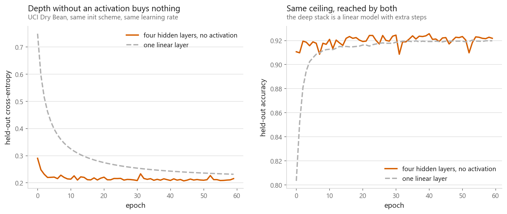
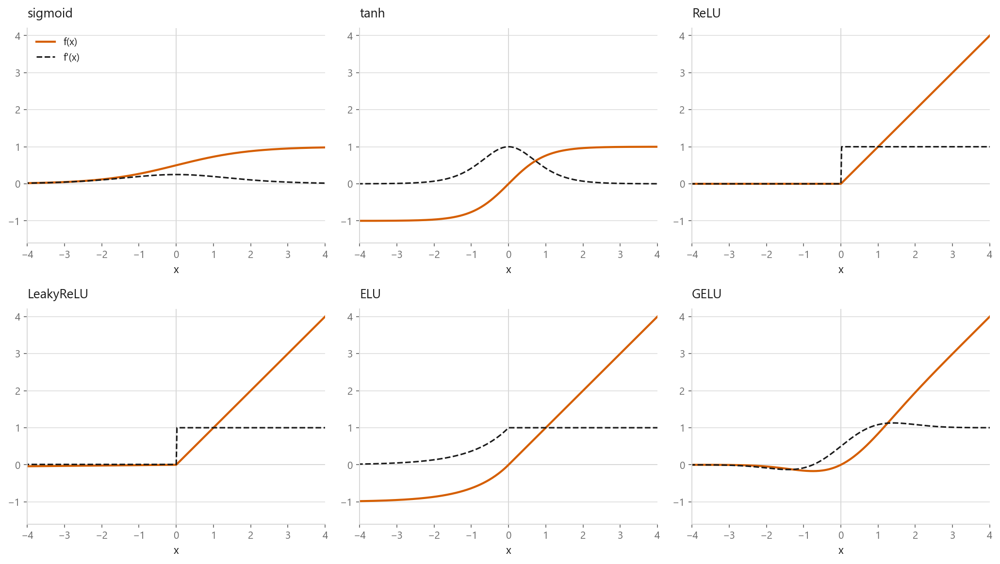
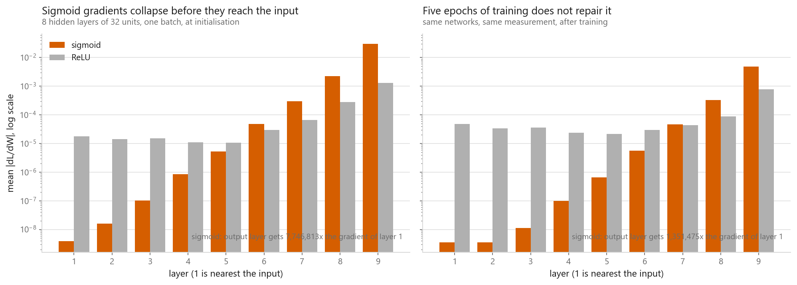
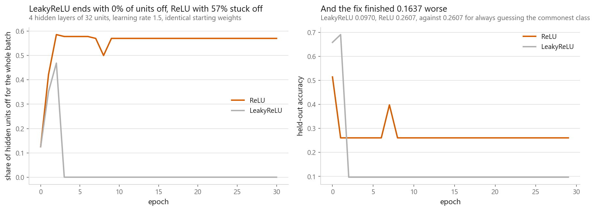
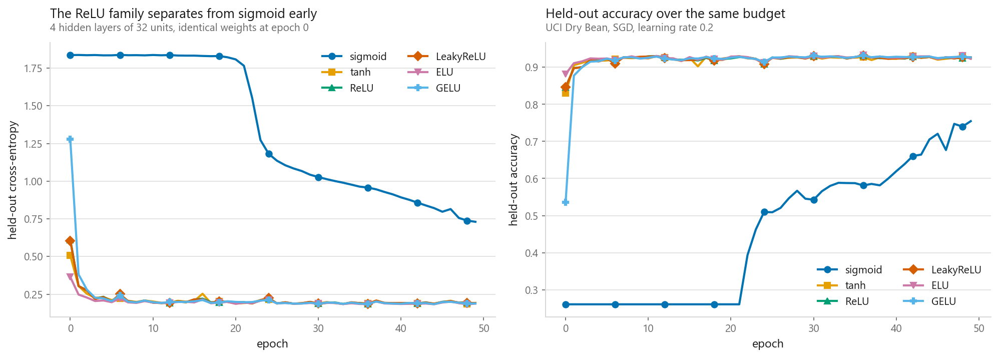

# Activation functions

### Sigmoid's first layer got one 7.7-millionth of the gradient its last layer got

**[Open the notebook](notebook.ipynb)** · Part 7, Neural networks ·
Made by [Elyes Lounissi](https://www.linkedin.com/in/elyes-lounissi/)

| | |
|---|---|
| **What you will learn** | Why a network without a non-linearity is a linear model wearing a costume, what six common activations do to a signal and to a gradient, how to measure a vanishing gradient instead of taking my word for it, how ReLU units die, and which activation to reach for first |
| **You should already know** | [The same network in PyTorch](../03-the-same-net-in-pytorch/) |
| **Dataset** | UCI Dry Bean (10,208 train / 3,403 test, 16 features, 7 classes) |
| **Runtime** | Two to three minutes on a laptop CPU (torch 2.11.0, run on CUDA here) |

---

## Start here: the number that explains why deep learning waited twenty years

One backward pass through a nine-layer stack, mean $|\partial L/\partial W|$ per layer,
at initialisation:

| Layer | Sigmoid | ReLU | ReLU / sigmoid |
|---|---|---|---|
| 1 (nearest the input) | **3.915e-09** | 1.759e-05 | 4,494 |
| 3 | 1.041e-07 | 1.518e-05 | 145.8 |
| 5 | 5.269e-06 | 1.053e-05 | 2.00 |
| 7 | 3.002e-04 | 6.586e-05 | 0.219 |
| 9 (nearest the loss) | **3.033e-02** | 1.301e-03 | 0.043 |

**Sigmoid: the last layer's gradient is 7,746,812.8× the first layer's. ReLU: 73.9×.**
Five epochs of training barely help — sigmoid still sits at **1,351,474.6×**, ReLU at
**16.2×**.

The early layers of the sigmoid network build the features every later layer depends on,
and they are learning millions of times slower than the output layer. The network is not
broken; it is untrainable in any reasonable time, and from outside that looks like a
model that refuses to fit. The architecture was never the obstacle. The derivative of
the sigmoid was.

## Proof that a stack of linear layers is one linear layer

$$W_2(W_1x + b_1) + b_2 = (W_2W_1)x + (W_2b_1 + b_2) = Wx + b$$

Better to measure that than assert it, so I trained a deep stack with `nn.Identity`
between layers and multiplied the weight matrices out by hand. The stack has **3,943
parameters** and scored **0.9218**; a single linear layer has **119** and scored
**0.9198**. They predict the same class on **0.9697** of held-out rows. Collapsing the
trained stack gives a (7, 16) matrix plus a (7,) bias — **119 numbers** — and the
largest disagreement with the 3,943-parameter network is **3.43e-05**, float32 rounding.
The collapsed matrix has **rank 7**, the most a 7 × 16 matrix can have.

Hold on to that 0.9198 from a bare linear layer: on sixteen tabular bean measurements a
straight line already gets most of the way, which is why the differences later are small.

## The functions, and the derivative that matters more

| Activation | f(0) | max \|f'\| | Flat share of grid | Output min | Output max |
|---|---|---|---|---|---|
| Sigmoid | 0.5 | **0.2500** | 0.2363 | 0.0025 | 0.9975 |
| tanh | 0.0 | 1.0000 | **0.5025** | -1.0000 | 1.0000 |
| ReLU | 0.0 | 1.0000 | 0.5008 | 0.0000 | 6.0000 |
| LeakyReLU | 0.0 | 1.0000 | **0.0000** | -0.0600 | 6.0000 |
| ELU | 0.0 | 1.0000 | 0.1165 | -0.9975 | 6.0000 |
| GELU | 0.0 | **1.1289** | 0.2479 | -0.1700 | 6.0000 |

The sigmoid's derivative peaks at **0.2500** and nowhere higher, and backpropagation
multiplies one derivative per layer, so nine layers of that is $0.25^9$ before anything
else is accounted for. ReLU's derivative is a step — exactly one on the right, exactly
zero on the left — so there is no shrinkage on the active side at all. GELU is the only
one whose derivative exceeds 1, at **1.1289**. Note that tanh's flat share of the grid
is the largest in the table at 0.5025, above sigmoid's 0.2363, and tanh still trains
fine here: flat share says where the derivative is small, the peak value is what
compounds.

## Dying ReLU, and the fix that did not fix the run

A ReLU unit whose pre-activation is negative for every row outputs zero for every row,
and its gradient is exactly zero — not small, zero. On a single isolated unit ReLU gave
**dL/dw = +0.0000, dL/db = +0.0000**; LeakyReLU (slope 0.01) gave **+0.0600** and
**+0.0300**. Zero means the unit can never recover.

Inside a real network, both from identical weights, both at an oversized learning rate:

| | Off, untrained | Peak | Off, trained | Exactly-zero gradients | Held-out accuracy |
|---|---|---|---|---|---|
| ReLU | 0.1250 | 0.5859 | **0.5703** | **128** | **0.2607** |
| LeakyReLU | 0.1250 | 0.4688 | **0.0000** | **0** | **0.0970** |

Read that honestly. LeakyReLU did exactly what it promises — it ended with **zero**
permanently off units against ReLU's 57% — and still finished at **0.0970** accuracy,
worse than the ReLU network's 0.2607. Both runs were wrecked by the learning rate, and
curing the dead units did not rescue the training, because the dead units were a symptom
of the oversized step rather than the disease. So the reason to know this is diagnostic,
not prescriptive. Counting units with `pre_activation.max(dim=0).values <= 0` takes one
line and often explains a network that stalled below what the same shape reached
yesterday. Then go fix the step size.

## Compared fairly

Same architecture, weights, learning rate, epochs and batch order. Only the activation.

| Activation | Held-out accuracy | Held-out loss | Epochs to 0.85 | Seconds |
|---|---|---|---|---|
| GELU | **0.9268** | 0.1883 | 2.0 | 17.2576 |
| LeakyReLU | **0.9268** | 0.1907 | 2.0 | 15.8714 |
| ReLU | 0.9259 | 0.1892 | 2.0 | **13.3171** |
| tanh | 0.9236 | 0.1919 | 2.0 | 14.3709 |
| ELU | 0.9227 | **0.1876** | **1.0** | 16.5162 |
| Sigmoid | **0.7546** | 0.7305 | **never** | 12.7537 |

**Nothing won.** GELU and LeakyReLU tied to four decimal places. The whole spread across
the five that trained is **0.0041**, while sigmoid is **0.1722** behind and never
reached 0.85 accuracy at all. ELU had the lowest loss (0.1876) and was the only one to
clear 0.85 in a single epoch, and it still finished fifth on accuracy. tanh, a
saturating function, beat ELU by 0.0009 — so "saturating" is not by itself the problem,
a derivative capped at 0.25 is.

Do not read the top five as a ranking: sixteen tabular features and four narrow layers
do not stress an activation the way a fifty-layer vision network does. The measured
lesson is the size of the gaps. Escaping the sigmoid is worth 42× more than every choice
made after it, combined, and ReLU was the fastest of the five at 13.3 s.

## Cheat sheet

| | |
|---|---|
| **Default** | ReLU. Fastest here at 13.3 s and within 0.0009 of the best. Change it for a reason, not by habit |
| **Deep and stalling** | Suspect the activation before the architecture. Print `weight.grad.abs().mean()` per layer |
| **Sigmoid and tanh** | Sigmoid's derivative peaks at 0.25 and compounds into a 7.7-million-fold gap across nine layers. Keep them for gates and bounded outputs |
| **Dying ReLU** | Count `pre_activation.max(dim=0).values <= 0`. LeakyReLU removes the dead units but will not fix an oversized learning rate |
| **Output layer** | No activation before `CrossEntropyLoss`. Sigmoid for one binary output, nothing for regression |
| **Never** | An identity activation between layers. 3,943 parameters collapsed to 119, to within 3.43e-05 |

---

Made by **Elyes Lounissi** ·
[LinkedIn](https://www.linkedin.com/in/elyes-lounissi/) ·
[pilot.tun@gmail.com](mailto:pilot.tun@gmail.com)

Back to [Part 7](../) · [the curriculum](../../CURRICULUM.md) · [the book](../../README.md)

`#DeepLearning` `#ActivationFunctions` `#ReLU` `#VanishingGradient` `#GELU`
`#PyTorch` `#NeuralNetwork` `#MachineLearning` `#Python` `#MLTutorial`
