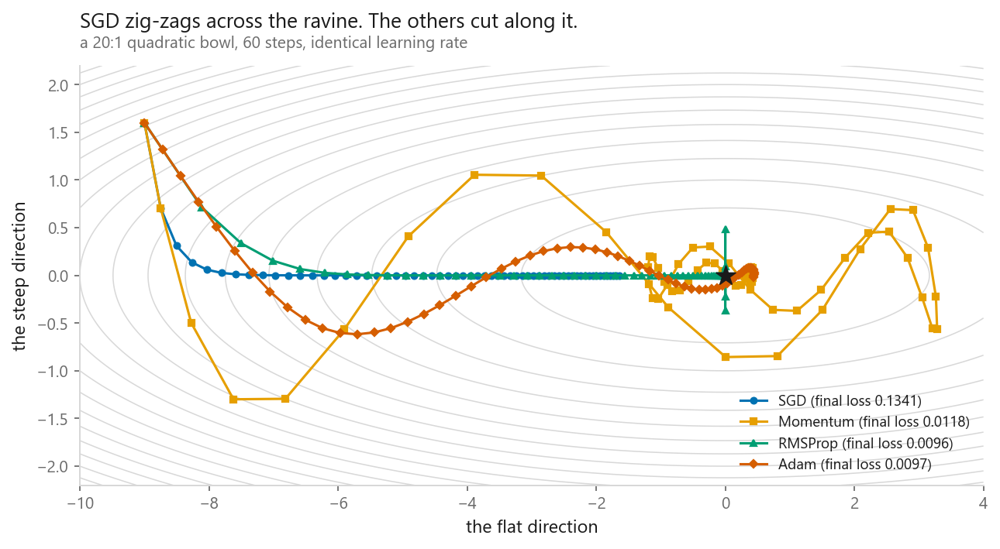
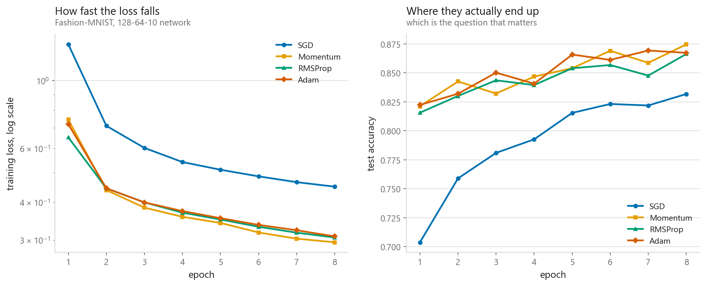
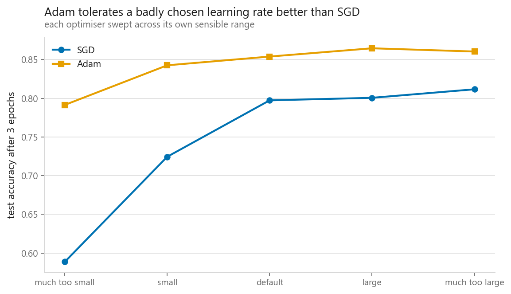

# Optimisers

### SGD, Momentum, RMSProp, Adam — what each one actually fixes

**[Open the notebook](notebook.ipynb)** · Part 7, Neural networks ·
Made by [Elyes Lounissi](https://www.linkedin.com/in/elyes-lounissi/)

| | |
|---|---|
| **What you will learn** | The named failure each optimiser was invented to fix, how the four differ on a surface you can draw, and whether adaptive methods find better minima or only reach them sooner |
| **You should already know** | [The PyTorch training loop](../03-the-same-net-in-pytorch/) |
| **Datasets** | A 2-D quadratic ravine, then Fashion-MNIST |
| **Runtime** | About fifteen minutes end to end. The four 8-epoch runs take 526 s of that, on torch 2.11.0 with CUDA |

---

## The answer, before the argument

On a real network the adaptive optimisers were **faster, and they were not
better.** Adam crossed 85% test accuracy in **3 epochs**, momentum needed **5**,
plain SGD never reached it in 8 — yet the highest final accuracy belonged to **SGD
with momentum, 0.8745**, ahead of Adam's 0.8672. Two different claims, and only
the speed one survived the measurement.

## What plain gradient descent gets wrong

Every optimiser after SGD fixes one of two named failures. **Ravines:** when the
surface is far steeper in one direction than another, the gradient points across
the valley rather than along it and the step bounces between the walls — the normal
case, produced by correlated features or features on different scales. **One rate
for every parameter:** a rate safe in the steepest direction is far too small for
the flattest. Momentum averages past gradients, so reversing components cancel and
consistent ones accumulate. RMSProp divides each step by the square root of that
parameter's own running squared gradient — a per-parameter rate. Adam runs both,
plus a bias correction for the cold start.

## Four rules on a 20:1 ravine

The bowl is `0.05x² + y²`, 60 steps, same learning rate of 0.28 for all four.

| | Final loss | Distance from the minimum |
|---|---|---|
| SGD | 0.134093 | 1.6376 |
| Momentum | 0.011805 | 0.3918 |
| RMSProp | **0.009567** | **0.0978** |
| Adam | 0.009721 | 0.4345 |

SGD ends at **11× the loss of momentum** and four times further out, having spent
its steps crossing the valley rather than descending it. RMSProp lands essentially
on the minimum. The pair worth staring at is Adam and momentum: Adam finishes
**further from the minimum** (0.4345 against 0.3918) and yet at a **lower loss**,
because what is left of its error lies along the cheap flat direction. Distance
and loss are not the same ruler on a stretched surface.

## The same four on Fashion-MNIST

A 128-64-10 network, batch size 256, 8 epochs each, one seed. SGD and momentum at
`lr=0.05`, RMSProp and Adam at `lr=0.001`.

| | Final train loss | Best test acc | Final test acc | Epochs to 0.85 | Seconds |
|---|---|---|---|---|---|
| SGD | 0.4496 | 0.8317 | 0.8317 | never | 130.6 |
| Momentum | **0.2956** | **0.8745** | **0.8745** | 5 | 151.9 |
| RMSProp | 0.3065 | 0.8662 | 0.8662 | 5 | 133.4 |
| Adam | 0.3091 | 0.8692 | 0.8672 | **3** | **110.5** |

The dramatic ordering from the ravine mostly evaporates: momentum, RMSProp and Adam
finish within **0.0083** of each other. Plain SGD is the only clear loser, **0.0428
below** momentum, and the only one that never crossed the line.

## Faster, or better

**Faster: yes.** Adam reached 0.85 in 3 epochs against 5 for the other two, in the
shortest wall-clock time of the four, 110.5 s — 41.4 s less than momentum, despite
being the more expensive update rule per step.

**Better: no.** Momentum's final 0.8745 beats Adam's best-ever epoch of 0.8692 by
**0.0053**, and momentum also reached the lowest training loss, 0.2956. What the
adaptive methods bought here was time, not quality. One seed and 8 epochs, so I
would not stake much on a 0.007 gap — which is the point. The accuracy difference
is inside the noise; the speed difference is not.

## What actually separates them

Each optimiser swept across its own sensible range, 3 epochs per rate.

| Rate | SGD | Test acc | Adam | Test acc |
|---|---|---|---|---|
| much too small | 0.005 | **0.589** | 0.0001 | 0.791 |
| small | 0.02 | 0.724 | 0.0005 | 0.843 |
| default | 0.05 | 0.797 | 0.001 | 0.854 |
| large | 0.2 | 0.801 | 0.005 | **0.865** |
| much too large | 0.5 | **0.812** | 0.02 | 0.860 |
| **spread** | | **0.223** | | **0.073** |

**SGD's spread is 0.223 across its sweep. Adam's is 0.073 — three times tighter.**
Adam's worst rate, off by 10× in the wrong direction, still scored 0.791, within
0.006 of SGD's carefully chosen default and ahead of every SGD rate below 0.05.
This is why Adam is the default in most codebases: not that it finds better minima,
which the numbers above say it did not, but that a badly chosen rate costs you 7
points instead of 22.

Two wrinkles in my sweep. SGD never actually blew up — accuracy rose monotonically
to 0.812 at `lr=0.5`, the largest rate I tried, so the failure here was rates too
small rather than too large, and a wider sweep would find the divergence point.
And Adam peaked at `lr=0.005` (0.865), not at the `1e-3` default (0.854). Well-tuned
SGD with momentum still wins many vision benchmarks, and it won here too.

## Cheat sheet

| | |
|---|---|
| **Start with** | Adam at `lr=1e-3`. It is the default because it is forgiving, not because it is best |
| **Switch to SGD + momentum when** | You are tuning carefully, training a vision model, or chasing the last fraction of accuracy. It took the top accuracy here |
| **Momentum fixes** | Zig-zagging in ravines, by averaging directions that keep reversing |
| **RMSProp fixes** | One learning rate for all parameters, by scaling each by its own gradient history |
| **Adam** | Both at once, plus bias correction for the cold start. Use AdamW instead whenever you want weight decay |
| **Watch out** | The learning rate matters more than the optimiser. The 0.223 spread from the rate dwarfs the 0.007 gap between optimisers. Tune it first |

---

Made by **Elyes Lounissi** ·
[LinkedIn](https://www.linkedin.com/in/elyes-lounissi/) ·
[pilot.tun@gmail.com](mailto:pilot.tun@gmail.com)

Back to [Part 7](../) · [the curriculum](../../CURRICULUM.md) · [the book](../../README.md)

`#DeepLearning` `#Optimizers` `#Adam` `#SGD` `#Momentum` `#RMSProp`
`#PyTorch` `#LearningRate` `#MLTutorial` `#GradientDescent`
