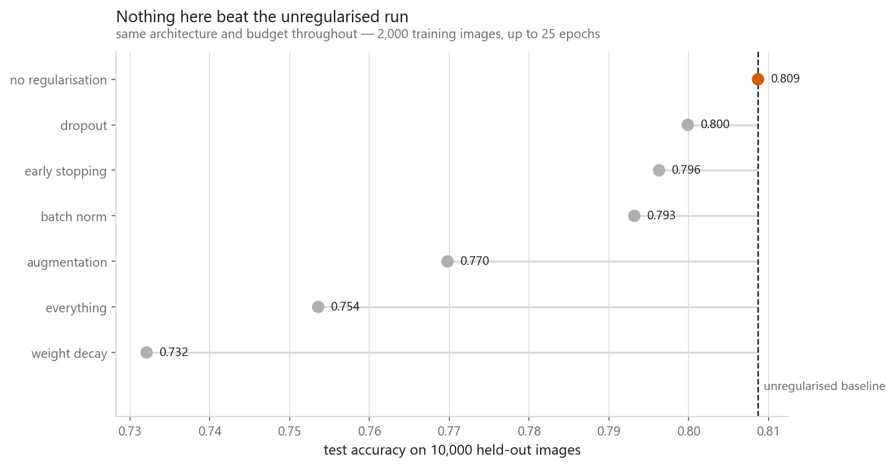
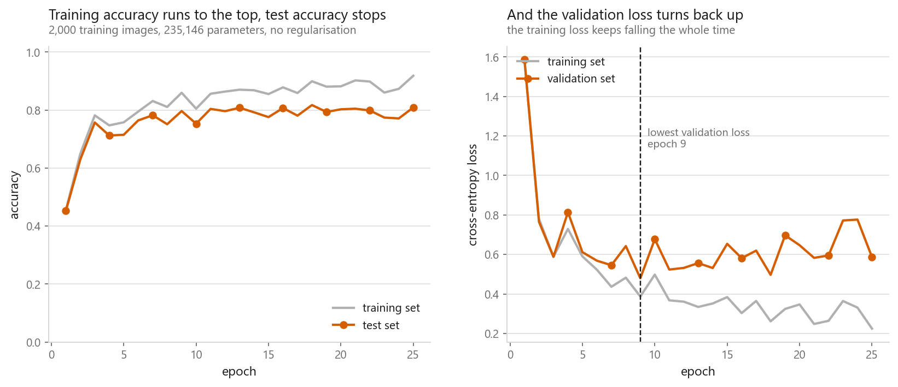
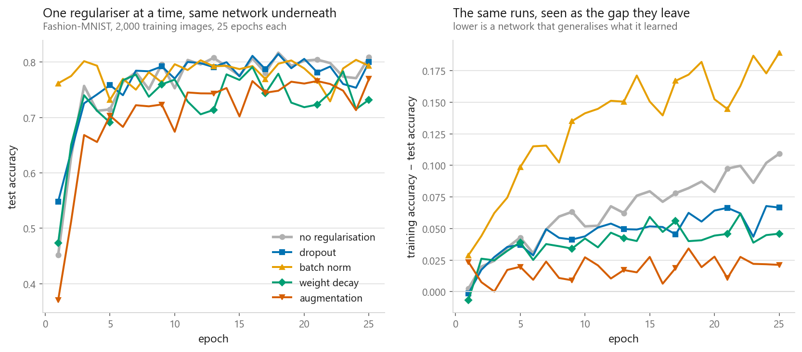
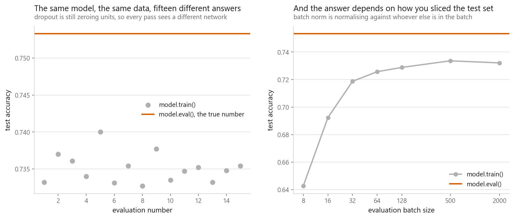

# Regularisation in neural networks

### Five ways to stop a network memorising its training set

**[Open the notebook](notebook.ipynb)** · Part 7, Neural networks ·
Made by [Elyes Lounissi](https://www.linkedin.com/in/elyes-lounissi/)

| | |
|---|---|
| **What you will learn** | How to overfit on purpose, what dropout, batch norm, weight decay, early stopping and augmentation each do mechanically, how much each recovers on one architecture, and why forgetting `model.eval()` ruins your numbers |
| **You should already know** | [The PyTorch training loop](../03-the-same-net-in-pytorch/), [optimisers](../05-optimisers/) |
| **Datasets** | Fashion-MNIST, cut to 2,000 training images against 10,000 test images |
| **Runtime** | Three to five minutes on a laptop CPU, under one on a GPU |

---

## Nothing beat the unregularised run

I built a network that overfits badly, added five regularisers one at a time on
identical settings, and the plain network won. Not by much, and not in the way any
of this is usually presented, but it won.

| Method | Train acc | Test acc | Gap | Epochs | vs baseline |
|---|---|---|---|---|---|
| **No regularisation** | 0.9180 | **0.8087** | 0.1093 | 25 | |
| Dropout, p=0.3 | 0.8665 | 0.7999 | 0.0666 | 25 | **−0.0088** |
| Early stopping | 0.8595 | 0.7963 | 0.0632 | **9** | −0.0124 |
| Batch norm | 0.9825 | 0.7932 | **0.1893** | 25 | −0.0155 |
| Augmentation | 0.7910 | 0.7698 | **0.0212** | 25 | −0.0389 |
| Everything combined | 0.7700 | 0.7536 | **0.0164** | 24 | −0.0551 |
| Weight decay, 1e-2 | 0.7780 | 0.7321 | 0.0459 | 25 | **−0.0766** |

Every method did what it claims to do. Augmentation cut the generalisation gap from
**0.1093 to 0.0212**, an 81% reduction; the combined run cut it to **0.0164**. None
converted that into test accuracy inside 25 epochs, because closing the gap by
making the network worse at training is not worth anything on its own. Dropout came
closest to free, giving up 0.0088 for a gap 39% smaller. Weight decay at 1e-2 was
too strong and cost 0.0766. Batch norm is the odd one: it produced the **widest**
gap of all seven runs at 0.1893, above the unregularised baseline, and still
finished third on test accuracy.

The honest reading is that 25 epochs is not enough for the noisy methods. Dropout
and augmentation both slow convergence in exchange for a better ceiling, and this
run stops before the trade pays. One seed, one 2,000-image subset: differences of
a fraction of a percent in the middle of that table are noise.

## Building the gap first

You cannot judge a regulariser on a network that is not overfitting. Two hidden
layers of 256 and 128 with ReLU, **235,146 parameters** against **2,000 training
images** (**118 parameters per image**) plus 500 validation images and the full
**10,000** test images, on torch 2.11.0+cu128 on CUDA.

| | |
|---|---|
| Training accuracy after 25 epochs | 0.9180 |
| Test accuracy after 25 epochs | 0.8087 |
| Gap | **0.1093** |
| Best test accuracy at any epoch | 0.8170, epoch 18 |
| Validation loss minimum | **epoch 9** |

Training loss falls monotonically. Validation loss bottoms out at epoch 9 and then
climbs, and after that turning point the network is still learning: it is learning
things true of these 2,000 images and false of clothing in general.

## What each one does

**Dropout** zeroes each activation with probability $p$ on every forward pass and
scales the survivors by $1/(1-p)$ so the expected sum is unchanged. At `p=0.5` on a
tensor of ones, the training-mode output is a mix of 0 and 2; in eval mode the
layer is the identity function, exactly. If unit 40 might vanish on any step, no
other unit can build a feature that depends on unit 40 being there.

**Batch norm** normalises each feature against its own mini-batch. On a batch with
mean +4.989 and standard deviation 2.946, the output came out at mean +0.000 and
std 1.002. Its running mean after that one batch was `[0.473 0.486 0.532 0.504]`:
those stored numbers, not the batch, are what eval mode uses. The regularising
effect is a side effect of batch noise, and it is not adjustable.

**Weight decay** is L2 on the weights, turning the update into
$w \leftarrow (1 - \eta\lambda)\, w - \eta \nabla \mathcal{L}(w)$. With SGD the
equation and the code agree. With Adam they do not, which is why `AdamW` exists.

**Early stopping** is free. **Augmentation**, random horizontal flip plus a shift
of up to two pixels, is the only method here that adds information rather than
removing freedom.

Wall clock per 25-epoch run: dropout 7 s, batch norm 7 s, weight decay 2 s,
augmentation 4 s, everything combined 4 s.

## Early stopping cost negative epochs

The baseline run already recorded validation loss every epoch, so no retraining was
needed. It bottomed out at **epoch 9 of 25**, where test accuracy was **0.7963**
against **0.8087** at epoch 25, a difference of −0.0124 for **16 saved epochs, 64%
of the run**.

It gave back 0.0124 accuracy for 64% of the compute. On a longer run past the
point where the test curve turns down as well, that sign flips. It is the first
thing to add to a training script and the last thing anyone remembers.

## The train/eval trap

Dropout and batch norm behave differently in the two modes and both do it silently.
Nothing raises an exception. Worse, a forward pass in training mode also *updates*
batch norm's running statistics, so an evaluation that forgets `model.eval()`
reports a wrong number and edits the model while doing it.

`model.eval()` returns **0.7533**, the same number every time. `model.train()` over
15 identical calls averaged **0.7351**, ranging **0.7327 to 0.7400**, an error of
**−0.0182** from forgetting one line. Then the part that catches people: in training
mode the accuracy depends on the evaluation batch size, a parameter that should have
no effect on anything.

| Eval batch size | 8 | 16 | 32 | 64 | 128 | 500 | 2000 |
|---|---|---|---|---|---|---|---|
| Train-mode accuracy | **0.6426** | 0.6923 | 0.7187 | 0.7257 | 0.7288 | 0.7336 | 0.7321 |

**At batch size 8 the reported accuracy is 0.6426 against a true 0.7533, an error
of 0.1107 from a missing line of code.** Batch norm is normalising each image
against whichever others share its batch, so the prediction for one garment depends
on what you loaded beside it.

The failure mode in the wild is quieter than either panel: you leave the model in
training mode during validation, accuracy comes out a couple of points low, and you
spend an afternoon tuning a learning rate to fix a one-line bug. Put `model.eval()`
inside your evaluation function rather than at the call site, and wrap it in
`torch.no_grad()` while you are there.

## Cheat sheet

| | |
|---|---|
| **Dropout** | `nn.Dropout(p)` after the activation. 0.5 for wide dense layers, lower for small ones, rarely in conv layers |
| **Batch norm** | Between the linear or conv layer and the activation. Set `bias=False` underneath it |
| **Weight decay** | `weight_decay` on the optimiser. With SGD it is L2 exactly. With Adam use `AdamW` |
| **Early stopping** | Track validation loss, keep the best weights, stop after `patience` epochs. Free |
| **Augmentation** | Training batches only, and the transform has to preserve the label |
| **Never** | Evaluate without `model.eval()`. Wrong numbers that depend on your batch size |
| **Never** | Tune on the test set. Early stopping needs its own validation split |
| **First move** | Get more data, or augment. Everything else is a way of coping without it |
| **Next** | [A training loop you can reuse](../07-a-training-loop-you-can-reuse/) |

---

Made by **Elyes Lounissi** ·
[LinkedIn](https://www.linkedin.com/in/elyes-lounissi/) ·
[pilot.tun@gmail.com](mailto:pilot.tun@gmail.com)

Back to [Part 7](../) · [the curriculum](../../CURRICULUM.md) · [the book](../../README.md)

`#DeepLearning` `#Regularisation` `#Dropout` `#BatchNorm` `#WeightDecay`
`#PyTorch` `#FashionMNIST` `#MachineLearning` `#Python` `#MLTutorial`
