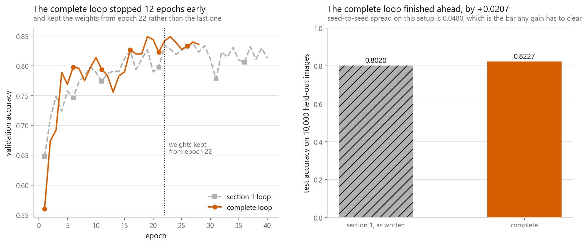
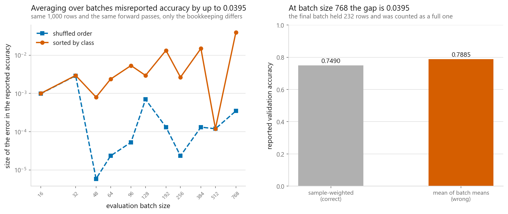
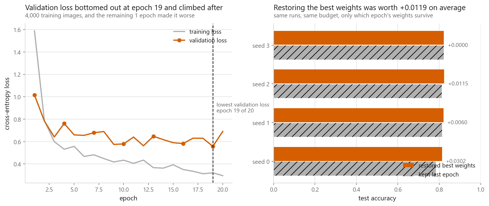
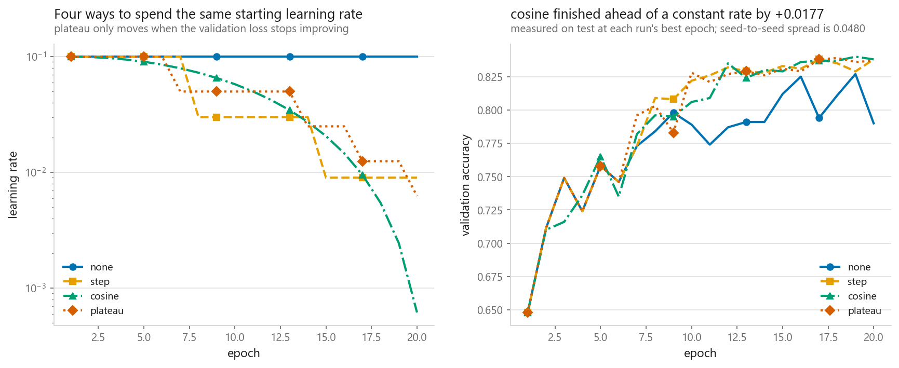
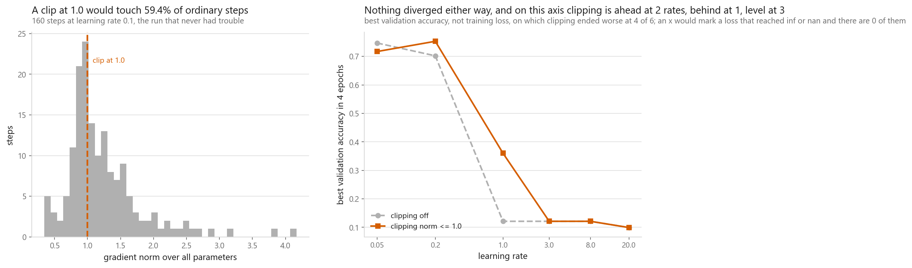

# A training loop you can reuse

### Eight pieces added one at a time, and a seed spread wide enough to swallow all of them

**[Open the notebook](notebook.ipynb)** · Part 7, Neural networks ·
Made by [Elyes Lounissi](https://www.linkedin.com/in/elyes-lounissi/)

| | |
|---|---|
| **What you will learn** | Which pieces of a training loop earn their place, why averaging a metric over batches is wrong and how large the error gets, what keeping the last epoch's weights costs, how a schedule and gradient clipping actually behave when you measure them, and one function to paste into your own project |
| **You should already know** | [The same network in PyTorch](../03-the-same-net-in-pytorch/), [optimisers](../05-optimisers/), [regularisation](../06-regularisation/) |
| **Dataset** | Fashion-MNIST, cut to 4,000 training and 1,000 validation images against a 10,000-image test set left untouched until the last section |
| **Runtime** | A few minutes. The device is chosen at run time and printed by the first cell; the timings on this page came from a CUDA device, torch 2.11.0+cu128 on an NVIDIA RTX A2000 Laptop GPU |

---

## The result I would lead with

The first thing the notebook measures is the noise floor: four runs, identical in
every way except the seed. Final validation accuracy landed between **0.7900 and
0.8380**, a spread of **0.0480** and a standard deviation of **0.0172**. The same
seed twice reproduces the curve exactly.

Then every later improvement in the chapter is measured against that bar, and
none of them clear it:

| Piece | What it was worth | Seed spread |
|---|---|---|
| restoring the best weights instead of the last | **+0.0119** | 0.0480 |
| cosine annealing instead of a constant rate | **+0.0177** | 0.0480 |
| the complete loop against the loop from section 1 | **+0.0207** | 0.0480 |
| gradient clipping, runs saved from `inf` or `nan` | **0 of 6** | |

The notebook prints the verdict on the first of those without softening it:
`the gain is larger than the seed spread : False`.

**Every piece in this chapter is insurance, and insurance does not show up in a
single number on a good day.** That is not an argument for deleting the pieces.
It is an argument for measuring the seed spread before you believe any of the
comparisons you are about to run, including the ones on this page.

The complete loop reached **0.8227** test accuracy in **28 epochs and 2.5139 s**.
The loop from section 1 reached **0.8020** in **40 epochs and 2.7196 s**. Early
stopping saved **12 epochs**. The accuracy difference is real and it is smaller
than the seed spread, so the defensible claim is the cheaper one: same result,
fewer epochs, and a number chosen by a validation set the test data never
touched.

## Averaging a metric over batches

The bug is `sum(batch_accuracies) / len(loader)`, which weighs a batch of eight
rows the same as a batch of a hundred and twenty-eight. It is invisible until
your evaluation set stops dividing evenly by your batch size, and then it is
still small enough to look like noise.

At batch size 128 over 1,000 validation rows there are 8 batches and the last one
holds 104. Across eleven batch sizes, the correct row-weighted answer is 0.749
every time and varies by **5.53e-08**. The wrong one does not:

| | Largest error from averaging over batches |
|---|---|
| shuffled evaluation set | 0.00291 |
| sorted by class | **0.03946** |

On shuffled data the error is small, and small is exactly what makes it
dangerous, because it is the size of the difference you are trying to detect
between two models. On grouped data it stops being subtle. The worst case in the
table is batch size 768 with a final batch of 232 rows counted as a full one.

## Early stopping and best-weight restoration are two things

Early stopping decides when to stop. Best-weight restoration decides which
weights you keep once you have stopped. Do the first without the second and you
stopped after `patience` epochs of getting worse, then kept the weights from the
worst of them:

| Seed | Best epoch | Test acc, best weights | Test acc, last weights | Difference |
|---|---|---|---|---|
| 0 | 19 | 0.8132 | 0.7830 | **+0.0302** |
| 1 | 15 | 0.8202 | 0.8142 | +0.0060 |
| 2 | 10 | 0.8237 | 0.8122 | +0.0115 |
| 3 | 20 | 0.8223 | 0.8223 | 0.0000 |

Mean gain **+0.0119**, and it helped on **3 of 4 seeds**. On seed 3 the best
epoch was the last one, so there was nothing to restore.

### What peeking at the test set is worth

The same runs recorded test accuracy every epoch, which you must never do in real
work and which is useful exactly once, here. Picking the epoch by validation loss
gives **0.8132** at epoch 19. Picking the epoch where test accuracy happened to
peak gives **0.8230** at epoch 16. The difference, **+0.0098**, is not a
modelling gain. It is the amount you would be overstating, and "I tried a few
epoch counts and reported the best" is exactly that procedure with a friendlier
name.

## Schedules

Four ways to spend the same starting learning rate, same seed, same budget:

| Schedule | Best val loss | Best epoch | Final lr | Test acc, best weights |
|---|---|---|---|---|
| none | 0.5569 | 19 | 0.1000 | 0.8132 |
| step | 0.4947 | 19 | 0.0090 | 0.8294 |
| **cosine** | **0.4891** | 19 | 0.0006 | **0.8309** |
| plateau | 0.4972 | 10 | 0.0062 | 0.8214 |

Cosine won by **+0.0177** over a constant rate, against a seed spread of 0.0480.
The reason to use a schedule is that it is cheap and rarely harmful, not that a
single run improved by an amount smaller than the noise.

## Gradient clipping, measured rather than assumed

Clipping is usually described as inert on healthy runs. On the run that never had
trouble, over 160 steps at learning rate 0.1, the gradient norms came out at
**median 1.0596, 90th percentile 1.9720, maximum 4.1656**, and **a clip at 1.0
would touch 0.5938 of ordinary steps**. It is not inert. It is rescaling the
majority of steps on a run nobody thought needed help.

Then the sweep that was supposed to show clipping rescuing a run:

| lr | Clipping | Final train loss | Finite | Best val acc |
|---|---|---|---|---|
| 0.05 | off | 0.5843 | True | **0.747** |
| 0.05 | norm <= 1.0 | 0.6670 | True | 0.717 |
| 0.20 | off | 0.6901 | True | 0.702 |
| 0.20 | norm <= 1.0 | 0.5842 | True | **0.753** |
| 1.00 | off | 2.3128 | True | 0.121 |
| 1.00 | norm <= 1.0 | 2.1089 | True | **0.360** |
| 3.00 | off | 2.3478 | True | 0.121 |
| 3.00 | norm <= 1.0 | 2.3500 | True | 0.121 |
| 8.00 | off | 2.5498 | True | 0.121 |
| 8.00 | norm <= 1.0 | 2.5645 | True | 0.121 |
| 20.00 | off | 22.2093 | True | 0.099 |
| 20.00 | norm <= 1.0 | 31.1005 | True | 0.099 |

`runs that produced a non-finite loss without clipping : 0 of 6`
`runs that produced a non-finite loss with clipping    : 0 of 6`

Nothing was rescued, because nothing broke. What the table shows instead is that
the two columns disagree about clipping, and which one you read decides the
verdict.

On **final training loss** clipping ended worse at **4 of 6** rates, including
the largest one in the sweep, where 31.1005 against 22.2093 is the clipped run
finishing higher.

On **best validation accuracy**, which is what the right-hand panel of the figure
plots, clipping is behind at 0.05 by 0.030, ahead at 0.20 by 0.051, ahead again
at 1.00 by 0.239, and level at 3.00, 8.00 and 20.00 where both runs land on the
same number. So the 1.00 row is not a case of clipping failing to rescue a bad
rate: 0.360 against 0.121 is the largest accuracy gap in the table, well clear of
the 0.10 a ten-class coin flip would give, and it is the one place clipping
visibly bought something. It bought it on a learning rate nobody should use, and
0.360 is still a broken run. Surviving is a different thing from learning.

Read across both columns and the pattern is that clipping's sign changes with the
setting, and changes again with the metric. That is what an undeclared second
learning-rate dial looks like.

Keep it anyway. It costs one norm computation per step, and the day a single
batch produces a norm an order of magnitude off the median is the day you would
otherwise lose the run. This chapter simply cannot show you that day, and it says
so rather than manufacturing one.

## Checkpointing

Two different jobs get called checkpointing. Keeping the best model needs only
the weights. Resuming a crashed run needs the optimiser state too, because
momentum buffers and Adam's moment estimates took as long to build as the weights
did. The notebook writes both, at **0.88 MB**, recording epoch 19 with validation
loss 0.4891, and reloading into a fresh network reproduces the logits with a
largest difference of **0.000e+00**.

## Cheat sheet

| | |
|---|---|
| **First measurement** | The seed spread. Here it was 0.0480, and no single-run improvement in the chapter cleared it |
| **Device** | Select once at the top. `model.to(device)` is in place, `tensor.to(device)` is not. Assign the result |
| **Splits** | Anything you make a decision with is a validation set, whatever you called it |
| **Metrics** | Weight by rows. Dividing by `len(loader)` misreported accuracy by 0.03946 on a grouped evaluation set |
| **Eval mode** | `model.eval()` and `torch.no_grad()` inside the evaluation function, not at the call site |
| **Best weights** | `copy.deepcopy(model.state_dict())`, loaded back before you return. Worth +0.0119 on average and +0.0302 on the worst seed |
| **Never** | Select the epoch by test accuracy. Here that bought +0.0098 of pure optimism |
| **Scheduling** | Cosine when in doubt. One dial, and it is the epoch count you already chose |
| **Clipping** | By norm, not by value. A clip at 1.0 touched 0.5938 of ordinary steps here and saved 0 runs, and it still costs one norm per step to keep |
| **Checkpoints** | Weights for keeping the best, weights plus optimiser state for resuming. `weights_only=True` when loading |
| **Next** | [Convolution and pooling](../../08-computer-vision/01-convolution-and-pooling/), where the same loop trains a very different network |

---

Made by **Elyes Lounissi** ·
[LinkedIn](https://www.linkedin.com/in/elyes-lounissi/) ·
[pilot.tun@gmail.com](mailto:pilot.tun@gmail.com)

Back to [Part 7](../) · [the curriculum](../../CURRICULUM.md) · [the book](../../README.md)

`#PyTorch` `#TrainingLoop` `#EarlyStopping` `#GradientClipping` `#Checkpointing`
`#Reproducibility` `#FashionMNIST` `#DeepLearning` `#MachineLearning`
`#MLTutorial` `#LearnMachineLearning` `#DataScience` `#AI`
