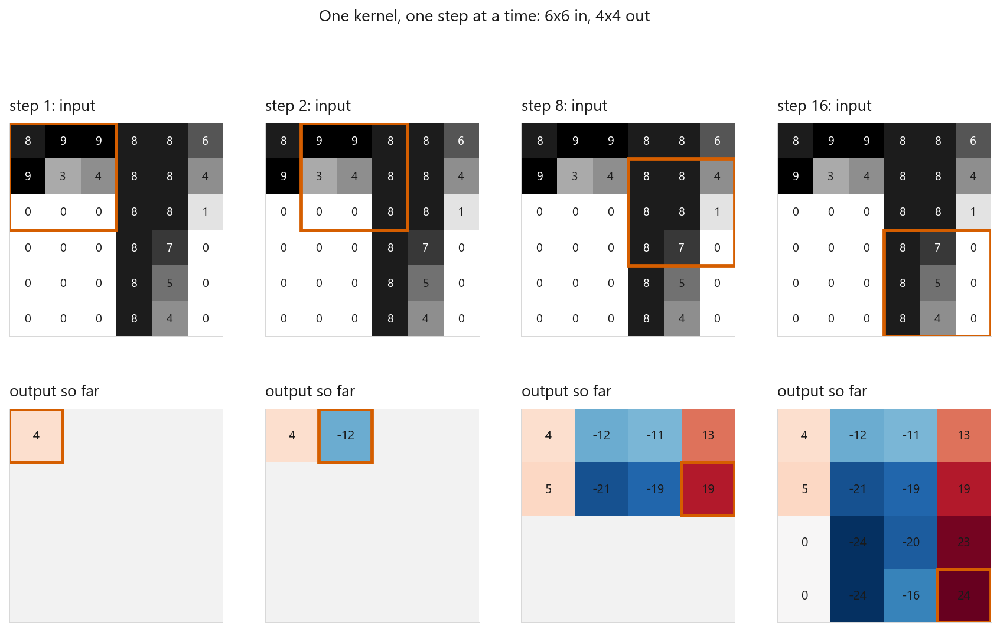
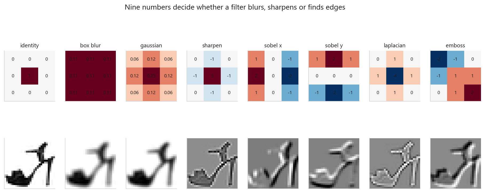
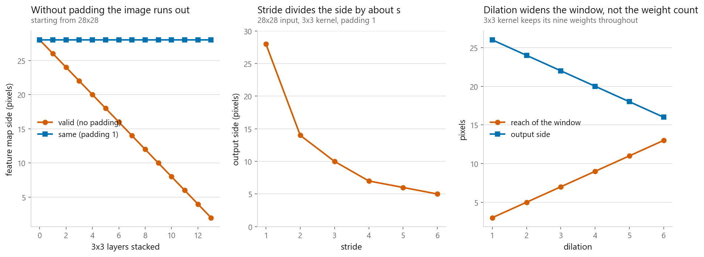
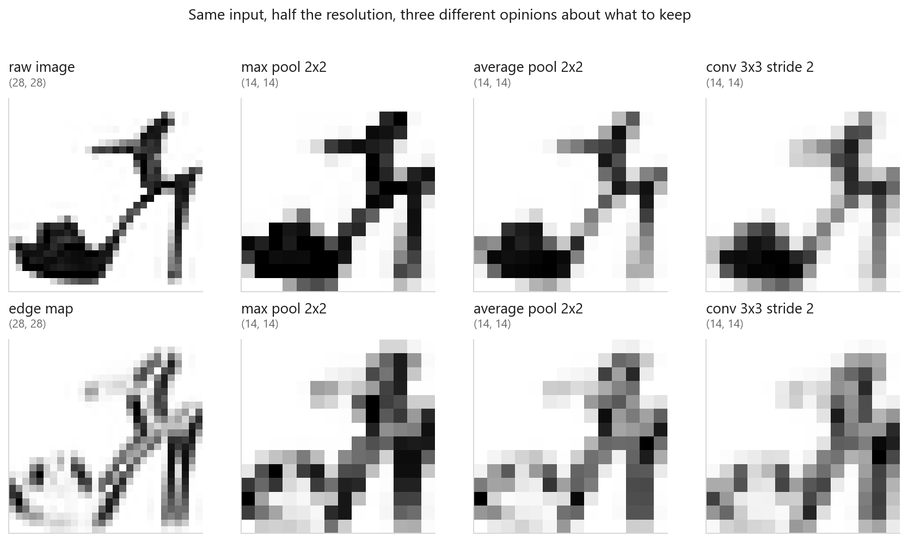
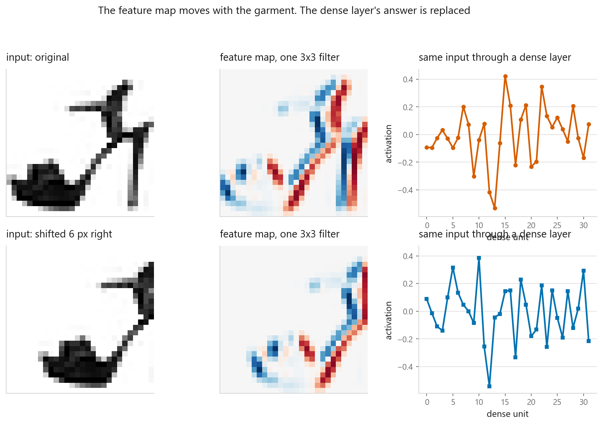

# Convolution, pooling, and what a filter learns

### The sliding window, the arithmetic of shapes, and the two properties everything later depends on

**[Open the notebook](notebook.ipynb)** · Part 8, Computer vision ·
Made by [Elyes Lounissi](https://www.linkedin.com/in/elyes-lounissi/)

| | |
|---|---|
| **What you will learn** | How a convolution is computed, written in NumPy and checked against PyTorch; the one formula that gives every output shape; the parameter count of a real layer; three ways to downsample and how they differ; and how far back one output unit can see |
| **You should already know** | [Neural networks in PyTorch](../../07-neural-networks/03-the-same-net-in-pytorch/), and NumPy indexing |
| **Dataset** | Fashion-MNIST (28×28 greyscale), used as pictures to filter. Nothing is trained here |
| **Runtime** | Well under a minute on a laptop CPU |

---

## Two numbers make the whole case for convolution

Shift a garment sideways, run it through a fixed filter, shift the feature map back
and subtract: the difference away from the borders is **`0.000e+00`**. Exactly zero,
not approximately zero. Cosine between the two maps is **0.008** unaligned and
**0.969** aligned; through a fixed dense layer the same shift gives **0.313**, because
a dense layer has no way to know the two pictures show the same garment.

The second number is the price. `Conv2d(16, 32, 3)` holds **4,640** parameters. A
dense layer mapping the same 16×14×14 tensor to 32×14×14 needs **19,675,264** — a
ratio of **4,240×** — and the convolution holds those 4,640 whether the input is
14×14, 64×64 or 224×224. Everything below is the machinery behind those two facts.

## The operation



A kernel lies over a patch, multiplies the overlapping numbers pairwise, and adds them
up. That sum is one output pixel. Then it slides one step and repeats.

$$(I * K)(i, j) = \sum_{m=0}^{k-1}\sum_{n=0}^{k-1} I(i+m,\; j+n)\, K(m, n)$$

On a 6×6 crop of a sandal, taken at row 12 column 21, with a vertical-edge kernel:

```
first window       kernel        product      sum
[[8 9 9]        [[ 1  0 -1]   [[ 8  0 -9]
 [9 3 4]         [ 1  0 -1]    [ 9  0 -4]      4   <- output pixel (0, 0)
 [0 0 0]]        [ 1  0 -1]]   [ 0  0  0]]
```

Repeating at every position gives a 4×4 map: **the 6×6 patch became 4×4 because the
window cannot hang off the edge**. The values run positive where the patch goes
bright-to-dark left to right, negative the other way, near zero on flat ground. The
formula above is cross-correlation, not convolution — every library skips the kernel
flip and calls it convolution anyway, and it makes no difference to a learned weight.

## Nine numbers decide everything



One sandal, eight hand-designed kernels, same operation throughout.

| Kernel | Weight sum | Output mean | Output std |
|---|---|---|---|
| identity | 1.0 | 0.204 | 0.353 |
| box blur | 1.0 | 0.203 | 0.286 |
| gaussian | 1.0 | 0.203 | 0.297 |
| sharpen | 1.0 | 0.205 | 0.822 |
| sobel x | 0.0 | −0.001 | **1.239** |
| sobel y | 0.0 | 0.000 | 1.133 |
| laplacian | 0.0 | −0.002 | 0.568 |
| emboss | 1.0 | 0.204 | **1.348** |

The weight-sum column splits the table into two families. Sum to one and average
brightness is preserved, so the output still looks like the garment. Sum to zero and
the kernel cancels on flat regions, responding only where something changes — mean
within 0.002 of zero for all three.

## From scratch, checked against torch

I wrote the loop over output positions myself. Padding, stride and dilation all live
inside the same loop, and every combination was checked against `F.conv2d`.

| padding | stride | dilation | my shape | torch shape | max abs diff |
|---|---|---|---|---|---|
| 0 | 1 | 1 | (11, 15) | (11, 15) | 1.33e-15 |
| 1 | 2 | 1 | (7, 9) | (7, 9) | 8.88e-16 |
| 0 | 1 | 2 | (9, 13) | (9, 13) | 9.16e-16 |
| 2 | 3 | 2 | (5, 6) | (5, 6) | 8.88e-16 |

Largest difference anywhere across eight configurations: **1.332e-15**, against a
float64 machine epsilon of 2.220e-16. Six units in the last place is the only
agreement worth claiming. It also confirms the unflipped convention — a flipped
kernel would disagree in the first decimal, not the sixteenth.

With channels, a filter is an `in_channels × k × k` block. Two implementations, both
matching torch to **7.105e-15** on a (6, 10, 12) output, and the timing is the reason
the second one exists: **17.4 ms of Python loops against 0.6 ms of one tensor
contraction, 32× faster** for identical arithmetic.

## The size arithmetic



$$\text{out} = \left\lfloor \frac{n + 2p - d(k-1) - 1}{s} \right\rfloor + 1$$

Twelve configurations were run through the formula and through torch. **Formula and
torch agree on every row**, including the awkward ones: 28 with k=3, s=2, p=0 gives
13; with p=1 it gives 14; k=5, s=3, d=2 gives 7 from a reach of 9. `same` padding at
stride 1 with odd $k$ is $p = (k-1)/2$, keeping 28×28 where `valid` gives 26, 24 and
22 for k=3, 5, 7. Two things the library does quietly: a 4×4 kernel with
`padding='same'` pads 2 on one side and 1 on the other, and `padding='same'` with
stride 2 raises `RuntimeError`.

The cost of shrinking shows up when you stack. From 28×28 a 3×3 valid conv can be
stacked **13 times** before the map is 2×2 (28, 26, 24 … 4, 2); the padded stack sits
at 28 forever. That is why `padding=1` appears on nearly every 3×3 layer in nearly
every architecture — a network with no padding eats its own image from the border
inwards, so edge pixels pass through fewer layers than central ones.

### Parameters

$$\text{parameters} = C_\text{in} \cdot C_\text{out} \cdot k \cdot k + C_\text{out}$$

| in | out | k | Formula | Torch |
|---|---|---|---|---|
| 1 | 16 | 3 | 160 | 160 |
| 16 | 32 | 3 | 4,640 | 4,640 |
| 3 | 64 | 7 | 9,472 | 9,472 |
| 256 | 256 | 3 | 590,080 | 590,080 |
| 256 | 256 | 1 | 65,792 | 65,792 |

The height and width of the image are absent from that expression, and that absence is
the entire economic argument. The 1×1 row is not a mistake: it does no spatial mixing
at all, it is a small dense layer applied identically at every pixel, and it is how
ResNet and Inception blocks change channel counts cheaply.

## Downsampling three ways



All three halve a 28×28 map to 14×14 and disagree about what survives.

| Input | Method | Mean | Max | Peak kept |
|---|---|---|---|---|
| raw image | max pool 2×2 | 0.305 | 1.000 | **1.000** |
| raw image | average pool 2×2 | 0.204 | 0.970 | 0.970 |
| raw image | conv 3×3 stride 2 | 0.203 | 0.954 | 0.954 |
| edge map | max pool 2×2 | 1.130 | 3.929 | **1.000** |
| edge map | average pool 2×2 | 0.662 | 3.177 | 0.809 |
| edge map | conv 3×3 stride 2 | 0.652 | 2.985 | 0.760 |

On the raw image the three look almost alike, which is why the edge map is there. On
the edge map max pooling keeps **100%** of every thin edge peak, average pooling
**80.9%** and the strided conv **76.0%** — thin structure fades. None is right in
general: max pooling detects whether a feature is present at all, average pooling is
what global pooling does at the end of a modern network, and a strided convolution has
parameters, so it can learn what to keep.

## How far back one output unit can see

$$r_\ell = r_{\ell-1} + d_\ell (k_\ell - 1) \cdot j_{\ell-1} \qquad
  j_\ell = j_{\ell-1} \cdot s_\ell$$

| Layer | Jump | Receptive field |
|---|---|---|
| conv 3×3 | 1 | 3 |
| conv 3×3 | 1 | 5 |
| pool 2×2 stride 2 | 2 | 6 |
| conv 3×3 | 2 | 10 |
| conv 3×3 | 2 | 14 |
| pool 2×2 stride 2 | 4 | 16 |
| conv 3×3 | 4 | **24** |

The recurrence is easy to get wrong, so I checked it by backpropagation: put a
gradient of one on a single output unit, and the input pixels with non-zero gradient
are exactly the pixels it depends on. **Formula says 24×24. The gradient says 24×24 —
576 non-zero pixels of 4,225.** The probe uses average pooling, because max pooling
routes its gradient to one winner and would undercount a real footprint.

Stride is what buys reach. With 3×3 stride-1 convs and no pooling it takes **14
layers** before one unit covers a whole 28×28 image (field 29×29). Four 3×3 convs at
dilations 1, 2, 4, 8 reach **31×31 using 36 weights**.

## Translation equivariance



The exact zero from the top of this page lives here. The same weights apply at every
position, so moving the input moves the output and changes nothing else. Including the
borders the difference is **3.486**, since the shift pulls in pixels that were not
there before — the zero is an interior claim, and it is stronger than similarity.

Equivariance is not invariance. The feature map moved. Something later has to stop
caring where it moved to, and pooling is the cheap version of that: a maximum over a
block reads the same whether the response landed on the left or the right of it.

## Cheat sheet

| | |
|---|---|
| **Output size** | `floor((n + 2p - d(k-1) - 1) / s) + 1`. Learn this one and you never guess a shape again |
| **Keeping the size** | Odd `k`, stride 1, `p = (k-1)//2`. That is `padding='same'`, and torch rejects it above stride 1 |
| **Parameters** | `in * out * k * k + out`. Image size does not appear, which is the point |
| **Reach** | `d(k-1) + 1`. Dilation widens the window without buying weights |
| **Downsampling** | Max pool keeps peaks (1.000 here), average pool smooths them (0.809), strided conv learns what to keep and costs parameters |
| **Receptive field** | `r += d(k-1)*jump` then `jump *= stride`. Verify by backpropagating to the input if it matters |
| **Watch out** | Libraries compute cross-correlation and call it convolution. No kernel flip anywhere, and nothing downstream cares |

---

Made by **Elyes Lounissi** ·
[LinkedIn](https://www.linkedin.com/in/elyes-lounissi/) ·
[pilot.tun@gmail.com](mailto:pilot.tun@gmail.com)

Back to [Part 8](../) · [the curriculum](../../CURRICULUM.md) · [the book](../../README.md)

`#DeepLearning` `#Convolution` `#CNN` `#ComputerVision` `#PyTorch` `#NumPy`
`#FashionMNIST` `#MachineLearning` `#Python` `#MLTutorial`
