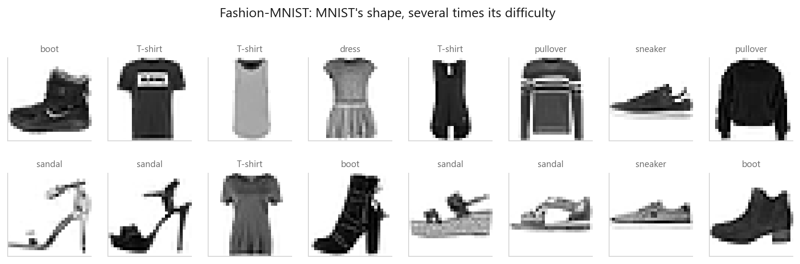
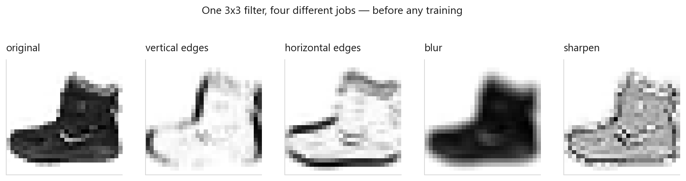
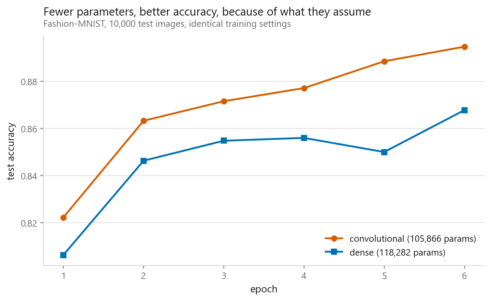
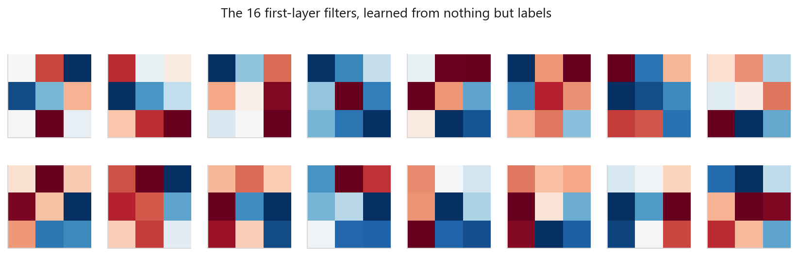
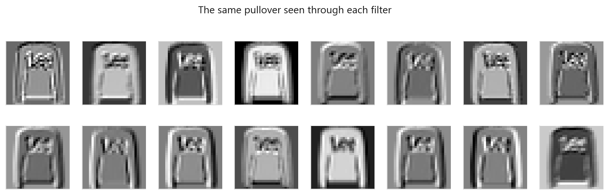
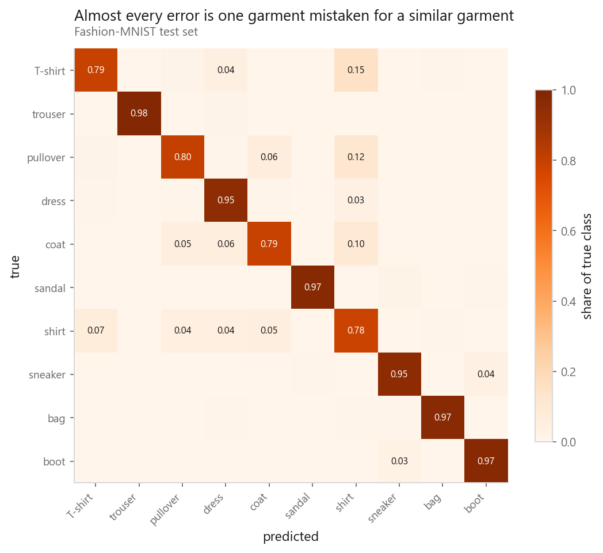

# A convolutional network, layer by layer

### What a convolution buys that a dense layer cannot

**[Open the notebook](notebook.ipynb)** · Part 8, Computer vision ·
Made by [Elyes Lounissi](https://www.linkedin.com/in/elyes-lounissi/)

| | |
|---|---|
| **What you will learn** | What a convolution computes, and why weight sharing is the whole trick. What the filters actually learn. And a fair comparison against a dense network at a similar parameter budget |
| **You should already know** | [The PyTorch training loop](../../07-neural-networks/03-the-same-net-in-pytorch/) |
| **Dataset** | Fashion-MNIST (70,000 images, 28×28 greyscale, 10 classes) |
| **Runtime** | Four to six minutes on a laptop CPU, under two on a GPU |

---

## The idea

A dense layer treats a 28×28 image as 784 unrelated numbers. Shift a shoe two
pixels right and every input changes: as far as the layer knows it is a different
picture, and it must learn the shoe again in the new position.

A convolution starts from two facts about images: **nearby pixels are related**,
and **a useful pattern is useful anywhere**. So it learns one small filter and
slides it across the whole image, reusing the same weights at every position.

| | Parameters |
|---|---|
| Dense layer, 784 → 784 | 615,440 |
| One 3×3 filter | **9**, whatever the image size |

## What a filter actually does

The same 3×3 grid doing several different jobs, edge detection, blur and
sharpening among them, before any learning happens. **Pooling** is the other
half: take the maximum in each 2×2 block, which halves the resolution and makes
the representation tolerant to small shifts.

## Fewer parameters, better accuracy

| Model | Parameters | Test accuracy | Seconds/epoch |
|---|---|---|---|
| Convolutional | **105,866** | **0.8876** | **7.7** |
| Dense | 118,282 | 0.8678 | 8.1 |

The CNN wins on accuracy, parameter count, **and** speed. This is not extra
capacity; it is better assumptions. The convolution knows the input is a grid and
that patterns repeat across it. The dense layer must discover both from data, and
never fully does.

## What the filters learned

Compare these to the hand-designed Sobel filters earlier in the notebook. Several
learned ones have the same structure: positive on one side, negative on the other,
which is an edge detector. **Nobody asked for that.** It emerged because detecting
edges helps tell a sandal from a boot.

## Where the mistakes are

The errors are not random. Shirts, pullovers, coats and T-shirts trade with each
other, because at 28×28 in greyscale they genuinely do look alike, sleeves and a
torso-shaped blob. Trousers, bags and boots are almost never confused, because
their silhouettes are distinctive.

**A model whose mistakes are the ones a human would also make has learned something
real.** Errors scattered evenly across the matrix would suggest it had not.

## Cheat sheet

| | |
|---|---|
| **Use it when** | The input is a grid where position matters and patterns repeat: images, spectrograms, some time series |
| **Avoid it when** | Features have no spatial relationship. On tabular data a convolution is meaningless |
| **The trick** | Weight sharing. Parameters do not scale with input size |
| **Standard block** | `Conv → ReLU → Pool`, repeated, channels doubling as resolution halves |
| **Padding** | `padding=1` with a 3×3 kernel preserves size |
| **Watch out** | The flatten into the first dense layer usually holds most of the parameters. That is where overfitting starts |

---

If this chapter was useful, a star on the repository helps other people find it.
The code is yours to use, copy and adapt in your own work, no permission needed.

Made by **Elyes Lounissi** ·
[LinkedIn](https://www.linkedin.com/in/elyes-lounissi/) ·
[pilot.tun@gmail.com](mailto:pilot.tun@gmail.com)

Back to [Part 8](../) · [the curriculum](../../CURRICULUM.md) · [the book](../../README.md)

`#DeepLearning` `#CNN` `#ConvolutionalNeuralNetwork` `#ComputerVision` `#PyTorch`
`#FashionMNIST` `#MachineLearning` `#Python` `#MLTutorial` `#AI`
