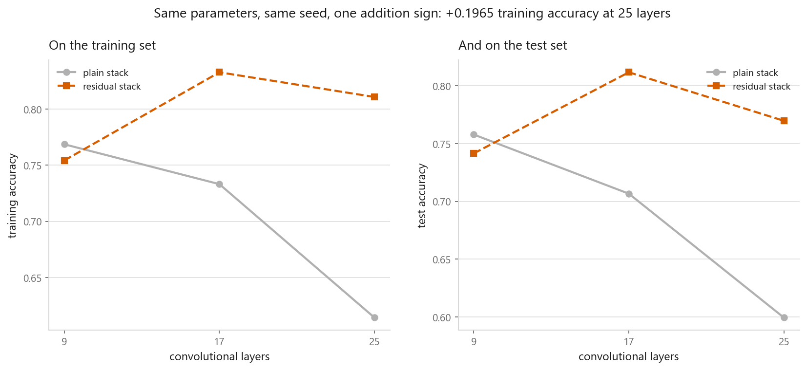
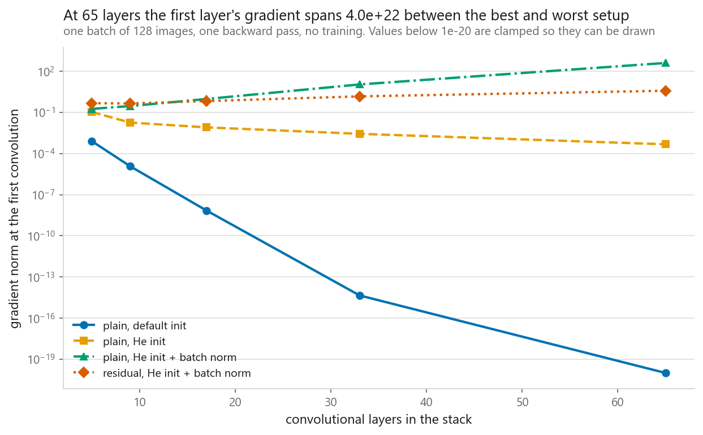
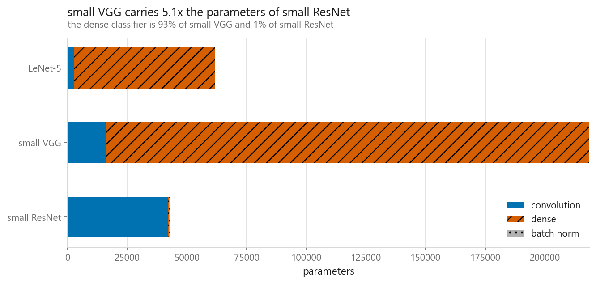
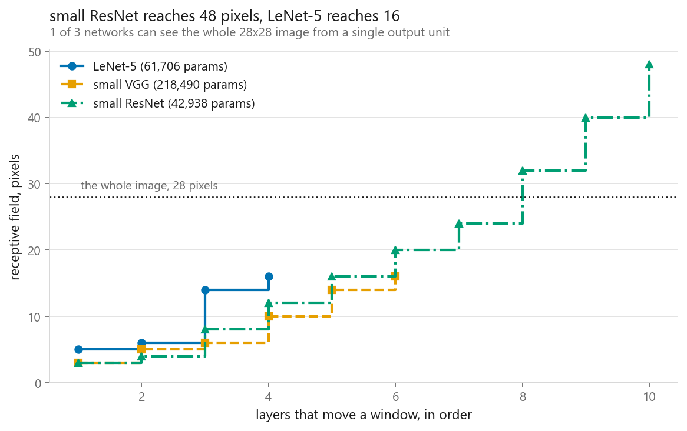
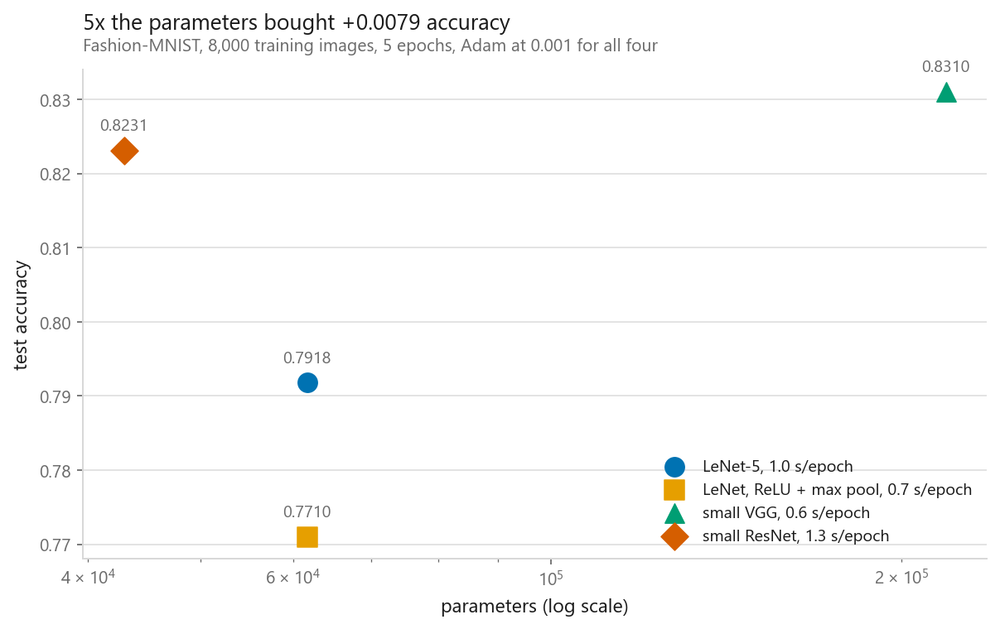

# Classic architectures: LeNet, VGG, ResNet

### The degradation ResNet was built for showed up on cue, and the gradient measurement that is supposed to explain it pointed the other way

**[Open the notebook](notebook.ipynb)** · Part 8, Computer vision ·
Made by [Elyes Lounissi](https://www.linkedin.com/in/elyes-lounissi/)

| | |
|---|---|
| **What you will learn** | How to write LeNet, a VGG block stack and a residual network from scratch in PyTorch, where each one keeps its parameters, how far each one can see computed from the layer list, and what a skip connection does and does not do to the gradient at the first layer |
| **You should already know** | [A CNN layer by layer](../02-a-cnn-layer-by-layer/) and the [size arithmetic](../01-convolution-and-pooling/) |
| **Dataset** | Fashion-MNIST, a fixed 8,000-image subset, 758 to 856 images per class, scored on all 10,000 test images |
| **Runtime** | 1.3 minutes on a laptop GPU. Nothing here is tuned per architecture, which is the only way the comparison means anything |

---

## The result I would lead with

Two stacks, identical down to the parameter count and the seed, differing by one
addition sign inside the block. Both keep He initialisation and batch norm, so
the only variable left is the skip connection.

| Conv layers | Stack | Parameters | Final train loss | Train accuracy | Test accuracy | Mean first-layer gradient, epoch 1 |
|---|---|---|---|---|---|---|
| 9 | plain | 19,034 | 0.8216 | **0.7686** | 0.7578 | 2.398e-01 |
| 9 | residual | 19,034 | 0.6655 | 0.7542 | 0.7415 | 3.850e-01 |
| 17 | plain | 37,722 | 0.8324 | 0.7331 | 0.7066 | 6.908e-01 |
| 17 | residual | 37,722 | 0.5250 | **0.8327** | **0.8117** | 5.850e-01 |
| 25 | plain | 56,410 | 1.1936 | **0.6142** | 0.5993 | **2.361e+00** |
| 25 | residual | 56,410 | 0.4963 | 0.8107 | 0.7697 | 6.989e-01 |

The headline held. The plain stack lost **0.1544 training accuracy** going from 9
to 25 layers while the residual one gained 0.0565 over the same range, worth
**+0.1965 at 25 layers**. Training accuracy falling as depth rises is the
degradation the ResNet paper was written about, and it cannot be overfitting,
because it is the training set.

The mechanism did not hold. The standard story is that the plain stack fails
because gradient stops reaching its early layers. Read the last column. At 25
layers the plain stack, the one that collapsed to 0.6142, received a first-layer
gradient of **2.361e+00** against the residual stack's **6.989e-01**. The network
that failed got **3.4x more** gradient than the network that worked, and the sign
of the comparison flips between 9 layers and 17.

So the sweep gives a clean result and takes away the explanation. Whatever went
wrong in the plain stack at 25 layers, "the first layer stopped hearing anything"
is not it on this budget, and any chapter that prints both tables and only
narrates one of them is choosing which half to believe.

Two more things in that figure that the summary line hides. At 9 layers the
residual stack is **worse** than the plain one on both splits, 0.7542 against
0.7686 on training and 0.7415 against 0.7578 on test, so the skip connection is
not free at shallow depth. And the residual stack peaks at 17 layers and then
falls, 0.8327 to 0.8107 on training and 0.8117 to 0.7697 on test. It degrades
too. It just degrades later. The single printed figure of +0.0565 is a 9-to-25
difference across a curve that goes up and then comes back down.

## What the initialisation measurement actually shows

One batch of 128 images, one backward pass, no training, four families read in
the order that separates three different fixes usually credited to each other.
Gradient norm at the first convolution:

| Conv layers | Plain, default init | Plain, He init | Plain, He + batch norm | Residual, He + batch norm |
|---|---|---|---|---|
| 5 | 7.928e-04 | 1.064e-01 | 1.805e-01 | 4.711e-01 |
| 9 | 1.183e-05 | 1.810e-02 | 2.887e-01 | 4.428e-01 |
| 17 | 6.907e-09 | 8.048e-03 | 9.482e-01 | 6.726e-01 |
| 33 | 4.485e-15 | 2.728e-03 | 1.089e+01 | 1.469e+00 |
| 65 | **0.000e+00** | 4.705e-04 | **4.013e+02** | 3.778e+00 |

Three separate stories in one table. PyTorch's default convolution
initialisation, which is not He, underflows to exactly zero by 65 layers. He
initialisation alone slows the decay to a 226x fall over the same range but does
not stop it. The residual family is the only one that stays in a usable band the
whole way, from 4.711e-01 to 3.778e+00.

**The figure's title and the printed labels get one thing backwards, and it is
worth naming.** The code ranks the families by gradient magnitude and calls the
largest the "strongest signal" and the "best setup". At 65 layers the largest is
plain with He and batch norm at 4.013e+02, a gradient norm two orders of
magnitude above the residual family's. That is exploding, not best. Batch norm on
its own does prevent the vanishing failure, and it overshoots straight into the
other one. The line you want is the flat orange one.

The headline span of 4.0e+22 is also an artifact rather than a measurement. The
true minimum is 0.000e+00, so the ratio is undefined and the number comes from
the 1e-20 clamp the code applies so the point can be drawn. The subtitle says so.
The headline does not.

One more thing the table does not do. The notebook also prints the standard
deviation of the logits at initialisation as a collapse diagnostic, with the
reference value ln(10) = 2.3026 for a network that outputs the same thing for
every image. Nothing collapses. The default-init family sits at 1.426e-01 at 65
layers against 1.343e-01 at 5, essentially unchanged, while its gradient has
gone to zero. The forward pass was healthy the whole time and the backward pass
was already dead.

## Where the parameters live

| | Convolution | Dense | Batch norm | Total | Dense share |
|---|---|---|---|---|---|
| LeNet-5 | 2,572 | 59,134 | 0 | 61,706 | **95.8%** |
| small VGG | 16,368 | 202,122 | 0 | 218,490 | 92.5% |
| small ResNet | 42,128 | 330 | 480 | 42,938 | **0.8%** |

The interesting number is not the total, it is the share sitting in the dense
classifier after the flatten, because that share is exactly what global average
pooling deletes. small VGG carries 5.1x the parameters of small ResNet and 92.5%
of them are in a layer doing position-specific bookkeeping over a 7x7 map. Swap
the flatten for an average and the same architecture family gets deeper and
smaller at the same time.

The skip connection itself costs nothing. Plain and residual stacks at 4 blocks
both print 19,034 parameters. It is an addition, not a layer.

## How far each one can see

Computed off the layer list rather than estimated, so the table cannot drift out
of step with the code:

| | Final receptive field | Verdict |
|---|---|---|
| LeNet-5 | 16 pixels | sees a window, never the whole garment |
| small VGG | 16 pixels | sees a window, never the whole garment |
| small ResNet | **48 pixels** | covers the image |

One of the three can see a whole 28x28 image from a single output unit. The other
two are deciding "sneaker or boot" from a patch. Stride is what buys the reach
cheaply: every pool multiplies the jump, so a 3x3 convolution placed after two
pools advances the reach by four pixels instead of two for the same nine weights.

The arithmetic behind VGG's one design decision, at a real layer width of 32
channels in and 32 out:

| Target reach | One large kernel | Stacked 3x3 | Weight ratio | Nonlinearities |
|---|---|---|---|---|
| 5 | 25,600 | 18,432 | 1.39x | 2 against 1 |
| 7 | 50,176 | 27,648 | 1.81x | 3 against 1 |
| 9 | 82,944 | 36,864 | 2.25x | 4 against 1 |
| 11 | 123,904 | 46,080 | **2.69x** | 5 against 1 |

Same reach, fewer weights, and the gap widens with the target. The single large
kernel gets one nonlinearity no matter how wide it is.

## Parameters are not accuracy, and they are not cost either

All four trained on the same 8,000 images with the same optimiser, learning rate,
batch size and seed:

| Model | Parameters | Train | Test | Seconds per epoch | Train minus test |
|---|---|---|---|---|---|
| LeNet-5 | 61,706 | 0.8086 | 0.7918 | 1.0 | +0.0168 |
| LeNet, ReLU + max pool | 61,706 | 0.7795 | **0.7710** | 0.7 | +0.0085 |
| small VGG | 218,490 | 0.8399 | **0.8310** | **0.6** | +0.0089 |
| small ResNet | 42,938 | 0.8536 | 0.8231 | **1.3** | +0.0305 |

The standard error on a test accuracy of 0.8310 over 10,000 images is 0.0037.
5.1x the parameters bought +0.0079 accuracy, about two standard errors, and the
model with the fewest parameters finished 0.0079 behind the model with the most.
Per ten thousand parameters, above the weakest model, small ResNet returns
+0.01213 against small VGG's +0.00275, a 4.4x difference in efficiency that the
raw accuracy column completely hides.

The seconds column disagrees with the parameter column outright. small VGG has
the most parameters and the **fastest** epoch at 0.6 s. small ResNet has the
fewest and the **slowest** at 1.3 s. A dense layer holds many weights and touches
each once per image; a convolution holds few and touches each at every spatial
position, so the arithmetic bill follows feature map size, not weight count.

The unflattering row is the second one. Swapping LeNet's `tanh` and average
pooling for ReLU and max pooling, the substitution with the best claim to having
unlocked everything that came after it, **lost 0.0208 test accuracy** here, which
is 5.6 standard errors. At 8,000 images and five epochs on a 28x28 problem, the
historic fix is not the fix. It is also the model everything else is normalised
against in the per-parameter print, which is why its efficiency line reads
+0.00000.

## Cheat sheet

| | |
|---|---|
| **LeNet-5** | Conv, pool, conv, pool, dense. Still the skeleton, and 95.8% of its weights are in the dense head |
| **VGG** | Only 3x3 convolutions and 2x2 pools, depth as the single dial. Cheap per epoch here, expensive in parameters |
| **Why 3x3** | Two reach as far as one 5x5 at 0.72x the weights with an extra nonlinearity. Three match a 7x7 at 0.55x |
| **ResNet** | `y = relu(F(x) + x)`. The addition costs zero parameters, measured, and puts an identity term in the gradient product |
| **Global average pooling** | Replaces the flatten and deletes the largest parameter block in the other two architectures. 0.8% dense share against 92.5% |
| **Receptive field** | `r += d(k-1)*jump` then `jump *= stride`. Compute it. Two of these three networks never see a whole garment |
| **Degradation** | A claim about training error, not test error. Confirmed here: the plain stack lost 0.1544 training accuracy from 9 to 25 layers |
| **Do not** | Assume the skip connection worked by keeping gradient alive during training. At 25 layers the failing plain stack had 3.4x the gradient |
| **Watch out** | PyTorch's default convolution init is not He. It underflowed to exactly zero at 65 layers while the forward pass still looked fine |
| **Larger is not better** | Batch norm without skips gave the largest first-layer gradient at depth, 4.013e+02. That is the other failure, not the fix |
| **Next** | [08-04 Data augmentation](../04-data-augmentation/), which changes the data instead of the architecture, and lost at every size it tried |

---

Made by **Elyes Lounissi** ·
[LinkedIn](https://www.linkedin.com/in/elyes-lounissi/) ·
[pilot.tun@gmail.com](mailto:pilot.tun@gmail.com)

Back to [Part 8](../) · [the curriculum](../../CURRICULUM.md) · [the book](../../README.md)

`#ResNet` `#VGG` `#LeNet` `#SkipConnections` `#ResidualNetworks` `#BatchNorm`
`#ReceptiveField` `#CNN` `#ComputerVision` `#PyTorch` `#FashionMNIST`
`#DeepLearning` `#MachineLearning` `#MLTutorial` `#LearnMachineLearning`
`#DataScience` `#AI`
