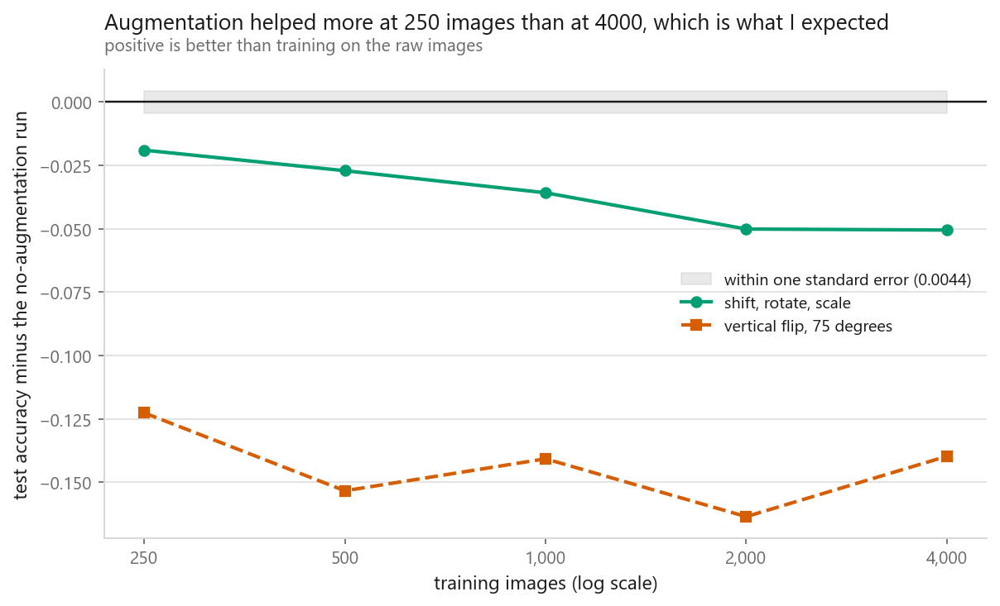
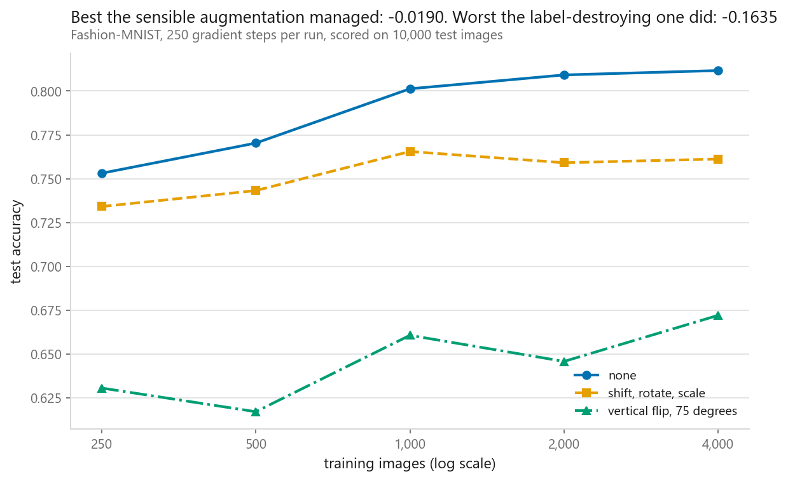
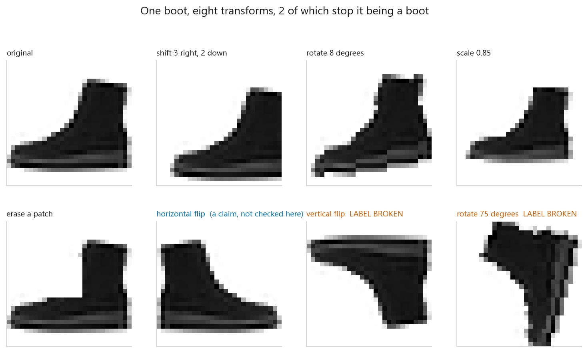
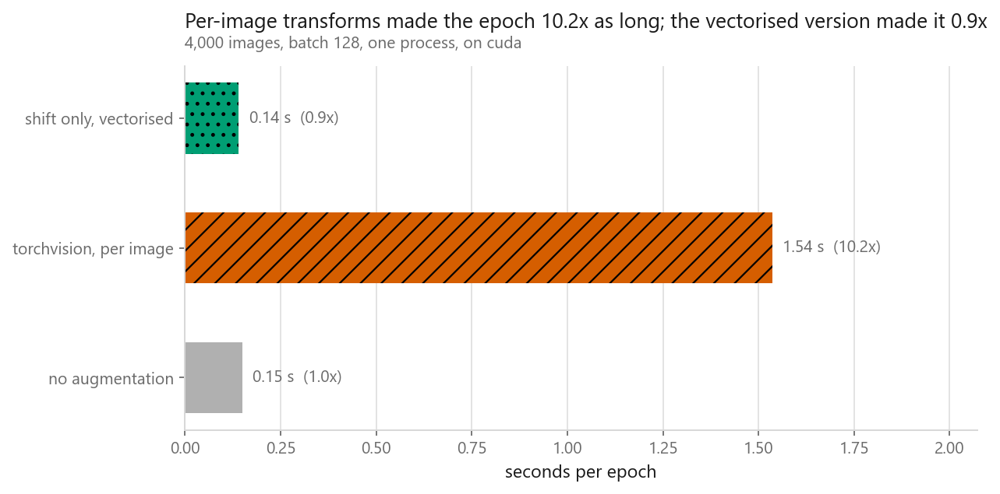
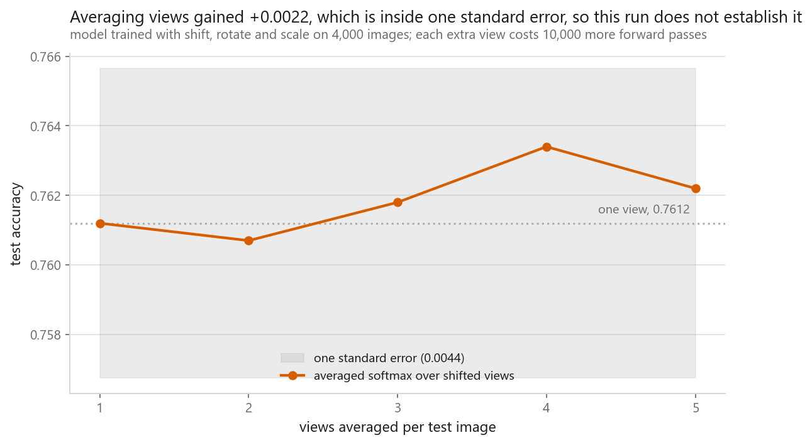

# Data augmentation

### Fifteen runs, five training set sizes, and not one where augmentation beat the raw images

**[Open the notebook](notebook.ipynb)** · Part 8, Computer vision ·
Made by [Elyes Lounissi](https://www.linkedin.com/in/elyes-lounissi/)

| | |
|---|---|
| **What you will learn** | How to write a translation augmentation on the array in four lines, what a label-destroying transform costs in accuracy, what per-image transforms cost in seconds, and why a fixed step budget can turn a fair-looking sweep into a rigged one |
| **You should already know** | [A CNN layer by layer](../02-a-cnn-layer-by-layer/), enough PyTorch to read a training loop |
| **Dataset** | Fashion-MNIST, nested subsets of 250, 500, 1,000, 2,000 and 4,000 images from one shuffled pool, scored on all 10,000 test images every time |
| **Runtime** | 4.7 minutes on a GPU. The fifteen-run sweep is 4.3 minutes of that |

---

## The result I would lead with

The sweep was built to test the standard claim that augmentation pays most when
data is scarce. It never paid at all.

| Training images | No augmentation | Shift, rotate, scale | Change |
|---|---|---|---|
| 250 | 0.7531 | 0.7341 | **-0.0190** |
| 500 | 0.7703 | 0.7432 | -0.0271 |
| 1,000 | 0.8013 | 0.7655 | -0.0358 |
| 2,000 | 0.8092 | 0.7591 | -0.0501 |
| 4,000 | 0.8117 | 0.7612 | **-0.0505** |

Five sizes, five losses. The binomial standard error at the sweep's mean
accuracy of 0.7290 over 10,000 test images is **0.0044**, so even the smallest
of those losses is four standard errors below zero. This is not a null result
that failed to reach significance. Sensible, label-preserving augmentation made
the model measurably worse at every training set size I could afford.

The one direction that did survive is the shape of the damage. The penalty grows
monotonically with data, from -0.0190 at 250 images to -0.0505 at 4,000. So the
scarcity story is half right and inverted: augmentation is least harmful when
data is scarce, not most helpful. Hold that shape until the next section, because
half of it turns out to be an artefact of how I budgeted the runs.

That chart used to carry a caption saying augmentation helped most when data was
scarce, which is the reverse of the line it was drawn above. The verdict string
came from a branch comparing the gain at 250 images against the gain at 4,000
that never checked the sign of either, so with both negative it fired the
sentence written for the success case. The branch now counts how many sizes
cleared one standard error before it compares anything, and the title, the
summary line and the section heading follow the measurement.

I am keeping the story here because the failure mode generalises: a verdict
computed by a branch is only as good as the cases the branch enumerates, and the
case nobody writes is the one where the effect points the other way.

## Why it lost, split into the part that is my fault and the part that is not

Every run gets **250 gradient steps of 128 images**, which is 32,000 image passes
whatever the subset size, on a network of 105,866 parameters. Holding steps fixed
is the right call for the size sweep: with fixed epochs, the 4,000-image run
would take sixteen times as many updates as the 250-image run and the comparison
would be measuring optimisation effort.

But the same choice quietly biases the other comparison. Augmented data is harder
data. A model given a fresh random shift, rotation and scale on every draw is
fitting a wider distribution, and it needs more steps to reach the same place. At
a fixed 250 steps the augmented run is scored before it has finished converging
and the clean run is not.

That is a testable claim, so the notebook tests it. Same 4,000 images, both
pipelines, at 250 steps and at 1,000:

| Gradient steps | No augmentation | Shift, rotate, scale | Gap |
|---|---|---|---|
| 250 | 0.8117 | 0.7612 | -0.0505 |
| 1,000 | 0.8581 | 0.8322 | **-0.0259** |

Quadrupling the budget recovered **+0.0246** of the penalty, nearly half of it,
and left the rest. Both numbers matter. The budget was carrying half the result,
so the sweep above overstates the damage and I would not quote its gain column
without this table beside it. The other half survived a budget four times larger,
so augmentation still cost real accuracy on this dataset.

The residual has a mechanism, and it is about Fashion-MNIST rather than about
augmentation. These images are already centred, already upright, already the same
scale, and the test set is drawn the same way. Shifting and rotating the training
images spends model capacity on variation the test set does not contain. There is
nothing to win, so only the cost shows up. Photographs of products on a shelf do
contain rotation, and there the same transform would pay.

The rule I would carry out of this: augmentation pays in proportion to how much
of the transform's range your test distribution actually contains, and any
benchmark that fixes the step count has already handed the win to whichever run
had the easier distribution. Ask for the budget before you look at the
accuracies.

## What a false claim about your labels costs

The second pipeline is deliberately wrong for this dataset: a vertical flip and a
seventy-five degree rotation, applied to garments that are all upright and
roughly centred.

Eight transforms on one boot, two of which stop it being a boot. The horizontal
flip is labelled as a claim rather than a fact on purpose, because mirroring a
boot does give a boot, but every shoe in Fashion-MNIST points the same way, so a
mirrored one is a picture the test set does not contain.

The cost of the two that are plainly wrong:

| Training images | Label-destroying change |
|---|---|
| 250 | -0.1226 |
| 500 | -0.1533 |
| 1,000 | -0.1407 |
| 2,000 | **-0.1635** |
| 4,000 | -0.1397 |

Between -0.1226 and -0.1635 across the sweep, which is between 2.8 and 6.5 times
the damage the sensible pipeline did at the same size. Nothing in the training
loop can see this. The loss goes down, the training accuracy goes up, and the
augmented training set is internally consistent. Only the untouched test set
knows.

## What it costs per epoch

One epoch over 4,000 images, averaged over two passes:

| Pipeline | Seconds per epoch | Times the baseline |
|---|---|---|
| no augmentation | 0.226 | 1.000 |
| torchvision, per image | 2.710 | **11.986** |
| shift only, vectorised | 0.256 | 1.133 |

The transform costs twelve times the training step it feeds. That ratio is a
property of this pairing rather than a law, since a larger network would swallow
it, but the fix generalises: the third row is the same translation applied to a
whole batch as one tensor operation, and it costs 13% over doing nothing.

The hand-written version is checked against torchvision on four offsets and the
largest difference is **0.0e+00**. A translation augmentation is array slicing.

## The bug that makes your augmentation a fraction of what you asked for

Six copies of one image, augmented two ways:

| How the transform was applied | Largest difference between copies |
|---|---|
| to the stacked batch | **0.0000** |
| per image | 1.0000 |

A zero in the first row means every image in the batch got the same random draw.
The pipeline runs, the images change, and the effective augmentation is one
sample instead of `batch_size` samples.

## Test-time augmentation

Averaging the softmax over the original view and up to four two-pixel shifts, on
the model trained with shift, rotate and scale:

| Views averaged | Test accuracy | Forward passes | Change |
|---|---|---|---|
| 1 | 0.7612 | 10,000 | +0.0000 |
| 2 | 0.7607 | 20,000 | -0.0005 |
| 3 | 0.7618 | 30,000 | +0.0006 |
| 4 | **0.7634** | 40,000 | **+0.0022** |
| 5 | 0.7622 | 50,000 | +0.0010 |

The best row gains +0.0022 for four times the inference cost, and one standard
error is 0.0044. The notebook says so in the chart title rather than rounding the
number up into a finding, which is the behaviour I want from the rest of the
chapter too.

## Cheat sheet

| | |
|---|---|
| **What it is** | Random label-preserving transforms on training inputs, drawn fresh every epoch |
| **The rule** | Every transform is a claim that the label survives it. Nothing in training checks that claim |
| **Before you believe a gain** | Check the step budget. Augmented data needs more updates, and a fixed-step comparison hands the win to the unaugmented run |
| **Fashion-MNIST** | Small shifts, small rotations, small scale changes. Not vertical flips, not large rotations, which cost up to -0.1635 here |
| **The usual bug** | Transforming a stacked batch instead of each image. Measured here as a zero difference between six copies |
| **The other usual bug** | Augmenting the validation or test set, which hides the damage from the only measurement that can see it |
| **Cost** | Per-image torchvision transforms ran 12x the training step on this model. Vectorise the cheap ones and the bill drops to 1.1x |
| **Test time** | Averaging 4 views bought +0.0022 against a standard error of 0.0044, for 4x the inference. Measure before shipping it |
| **When it pays** | In proportion to how much of the transform's range your test set actually contains. Fashion-MNIST is centred and upright, so shifting and rotating had nothing to win |
| **Do not** | Quote "augmentation helps most when data is scarce" from a run like this one. Here it helped least at 250 images by helping nowhere |
| **Next** | [Transfer learning](../05-transfer-learning/), which buys the same thing from somebody else's data rather than from your own, and unlike this chapter finds a real gain at small sizes |

---

If this chapter was useful, a star on the repository helps other people find it.
The code is yours to use, copy and adapt in your own work, no permission needed.

Made by **Elyes Lounissi** ·
[LinkedIn](https://www.linkedin.com/in/elyes-lounissi/) ·
[pilot.tun@gmail.com](mailto:pilot.tun@gmail.com)

Back to [Part 8](../) · [the curriculum](../../CURRICULUM.md) · [the book](../../README.md)

`#DataAugmentation` `#ComputerVision` `#DeepLearning` `#PyTorch` `#torchvision`
`#FashionMNIST` `#CNN` `#TestTimeAugmentation` `#MachineLearning` `#MLTutorial`
`#LearnMachineLearning` `#DataScience` `#AI`
