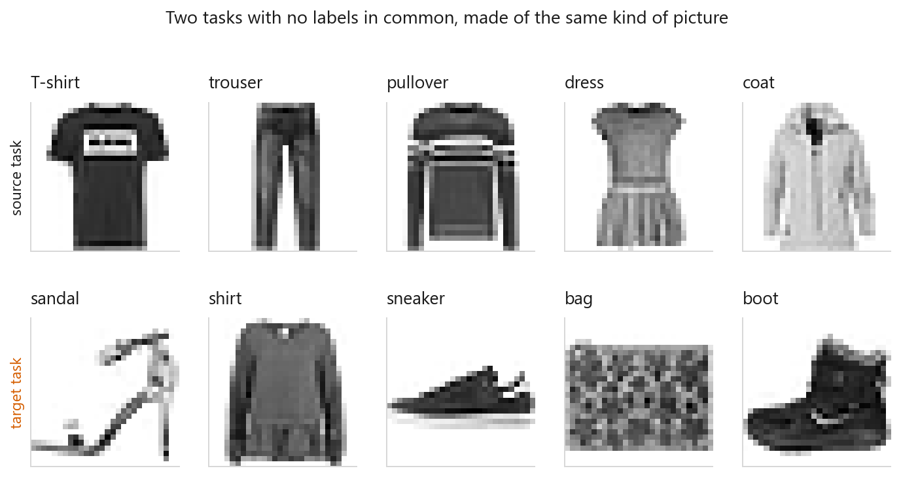
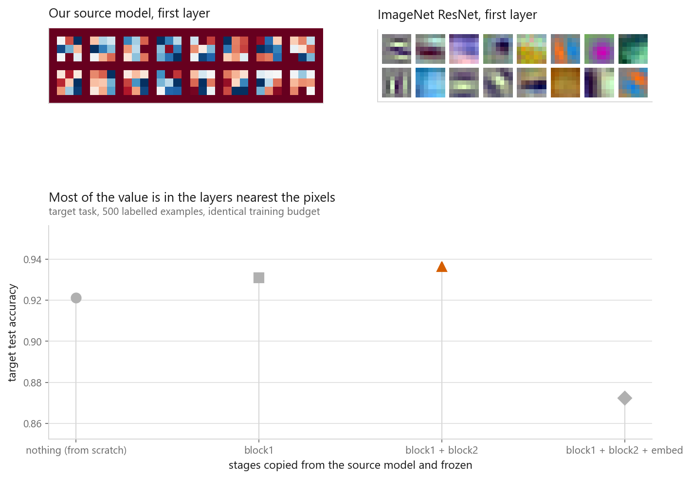
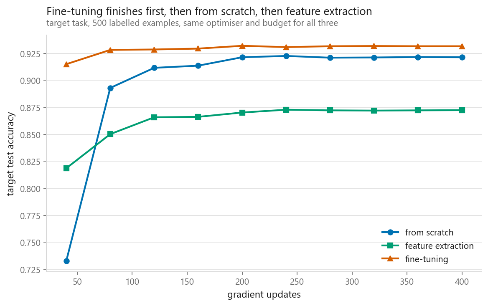
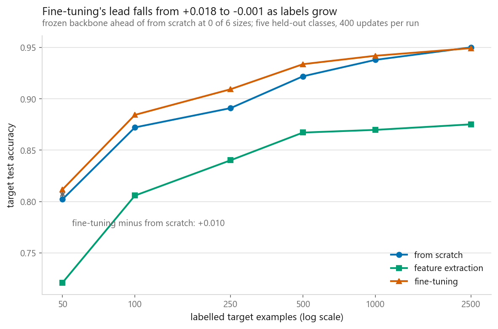

# Transfer learning and fine-tuning

### Reusing a network that was trained for something else

**[Open the notebook](notebook.ipynb)** · Part 8, Computer vision ·
Made by [Elyes Lounissi](https://www.linkedin.com/in/elyes-lounissi/)

| | |
|---|---|
| **What you will learn** | Why early layers transfer and late ones do not, the difference between feature extraction and fine-tuning, how both compare against training from scratch, and how little labelled data you need before transfer stops being worth it |
| **You should already know** | [A convolutional network, layer by layer](../02-a-cnn-layer-by-layer/) |
| **Datasets** | Fashion-MNIST, split into two separate five-class tasks |
| **Runtime** | Four to six minutes on a laptop CPU, about one on a GPU |

---

The advice everyone repeats is that feature extraction is the safe choice when
labels are scarce, because it has almost nothing to overfit. I swept the target set
from 50 examples to 2500 and **feature extraction lost to training from scratch at
every size**, worst of all at the smallest one: **0.7306 against 0.8022 at 50
examples**, a 7.2-point deficit at exactly the size where it is supposed to shine.

Fine-tuning did win everywhere, but by less than the usual story implies. Its lead
over from-scratch was **+0.0114 at 50 examples**, peaked at **+0.0226 at 100**, and
had shrunk to **+0.0018 by 2500**. From scratch needed 100 labelled examples to
reach what fine-tuning got from 50 — a 2× data saving, not a 10× one.

That is one small greyscale task, and I would not carry the sign of it over to
ImageNet-scale backbones. But it is what the run said, so it is what is reported.

## Two tasks that share no classes

The honest demonstration would pull an ImageNet network off the internet, and the
notebook tries — the ResNet-18 weights did load, and I use them for one picture. The
experiment itself is self-contained so it never stops running: Fashion-MNIST split
into a **source task** (T-shirt, trouser, pullover, dress, coat — 30,000 training
images) and a **target task** (sandal, shirt, sneaker, bag, boot). No garment appears
in both, so whatever transfers is not memorised labels. The source model reached
**0.9206** on its own five classes in **21 seconds**; everything below inherits from
it, and every target run gets the same budget of **400 updates, batch 64, same
seed**.

## Where to cut

Copy the layers below the cut and freeze them, put fresh layers above, train on the
target.

| Copied and frozen | Target accuracy |
|---|---|
| Nothing (from scratch) | 0.9224 |
| block1 | 0.9336 |
| block1 + block2 | **0.9356** |
| block1 + block2 + embed | 0.8660 |

Copying one block past the best cut cost **−0.0696**, five times more than the
+0.0132 that copying the first two blocks bought in the first place. That embed
stage was shaped by pressure to separate trousers from coats, and my question is
about sandals.

The first-layer filters in the figure are why the early blocks work at all. Most are
oriented light and dark bands, with a few blob detectors. Nobody asked for edge
detectors. One of those networks saw a million colour photographs across a thousand
categories and the other saw thirty thousand small greyscale clothes, and their
first layers are recognisably the same thing.

## Three strategies, at 500 target examples

| Strategy | Accuracy | Trainable parameters |
|---|---|---|
| From scratch | 0.9210 | 105,541 of 105,541 |
| Feature extraction | 0.8660 | **325** of 105,541 |
| Fine-tuning | **0.9366** | 105,541 of 105,541 |

Feature extraction trains 325 numbers, a linear map over frozen features, and its
ceiling is whatever the source task left behind. Here that ceiling sat **5.5 points
below** simply starting over from noise.

The interesting part of the figure is the left edge, not the right. Both transferred
models are useful after a handful of updates, because all they have to learn is a
map over features that already separate garments. The from-scratch model spends most
of its 400 updates rediscovering edge detectors that were sitting in the source
model the whole time. It gets there — it just pays for the trip.

## How little data before it stops helping

Eighteen training runs, 112 seconds total. Sizes are nested, so the smallest set is
contained in every larger one and the curves are not moving because the sample
changed.

| Target examples | From scratch | Feature extraction | Fine-tuning |
|---|---|---|---|
| 50 | 0.8022 | 0.7306 | **0.8136** |
| 100 | 0.8634 | 0.8184 | **0.8860** |
| 250 | 0.8914 | 0.8420 | **0.9116** |
| 500 | 0.9216 | 0.8660 | **0.9366** |
| 1000 | 0.9388 | 0.8708 | **0.9412** |
| 2500 | 0.9496 | 0.8742 | **0.9514** |

Fine-tuning minus from scratch, by size: **+0.0114, +0.0226, +0.0202, +0.0150,
+0.0024, +0.0018**. Three readings.

**The two transfer curves never cross.** Fine-tuning beat feature extraction at all
six sizes, and the margin was widest at 50 examples (0.0830), not narrowest. The
freeze-when-you-have-nothing rule did not survive contact with the measurement. If
the frozen features are not good enough, having few parameters does not rescue you —
it only guarantees you cannot fix them.

**Convergence is fast.** By 1000 target examples fine-tuning's edge is **+0.0024**,
inside the noise of a single seed. Transfer bought something real over roughly the
50-to-500 range and almost nothing past 1000. Feature extraction flattened out
around 0.87 and stopped improving at all, because more labels cannot teach a frozen
backbone anything.

**The advantage was modest even at its largest.** +0.0226 at 100 examples is worth
having and is not the difference between a working model and no model. A larger
source task, or a target less similar to Fashion-MNIST's own statistics, would move
that number.

## Learning rates and catastrophic forgetting

Fine-tuning moves the copied weights, and the source task quietly stops working. I
measured it by putting the original source head back on the fine-tuned backbone.
Nothing about that head changed, so any loss is the features moving out from under
it. Source accuracy before any of this: **0.9206**.

| Setting | Target accuracy | Source accuracy after |
|---|---|---|
| Frozen backbone | 0.8660 | 0.9206 |
| Backbone lr = head lr | 0.9350 | **0.6686** |
| Backbone lr = head lr / 10 | **0.9368** | 0.8710 |
| Backbone lr = head lr / 100 | 0.9244 | 0.9186 |

The full learning rate is the row to stare at. It destroyed **0.2520 of source
accuracy** — a quarter of the old task, gone — and came out *worse on the target*
than the tenth-rate setting did. It paid the whole price of forgetting and got
nothing back. The tenth is the standard recipe and this is why. The frozen row is
the sanity check: it lands exactly on 0.9206, because those weights never moved.

Forgetting matters when one model has to serve several tasks, or when you fine-tune
the same base repeatedly and each round erases the last. The cheap defences are
keeping the source weights on disk, freezing the lower stages, and mixing a little
source data back in.

## Cheat sheet

| | |
|---|---|
| **Use it when** | Small labelled dataset, and somebody has already trained on a similar kind of input |
| **Try first** | Fine-tuning. Feature extraction lost to from-scratch at every size measured here |
| **Feature extraction** | Freeze the backbone, train a head. 325 trainable parameters — the cheapest test of whether the source features are any use |
| **Fine-tuning** | Unfreeze at a fraction of the head's learning rate. Won at all six target sizes, by +0.0018 to +0.0226 |
| **From scratch** | Catches up fast. Only 0.0024 behind fine-tuning by 1000 target examples |
| **Learning rate** | Head normal, backbone a tenth. Equal rates cost 0.2520 of source accuracy and did not even help the target |
| **Where to cut** | Freeze from the bottom, and stop early. One block too deep cost −0.0696 |
| **Watch out** | Frozen batch-norm layers still update running statistics unless you also put them in eval mode |
| **Watch out** | Match the source preprocessing exactly — same resize, same channel order, same normalisation |

---

Made by **Elyes Lounissi** ·
[LinkedIn](https://www.linkedin.com/in/elyes-lounissi/) ·
[pilot.tun@gmail.com](mailto:pilot.tun@gmail.com)

Back to [Part 8](../) · [the curriculum](../../CURRICULUM.md) · [the book](../../README.md)

`#DeepLearning` `#TransferLearning` `#FineTuning` `#ComputerVision` `#PyTorch`
`#FashionMNIST` `#MachineLearning` `#Python` `#MLTutorial` `#NeuralNetworks`
