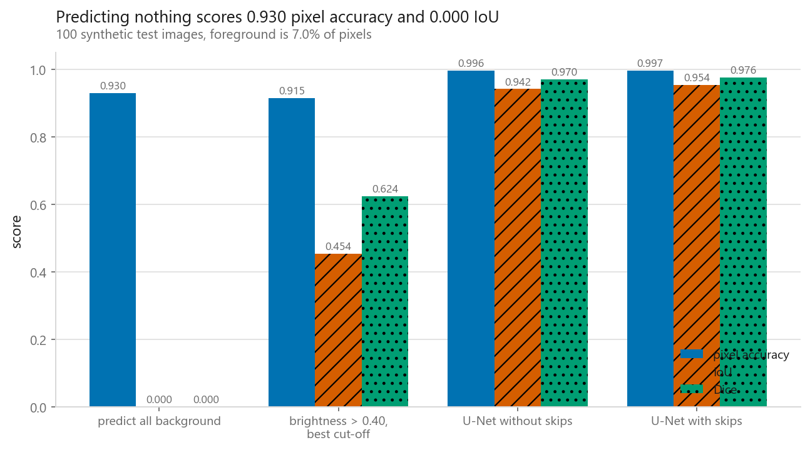
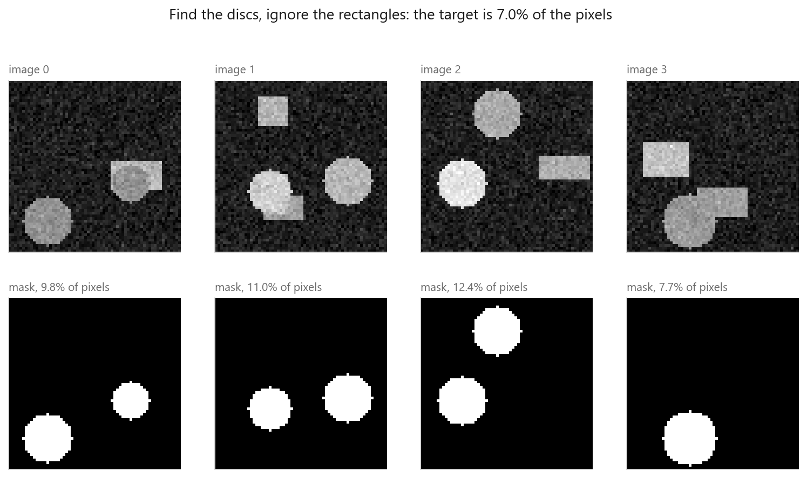
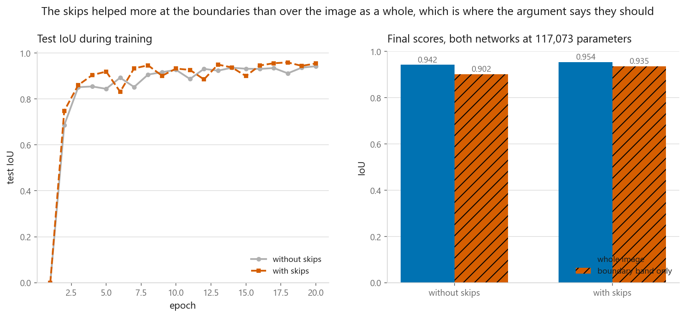
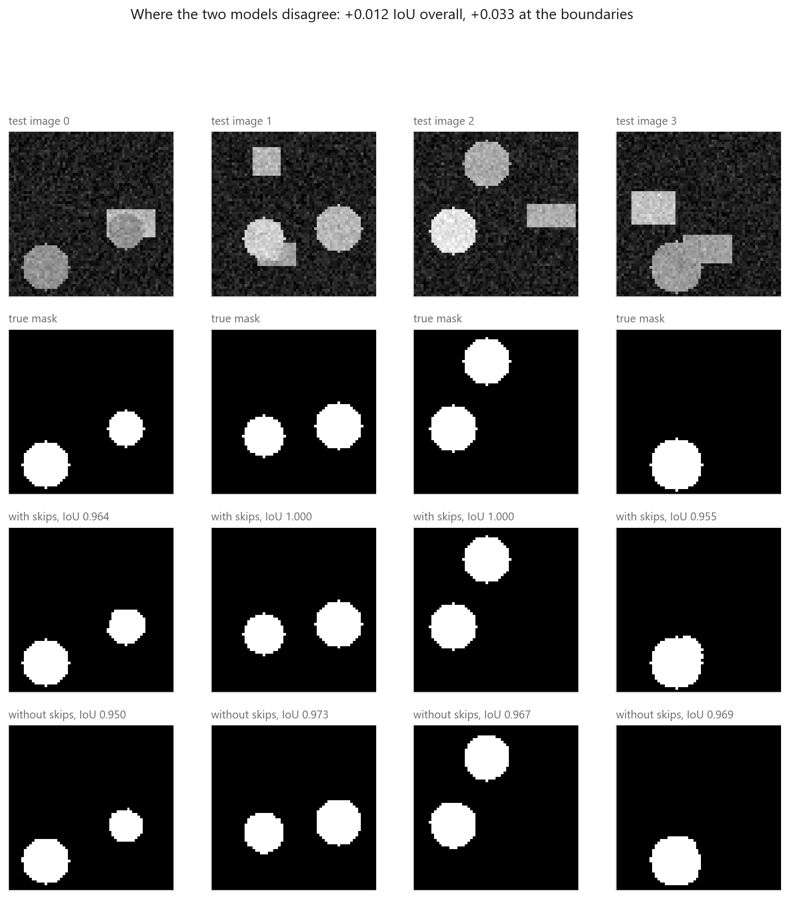
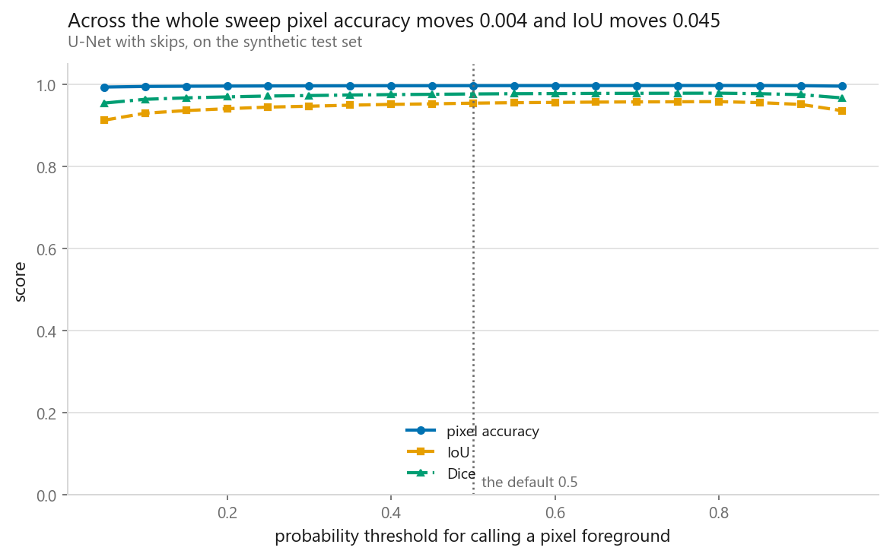

# Image segmentation

### Pixel accuracy ranked a model that predicts nothing above a baseline that works

**[Open the notebook](notebook.ipynb)** · Part 8, Computer vision ·
Made by [Elyes Lounissi](https://www.linkedin.com/in/elyes-lounissi/)

| | |
|---|---|
| **What you will learn** | Why pixel accuracy is the wrong metric for a small foreground, how IoU and Dice fix it and how they relate exactly, how to write a U-Net from scratch, and what the skip connections contribute, measured at the boundaries where they should matter most |
| **You should already know** | [A CNN layer by layer](../02-a-cnn-layer-by-layer/) and [classic architectures](../03-classic-architectures/) for the skip connection |
| **Dataset** | Synthetic 64x64 images generated in the notebook: 400 training, 100 test. Bright discs to find, bright rectangles to ignore, and every mask exact by construction |
| **Runtime** | 0.3 minutes on the CUDA device this run used, torch 2.11.0+cu128. Each U-Net trains in 6 s |

---

## The result I would lead with

Four models, scored two ways. The discs occupy **7.03% of test pixels**, so a
model that outputs all background is correct on 92.97% of them:

| Model | Pixel accuracy | IoU | Dice | Boundary-band IoU |
|---|---|---|---|---|
| predict all background | **0.9297** | **0.0000** | 0.0000 | 0.0000 |
| brightness > 0.40, best cut-off | **0.9154** | 0.4540 | 0.6245 | 0.8363 |
| U-Net without skips | 0.9959 | 0.9419 | 0.9701 | 0.9018 |
| U-Net with skips | 0.9967 | 0.9540 | 0.9765 | 0.9349 |

Read the first two rows against each other. The brightness threshold is a real
baseline that finds real discs, given every advantage the notebook could hand it,
including a cut-off chosen by sweeping the test set. It scores an **IoU of
0.4540**, and it is ranked **below** the model that has learned nothing and
outputs a blank image, on pixel accuracy, by 0.0143.

**Pixel accuracy did not merely fail to distinguish them. It put them in the
wrong order.**

Across all four rows, pixel accuracy spans **0.0812** and IoU spans **0.9540**.
One of those metrics is measuring the class prior and the other is measuring the
model.

The fix is one term. IoU throws the true negatives away entirely, `TP / (TP + FP
+ FN)`, so predicting nothing gives `TP = 0` and a score of zero. Dice counts the
intersection twice, and the two are the same quantity in different clothes:

`Dice = 2·IoU / (1 + IoU)`

The notebook checks that identity against the computed values and the largest
gap is **0.00e+00**. Dice is always the larger of the two, so a paper reporting
Dice is reporting the more flattering number, and a paper reporting both is
reporting one number twice.

## What the metrics do to a correct answer moved slightly

Four hand-built predictions, no model involved:

| Prediction | Pixel accuracy | IoU | Dice |
|---|---|---|---|
| all background | 0.9297 | 0.0000 | 0.0000 |
| all foreground | 0.0703 | 0.0703 | 0.1314 |
| the true mask | 1.0000 | 1.0000 | 1.0000 |
| the true mask, shifted 2 pixels | **0.9780** | **0.7294** | 0.8436 |

The last row is the second lesson. Take a perfect mask and slide it two pixels
and pixel accuracy loses 0.022 while IoU loses 0.271. IoU only ever looks at the
small set of pixels either mask claims, so it is the metric that notices the
boundary, and that is what makes the skip-connection experiment measurable at
all.

Sharpening it further: dilate the true mask, erode it, and score only in the
band between. That band covers **8.94% of test pixels** and is **41.5%
foreground inside itself**, against 7.0% over the whole image. It deletes the
easy interior and the easy far background and leaves the part that is actually
in dispute.

## What the skip connections bought

The control matters here. When `use_skips` is off, the concatenation still
happens, with a block of zeros in place of the encoder features, so both networks
have **117,073 parameters** and identical arithmetic cost. Cutting the
concatenation instead would have made the second network smaller and confounded
skips with capacity.

| Network | IoU | Boundary-band IoU | Seconds | Parameters |
|---|---|---|---|---|
| without skips | 0.9419 | 0.9018 | 6 | 117,073 |
| with skips | **0.9540** | **0.9349** | 6 | 117,073 |

**Skips were worth +0.0121 IoU over the whole image and +0.0331 inside the
boundary band.** The direction is what the architecture predicts. The bottleneck
knows what is in the image because it has seen a large receptive field, and has
thrown away where to two levels of pooling. The early encoder maps know exactly
where every edge is and nothing about what it belongs to. If skips do the job
they are supposed to do, the gain has to concentrate where position is in doubt,
which is the edge of a shape and not its interior, because the interior is easy
for a coarse feature map too.

I would report those two numbers and not their ratio. Both come from one pair of
runs, so the notebook also scores every test image separately and pairs them,
which gives a standard error on the difference for the price of no extra
training. Read that line before deciding the skips won: the per-image differences
carry both signs, and the count of images each network took is the honest summary
of a gap this size.

## Where the skips lost

Per-image IoU on the four test images shown, with skips then without:

| Image | With skips | Without skips |
|---|---|---|
| 0 | 0.964 | 0.950 |
| 1 | **1.000** | 0.973 |
| 2 | **1.000** | 0.967 |
| 3 | 0.955 | **0.969** |

The skip network reached a perfect 1.000 on two of the four and **lost on the
third**, 0.955 against 0.969. An aggregate of +0.0121 is not a promise about any
individual image, and this is what that looks like from four samples.

This is also the reason to put the masks on the page next to the metrics. A
single number compresses a 64x64 disagreement, and the disagreement has structure
that a scalar cannot carry.

## The threshold is a free parameter, and only one metric notices

The model outputs a probability per pixel and 0.5 is a convention:

| Threshold | Pixel accuracy | IoU | Dice |
|---|---|---|---|
| 0.05 | 0.9933 | 0.9125 | 0.9543 |
| 0.25 | 0.9959 | 0.9444 | 0.9714 |
| 0.50 | 0.9967 | 0.9540 | 0.9765 |
| **0.80** | 0.9970 | **0.9577** | **0.9784** |
| 0.95 | 0.9955 | 0.9358 | 0.9669 |

Across the whole sweep **pixel accuracy moves 0.0037 and IoU moves 0.0451**, a
factor of twelve. Moving the threshold trades false positives against false
negatives, and both are rare compared with the background pixel accuracy is busy
getting right.

The best cut-off is 0.80, worth **+0.0037 IoU** over the default, on the same
order as the whole skip-connection difference and for no training at all. Sweep
it, and sweep it on data you did not train on. The 0.80 above was chosen on the
test set, so it is an upper bound on the gain rather than a recommendation, and
that is the same reason the brightness baseline earlier got its cut-off the same
way: a number picked on the test set is a ceiling, not a result.

## What this does not settle

One seed, one small synthetic dataset, one architecture size. The
skip-connection comparison is a single pair of runs, so +0.0121 is what those two
runs produced rather than an estimate of what they would produce on average. The
per-image standard error printed in the notebook bounds one source of that
uncertainty, the test set, and says nothing about the other, which is the seed. A
serious version repeats each configuration over several seeds and reports the
spread; nothing here is a claim about skip connections in general, only about
what these two runs did.

The task is also easier than any real one. The masks are exact, the shapes come
from two families, and there is no ambiguity about where a boundary is. That is
deliberate, because it makes the metric arguments unarguable, and it is also why
none of these numbers transfers to a real segmentation problem. The argument
transfers. The numbers do not.

## Cheat sheet

| | |
|---|---|
| **The task** | One label per pixel. The output is an image, not a vector |
| **Never report** | Pixel accuracy on an imbalanced mask. It ranked a blank prediction above a working baseline here |
| **Report instead** | IoU. Add Dice only if a reviewer insists; it carries no extra information |
| **Dice against IoU** | `Dice = 2·IoU/(1 + IoU)`, checked to 0.00e+00 here. Dice is always the larger number |
| **Architecture** | Encoder halves resolution and doubles channels, decoder reverses it, skips carry the position information across |
| **Skip control** | Concatenate zeros rather than removing the concatenation, so both networks have the same parameter count |
| **Loss** | Per-pixel binary cross entropy to start. Dice loss or a weighted version when the foreground is very small |
| **Threshold** | 0.5 is a convention. Sweeping it was worth +0.0037 IoU here, the same order as the entire skip-connection difference |
| **Boundaries** | Score inside a band around the true edge. It was 41.5% foreground here against 7.0% over the whole image |
| **Watch out** | Aggregate IoU hides per-image losses. Score each image separately and you get an error bar for free |
| **Next** | [Object detection](../07-object-detection/), which labels objects rather than pixels and has the opposite metric problem |

---

If this chapter was useful, a star on the repository helps other people find it.
The code is yours to use, copy and adapt in your own work, no permission needed.

Made by **Elyes Lounissi** ·
[LinkedIn](https://www.linkedin.com/in/elyes-lounissi/) ·
[pilot.tun@gmail.com](mailto:pilot.tun@gmail.com)

Back to [Part 8](../) · [the curriculum](../../CURRICULUM.md) · [the book](../../README.md)

`#ImageSegmentation` `#UNet` `#ComputerVision` `#PyTorch` `#IoU`
`#DiceCoefficient` `#SkipConnections` `#DeepLearning` `#MachineLearning`
`#MLTutorial` `#LearnMachineLearning` `#DataScience` `#AI`
