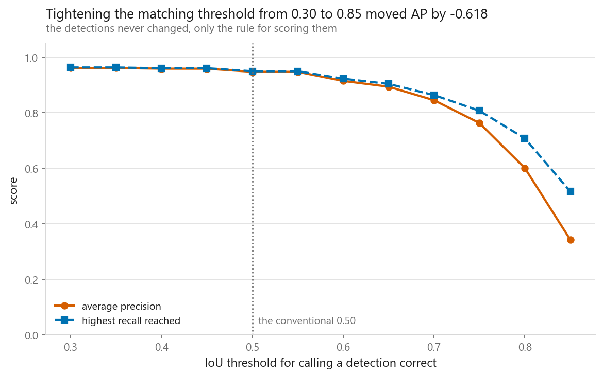
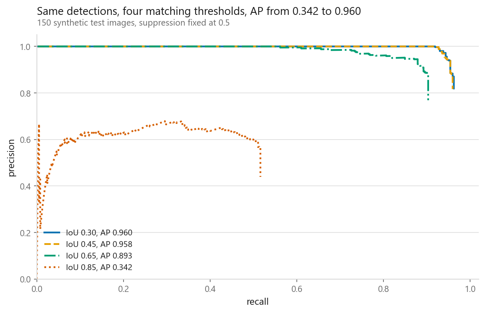
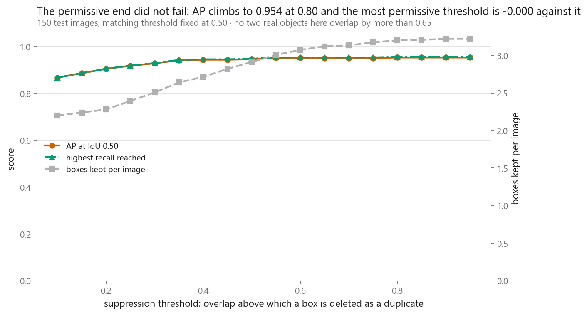
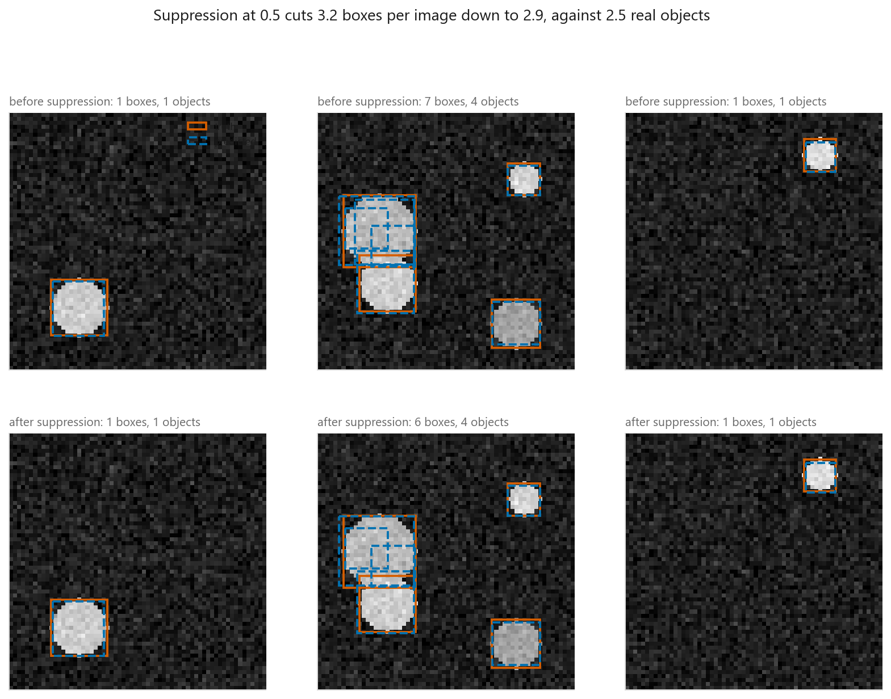
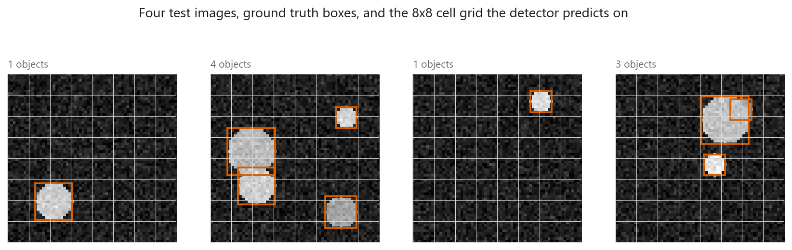

# Object detection

### The same boxes scored anywhere from 0.9604 to 0.3423, and the detector never moved

**[Open the notebook](notebook.ipynb)** · Part 8, Computer vision ·
Made by [Elyes Lounissi](https://www.linkedin.com/in/elyes-lounissi/)

| | |
|---|---|
| **What you will learn** | Intersection over union, non-maximum suppression and average precision, written from scratch. How a single-shot detector turns a grid of anchors into boxes. Why detection is scored with AP rather than accuracy. And how AP moves when you change the two thresholds you are forced to pick |
| **You should already know** | [A CNN layer by layer](../02-a-cnn-layer-by-layer/) and [segmentation](../06-image-segmentation/) for the IoU definition |
| **Dataset** | Synthetic 64x64 images generated in the notebook. 600 training images with 1,526 objects, 150 test images with 372, every box exact by construction |
| **Runtime** | 0.5 minutes on the CUDA device this run used, torch 2.11.0+cu128. The detector itself trains in 16 s |

---

## The result I would lead with

Two pieces of vocabulary first, because the table needs them. **IoU**, intersection
over union, is how much a predicted box and a true box overlap, from 0 for no
contact to 1 for a perfect match, and you have to pick how much overlap counts as
finding the object. **AP**, average precision, is the area under the
precision-recall curve, so 1.0 means every object found with no false alarms.

One trained detector, one fixed set of predicted boxes, scored twelve times with
nothing changed except the overlap required to call a box correct:

| Matching IoU threshold | AP | Best recall reached | Precision there |
|---|---|---|---|
| 0.30 | **0.9604** | 0.9624 | 0.8192 |
| 0.50 | 0.9469 | 0.9489 | 0.8078 |
| 0.60 | 0.9139 | 0.9220 | 0.7849 |
| 0.70 | 0.8445 | 0.8629 | 0.7346 |
| 0.75 | 0.7623 | 0.8065 | 0.6865 |
| 0.80 | 0.6000 | 0.7070 | 0.6018 |
| 0.85 | **0.3423** | 0.5161 | 0.4394 |

**AP fell from 0.9604 to 0.3423 across that column. The boxes did not move
between any two rows.** Only the rule for calling one correct did.

The two numbers a paper would print for this same detector:

| | |
|---|---|
| AP at IoU 0.50, what most papers call AP50 | **0.9469** |
| averaged over thresholds from 0.50 up, the COCO style | **0.7812** |

A 0.166 gap between two headline numbers describing one model on one test set.
A detection score quoted without its matching threshold is not a result, and the
distance between the ends of that table is how much room there is to flatter
yourself.

## The suppression threshold, where I expected a peak and got a plateau

The other free number is how much overlap between two predictions counts as a
duplicate:

| NMS threshold | AP at IoU 0.50 | Boxes kept per image | Best recall |
|---|---|---|---|
| 0.10 | **0.8682** | 2.2000 | 0.8683 |
| 0.25 | 0.9187 | 2.3933 | 0.9194 |
| 0.40 | 0.9448 | 2.7133 | 0.9462 |
| **0.50, the convention** | 0.9469 | 2.9133 | 0.9489 |
| 0.65 | 0.9520 | 3.1200 | 0.9543 |
| **0.80** | **0.9540** | 3.2000 | 0.9570 |
| 0.90 | **0.9540** | 3.2200 | 0.9570 |
| 0.95 | **0.9540** | 3.2200 | 0.9570 |

The standard story is that both ends of this sweep are failures: too low and you
delete boxes sitting on genuinely different objects, too high and the duplicates
flood the ranking as false positives and pull precision down.

**Only the low end failed here.** AP climbs the whole way and then flattens, and
the best value, 0.9540 at a threshold of 0.80, is also the value at 0.90 and at
0.95. There is no peak to fall off.

The low end behaves exactly as advertised: at 0.10 the detector keeps 2.2 boxes
per image against 2.5 real objects, best recall drops to 0.8683, and AP loses
0.0858. Suppression at that setting is deleting correct detections on
overlapping discs, which is why the images in this notebook let discs overlap on
purpose.

The high end did not bite because this detector's duplicates arrive with low
confidence, and AP pools every detection in rank order, so a low-scoring
duplicate lands at the bottom of the list where it costs almost nothing. That is
a property of a well-calibrated detector on an uncrowded scene, not a general
result. The peak's location is a property of how crowded your objects are, which
is precisely why it is a knob and not a constant. Here the conventional 0.50
gives up **0.0071 AP** against the best setting.

Suppression at 0.5 cuts **3.2 raw boxes per image down to 2.9**, against 2.5 real
objects.

## Why accuracy is not available

You can force an accuracy out of a grid detector by asking, for each fixed slot,
whether the objectness call was right:

| Model | Slot accuracy | AP at IoU 0.50 |
|---|---|---|
| trained detector | 0.9978 | 0.9469 |
| a detector that never fires | **0.9809** | **0.0000** |

A model that outputs nothing at all is 0.0169 behind on slot accuracy and 0.9469
behind on AP. Only **1,500 of 76,800 training slots hold an object**, 1.95% of
them, so accuracy over the grid is the background rate wearing a disguise.

It also cannot express any of the things that go wrong in detection. A box can be
right in position and wrong in size, right about an object another box has
already claimed, or right with a confidence so low you would never have shown it.
Under the AP protocol the second detection on an already-claimed object is a
**false positive**, not a duplicate to be quietly ignored, and that rule is what
makes the metric care about ranking.

That same 1.95% imbalance is why the objectness loss needs `pos_weight`. Left
alone, unweighted cross entropy is minimised well enough by never firing, which
is the 0.9809 row above.

## The three pieces that transfer

The detector is deliberately small and will not impress anybody: an 8x8 grid of
8-pixel cells, 2 anchors per cell, **128 slots per image**, one class. What
transfers unchanged to any detector is the machinery around it, and all three
pieces are checked against cases worked out by hand.

**IoU on boxes**, arithmetic rather than pixel counting, with five cases worked
out by hand against the vectorised `box_iou` the rest of the notebook uses:

| Case | By hand | `box_iou` | Difference |
|---|---|---|---|
| identical | 1.000000 | 1.000000 | 0.000000 |
| no overlap | 0.000000 | 0.000000 | 0.000000 |
| half overlap along x | 0.333333 | 0.333333 | 0.000000 |
| one inside the other | 0.360000 | 0.360000 | 0.000000 |
| touching edges only | 0.000000 | 0.000000 | 0.000000 |

**NMS**, on four boxes with three piled on one object. At a threshold of 0.3 and
of 0.5 it keeps 2 of 4. At 0.9, where nothing exceeds the largest pairwise
overlap of 0.826, it keeps all 4.

**AP**, on a ranked outcome of true, false, true against 2 ground truth boxes:
the function returns 0.833333 and the hand calculation returns 0.833333,
difference **0.00e+00**.

## The anchor parameterisation, and the check that catches a sign error

Each slot predicts a correction to a known box rather than coordinates:

- centre: `cx = (column + sigmoid(tx)) * stride`, so the sigmoid keeps the centre
  inside the cell responsible for it
- size: `w = anchor_w * exp(tw)`, so a prediction of zero means the anchor was
  already the right size

Encoding and decoding have to be exact inverses, and a sign error in either is
invisible in the loss curve and fatal in the output. So before training: encode
one image's true boxes, build the prediction a perfect network would produce,
decode it, compare. **Largest coordinate error over the round trip: 7.63e-06
pixels.**

Training is then uneventful:

| Epoch | Objectness loss | Box loss |
|---|---|---|
| 1 | 0.7116 | 0.0651 |
| 13 | 0.0164 | 0.0031 |
| 25 | 0.0020 | 0.0011 |

## The limit that is built into the grid

**26 of the 1,526 training objects were dropped** because another object already
owned their cell and anchor. That is 1.7% of the training signal thrown away
before a single gradient step, and it is not a bug. A single-shot grid cannot
represent two objects whose centres share a cell and whose sizes prefer the same
anchor. Test objects run from 8 to 18 pixels a side against anchors at 10.0 and
17.0, so the sizes are covered and the collisions are positional.

Every real single-shot detector inherits this and answers it with more feature
maps at more resolutions and a matching rule based on anchor IoU rather than
nearest anchor size. None of that changes anything in the evaluation sections
above, which is why this chapter spends most of its length there.

## Cheat sheet

| | |
|---|---|
| **Boxes** | `(x1, y1, x2, y2)`. Check which convention a library uses before trusting a number |
| **IoU** | Intersection over union. The `max(0, ...)` in the overlap is what handles disjoint boxes |
| **Anchors** | Reference boxes at fixed positions and sizes. The network predicts corrections, not coordinates |
| **Parameterisation** | `sigmoid` on the centre offset keeps it in its cell, `exp` on the size keeps it positive and centred on the anchor |
| **Before training** | Round-trip one image's boxes through encode and decode. It caught nothing here, at 7.63e-06 pixels, which is the point |
| **Class imbalance** | 1.95% of slots held an object. Weight the positive term or the model learns to stay silent |
| **NMS** | Greedy, and it cannot keep two heavily overlapping true objects. At 0.10 it cost 0.0858 AP here |
| **NMS tuning** | The conventional 0.50 was not the best setting. 0.80 was, by 0.0071 |
| **AP** | Area under the interpolated precision-recall curve, detections pooled across images and ranked by confidence |
| **Always state** | The matching IoU threshold. The same boxes scored 0.9604 and 0.3423 on this page |
| **Never report** | Grid-slot accuracy. A silent detector scores 0.9809 on it |
| **Next** | [Text preprocessing](../../09-sequences-and-language/01-text-preprocessing-and-tfidf/), which starts Part 9 |

---

If this chapter was useful, a star on the repository helps other people find it.
The code is yours to use, copy and adapt in your own work, no permission needed.

Made by **Elyes Lounissi** ·
[LinkedIn](https://www.linkedin.com/in/elyes-lounissi/) ·
[pilot.tun@gmail.com](mailto:pilot.tun@gmail.com)

Back to [Part 8](../) · [the curriculum](../../CURRICULUM.md) · [the book](../../README.md)

`#ObjectDetection` `#AveragePrecision` `#NonMaximumSuppression` `#IoU`
`#Anchors` `#SingleShotDetector` `#PyTorch` `#ComputerVision` `#DeepLearning`
`#MachineLearning` `#MLTutorial` `#LearnMachineLearning` `#AI`
