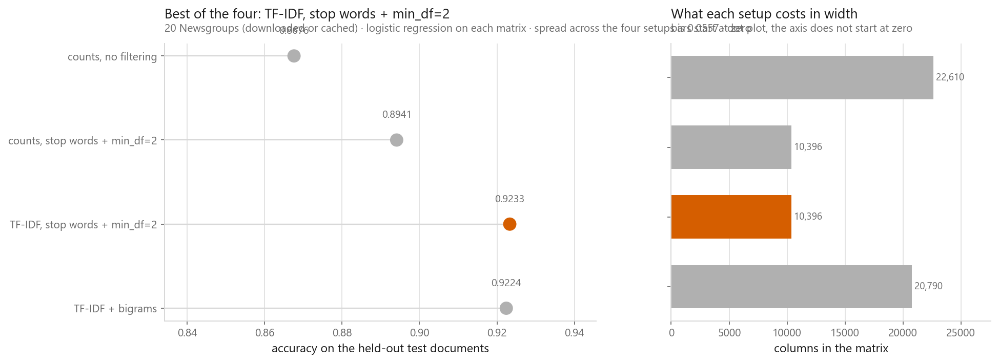
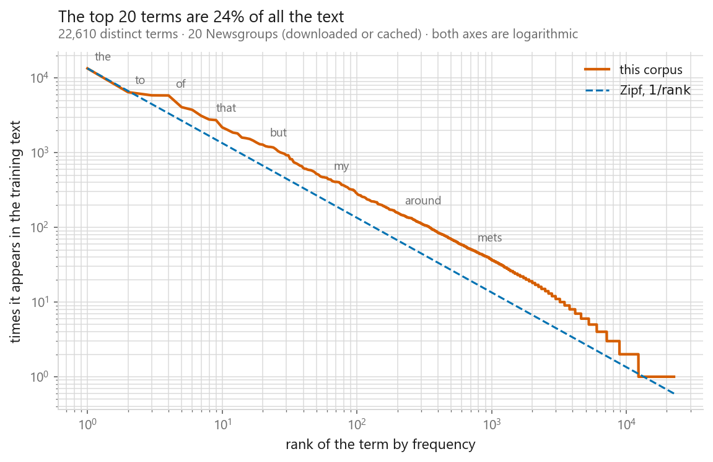
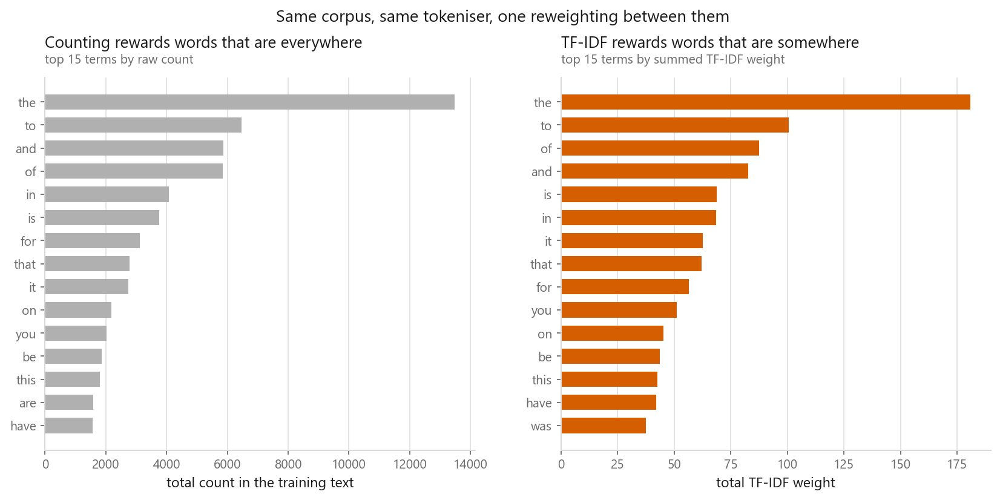
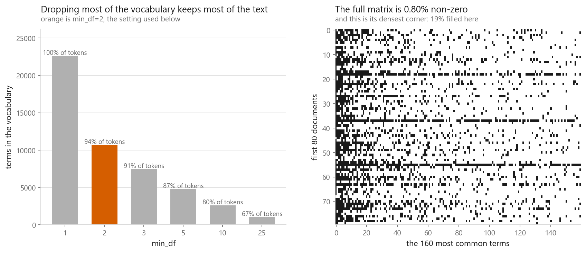

# Text preprocessing, bag of words, and TF-IDF

### Turning documents into rows of numbers a classifier can read

**[Open the notebook](notebook.ipynb)** · Part 9, Sequences and language ·
Made by [Elyes Lounissi](https://www.linkedin.com/in/elyes-lounissi/)

| | |
|---|---|
| **What you will learn** | How a document becomes a row of numbers, why raw counts over-weight the commonest words, TF-IDF derived by hand and checked against sklearn, what n-grams add, and which of `min_df` / `max_df` / `max_features` actually matter |
| **You should already know** | [Logistic regression](../../03-classification/01-logistic-regression/), [train and test splits](../../01-foundations/03-overfitting-and-underfitting/) |
| **Datasets** | 20 Newsgroups, three groups. The download worked on this run, so every number below is real newsgroup text |
| **Runtime** | Two to three minutes on a laptop CPU |

---

## One reweighting removed 42% of the errors

Four setups, the same logistic regression on each, scored once on 1,095 held-out
documents. No new information enters between rows two and three — the same
vocabulary, the same tokeniser, the same counts. Only the weighting changes.

| Setup | Features | Density | Accuracy | Macro F1 | Seconds |
|---|---|---|---|---|---|
| Counts, no filtering | 22,610 | 0.409% | 0.8676 | 0.8677 | 1.9 |
| Counts, stop words + `min_df=2` | 10,396 | 0.545% | 0.8941 | 0.8941 | 0.7 |
| **TF-IDF, stop words + `min_df=2`** | 10,396 | 0.545% | **0.9233** | 0.9236 | 0.7 |
| TF-IDF + bigrams | 20,790 | 0.354% | 0.9224 | 0.9226 | 1.3 |

Best to worst is **+0.0557 accuracy, a 42.1% cut in the error rate**. The bigram
row is the one worth staring at: doubling the columns to 20,790 bought **−0.0009**.
On topic classification the words alone carry the topic and the extra columns are
noise the model has to regularise away. On sentiment, where `not good` and `good`
mean opposite things, the same experiment comes out differently.

## The corpus

Three groups a human separates instantly, with enough shared English between them
that the vectoriser has to work: computer graphics, baseball, space.

| | |
|---|---|
| Source | 20 Newsgroups, downloaded or cached |
| Training documents | 1,651 (graphics 550, baseball 538, space 563) |
| Test documents | 1,095 |
| Words per document | median 73, shortest 12, longest **9,109** |

`remove=("headers", "footers", "quotes")` strips email headers, signatures and
quoted replies. Without it the classifier learns to read the `Organization:` line
and scores far too well for the wrong reason.

## What a token is

`CountVectorizer` lowercases, then splits on `\b\w\w+\b`. On
`The Rocket's engine DIDN'T fire; 3 seconds later, mission control called it.`
that yields `['the', 'rocket', 'engine', 'didn', 'fire', 'seconds', 'later',
'mission', 'control', 'called', 'it']`. Punctuation goes, single-letter words go
with it, and `didn't` splits into `didn` and a dropped `t`.

The English stop list holds **318** words. It is somebody's judgement rather than
your corpus's, and it deletes `system`, `front`, `back`, `call`, `fill`, `cry` and
`amount` along the way.

Stemming and lemmatising both try to collapse `study`, `studies`, `studying` into
one column. A stemmer chops suffixes by rule and returns non-words; my nine-line
version maps `studied` to `stud` and leaves `ran` as `ran`. A dictionary lemmatiser
gets `ran` to `run` and `better` to `good`. Crude stemming cut the vocabulary from
**22,610 to 19,000 terms, 16.0% smaller**, which is the practical argument for it.

## Zipf, and why counts are a bad feature

| | |
|---|---|
| Matrix | 1,651 documents × 22,610 terms |
| Tokens counted | 274,553 |
| Density | 0.4094% |
| Rank 1, `the` | 13,469 appearances |
| Rank 100, `images` | 285 appearances |
| Terms appearing exactly once | **10,309, or 46% of the vocabulary** |

**The top 20 terms hold 24.1% of every token in the corpus. The rarer half of the
vocabulary holds 4.5%.** So the largest numbers in every row belong to words that
tell you nothing:

| Term | In % of docs | graphics | baseball | space |
|---|---|---|---|---|
| `the` | 88% | 82% | 89% | 91% |
| `of` | 68% | 65% | 61% | 78% |
| `nasa` | 7% | 2% | 0% | **19%** |
| `graphics` | 8% | **24%** | 0% | 1% |

The commonest terms sit at roughly the same percentage in all three classes. The
middling ones separate them cleanly.

## TF-IDF, by hand

$$\mathrm{idf}(t) = \ln\!\left(\frac{1 + n}{1 + \mathrm{df}(t)}\right) + 1,
\qquad \mathrm{tfidf}(t,d) = \frac{\mathrm{tf}(t,d)\,\mathrm{idf}(t)}
{\lVert \mathrm{tf}(\cdot,d)\,\mathrm{idf} \rVert_2}$$

Four lines of numpy against `TfidfVectorizer`, first on four toy sentences and then
on the real corpus:

| Check | Largest disagreement |
|---|---|
| idf, four sentences | **0.00e+00** |
| Matrix, four sentences | 1.11e-16 |
| idf, 1,651 real documents | **0.00e+00** |
| One real row, document 1415 (8,921 tokens) | 3.33e-16 |

Floating-point identical. The `+1` inside the log is smoothing; the `+1` outside
stops a term in every document from getting weight exactly zero — with
$\mathrm{df} = n$ the log is 0 and the idf is 1, so `the` survives as its raw count.
L2 normalisation is why the 9,109-word document does not automatically beat a
12-word one.

In that longest document, `jpeg` appeared 232 times with idf 5.191 and finished at
**0.5912**, nearly three times the weight of `the` at 0.2011 despite `the`
appearing 362 times.

An honest note on that figure. Comparing the top 15 by raw count against the top 15
by *summed* TF-IDF mass, **14 of 15 terms are the same** — only `are` and `was`
swap places. Summing a column over every document rewards terms that appear in
every document, so the aggregate view hides the reweighting that the per-row numbers
above make obvious. Judge TF-IDF one document at a time.

## The dials

| `min_df` | Terms | Non-zeros | Density | Tokens kept |
|---|---|---|---|---|
| 1 | 22,610 | 152,815 | 0.409% | 100.00% |
| **2** | **10,683** | 140,888 | 0.799% | **94.47%** |
| 3 | 7,442 | 134,406 | 1.094% | 91.35% |
| 5 | 4,770 | 125,342 | 1.592% | 86.87% |
| 10 | 2,562 | 110,929 | 2.623% | 79.56% |
| 25 | 984 | 87,414 | 5.381% | 66.53% |

`min_df=2` throws away **53% of the vocabulary and 5.5% of the text**. That is Zipf
paying you back: a term seen once cannot generalise, it can only be memorised.

`max_df=0.5` drops nine terms — `the, to, and, of, in, is, for, that, it` — and
**100% of them are already on sklearn's English stop list**. The corpus rediscovers
the stop list on its own, which I prefer to trusting a fixed one.

`max_features` is the memory ceiling: 1,000 terms keep 67.7% of all tokens, 5,000
keep 88.2%, 20,000 keep 99.0%.

The `min_df=2` matrix is 1,651 × 10,683 = **17,637,633 cells with 140,888 stored**.
Dense float64 would need **141.1 MB; sparse storage needs about 1.7 MB**, a factor
of 83. That is why every text vectoriser in scikit-learn returns a sparse matrix.

## What bigrams recover

`the player hit the ball` and `the ball hit the player` have identical unigram
vectors and different bigram vectors. `not good` exists as a bigram feature and
cannot exist as a unigram one. With `min_df=3`, **12,264 bigrams** survive against
22,610 unfiltered unigrams — and the ones each class leans on hardest turn out to
be `of the`, `in the`, `on the` for all three. The class-specific phrases
(`this year`, `last year`, `the braves` for baseball) sit below them.

## Cheat sheet

| | |
|---|---|
| **Bag of words** | Fix a vocabulary of $V$ terms, count, get an $n \times V$ matrix. Word order is discarded |
| **`CountVectorizer` defaults** | Lowercases, tokenises on `\b\w\w+\b`, no stemming, no stop words |
| **TF-IDF** | $\mathrm{tf} \times [\ln\frac{1+n}{1+\mathrm{df}} + 1]$, then L2-normalise the row |
| **Stemming vs lemmatising** | Rules that return non-words, against a dictionary that returns real base forms. Neither is needed for topic classification |
| **`min_df`** | The dial that matters. `min_df=2` cut this vocabulary 53% and the text 5.5% |
| **`max_df`** | A stop list derived from your corpus. Rediscovered 9 of sklearn's 318 here |
| **n-grams** | Recovers negation and fixed phrases. Cost 10,394 extra columns here and lost 0.0009 accuracy |
| **Sparsity** | 141.1 MB dense against 1.7 MB sparse. Keep it sparse |
| **Fit on train only** | Vocabulary and idf weights are fitted parameters. Use a `Pipeline` |
| **Next** | [Word embeddings](../02-word-embeddings/), which drop one-column-per-word entirely |

---

Made by **Elyes Lounissi** ·
[LinkedIn](https://www.linkedin.com/in/elyes-lounissi/) ·
[pilot.tun@gmail.com](mailto:pilot.tun@gmail.com)

Back to [Part 9](../) · [the curriculum](../../CURRICULUM.md) · [the book](../../README.md)

`#MachineLearning` `#NLP` `#TFIDF` `#BagOfWords` `#TextMining`
`#Python` `#ScikitLearn` `#DataScience` `#MLTutorial` `#FeatureEngineering`
