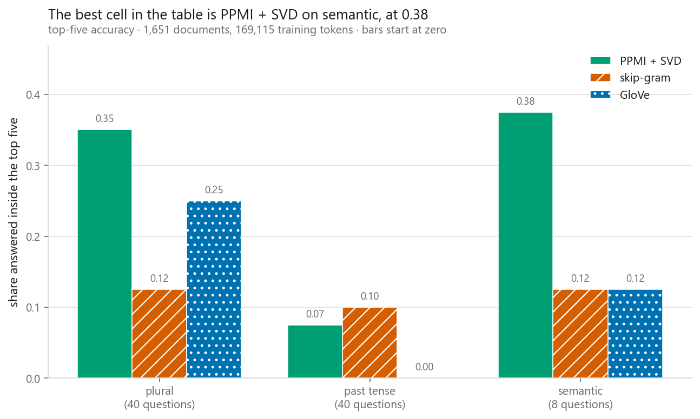
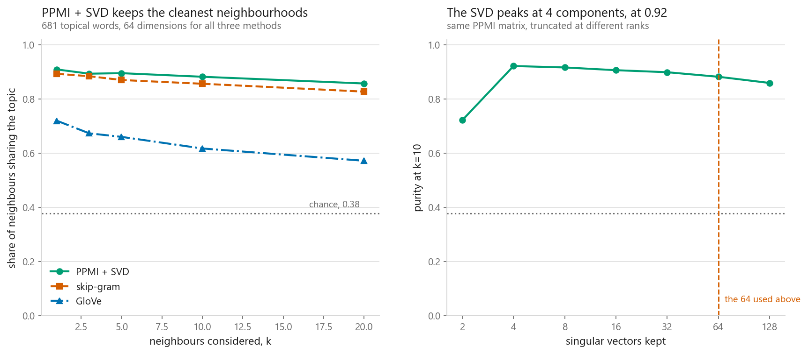
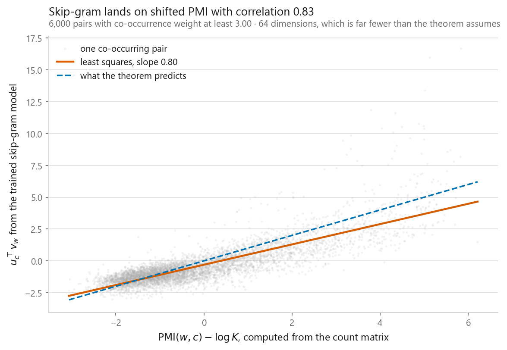
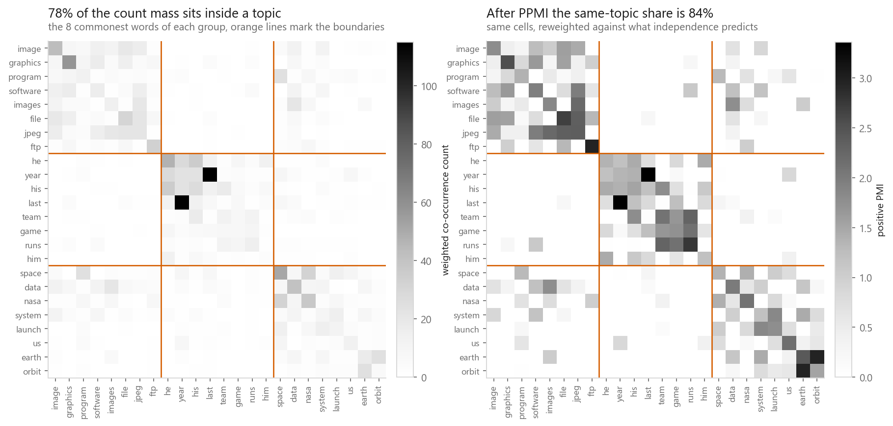
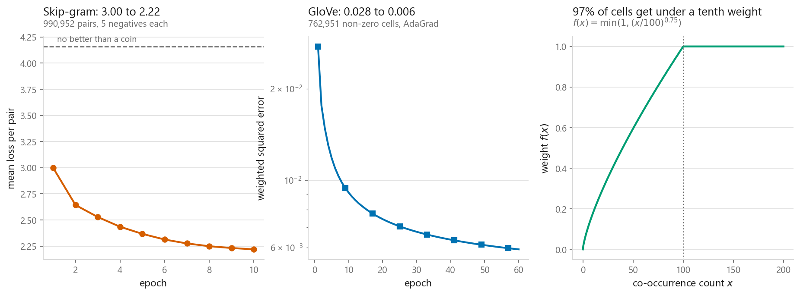
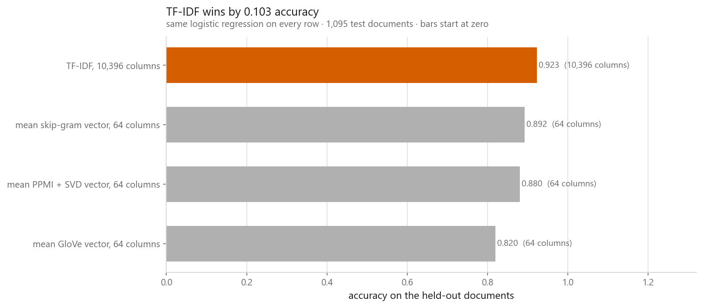

# Word embeddings: Word2Vec and GloVe

### Three methods, 88 analogy questions, and three right answers

**[Open the notebook](notebook.ipynb)** · Part 9, Sequences and language ·
Made by [Elyes Lounissi](https://www.linkedin.com/in/elyes-lounissi/)

| | |
|---|---|
| **What you will learn** | Why a co-occurrence table is the raw material for every word vector, skip-gram with negative sampling and GloVe both written from scratch in PyTorch, a nearest-neighbour score defined by the corpus rather than by taste, and how few analogies survive at this corpus size |
| **You should already know** | Text preprocessing and TF-IDF from 09-01, what a truncated SVD does, enough PyTorch to read a training loop |
| **Dataset** | 20 Newsgroups, three groups. 1,651 documents for the embeddings, 1,095 held back, 260,162 tokens before filtering |
| **Runtime** | On CPU, and the notebook prints its own bill: 0.3 s to build the matrix, 3.0 s for the SVD, 36 s for skip-gram, 67 s for GloVe |

---

## The result I would lead with

The demonstration everyone quotes is `king - man + woman` landing near `queen`.
It is shown once, on the pair it works for, and almost never scored. So this
notebook scores it, on 88 questions written down before any embedding existed.

| Family | Questions | PPMI + SVD | Skip-gram | GloVe |
|---|---|---|---|---|
| plural | 40 | 0.025 | 0.025 | **0.050** |
| past tense | 40 | 0.025 | **0.050** | 0.000 |
| semantic | 8 | **0.125** | 0.000 | 0.000 |

In whole questions rather than rates, the best method got **3 of 88 right at
top-1**, and so did skip-gram. GloVe got 2. Widen the target to the top five
candidates and the best method reaches **20 of 88**, or 23%.

The notebook also prints a "averaged over the three families" summary, and that
row reads 0.058 top-1 for PPMI + SVD. Do not quote it. It averages three family
rates without weighting them, so the 8-question semantic family counts as much as
the 40-question plural family, and the number comes out 70% above the actual
3-in-88 rate of 0.034. The same inflation moves top-5 from a true 0.227 to a
printed 0.267. When the denominators differ, average the questions, not the
families.

**The famous analogy could not even be asked.** Only 8 of the 12 semantic
questions had all four words inside the 3,000-word vocabulary, and the three
words that dropped out were `queen`, `slower` and `woman`. On a corpus of 260,162
tokens drawn from posts about graphics, baseball and space, the pair the whole
demonstration rests on does not appear often enough to earn a vector. That is a
more honest verdict on corpus size than any hit rate.

The prediction going in was that the inflection families would beat the semantic
one, because `year` and `years` sit in nearly identical contexts while `king` and
`queen` differ in contexts this corpus barely contains. The measurement cannot
settle it either way. Every cell in that table is a handful of questions, and one
question is worth 0.025 in the plural family and 0.125 in the semantic one, which
is larger than almost every gap between the rows. The semantic family's apparent
lead is a single correct answer out of eight.

So the headline is the one nobody puts in a blog post: **at this corpus size,
analogy arithmetic does not work.** Not for the count-based method, not for either
trained model, not on the inflections that should be easiest. The same vectors
carry real topical structure at the same time, which is what makes this worth
measuring. Embeddings can be good enough to group words by subject and nowhere
near good enough to do arithmetic on.

If you are evaluating vectors of your own, borrow the purity task below rather
than this one. It has hundreds of items instead of forty and it degrades
gracefully, where an analogy score sits at zero and never tells you how far from
working you are.

## The oldest and dullest method matched the newest, at a fraction of the cost

Three methods, 64 dimensions each, scored on whether a word's nearest neighbours
among the 681 topical words share its topic. Chance for this set is 0.377,
computed exactly rather than assumed to be one third.

| | k=1 | k=3 | k=5 | k=10 | k=20 |
|---|---|---|---|---|---|
| PPMI + SVD | 0.909 | 0.893 | 0.895 | 0.882 | 0.857 |
| skip-gram | 0.893 | 0.884 | 0.870 | 0.856 | 0.827 |
| GloVe | **0.720** | **0.673** | **0.660** | **0.617** | **0.572** |

One standard error over 681 topical words is about 0.012, so read the rows
against that.

**PPMI + SVD and skip-gram are tied.** They sit within 0.030 at every k, roughly
two standard errors, which is not enough to rank two methods and I will not. The
result is not that one beat the other. It is that one call to `randomized_svd`,
with no training loop, no sampling and no epochs, matched a model that took 36 s
of gradient descent, and took 3.0 s doing it. Section 4 explains why that is not
luck: both are factorising the same table.

**GloVe is well behind, by many standard errors at every k.** The mechanism is
printed earlier in the notebook and it is about this corpus rather than about
GloVe. Its weighting function caps at counts of 100 and nearly ignores small
cells: **0.00% of cells here reach full weight and 97.45% get less than a tenth**.
GloVe's loss assumes a corpus where common pairs occur hundreds of times. On 1,651
newsgroup posts almost every cell is a small count, so almost every cell is thrown
away, and the method is being run outside the regime it was designed for. On a
corpus a thousand times larger this row moves.

The right panel is the part I would send someone to. Sweeping the SVD rank, the
purity peaks at **4 components at 0.922** and falls monotonically from there:
0.916 at 8, 0.906 at 16, 0.899 at 32, **0.882 at the 64 this chapter uses**, and
0.859 at 128. Two failures pull against each other, and on this corpus the "too
many dimensions" side dominates almost the entire useful range. The dimension I
copied from convention is worse than the one the data asked for by 0.040. Sweep
it rather than inherit it.

A caveat the notebook is right to leave standing: a three-topic purity score is a
topic-separation test, and 4 components is enough to separate 3 topics. A task
needing finer distinctions would move the peak. The point is that nothing in this
corpus argued for 64.

## Skip-gram really is factorising a PMI matrix

Levy and Goldberg's result says that with enough dimensions, skip-gram's optimum
satisfies `dot(u_c, v_w) = PMI(w, c) - log K`. This model has 64 dimensions for
3,000 words and ran 10 epochs, which is nowhere near the setting the theorem
describes. It lands there anyway:

| | Value |
|---|---|
| Pearson, dot against shifted PMI | **0.832** |
| Spearman | 0.790 |
| Fitted slope | 0.798 |
| Fitted intercept | -0.305 |
| Theory at the optimum, unlimited dimensions | slope 1, intercept 0 |

A slope below one is what a dimension budget too small to fit the matrix looks
like: the model cannot reproduce the extremes so it shrinks everything towards
the middle. A model that never computed a count, never formed a matrix and never
saw the letters P, M or I has arranged its dot products along a PMI axis. All
three methods in this notebook are compressing the same table.

## The table all three are compressing

3,000 words by 3,000 words, built in 0.3 s, with 762,951 stored non-zeros filling
8.48% of the cells. Dense float32 would have wanted 36 MB. PMI is positive in
616,146 of those 762,951 cells, or 80.8%, and ranges from -3.65 to 8.74 with a
median of 1.19.

Reweighting is worth measuring rather than assuming. On the eight commonest words
of each of the three topics, the share of mass sitting inside a topic block rather
than between blocks goes from **77.9% on raw counts to 83.7% after PPMI**. Real,
and smaller than the usual telling suggests.

Both objectives were minimised from the same surviving token stream, which is a
deliberate deviation from the reference GloVe implementation. Skip-gram ran
990,952 pairs with 5 negatives each, 5,945,712 binary decisions per epoch, and
took its loss from 2.9970 to 2.2189 against a chance floor of 4.1589. GloVe took
its weighted loss from 0.0276 to 0.0059 over 762,951 non-zero cells. The two
losses are not comparable to each other and the notebook says so.

The third panel is the one worth keeping. **0.00% of cells reach the full weight
of GloVe's `f(x)`, and 97.45% get less than a tenth of it.** On a corpus this
size the weighting function, the part of the method that gets discussed least, is
throwing away nearly the entire matrix. That is a plausible reason GloVe finished
last on purity, and it is a fact about corpus size rather than about the method.

## Where the embeddings lose

Represent a document as the mean of its word vectors, fit the same logistic
regression as 09-01, score on the 1,095 held-out documents:

| Representation | Width | Accuracy |
|---|---|---|
| **TF-IDF** | 10,396 | **0.9233** |
| mean skip-gram vector | 64 | 0.8922 |
| mean PPMI + SVD vector | 64 | 0.8804 |
| mean GloVe vector | 64 | 0.8201 |

A sparse count matrix from the previous chapter beats every embedding here. The
chart's title reads "TF-IDF wins by 0.103 accuracy", which is the gap to the
**last** bar rather than the margin over the runner-up. The margin that matters
is **0.0311** over mean skip-gram vectors, bought with 162 times the columns.

Topic classification rewards knowing which words appeared, which is what a count
matrix encodes perfectly and what averaging vectors destroys: a word appearing
six times moves the mean exactly as far as six different words appearing once.
Embeddings earn their place when the model has to generalise to words it barely
saw, when order matters, or when the vectors came from a corpus orders of
magnitude larger than the labelled task, which is the situation everyone is
actually in when they download pretrained vectors.

## One thing this chapter does not measure

Subsampling frequent words is widely described as one of the most consequential
choices in the word2vec recipe. This notebook runs a single threshold, t = 0.001,
keeping 169,115 of 219,893 tokens, and never varies it. So nothing here is
evidence about how much it matters, and the notebook now says so instead of
asserting it. If you want the answer, sweep `t` and score each setting with the
purity task above; that task is cheap and defined by the corpus, which makes it
the right instrument for exactly this kind of question.

## Cheat sheet

| | |
|---|---|
| **The assumption** | A word is characterised by the words around it. Every method here compresses one co-occurrence table |
| **PPMI + SVD** | One linear algebra call, no training loop, and it tied skip-gram on purity at 3.0 s against 36 s. Try it before you train anything |
| **Skip-gram** | Classify real pairs against sampled fakes, never build the matrix. Its dot products still land on shifted PMI at r = 0.832 |
| **GloVe** | Weighted least squares on log counts. On a small corpus its weight function nearly ignores the matrix: 97.45% of cells under a tenth weight |
| **Dimension** | Sweep it. The SVD peaked at 4 components here, and the conventional 64 cost 0.040 purity |
| **Scoring** | Define the task from your own corpus and print the number. Nearest-neighbour lists will make anything look good if you pick the query |
| **Analogies** | 3 of 88 at top-1 on 260,162 tokens, for every method. Too small to rank anything, and the honest read is that the task needs a far larger corpus. Average the questions, not the families, or the rate inflates by 70% |
| **Before quoting a demo** | Check the words are in your vocabulary. `queen` and `woman` were not in this one |
| **Downstream** | Check against TF-IDF before assuming the newer representation wins. It did not here, by 0.0311 |
| **Next** | [Recurrent networks](../03-recurrent-neural-networks/), which read these vectors in order instead of averaging them away |

---

If this chapter was useful, a star on the repository helps other people find it.
The code is yours to use, copy and adapt in your own work, no permission needed.

Made by **Elyes Lounissi** ·
[LinkedIn](https://www.linkedin.com/in/elyes-lounissi/) ·
[pilot.tun@gmail.com](mailto:pilot.tun@gmail.com)

Back to [Part 9](../) · [the curriculum](../../CURRICULUM.md) · [the book](../../README.md)

`#WordEmbeddings` `#Word2Vec` `#GloVe` `#SkipGram` `#NegativeSampling` `#PPMI`
`#TruncatedSVD` `#NLP` `#20Newsgroups` `#PyTorch` `#MachineLearning`
`#MLTutorial` `#LearnMachineLearning` `#DataScience` `#AI`
