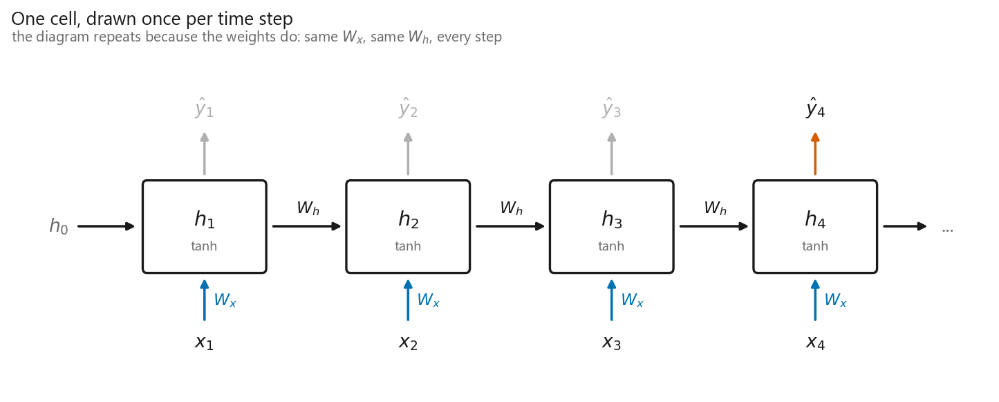
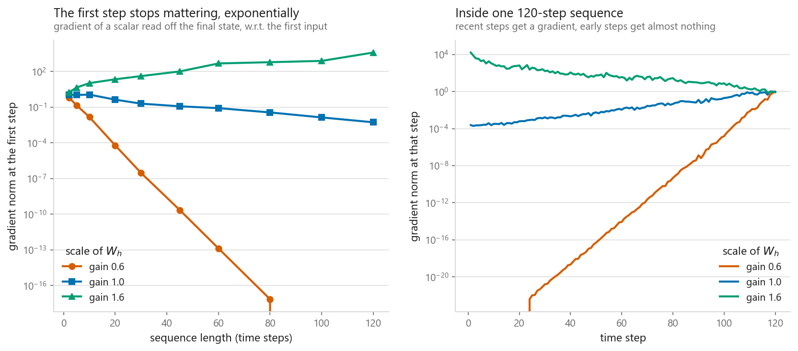
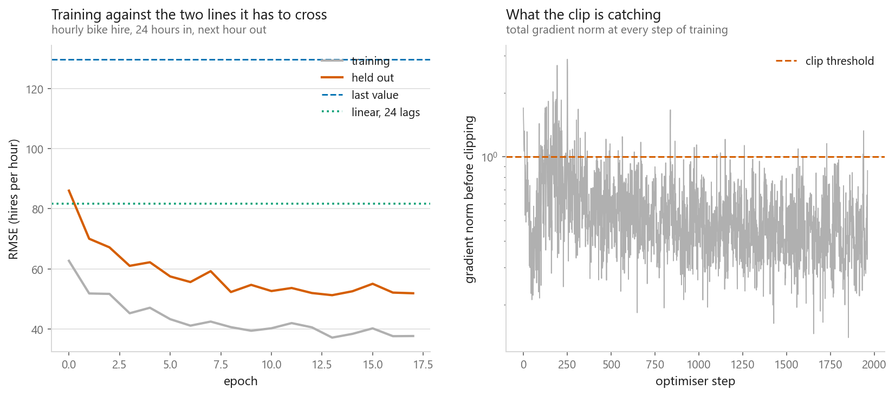
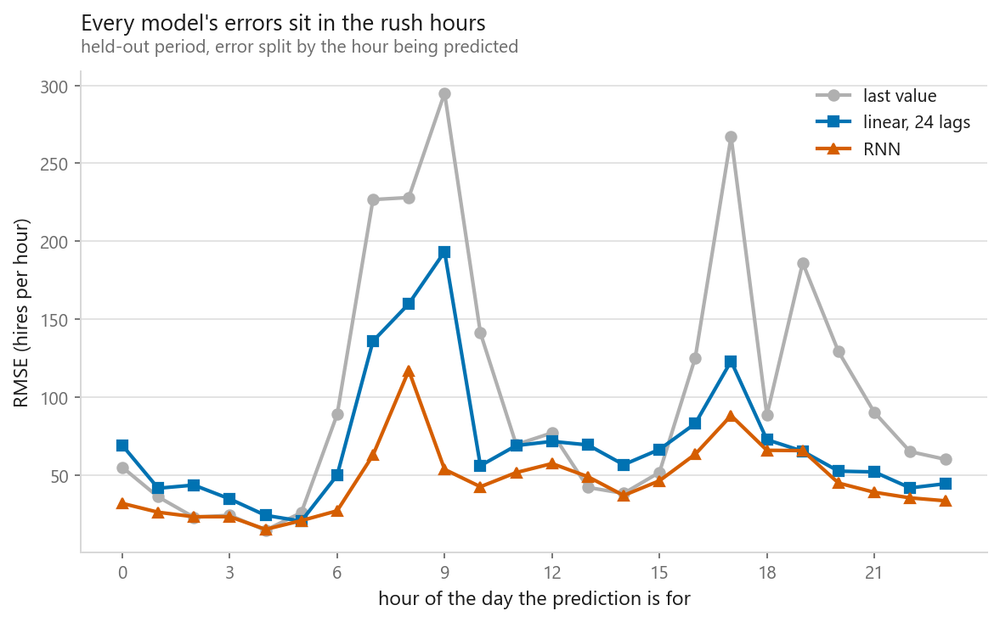
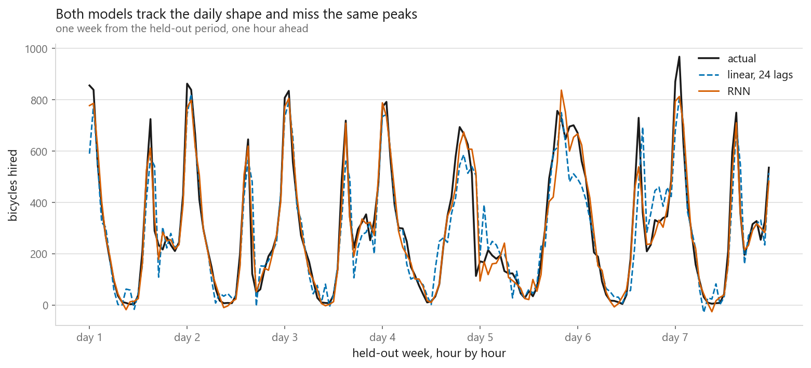

# Recurrent neural networks

### The architecture for data where order carries the meaning

**[Open the notebook](notebook.ipynb)** · Part 9, Sequences and language ·
Made by [Elyes Lounissi](https://www.linkedin.com/in/elyes-lounissi/)

| | |
|---|---|
| **What you will learn** | The recurrence and why sharing weights across time is the same trick as sharing them across space, a vanilla RNN cell written by hand and checked against `nn.RNN`, backpropagation through time, the vanishing gradient measured rather than asserted, gradient clipping, and an hourly forecast where the RNN has to earn its place |
| **You should already know** | [The same network in PyTorch](../../07-neural-networks/03-the-same-net-in-pytorch/). [Convolution and pooling](../../08-computer-vision/01-convolution-and-pooling/) helps but is not required |
| **Datasets** | UCI Bike Sharing, 17,379 hourly hire counts |
| **Runtime** | Two to three minutes on a laptop CPU |

---

## The gradient at step one is not small, it is zero

The vanishing gradient is usually asserted. Here it is measured: a fixed random
RNN, a random input sequence, one number read off the final state, and autograd
asked how much the *first* input step still influences it. The entries of $W_h$
are drawn with standard deviation $g/\sqrt{H}$, which puts the spectral radius
near the gain $g$.

| Recurrent gain | Gradient at T=2 | Gradient at T=120 | Measured factor per step |
|---|---|---|---|
| 0.6 | 6.408e-01 | **0.000e+00** | underflowed |
| 1.0 | 1.060e+00 | 5.243e-03 | 0.956 |
| 1.6 | 1.662e+00 | **3.806e+03** | 1.060 |

At gain 0.6 the number did not get small. It reached float zero, and the
notebook prints a `divide by zero encountered in log` warning when it tries to
fit a slope through it. At gain 1.6 the same product ran the other way, to
3.806e+03. One scalar moved by 1.0 separates those two outcomes.

A vanilla RNN can represent long-range structure. Gradient descent cannot find
it, because the signal that would teach the network about step 1 arrives at
machine zero.

## The recurrence



$$h_t = \tanh(W_x x_t + W_h h_{t-1} + b)$$

One matrix for reading the input, one for carrying the state forward, and that
is the entire architecture. The same two are used at every step, which is the
convolution argument moved from space to sequence: a convolution assumes an edge
is an edge wherever it appears, a recurrent layer assumes the rule for updating
memory does not depend on what time it is. Both buy a parameter count that does
not grow with input length. The copies in the picture are one layer used
repeatedly, which is why every arrow carries the same two labels.

Writing the loop by hand and copying the weights into `nn.RNN` — which uses two
bias vectors where I use one, so $b_{ih} + b_{hh}$ maps onto my single $b$ —
gives agreement across all 4 x 12 x 16 states:

```
largest disagreement, all steps : 6.706e-08
largest disagreement, last state: 5.960e-08
```

Float32 noise on both counts. Nothing in the loop is cyclic: once it has run,
autograd holds an ordinary feedforward graph `n_steps` layers deep in which
every layer happens to use the same weight matrix. That observation is the
whole of the next section.

## The gradient that does not arrive



$$\frac{\partial h_T}{\partial h_1} = \prod_{t=2}^{T} \operatorname{diag}\big(\tanh'(a_t)\big)\, W_h$$

A product of $T-1$ matrices, mostly the same matrix. Products of matrices behave
like powers of a number: below one they collapse, above one they run away, and
no single $W_h$ keeps the product near one in every direction at once. Both
panels are on a log scale, so a straight line is an exponential and its slope is
the per-step factor in the table above. Where the measured factor comes out
gentler than the gain that produced it — 1.060 from a gain of 1.6 — saturation
is the reason: once the state is large, $\tanh'$ is small and damps every term.

### Clipping fixes exactly one half of this

```
gradient norm before clipping : 14326.79
gradient norm after clipping  : 1.00
cosine between the two        : 1.000000
```

A 14,000x rescale with the direction untouched to six decimal places, which is
what makes it safe to apply on every step whether or not it bites. Clipping does
nothing for the vanishing half — you cannot rescale a gradient back into
existence once the product has flattened it. That needs a different recurrence,
which is the [LSTM](../04-lstm/).

## Forecasting bicycle hire



17,379 hourly counts from Washington DC become 17,355 windows of 24 hours. Train
on the first **13,884**, test on the last **3,471**, split by time and never at
random: neighbouring windows share 23 of their 24 values, so a random split would
score the model on windows it had almost memorised. Scaling statistics come from
the training portion only — mean 174.72 hires, sd 166.92, against a full series
running from 1 to 977 with a mean of 189.5.

| Model | Parameters | Test RMSE (hires) |
|---|---|---|
| **RNN, 48 hidden** | 2,497 | **51.91** |
| Linear on 24 lags | 25 | 81.77 |
| Last value | 0 | 129.72 |
| Same hour yesterday | 0 | 134.85 |

**The RNN won**, by 36.5% RMSE against the linear model and 60.0% against
persistence. I did not assume it would, and on a one-hour horizon there was a
good reason it might not: the next hour is close to a fixed weighted average of
the last few, which is precisely what 25 coefficients already are. Here the
extra capacity paid for itself. Training RMSE finished at **37.69** against a
test RMSE of 51.91, and the gradient hit the clip on **99 of 1,962** steps, so
clipping was doing real work rather than sitting idle.

The other line worth reading is the last one. "Same hour yesterday" finished
**behind plain persistence** on a series with a strong daily cycle. Twenty-four
hours back is further away than one hour back, and on this data proximity beats
seasonality.

## Where the errors live



The average hides the shape of the problem. RMSE in hires, by hour of day:

| Hour | Last value | Linear | RNN |
|---|---|---|---|
| 02 | **22.9** | 43.5 | 23.2 |
| 04 | **14.5** | 24.1 | 15.1 |
| 05 | 25.9 | **20.4** | 20.7 |
| 08 | 228.1 | 159.8 | **117.1** |
| 09 | 295.1 | 193.3 | **53.6** |
| 17 | 267.2 | 123.0 | **88.1** |
| 19 | 186.1 | **65.2** | 65.6 |
| 23 | 60.0 | 44.4 | **33.4** |

The RNN's whole margin comes from the commute. At 09:00 it scores 53.6 against
193.3 for the linear model and 295.1 for persistence, 3.6x better than the
linear model in the single hardest hour of the day. In the quiet hours it does
not win at all: persistence is ahead at 02:00 and 04:00, and the linear model is
ahead at 05:00 and 19:00. A model that beats everything on average can still be
third best where nothing much happens.

## One week



Both models follow the two commuter peaks and the overnight trough without being
told that days exist, and both shave the tops off the sharpest spikes, because a
squared error loss prefers being slightly low on a peak to being badly wrong on
either side of it. Their errors are correlated, the tell that they use the same
information in nearly the same way.

Two honest notes. A recurrent layer earns its place when the useful history is
longer than you can comfortably flatten, when sequences vary in length, or when
what matters is a pattern rather than a fixed lag. A one-hour horizon on a
periodic series is none of those, and it still won — a result, not a rule. And
the model saw the counts alone; the dataset also carries temperature, humidity,
holiday flags and hour of day.

## Cheat sheet

| | |
|---|---|
| **The recurrence** | `h = tanh(x_t @ W_x.T + h @ W_h.T + b)` in a loop. One $W_x$ and one $W_h$ for every step |
| **Weight sharing** | Across time, the same idea as a convolution across space. Parameter count does not grow with input length |
| **Shapes** | `nn.RNN(batch_first=True)` takes `(batch, time, features)` and returns `(output, h_n)` with `h_n` shaped `(layers, batch, hidden)` |
| **BPTT** | Nothing special. Unroll, call `backward()`. Memory grows with sequence length and the steps cannot be parallelised |
| **Vanishing** | A product of $T$ Jacobians. At gain 0.6 the first-step gradient hit float zero by T=120; at gain 1.6 it hit 3.806e+03 |
| **Clipping** | `nn.utils.clip_grad_norm_(model.parameters(), 1.0)`. Fixes exploding only, keeps the direction to 1.000000 cosine |
| **Time series splits** | Split by time, never at random. Overlapping windows make a random split close to training on the test set |
| **Always** | Run persistence and a lag-based linear model first. Here the RNN beat both, and running them is how you find out |

---

Made by **Elyes Lounissi** ·
[LinkedIn](https://www.linkedin.com/in/elyes-lounissi/) ·
[pilot.tun@gmail.com](mailto:pilot.tun@gmail.com)

Back to [Part 9](../) · [the curriculum](../../CURRICULUM.md) · [the book](../../README.md)

`#DeepLearning` `#RNN` `#PyTorch` `#TimeSeries` `#Forecasting`
`#MachineLearning` `#Python` `#MLTutorial` `#LearnMachineLearning` `#AI`
