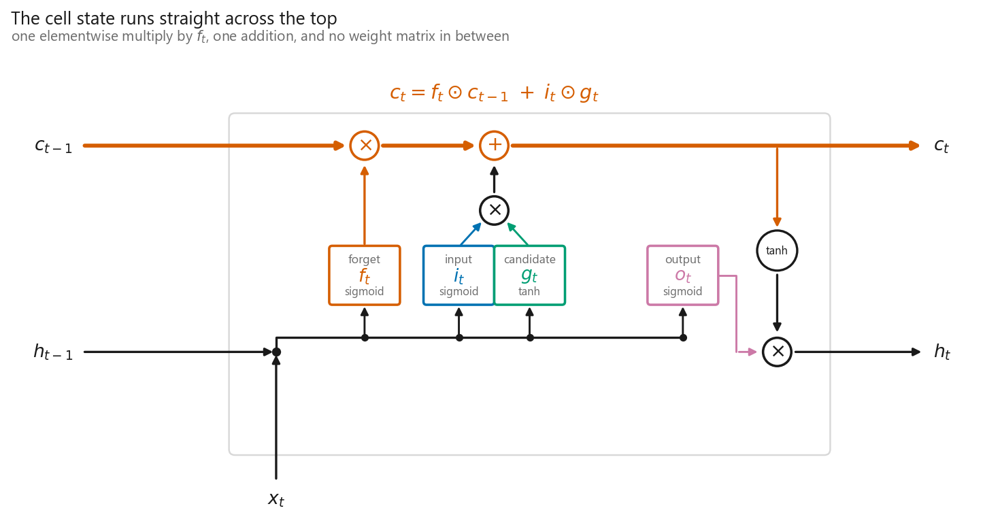
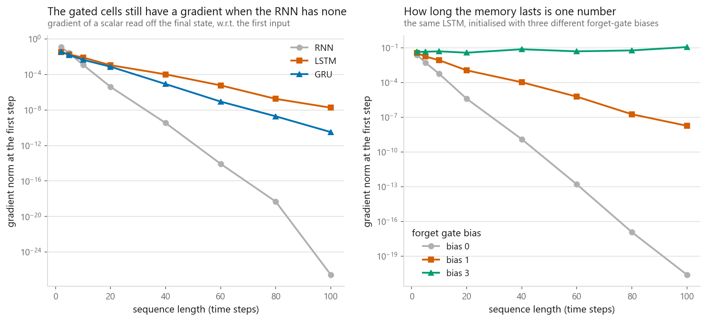
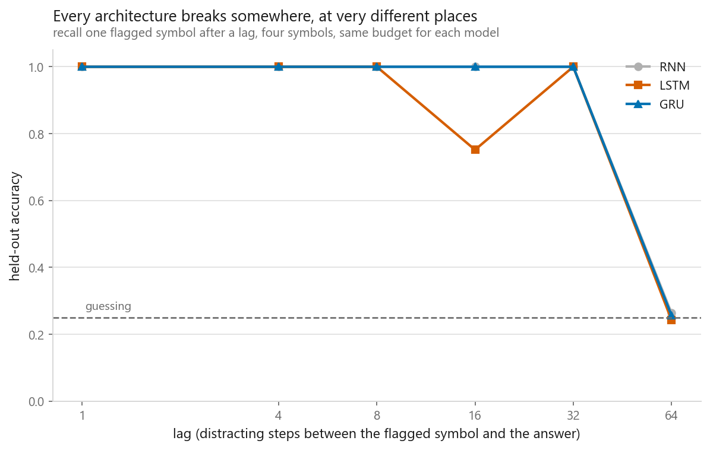
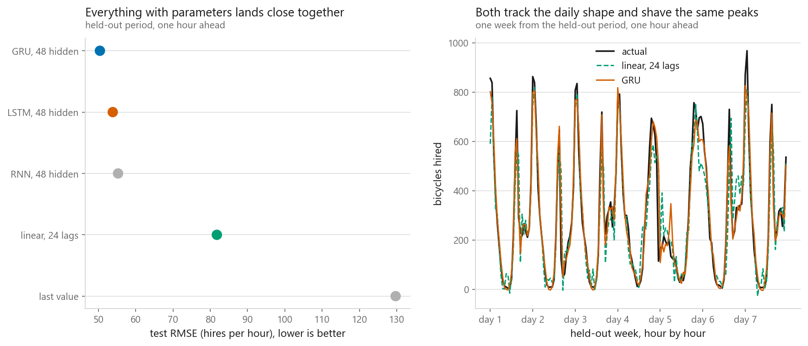
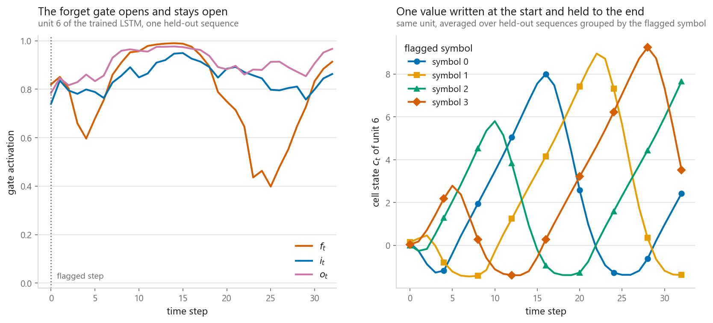

# LSTM

### The recurrence that keeps a gradient alive across a hundred steps

**[Open the notebook](notebook.ipynb)** · Part 9, Sequences and language ·
Made by [Elyes Lounissi](https://www.linkedin.com/in/elyes-lounissi/)

| | |
|---|---|
| **What you will learn** | The forget, input and output gates, the cell state and why updating it by addition is the whole trick, an LSTM cell written by hand and checked against `nn.LSTM`, the vanishing-gradient measurement repeated for gated cells, a synthetic memory task swept over lag, the GRU as a cheaper cousin, and hourly forecasting where all of them face a linear model |
| **You should already know** | [Recurrent neural networks](../03-recurrent-neural-networks/) — this notebook reuses its gradient measurement, its windowing and its training loop |
| **Datasets** | UCI Bike Sharing, 17,379 hourly hire counts, plus a synthetic copy task generated here |
| **Runtime** | Four to five minutes on a laptop CPU |

---

## The famous gradient advantage is bought by one line of initialisation

The measurement everyone quotes: a fixed random cell, a random sequence, one
scalar off the final state, and the gradient reaching input step 1.

| Cell | Gradient at T=2 | Gradient at T=100 | Factor per step |
|---|---|---|---|
| RNN | 1.216e-01 | 2.782e-27 | 0.568 |
| LSTM, forget bias 1 | 3.385e-02 | **1.814e-08** | 0.863 |
| GRU, update bias 1 | 3.664e-02 | 3.251e-11 | 0.809 |

At T=100 the LSTM's first-step gradient is **6.522e+18 times** the RNN's. Now
the same cell at PyTorch's default forget-gate bias, which is what you get if
you do not write the extra line:

| Forget bias | sigmoid(b) | Gradient at T=100 | Factor per step |
|---|---|---|---|
| 0.0, the default | 0.500 | **2.505e-21** | 0.641 |
| 1.0 | 0.731 | 1.814e-08 | 0.863 |
| 3.0 | 0.953 | **1.127e-01** | 1.007 |

The decay rate is $\sigma(b_f)$, near enough. At the default the LSTM's per-step
factor is **0.641 against the plain RNN's 0.568** — better, and nowhere near
better enough. Its T=100 gradient is 2.505e-21, thirteen orders of magnitude
below the same architecture with the bias at 1 and just as dead in practice. The
architecture makes the decay rate learnable; the initialisation is what puts it
somewhere useful to start with. At bias 3 the factor crosses 1.000 and the
gradient stops decaying at all, at the cost of a cell reluctant to forget.

## The additive cell state

$$c_t = f_t \odot c_{t-1} + i_t \odot g_t \qquad h_t = o_t \odot \tanh(c_t)$$

Nothing multiplies $c_{t-1}$ by a weight matrix and nothing pushes it through a
$\tanh$, so $\partial c_t / \partial c_{t-1} = \operatorname{diag}(f_t)$. Against
the RNN's $\operatorname{diag}(\tanh'(a_t))\,W_h$, the shared matrix and the
guaranteed shrinkage are both gone. What is left is still an exponential — the
table above is the proof — but the base is a number the network picks per unit
and per step.

Written by hand and checked against the library version across all 4 x 12 x 16
states, the largest disagreement is **5.960e-08**, float32 noise.

## What the gates cost

| Hidden | RNN | GRU | LSTM |
|---|---|---|---|
| 32 | 1,344 | 4,032 | 5,376 |
| 64 | 4,736 | 14,208 | 18,944 |

Four weight blocks against one, so four times the parameters at the same hidden
size. The clock does not follow the parameter count:

| Cell | Parameters | ms per step | vs RNN |
|---|---|---|---|
| RNN | 4,736 | 4.29 | 1.00 |
| LSTM | 18,944 | 10.25 | 2.39 |
| GRU | 14,208 | **2.50** | **0.58** |

The GRU has three times the RNN's parameters and runs in **58% of its time**.
Fused kernels decide this, not arithmetic.

## The copy task did not separate them

One flagged symbol at step 1, a run of distractors, name the flagged symbol at
the end. Four symbols, so chance is 0.25. Eighteen models, 66 seconds.

| Lag | RNN | LSTM | GRU |
|---|---|---|---|
| 1, 4, 8 | 1.000 | 1.000 | 1.000 |
| 16 | 1.000 | **0.752** | 1.000 |
| 32 | 1.000 | 1.000 | 1.000 |
| 64 | 0.263 | 0.243 | 0.257 |

Longest lag solved at 90%: **32 for all three**. This is meant to be the task
that separates gated cells from a plain RNN, and at these settings it does not.
The plain RNN carried a symbol across 32 distractor steps perfectly, the only
stumble anywhere in the sweep belongs to the LSTM at lag 16, and at lag 64 all
three sit on chance within 0.02 of each other. The gradient table above is a
statement about a fixed random cell at initialisation; it is not a promise about
what 66 seconds of Adam can find on a four-symbol task.

## Forecasting, with a linear model in the room

17,379 hourly counts become 17,355 windows of 24 hours, split by time —
**13,884** train, **3,471** test, scaling statistics from the training hours only
(mean 174.72 hires, sd 166.92).

| Model | Parameters | Test RMSE (hires) |
|---|---|---|
| **GRU, 48 hidden** | 7,393 | **50.40** |
| LSTM, 48 hidden | 9,841 | 53.85 |
| RNN, 48 hidden | 2,497 | 55.27 |
| Linear on 24 lags | 25 | 81.77 |
| Last value | 0 | 129.72 |

The LSTM came third of three sequence models. The spread across all three is
**4.87 RMSE**, which from one seed is not a ranking — the honest reading is that
the recurrence barely mattered here and the gap that did matter is the **38.4%**
between the best sequence model and the linear one. Predicting the next hour
from the last twenty-four is close to a fixed weighted average of recent values,
and a fixed weighted average is exactly what 25 coefficients already are.

## What the gates learned to do

The hand-written cell keeps the gates that `nn.LSTM` discards, so I can look at
hidden unit 6 of 32 on the copy task at lag 32:

| | Mean |
|---|---|
| Forget gate, that unit, across the lag | 0.801 |
| Forget gate, averaged over all units | 0.742 |
| Input gate, that unit, at the flagged step | 0.744 |
| Input gate, that unit, after the flag | **0.854** |

The forget gate does what the story says — it holds high across the lag, above
the average unit. The input gate does not. It sits **higher after the flag than
at it**, when the tidy version of the mechanism says it should shut to keep the
distractors out. Nobody designed these traces; they are what minimising a
classification loss produced, and they only partly match the diagram.

## Cheat sheet

| | |
|---|---|
| **The two states** | $h_t$ is what the network reports, $c_t$ is what it remembers. `nn.LSTM` returns `(output, (h_n, c_n))` |
| **The update** | `c = f * c_prev + i * g`, then `h = o * tanh(c)`. Elementwise multiplies and one addition |
| **Why it works** | $\partial c_t / \partial c_{t-1} = \operatorname{diag}(f_t)$. No weight matrix, no $\tanh'$, so the decay rate is learned |
| **Forget bias** | Set it to 1 yourself. At PyTorch's default the per-step factor is 0.641 against a plain RNN's 0.568 |
| **Gate order** | PyTorch stacks $[i, f, g, o]$ in `weight_ih_l0`, a GRU stacks $[r, z, n]$. Slice `H:2H` is the memory gate in both |
| **Cost** | Four times an RNN's parameters and 2.39x its time per step. A GRU ran at 0.58x |
| **Clipping** | Still worth having. Gating fixes vanishing, not exploding |
| **Choosing** | Run the linear baseline first. Here it decided more than the choice of cell did |

---

Made by **Elyes Lounissi** ·
[LinkedIn](https://www.linkedin.com/in/elyes-lounissi/) ·
[pilot.tun@gmail.com](mailto:pilot.tun@gmail.com)

Back to [Part 9](../) · [the curriculum](../../CURRICULUM.md) · [the book](../../README.md)

`#DeepLearning` `#LSTM` `#RNN` `#GRU` `#PyTorch` `#TimeSeries`
`#MachineLearning` `#Python` `#MLTutorial` `#LearnMachineLearning`
