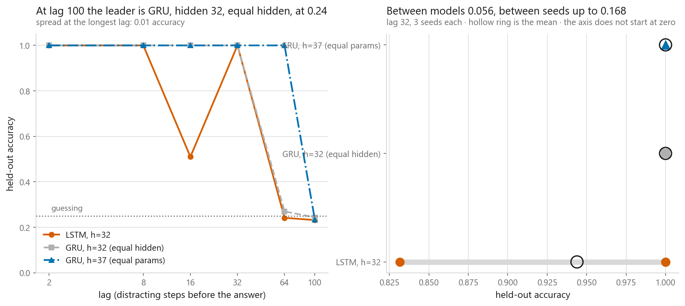
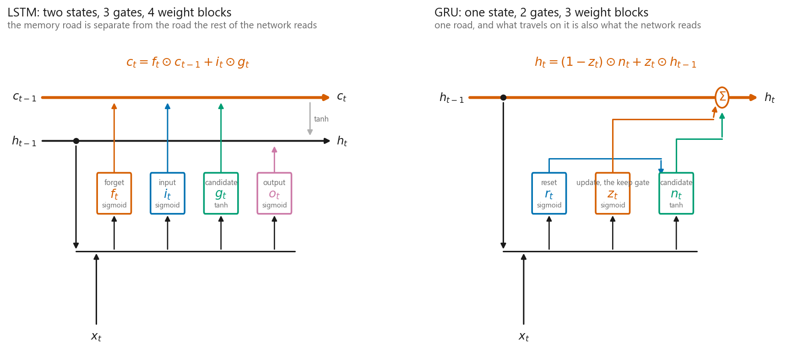
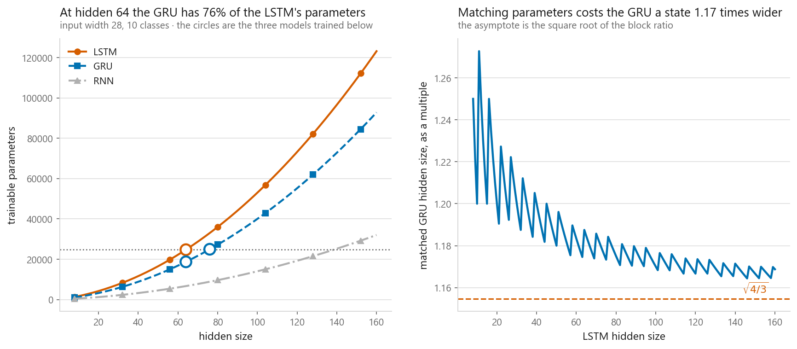
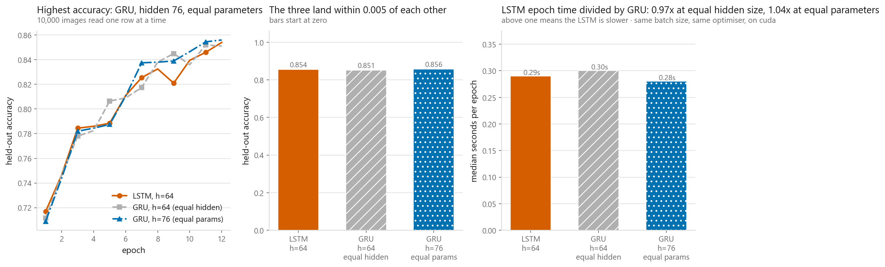
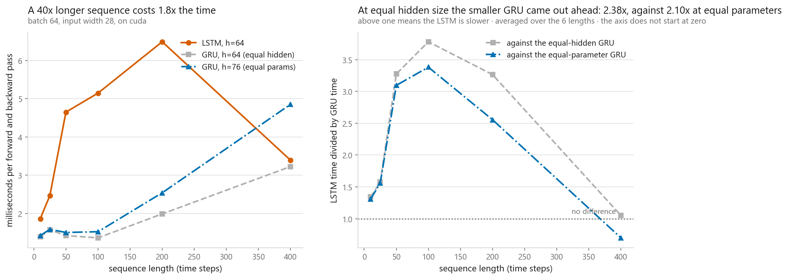

# GRU

### Two gates instead of three, and a seed spread three times larger than the architecture gap

**[Open the notebook](notebook.ipynb)** · Part 9, Sequences and language ·
Made by [Elyes Lounissi](https://www.linkedin.com/in/elyes-lounissi/)

| | |
|---|---|
| **What you will learn** | The reset and update gates, why merging the cell state removes a whole gate, a GRU cell written by hand and checked against `nn.GRU`, the place PyTorch puts the reset gate that the 2014 paper does not, and why comparing a GRU to an LSTM at equal hidden size is not a fair fight |
| **You should already know** | [LSTM](../04-lstm/) and [recurrent networks](../03-recurrent-neural-networks/). This chapter reuses their copy task and their training loop |
| **Datasets** | Fashion-MNIST read one row at a time as a 28-step sequence, 10,000 train and 2,000 test, plus the synthetic copy task from 09-04 |
| **Runtime** | A few minutes. On the CUDA device this run used, torch 2.11.0+cu128: three image models in 19 s, eighteen copy-task models in 71 s |

---

## The result I would lead with

Three models on the copy task at lag 32, three seeds each:

| Model | Mean | Min | Max | Seed spread |
|---|---|---|---|---|
| LSTM, hidden 32 | 0.944 | **0.832** | 1.0 | **0.168** |
| GRU, hidden 32, equal hidden | 1.000 | 1.000 | 1.0 | 0.000 |
| GRU, hidden 37, equal parameters | 1.000 | 1.000 | 1.0 | 0.000 |

| | |
|---|---|
| largest gap between model means | 0.056 |
| largest spread within one model | **0.168** |

**The spread one model shows across three seeds is three times the largest gap
between architectures.** Any ranking drawn from a single run of this comparison
is a property of `torch.manual_seed(0)`.

The single-seed sweep shows the same thing without needing the repeat. Watch the
LSTM row as the lag grows:

| Lag | LSTM | GRU, equal hidden | GRU, equal parameters |
|---|---|---|---|
| 2 | 1.000 | 1.000 | 1.000 |
| 8 | 1.000 | 1.000 | 1.000 |
| 16 | **0.510** | 1.000 | 1.000 |
| 32 | **1.000** | 1.000 | 1.000 |
| 64 | 0.242 | 0.270 | **1.000** |
| 100 | 0.232 | 0.243 | 0.233 |

The LSTM half-failed at lag 16 and then scored a perfect 1.000 at lag 32, which
is twice as hard. A curve that goes down and back up is not describing an
architecture, and any table built from one seed per point contains several of
these.

One result does survive the noise check, and it is the one that matters for the
chapter's argument: **the equal-parameter GRU carried lag 64 at 1.000 where both
other models sat near the chance level of 0.25.** Its longest lag at 90% is 64
against 32 for the other two. The difference between the two GRU columns is not
architecture at all. It is 5 units of hidden state.

## Why equal hidden size is the wrong comparison

The GRU makes two cuts. It merges the LSTM's memory `c` and its exposed state `h`
into one vector, which removes the output gate: whatever it remembers, it
reports. Then it ties the forget and input gates into a single update gate and
forms a weighted average, so keeping more of the old state necessarily means
writing less of the new one.

| Cell | Weight blocks |
|---|---|
| RNN | 1 |
| GRU | 3 |
| LSTM | 4 |

Three blocks against four means **three quarters of the parameters at the same
hidden size**, and the recurrent term dominates once the hidden size passes the
input width, so that ratio holds nearly everywhere:

| Task | Model | Parameters |
|---|---|---|
| Fashion-MNIST rows | LSTM, hidden 64 | 24,714 |
| Fashion-MNIST rows | GRU, hidden 64 | **18,698** |
| Fashion-MNIST rows | GRU, hidden 76 | 24,938 |
| copy task | LSTM, hidden 32 | 5,124 |
| copy task | GRU, hidden 32 | **3,876** |
| copy task | GRU, hidden 37 | 5,036 |

Since the count goes like `3H²` against `4H²`, matching parameters needs a hidden
size about `√(4/3)` larger: 76 against 64 on the image task, 37 against 32 on the
copy task. The counts computed from the formula and the counts allocated by
PyTorch agree exactly for all three cell types.

The comparison almost everyone runs fixes `hidden_size` and reports accuracies.
That comparison moves two things at once, and the second one is a 25% capacity
difference. Neither matching is right on its own. Printing both is the point.

## Fashion-MNIST, where nothing separates them

| Model | Hidden | Parameters | Test accuracy | Seconds per epoch |
|---|---|---|---|---|
| LSTM | 64 | 24,714 | 0.854 | 0.51 |
| GRU, equal hidden | 64 | 18,698 | 0.851 | 0.50 |
| **GRU, equal parameters** | 76 | 24,938 | **0.856** | 0.52 |

**The spread across all three is 0.0050 accuracy**, against a chance level of
0.10. The epoch-time ratios are 1.02x and 0.98x, which is to say nothing.

Report only the first two rows and you have "the GRU is 2% faster and 0.003 less
accurate", which sounds like a trade. Add the third row and both halves of that
sentence disappear: the GRU that costs the same as the LSTM is the most accurate
model in the table and takes 0.01 s per epoch longer.

## The speed argument, measured, and it does not hold

One forward and one backward pass over a fixed batch, in milliseconds:

| Model | 10 steps | 25 | 50 | 100 | 200 | 400 |
|---|---|---|---|---|---|---|
| LSTM, hidden 64 | 3.07 | 3.00 | **2.86** | 3.20 | **3.28** | **5.32** |
| GRU, hidden 64, equal hidden | **2.69** | **2.85** | 3.09 | **3.15** | 3.36 | 5.81 |
| GRU, hidden 76, equal parameters | 3.13 | 3.12 | 3.13 | **2.66** | 4.83 | 8.52 |

The GRU is supposed to be the faster cell because it is doing three quarters of
the arithmetic. **At equal hidden size it was faster at three sequence lengths
and slower at three**, and the printed ratio spans 0.92x to 1.14x. At 400 steps,
where the recurrent work should dominate most clearly, the smaller model was the
slower one: 5.81 ms against 5.32.

The equal-parameter GRU is worse still, running 8.52 ms at 400 steps against the
LSTM's 5.32.

The explanation is in the last printed line: **the LSTM's cost rose 1.7x for a
40x longer sequence.** Per-step arithmetic is not what the clock is measuring at
these sizes. Kernel launches, the Python-side loop over layers and fixed
overheads dominate, and a 25% difference in matrix size disappears underneath
them.

So the GRU's speed advantage is real on paper and was not visible on this machine
at these sizes. It would show up on a hidden size large enough for the matrix
multiplies to dominate. Quoting a speedup without saying which regime you
measured it in is how the claim survives.

## The GRU is two different functions

The hand-written cell agrees with `nn.GRU` to **5.960e-08**, which is
floating-point noise and the check you want.

Then there is the disagreement that is not noise. PyTorch computes the candidate
as

`n = tanh(W_in x + b_in + r ⊙ (W_hn h + b_hn))`

and the 2014 paper computes

`n = tanh(W_in x + b_in + W_hn (r ⊙ h) + b_hn)`

The reset gate is applied after the matrix multiply in one and before it in the
other. With identical weights and identical input:

| | |
|---|---|
| largest disagreement between the two formulations | **0.1368** |
| mean absolute disagreement | 0.0414 |
| typical size of a hidden state value | 0.1466 |

The mean disagreement is 28% of a typical activation. Both are trainable, both
work, and neither is a bug. PyTorch chose its version for speed, because
`W_hh h` can be computed once as a single 3H-wide multiply for all three gates
before anything is gated, while the paper's version needs `r` first.

It also explains an API detail that looks like sloppiness. `nn.GRU` keeps
`bias_ih_l0` and `bias_hh_l0` separate, and for a plain RNN those are redundant
because they only ever appear added together. Here `b_hn` sits inside the reset
gate's multiply and `b_in` sits outside it, so they are not interchangeable.

Write the cell from a paper, check it against the library, and you will spend an
hour looking for a bug that is not there.

## Cheat sheet

| | |
|---|---|
| **The update** | `h = (1 - z) * n + z * h_prev`. A weighted average, so keeping more of the old state means writing less of the new one |
| **The gates** | `r` resets the state inside the candidate, `z` decides how much of the old state survives. No output gate |
| **PyTorch's z** | Multiplies `h_prev`, so it is the keep gate. Half the literature defines it the other way round |
| **Gate order** | `weight_ih_l0` stacks `[r, z, n]`; an LSTM stacks `[i, f, g, o]`. Slice `H:2H` is the memory gate in both |
| **The reset gate's place** | PyTorch `r * (W_hn h + b_hn)`, paper `W_hn (r * h)`. Different by 0.1368 here, which is why two bias vectors exist |
| **Parameters** | Three blocks against four, so 3/4 at the same hidden size. Match by scaling the hidden size by about `√(4/3)` |
| **Comparing them** | Report equal hidden size and equal parameters. Either one alone is a defensible experiment and a misleading headline |
| **Speed** | Not visible here. The equal-hidden GRU was slower than the LSTM at three of six sequence lengths |
| **Seeds** | The seed spread was 0.168 and the architecture gap 0.056. Measure the first before reporting the second |
| **Returns** | `nn.GRU` returns `(output, h_n)`. `nn.LSTM` returns a tuple `(h_n, c_n)` |
| **Prefer LSTM when** | A long dependency is not being learned. The separate cell state can hold something without exposing it, and its gradient path is exactly `diag(f)` with nothing added |
| **Next** | [Sequence to sequence with attention](../06-seq2seq-with-attention/), which uses a GRU as both encoder and decoder |

---

Made by **Elyes Lounissi** ·
[LinkedIn](https://www.linkedin.com/in/elyes-lounissi/) ·
[pilot.tun@gmail.com](mailto:pilot.tun@gmail.com)

Back to [Part 9](../) · [the curriculum](../../CURRICULUM.md) · [the book](../../README.md)

`#GRU` `#LSTM` `#RNN` `#RecurrentNeuralNetworks` `#PyTorch` `#FashionMNIST`
`#DeepLearning` `#MachineLearning` `#MLTutorial` `#LearnMachineLearning`
`#DataScience` `#AI`
