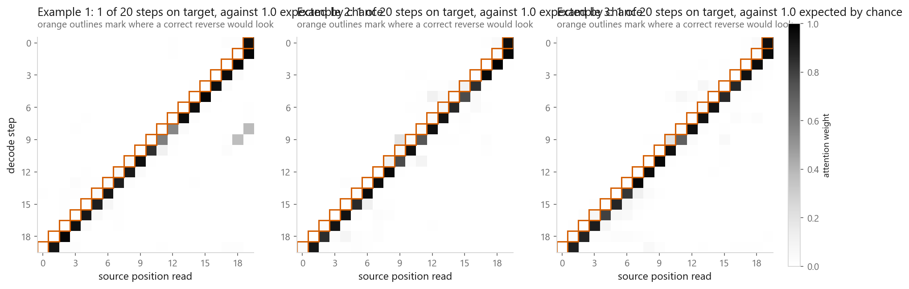
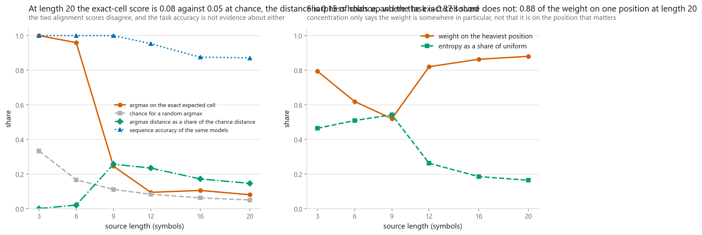
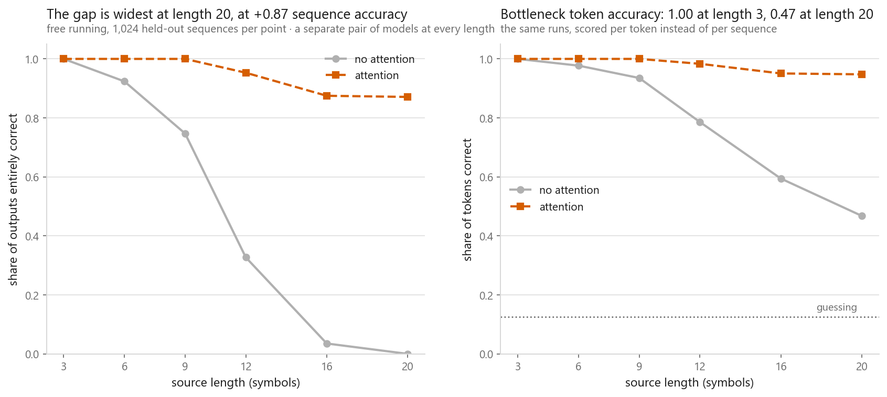
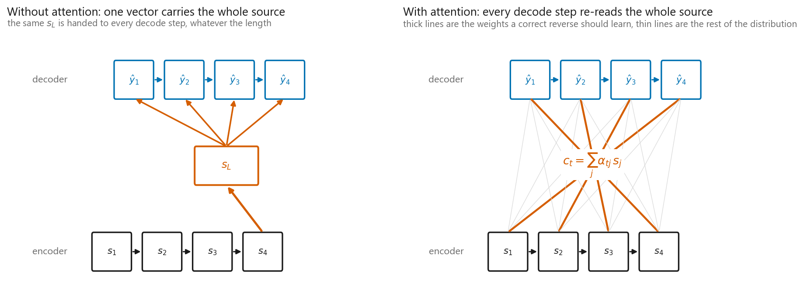
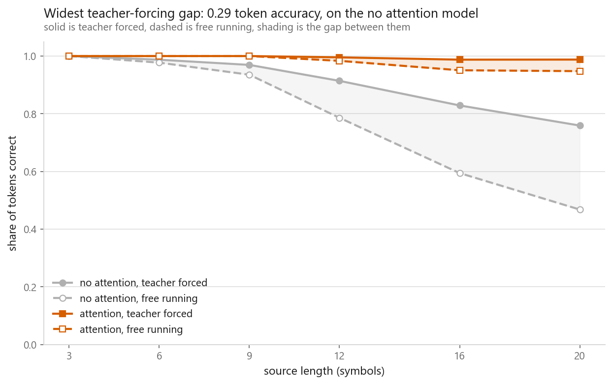
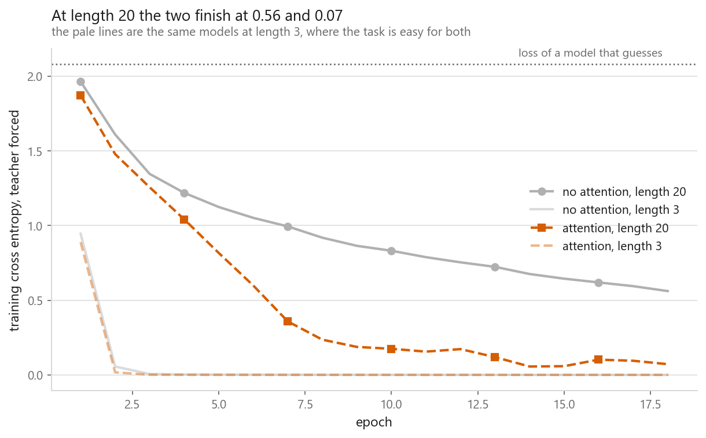

# Sequence to sequence with attention

### Attention solved the task perfectly at length 9, and its alignment map had already fallen apart

**[Open the notebook](notebook.ipynb)** · Part 9, Sequences and language ·
Made by [Elyes Lounissi](https://www.linkedin.com/in/elyes-lounissi/)

| | |
|---|---|
| **What you will learn** | The encoder-decoder shape and where its fixed-size bottleneck is, additive attention written from scratch with scores, weights and context all visible, a length sweep that finds where the bottleneck breaks, alignment matrices scored against a known answer rather than admired, and the teacher-forcing gap most reported numbers hide |
| **You should already know** | [GRU](../05-gru/) and [LSTM](../04-lstm/). The encoder and decoder here are both GRUs |
| **Dataset** | A synthetic reverse-copy task generated in the notebook, at six source lengths from 3 to 20. Vocabulary of 9 tokens, 8 of them content, so guessing scores 0.125 |
| **Runtime** | Twelve models in 302 s on the CUDA device this run used, torch 2.11.0+cu128 |

---

## The result I would lead with

The task is to reverse a sequence of random symbols. It was chosen because the
correct attention pattern is known in advance: when the decoder emits its first
token it should be looking at the last source position, so a working model's
attention matrix has to be an anti-diagonal. That turns "did attention learn
something sensible" into a score.

Here is that score next to the accuracy, for the same models:

| Source length | Attention, sequence accuracy | Attention argmax on the expected position | Chance |
|---|---|---|---|
| 3 | 1.000 | **1.000** | 0.333 |
| 6 | 1.000 | **0.959** | 0.167 |
| 9 | **1.000** | **0.245** | 0.111 |
| 12 | 0.953 | 0.094 | 0.083 |
| 16 | 0.875 | 0.105 | 0.062 |
| 20 | 0.871 | **0.080** | 0.050 |

**At length 9 the model reverses every held-out sequence correctly and its
attention lands on the expected position 24.5% of the time.** By length 12 the
on-target rate is 0.094 against a chance rate of 0.083, which is to say the
argmax is where random placement would put it, while the model is still solving
95.3% of sequences end to end.

The weights are not vague, either. At length 20:

| | |
|---|---|
| mean weight on the heaviest position | **0.880** |
| attention entropy against uniform | 0.491 against 2.996, **16.4% of it** |
| mean distance from the expected position | **0.97 symbols** |

So the distribution is sharp, it is confident, it sits about one symbol from
where the task definition says it should, and the entropy check the notebook
proposes for catching a model that is faking it, near-uniform weights, passes
comfortably. Sharpness said the model was addressing positions. The on-target
rate said it was not addressing the positions we expected.

The failure is not in the model, which works. It is in the assumption that a
sharp attention map is a readable one. **An attention matrix is a record of which
inputs were mixed into which step. It is not an explanation, and this chapter
contains the case where the two come apart while the task accuracy stays at 1.0.**

Note the entropy column moving the wrong way as well: 0.464 of uniform at length
3, rising to 0.542 at length 9, then falling to 0.164 at length 20. Attention got
sharper as it got less on-target.

## Where the bottleneck gives way

That said, the thing attention was introduced to fix, it fixes, and the size of
the fix is not subtle. Two models differing by one line, `c_t = s_L` at every
step against a context recomputed per step:

| Length | No attention, sequence | Attention, sequence | Gap | No attention, token | Attention, token |
|---|---|---|---|---|---|
| 3 | 1.000 | 1.000 | 0.000 | 1.000 | 1.000 |
| 6 | 0.924 | 1.000 | 0.076 | 0.977 | 1.000 |
| 9 | 0.747 | 1.000 | 0.253 | 0.935 | 1.000 |
| 12 | 0.327 | 0.953 | 0.626 | 0.786 | 0.983 |
| 16 | 0.035 | 0.875 | 0.840 | 0.594 | 0.951 |
| 20 | **0.000** | **0.871** | **0.871** | 0.468 | 0.948 |

The bottleneck model's longest source solved at 50% sequence accuracy is **9**.
Attention's is **20**, the longest length tested, so the sweep never found its
ceiling.

At length 20 the bottleneck model produces **zero** completely correct sequences
out of the held-out set while still getting 46.8% of individual tokens right.
That combination is the signature of a model that has learned the shape of the
task and cannot execute it, and it is exactly what one fixed-size vector holding
twenty symbols looks like from the outside.

None of this costs capacity:

| | Parameters |
|---|---|
| no attention | 176,169 |
| attention | **192,617** |

A 9% increase, all of it in three small matrices. Attention is a routing change,
not a capacity one.

## What the failure looks like up close

Three held-out sequences at length 20, both models decoding free-running:

| | Correct tokens |
|---|---|
| no attention | 10/20, 11/20, 7/20 |
| attention | **20/20, 20/20, 20/20** |

Share correct by output position, where position 1 is the first token emitted:

| Position | No attention | Attention |
|---|---|---|
| 1 | 0.946 | 0.997 |
| 3 | 0.785 | 0.991 |
| 6 | 0.541 | 0.973 |
| 10 | 0.363 | 0.941 |
| 15 | 0.317 | 0.927 |
| 20 | **0.291** | **0.931** |

The bottleneck model decays exactly as the theory predicts and then stops
decaying. For a reverse task the decoder's first output corresponds to the last
source symbol, the one the encoder saw most recently, so the summary vector
remembers it best. By position 10 the model is at 0.363 and it stays near there
for the second half, which is the floor at which it is running on whatever
general statistics survived rather than on the source.

Attention loses 0.066 across the same twenty positions.

## The teacher-forcing gap

Every model was trained with teacher forcing, which is standard and necessary.
Evaluating that way answers a question nobody asked, because at use time there
are no correct previous tokens.

| Length | No attention, gap | Attention, gap |
|---|---|---|
| 3 | 0.000 | 0.000 |
| 9 | 0.034 | 0.000 |
| 12 | 0.128 | 0.012 |
| 16 | 0.234 | 0.037 |
| 20 | **0.291** | **0.040** |

The bottleneck model at length 20 scores 0.759 token accuracy teacher-forced and
0.468 free-running. **That 0.291 is the number that goes missing from most
reported results**, and it is not a rounding difference. It is the whole
distance between a model that looks like it half works and a model that produces
zero correct sequences.

The gap widens with length for both models, for a structural reason: an error at
step t feeds every step after it, so a longer output gives one mistake more room
to compound. Attention's gap widens too, from 0.000 to 0.040, seven times less.

That ratio is the point, and it is easy to draw the wrong conclusion from it.
Attention did not fix exposure bias. Exposure bias is not a separate defect to be
patched; it is an amplifier on whatever per-step error rate you already have. A
model that is right at nearly every step compounds slowly, and a model already
shaky in the second half of its output compounds fast. So the way to shrink the
gap is to fix the per-step errors, and the way to know whether you have is to
print both numbers. A teacher-forced score alone cannot tell a small gap from a
large one.

The training loss confirms which failure is which:

| Length | No attention | Attention |
|---|---|---|
| 3 | 0.0002 | 0.0000 |
| 12 | 0.1814 | 0.0222 |
| 20 | **0.5611** | **0.0717** |

A model that guessed uniformly would sit at 2.0794, so neither model failed to
learn anything. The bottleneck model at length 20 got its training loss down to
0.5611 under teacher forcing and then produced no correct sequence at all when
run on its own output.

## The mechanism, and the three checks worth running before training

Additive scoring, from the 2015 Bahdanau paper:

`e_tj = vᵀ tanh(W_d h_{t-1} + W_e s_j)`, softmax over j, then `c_t = Σ_j α_tj s_j`

Three properties the softmax is supposed to guarantee, verified on an untrained
model:

| | |
|---|---|
| weights sum to one | max deviation **0.00e+00** |
| weights are non-negative | minimum 1.287e-01 |
| context is a convex average | its norm 1.111, largest encoder state norm 2.621 |

The third is the one worth carrying. The context vector's norm is bounded by the
largest encoder state's, which is what a convex combination buys: **attention
blends, it cannot invent**. Everything it produces is a mixture of things the
encoder actually computed.

The untrained model's weights over 7 source positions come out at
`[0.143, 0.15, 0.16, 0.142, 0.132, 0.136, 0.137]` against a uniform 0.143, which
is the baseline a trained model's map has to beat.

One implementation note that costs nothing and is skipped constantly: `W_e s_j`
does not depend on the decode step, so it is computed once for the whole sequence
before the loop starts. Putting it inside the loop is the standard way to make
attention needlessly slow.

## Cheat sheet

| | |
|---|---|
| **Encoder-decoder** | Encoder GRU reads the source, decoder GRU writes the target. The decoder loop cannot be fused, because step t needs step t-1's output |
| **The bottleneck** | One fixed-size summary of the source, whatever its length. Solved sources up to 9 here and produced zero correct outputs at 20 |
| **Additive attention** | `vᵀ tanh(W_d h + W_e s)`, softmax, weighted sum. What the 2015 paper introduced |
| **Dot-product attention** | `hᵀs / √d`. No parameters, and what the Transformer uses |
| **Precompute** | `W_e s_j` outside the decoding loop |
| **Context** | A convex combination of encoder states, norm bounded by theirs. It blends, it does not invent |
| **Cost** | `O(L_src × L_tgt)` arithmetic and all encoder states in memory, for 9% more parameters here |
| **Teacher forcing** | Necessary to train. Misleading to evaluate with. The gap reached 0.291 here |
| **Always report** | Free-running accuracy, and the gap to the teacher-forced number |
| **Scoring α** | On-target rate against chance, and entropy against `log L`. Run both |
| **Do not** | Read a sharp attention map as an alignment. At length 20 it was 88% concentrated and 8.0% on target against 5.0% chance |
| **Next** | [The Transformer](../07-the-transformer/), which keeps the attention and throws away the recurrence |

---

If this chapter was useful, a star on the repository helps other people find it.
The code is yours to use, copy and adapt in your own work, no permission needed.

Made by **Elyes Lounissi** ·
[LinkedIn](https://www.linkedin.com/in/elyes-lounissi/) ·
[pilot.tun@gmail.com](mailto:pilot.tun@gmail.com)

Back to [Part 9](../) · [the curriculum](../../CURRICULUM.md) · [the book](../../README.md)

`#Attention` `#Seq2Seq` `#EncoderDecoder` `#BahdanauAttention` `#GRU`
`#TeacherForcing` `#PyTorch` `#NLP` `#DeepLearning` `#MachineLearning`
`#MLTutorial` `#LearnMachineLearning` `#AI`
