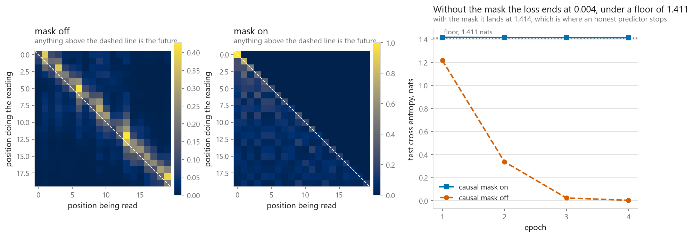
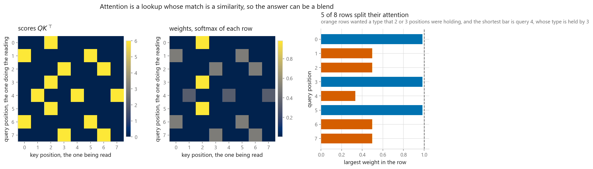
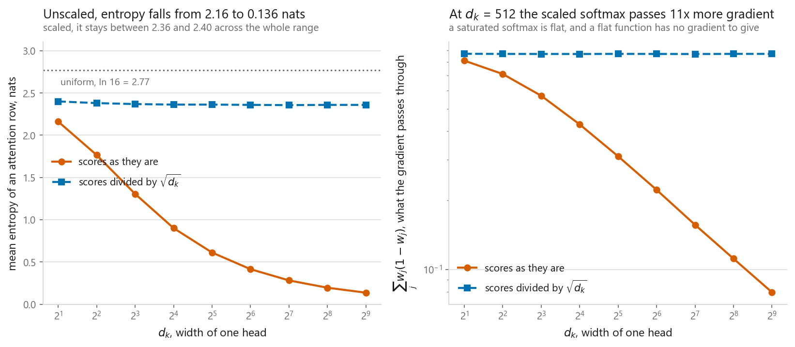
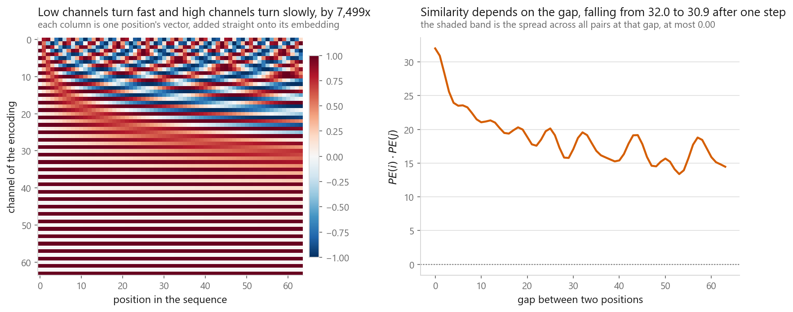
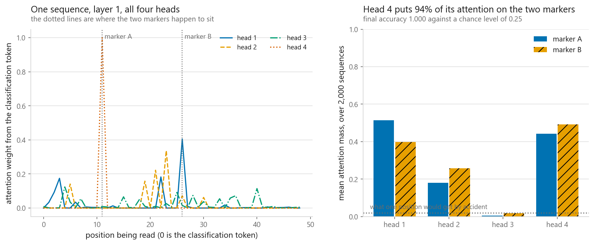
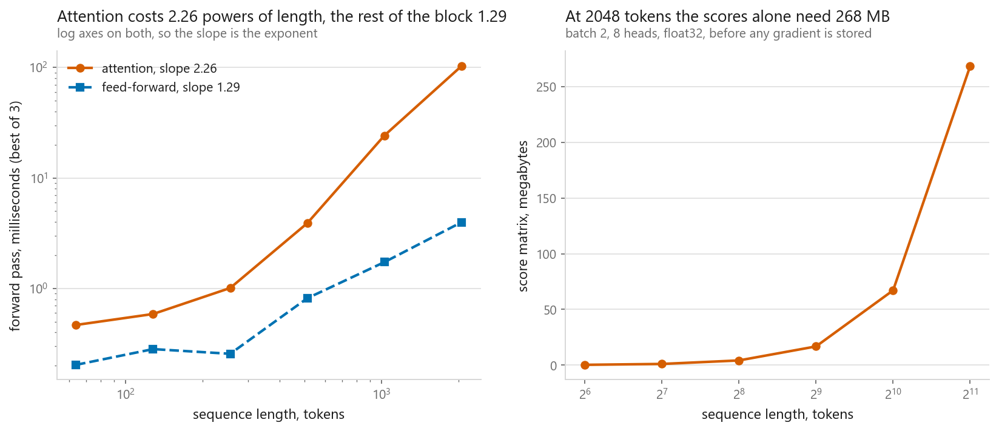

# The Transformer, built from scratch

### Five pieces written by hand, three of which PyTorch has something to check them against, and a printed accounting of the difference

**[Open the notebook](notebook.ipynb)** · Part 9, Sequences and language ·
Made by [Elyes Lounissi](https://www.linkedin.com/in/elyes-lounissi/)

| | |
|---|---|
| **What you will learn** | Scaled dot-product attention, multi-head attention, sinusoidal positional encoding, the position-wise feed-forward block and a complete encoder block, each written from scratch; which of them PyTorch has an equivalent to check against and which have to be checked against their own formula instead, with the accounting printed; why the $\sqrt{d_k}$ is not decoration; what a causal mask stops, measured against an information-theoretic floor; what individual heads attend to; and the cost in sequence length, timed |
| **You should already know** | [LSTM](../04-lstm/), or enough PyTorch to read `nn.Module`. Softmax, layer normalisation and residual connections from [Part 7](../../07-neural-networks/) |
| **Datasets** | Two synthetic tasks generated in the notebook: a two-marker retrieval problem, and a first-order Markov chain whose conditional entropy is known exactly. Nothing is downloaded |
| **Runtime** | Three to four minutes, torch 2.11.0+cu128 running on cpu for this run. The two trained models take 9 s and 20 s of that |

---

## The result I would lead with

Everything in this notebook is written out in NumPy-style PyTorch and then
checked. **The interesting part is that "checked" does not mean the same thing
for every piece, and the notebook prints which is which** rather than letting one
word cover both:

| Piece | Written | Checked against | Library reference | Max abs difference |
|---|---|---|---|---|
| scaled dot-product attention | by hand | `F.scaled_dot_product_attention` | **True** | 4.172e-07 |
| multi-head attention | by hand | `nn.MultiheadAttention` | **True** | 8.941e-08 |
| encoder block | by hand | `nn.TransformerEncoderLayer` | **True** | 4.768e-07 |
| sinusoidal positional encoding | by hand | the formula, one entry at a time | False | **1.937e-06** |
| position-wise feed-forward | by hand | its own weights, multiplied out | False | 0.000e+00 |
| layer normalisation | `nn.LayerNorm` | the formula, written out | False | 4.768e-07 |

```
pieces built by hand : 5
of those, checked against the PyTorch module that does the same job : 3
checked against their own formula instead : 2
largest disagreement anywhere in the table : 1.937e-06
```

Three of the five hand-written pieces were compared against an independent
implementation. The other two could not be, because **PyTorch ships no sinusoidal
positional encoding and no separate feed-forward module** to compare against, so
they were compared against a rewrite of the same formula by the same author on
the same afternoon. That second kind of check catches a transcription slip and
would not catch a misunderstanding of the formula.

The loosest number in the table is **1.937e-06**, and it comes from the
positional-encoding row, which is one of the weakly checked ones. The tightest
independent check is **8.941e-08** on multi-head attention, whose weight matrix
also agrees to **2.235e-08** and whose parameter count agrees exactly: **4,224
for mine and 4,224 for torch's**.

**Nothing in a transformer encoder is hidden inside the library, and three fifths
of it can be proved that way.** That is the claim this chapter is built to let
you verify rather than accept. A blanket "checked against PyTorch" would be doing
less work than the table, which is why the table is printed.

The notebook also checks what has no counterpart to compare with at all: the
attention weights sum to one along every row and are non-negative, both `True`,
and every masked position gets attention mass of exactly **0.000e+00**.

## A model that beat a bound no honest predictor can beat



The causal mask is usually demonstrated with a picture of a triangle. A picture
cannot say how much the leak is worth, so this chapter builds a task with a known
floor. Tokens come from a first-order Markov chain, so the smallest achievable
cross entropy is the chain's conditional entropy:

| Quantity | Nats |
|---|---|
| entropy of a uniform guess | 1.7918 |
| entropy of the stationary marginal | 1.7402 |
| **conditional entropy H(X_t+1 given X_t), the floor** | **1.4107** |
| test loss, causal mask on | 1.4142 |
| test loss, causal mask off | **0.0037** |

The masked model lands at 1.4142 against a floor of 1.4107, which is where an
honest predictor stops. The unmasked model reports **0.0037 nats**, three orders
of magnitude below a bound that no predictor of the future can beat, and the
attention map says how it did it.

Two means are printed with their set sizes attached, because they are averages
over sets of very different size and stacking them without the sizes makes the
smaller one look like a rebuttal of the larger:

| Cells, mask off | How many | Mean weight each | Share of all attention mass |
|---|---|---|---|
| read the future | 496 | 0.0338 | 52.5% |
| read the very next position | 31 | **0.2539** | 24.6% |

Every query row of 32 weights sums to one, so those are shares of the same 32
units. **6.2% of the future cells carry 46.9% of everything the model reads out of
the future**, and the cells in question are the ones holding the token it is being
asked to name.

That single next position takes the largest share of any position in the row. It
is a plurality and not a majority, and one cell in thirty-two does not need a
majority to leak an answer.

It is not a better model. It is a model reading the answer sheet, and nothing in
the run fails. The loss curve looks excellent, the code runs, and the model is
useless the moment it has to generate, because at generation time position t+1
does not exist. **If a language model's training loss is far below anything
comparable, suspect the mask before celebrating.**

## What attention actually is



Every position produces a query (what it wants to know), a key (what it
advertises) and a value (what it hands over). Compare one query against every
key, softmax the scores into weights that sum to one, and return that weighted
mixture of the values.

To make it visible the notebook builds Q, K and V by hand rather than learning
them: eight positions, four types, keys are one-hot for the type held and queries
are one-hot for the type wanted, and values are the position numbers so the
output names what was retrieved.

| Position | Type wanted | Positions holding it | Retrieved | Largest weight |
|---|---|---|---|---|
| 0 | 1 | 2 | 2.03 | **0.983** |
| 1 | 0 | 0, 5 | 2.51 | 0.496 |
| 2 | 3 | 3, 6 | 4.49 | 0.496 |
| 4 | 2 | 1, 4, 7 | 4.00 | **0.332** |

A query wanting a type held by exactly one position retrieved that position's
number almost exactly, at weight 0.983. A query wanting a type held by two
positions retrieved 2.51, the midpoint of 0 and 5, at weight 0.496 on each. The
one wanting a type held by three retrieved 4.00, the midpoint of 1, 4 and 7.

**Attention does not select, it mixes.** A confident-looking mechanism will hand
you the average of two answers and report no problem.

## Why the square root of d_k, measured



The scale factor is one character in the formula, usually explained in one
sentence and skipped. Uniform attention over 16 keys has entropy ln(16) =
**2.7726 nats**, and a row collapsed onto one key has entropy zero. Sweeping the
head width with and without the division:

| d_k | Score sd, unscaled | Entropy, unscaled | Softmax slope, unscaled | Score sd, scaled | Entropy, scaled | Softmax slope, scaled |
|---|---|---|---|---|---|---|
| 2 | 1.4184 | 2.1607 | 0.8112 | 1.0029 | 2.4004 | 0.8692 |
| 16 | 3.9998 | 0.9001 | 0.4279 | 0.9999 | 2.3626 | 0.8673 |
| 64 | 7.9963 | 0.4145 | 0.2220 | 0.9995 | 2.3593 | 0.8677 |
| **512** | **22.6274** | **0.1365** | **0.0795** | **1.0000** | **2.3589** | **0.8681** |

The unscaled score standard deviation goes 1.4184, 3.9998, 7.9963, 22.6274 across
those widths, which is the claim Var = d_k checked directly. The scaled column
sits at 1.0 across all nine widths tested.

The consequence is in the last columns. The derivative of a softmax weight with
respect to its own score is w(1-w), which is zero at both ends, so a saturated
softmax passes almost nothing back. At d_k = 512 the unscaled softmax slope is
**0.0795** and the scaled one is **0.8681**. The scaling is there so that the
layer has a gradient at initialisation, which is when it needs one most.

One honest caveat the notebook makes and I will repeat: this measures random Q
and K at initialisation. After training, a network is free to learn large weights
and saturate its own softmax on purpose, and heads that behave like hard pointers
do exactly that. The scaling decides where training starts, not where it ends up.

## Positions, and the fact that attention has none



Attention as written is permutation equivariant, which for a bag of words is a
feature and for a sentence is a catastrophe. The sinusoidal fix is checked rather
than believed, on 64 positions in 64 dimensions:

| | Value |
|---|---|
| norm of every position vector | 5.6569 to 5.6569 |
| closest two distinct positions | 1.4718 apart |
| self-similarity PE(p) . PE(p) | 32.0000 |
| similarity at a gap of 1 | 30.9168, spread across pairs **0.0000** |
| similarity at a gap of 16 | 19.3728, spread across pairs **0.0000** |

The spread column is the property that matters. Similarity depends on the gap and
not at all on where in the sequence the pair sits, so a head that wants "the
token before me" learns one pattern rather than a different one per starting
point.

The left panel is the frequency ladder, and it runs low-channel-fast rather than
the other way round. `inv_freq = exp(arange(0, d, 2) * -log(10000)/d)` gives
channel 0 a rate of **1.0000 radians per position**, a full cycle every 6.3
positions, and channel 62 **1.334e-04**, a full cycle every **47,117**
positions, which is 0.0014 of a cycle across the 64 positions drawn. The two ends
are **7,499x** apart. The stripes at the top of the image are the fast channels
and the near-flat bands at the bottom are the slow ones.

### The encoding bought nothing on this task

The retrieval task here is to find two marked tokens in a sequence of 48 and sum
their symbols, with chance accuracy at **0.25**. Two identical models, one with
positional encoding and one without, 38,740 parameters each, both trained in 20
s:

| Epoch | With positional encoding | Without |
|---|---|---|
| 1 | 0.2455 | 0.2455 |
| 2 | 0.3450 | **0.6150** |
| 3 | 0.9965 | **1.0000** |
| 6 | 1.0000 | 1.0000 |

The model without positions got there first and both finished at 1.0000. A sum
does not care which marker came first, so there is no order information in the
label and nothing for the encoding to carry.

That makes the permutation-equivariance claim testable rather than rhetorical.
Shuffling the input positions moves the output logits by **1.907e-06** for the
model trained without the encoding and by **2.6043** for the model trained with
it. Both still score **1.0000** on the shuffled inputs. The first model is not
merely indifferent to order, it is mathematically incapable of noticing it.

So the rule is narrower than "transformers need positional encodings". They need
them when the answer depends on order.

## Which head does the work



The classification token's row of the attention matrix says where the answer is
being read from, and the marker positions are known for every test sequence, so
the mass landing on them can be averaged per head. A head that ignored the
markers entirely would put **0.0408** of its mass on them:

| Layer | Head | Mass on marker A | Mass on marker B | On the markers |
|---|---|---|---|---|
| 1 | 1 | 0.5143 | 0.3979 | 0.9122 |
| 1 | 2 | 0.1802 | 0.2576 | 0.4378 |
| 1 | 3 | 0.0058 | 0.0182 | **0.0239** |
| **1** | **4** | 0.4429 | 0.4921 | **0.9350** |
| 2 | 1 | 0.0133 | 0.0303 | 0.0436 |
| 2 | 2 | 0.1093 | 0.0123 | 0.1217 |
| 2 | 3 | 0.2595 | 0.1877 | 0.4472 |
| 2 | 4 | 0.0125 | 0.0180 | 0.0305 |

The busiest head is layer 1 head 4 at **0.9350**, and only **2 of 8** heads put
more than half their mass on the markers. Layer 1 head 3 is at 0.0239, below the
0.0408 a head that ignored the markers would score. That pattern is what the
pruning literature keeps finding in real models: a large share of heads can be
removed with little loss, because they were never carrying much.

Several heads still earn their place here, for a reason this task shows in
miniature. There are two things to find and one softmax row can only concentrate
on one place at a time without splitting its weight. Extra rows are what let the
layer hold several pointers at once, and the training run decides how many it
uses.

## Where the parameters live, and where the time goes

The encoder block splits into three parts:

| Part | Parameters |
|---|---|
| multi-head attention | 4,224 |
| feed-forward, inner width 128 | **8,352** |
| two layer norms | 128 |

The feed-forward network holds **65.7% of the block**. Attention decides what to
mix and the feed-forward network decides what to do with the mixture, one
position at a time with no communication between positions, and it is the only
non-linearity applied to a position's own mixture.



The scores matrix is T by T, so both the arithmetic and the memory for it grow
with the square of the sequence length while everything else grows linearly:

| Sequence length | Attention ms | Feed-forward ms | Score matrix MB |
|---|---|---|---|
| 64 | 0.546 | 0.187 | 0.262 |
| 128 | 0.547 | 0.254 | 1.049 |
| 256 | 0.928 | 0.247 | 4.194 |
| 512 | 3.989 | 0.788 | 16.777 |
| 1024 | 25.446 | 1.489 | 67.109 |
| **2048** | **103.833** | 4.084 | **268.435** |

Going from 64 to 2048 tokens, a 32x longer sequence, attention costs **190.2x**
more time and the feed-forward network **21.8x**.

Fitted over the last four lengths, the exponents come out at **2.31 for attention
and 1.31 for the feed-forward network** on this run. The arithmetic says two and
one, so neither fit lands on its predicted value, and in this run both miss on the
same side by the same amount, **+0.31**, including the curve that is supposed to
be linear. A quadratic term cannot explain an excess on a linear curve, so the
shared offset is measuring one machine's memory system as much as the algorithm.
What the fit does support is the **difference of one power** between the two,
which is the claim worth carrying out of this table. At the short end neither
slope is clean either, because at 64 tokens Python and kernel launch overhead
dominate, which is also why nobody notices the quadratic term until their context
window grows.

These are timings, the least reproducible numbers on this page. Run it yourself
and expect the exponents to move; expect the gap between them to move much less.

The memory panel is what bites first in practice. Storing the scores for
backpropagation at long context is what fills a card, and it is why
FlashAttention, which never materialises the full matrix, was a systems paper
with a larger effect on model sizes than most architecture papers.

## Cheat sheet

| | |
|---|---|
| **Attention** | `softmax(Q @ K.T / sqrt(d_k)) @ V`. Q asks, K advertises, V answers, and the answer is a blend |
| **The scale** | Scores have standard deviation 22.6274 at d_k = 512 without it and 1.0000 with it. The softmax slope goes from 0.0795 to 0.8681 |
| **Multi-head** | One projection of width d_model reshaped into h heads. Same cost, several lookups, and here only 2 of 8 heads did real work |
| **Positional encoding** | Add it when the answer depends on order. Without it a trained model's logits moved 1.907e-06 under a shuffle, and its accuracy did not move at all |
| **Encoder block** | `x = LN(x + attn(x))` then `x = LN(x + ffn(x))`. Post-norm needs warmup; `norm_first=True` does not |
| **The feed-forward net** | 65.7% of the block's parameters, applied per position, and the only non-linearity between mixtures |
| **Causal mask** | `torch.triu(ones(T, T), 1).bool()`, set to -inf before the softmax. Without it the loss reached 0.0037 nats under a 1.4107 floor |
| **Cost** | Fitted exponents 2.31 for attention and 1.31 for everything else, one power apart, both above the arithmetic, so read the gap rather than either number. Scores alone need 268.435 MB at 2048 tokens |
| **Sanity checks** | Rows of the weights sum to one, masked entries are exactly 0.000e+00, and a from-scratch block matches `nn.TransformerEncoderLayer` at 4.768e-07 with the weights copied across. Say which pieces got that kind of check: here 3 of 5, and the other 2 got the weaker one against their own formula |
| **Next** | [Fine-tuning a pretrained transformer](../08-fine-tuning/), which pretrains one from nothing and then measures what the pretraining was worth |

---

Made by **Elyes Lounissi** ·
[LinkedIn](https://www.linkedin.com/in/elyes-lounissi/) ·
[pilot.tun@gmail.com](mailto:pilot.tun@gmail.com)

Back to [Part 9](../) · [the curriculum](../../CURRICULUM.md) · [the book](../../README.md)

`#Transformer` `#Attention` `#SelfAttention` `#MultiHeadAttention`
`#PositionalEncoding` `#CausalMask` `#PyTorch` `#NLP` `#DeepLearning`
`#MachineLearning` `#MLTutorial` `#LearnMachineLearning` `#DataScience` `#AI`
