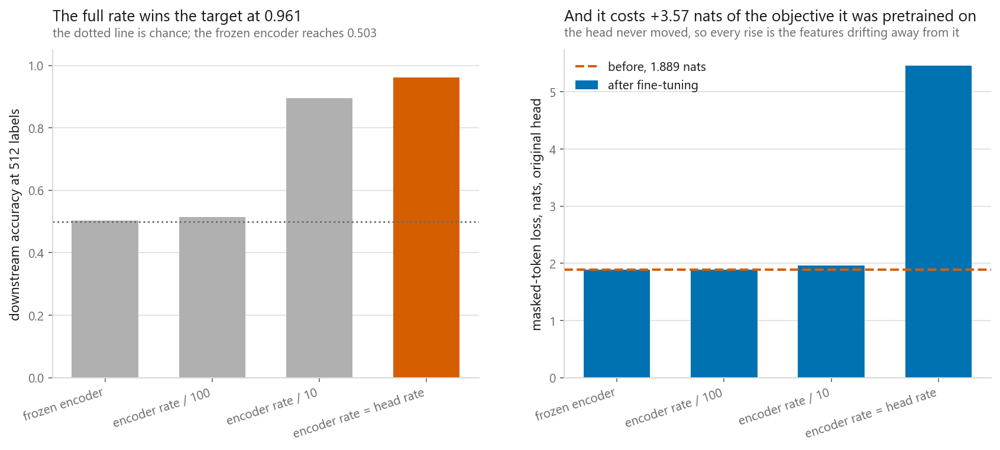
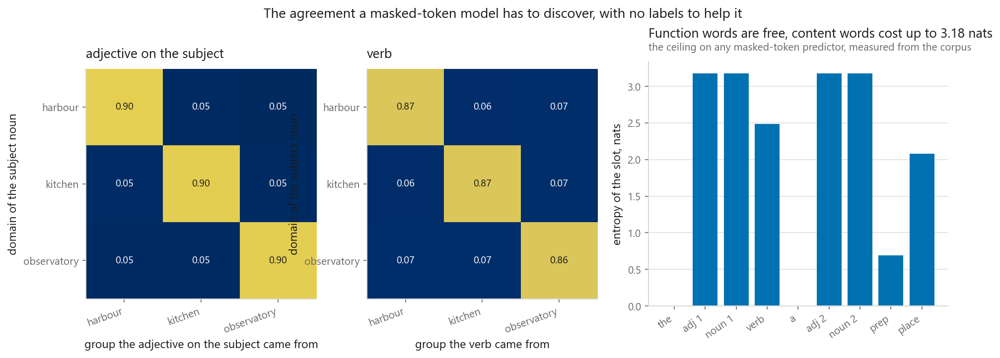
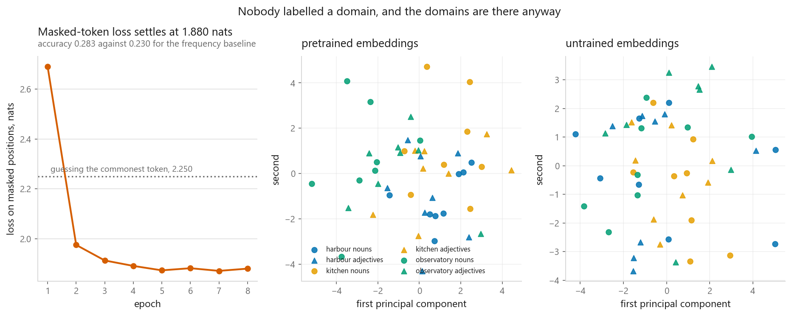
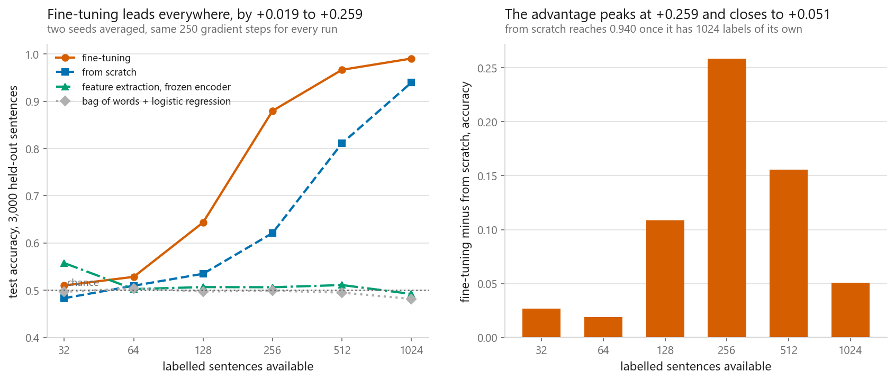
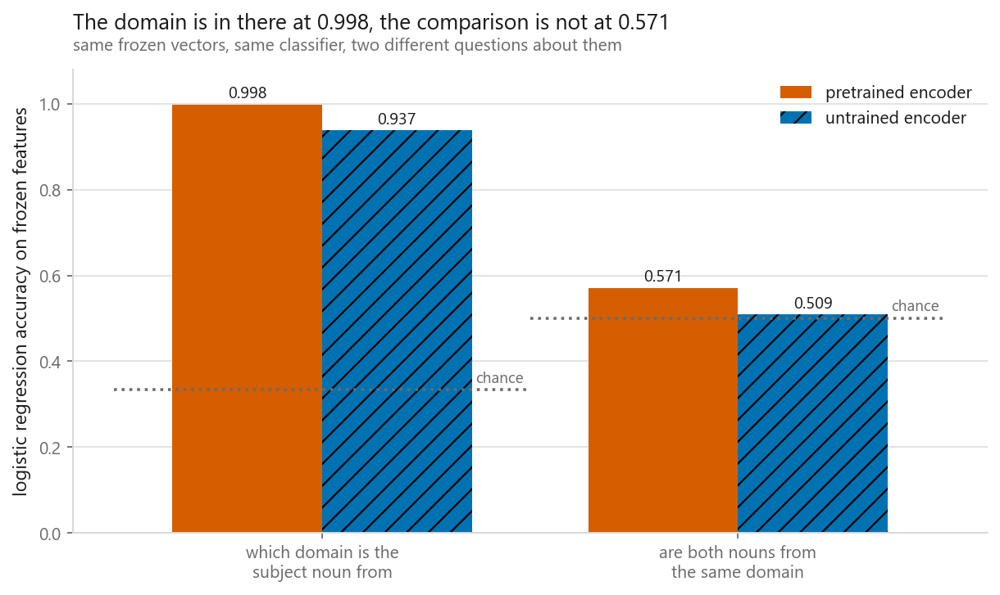

# Fine-tuning a pretrained transformer

### The setting that forgot the most of its pretraining is the one that won the task

**[Open the notebook](notebook.ipynb)** · Part 9, Sequences and language ·
Made by [Elyes Lounissi](https://www.linkedin.com/in/elyes-lounissi/)

| | |
|---|---|
| **What you will learn** | How masked language modelling turns unlabelled text into supervision, what a pretrained checkpoint actually contains, how fine-tuning compares against a frozen feature extractor and against random initialisation across a sweep of labelled-set sizes, how much of the pretraining objective fine-tuning destroys, and whether discriminative learning rates fix it |
| **You should already know** | [The Transformer, built from scratch](../07-the-transformer/). [Transfer learning](../../08-computer-vision/05-transfer-learning/) runs the same three-way comparison on images |
| **Datasets** | A synthetic language defined in the notebook: 24,000 sentences of 9 tokens, 216,000 tokens in all, over a vocabulary of 73. Nothing is downloaded and no pretrained weights are used |
| **Runtime** | Three to four minutes, torch 2.11.0+cu128. Pretraining takes 15 s on 71,616 encoder parameters and the 36-run sweep takes 58 s |

---

## The result I would lead with

Fine-tuning moves the encoder, and the encoder is carrying the pretraining. The
standard defence is a discriminative learning rate: full-sized steps for the new
head, a fraction of that for the body, and the recipe most people quote is a
tenth. The notebook measures the trade by putting the original masked-language-model
head back on the fine-tuned encoder, so any loss is the features moving out from
under a head that never changed.

The pretrained checkpoint scores **1.8890 nats** and **0.2760** masked-token
accuracy before anything is fine-tuned. After:

| Setting | Target accuracy | Masked-token loss after | Masked-token accuracy after | Loss added |
|---|---|---|---|---|
| frozen encoder | 0.5030 | 1.8890 | 0.2760 | 0.0000 |
| encoder rate / 100 | 0.5153 | 1.8878 | 0.2750 | **-0.0013** |
| encoder rate / 10 | 0.8947 | 1.9654 | 0.2820 | +0.0764 |
| **encoder rate = head rate** | **0.9607** | **5.4610** | **0.0516** | **+3.5720** |

**The best model on the task is the one that destroyed its pretraining.** Full
rate wins the target at 0.9607 and pays +3.5720 nats, dropping masked-token
accuracy from 0.2760 to 0.0516, which is below the 0.2298 a frequency baseline
gets and not far above the 0.0139 of a uniform guess over the vocabulary.

I expected this table to reproduce [08-05](../../08-computer-vision/05-transfer-learning/),
where the full learning rate destroyed the source task and came out worse on the
target too, making the tenth-rate recipe an easy sell. Half of it happened. The
forgetting is here and it is larger than on the image side. The accuracy loss is
not.

So a discriminative learning rate is not free accuracy. It is a trade, and which
side you want is a question about deployment rather than about learning. If the
fine-tuned model is the only artefact that ships, the forgetting column costs
nothing. If the same base has to serve several tasks, or gets fine-tuned again
next month, the tenth-rate row is insurance and the table says what the premium
is: 0.8947 on the target instead of 0.9607, for +0.0764 nats of forgetting
instead of +3.5720.

The frozen row is the sanity check, landing on 1.8890 exactly, because those
weights never moved.

## A language with something worth learning

Three domains, a harbour, a kitchen and an observatory, with **8 nouns, 8
adjectives and 4 verbs each**, plus **8 places and 4 function words** shared
across all of them. Every sentence follows one template and the agreement between
a noun and its adjective, or a subject and its verb, is strong but not absolute.
Nothing in the corpus is labelled with a domain and the word "harbour" never
appears.

The entropy of each slot is the number people forget to compute before being
disappointed by a language model's accuracy:

| Slot | Entropy (nats) | Most frequent token's share |
|---|---|---|
| the | -0.0000 | 1.0000 |
| adj 1 | **3.1777** | 0.0442 |
| noun 1 | 3.1777 | 0.0438 |
| verb | 2.4848 | 0.0860 |
| prep | 0.6931 | 0.5023 |
| place | 2.0793 | 0.1283 |

Guessing the most frequent token in every slot would be right **0.3213** of the
time. A slot holding one of eight equally likely nouns cannot be predicted better
than one in eight when nothing else narrows it down, and no amount of training
changes that.

## Pretraining, and what ended up in the weights

Masked token prediction, with the loss computed only at the masked positions,
because an unmasked position has its answer sitting in the input and including it
would train the model to copy.

| Epoch | Masked-token loss | Masked-token accuracy |
|---|---|---|
| 1 | 2.6901 | 0.2307 |
| 2 | 1.9752 | 0.2780 |
| 5 | 1.8734 | 0.2873 |
| 8 | 1.8802 | 0.2830 |

Scored on 4,822 masked positions against three references:

| Predictor | Accuracy | Loss (nats) |
|---|---|---|
| uniform guess over the vocabulary | 0.0139 | |
| the commonest token for that slot | 0.2298 | 2.2500 |
| **the pretrained model** | **0.2830** | **1.8802** |

The model was never told domains exist. The embedding table clusters by domain
anyway, because predicting a masked adjective requires knowing which nouns it
goes with, and a randomly initialised encoder of the same shape is the control
that shows the clustering came from training rather than from the architecture.

## How much labelled data before the pretraining stops mattering

The downstream task is relational: given a sentence, say whether the subject noun
and the object noun belong to the same domain. It does not turn on any single
word. Labels are balanced by construction, train at 0.4935 and test at 0.5143, so
chance is a half. Six sizes, two seeds each, same 250 gradient steps for every
run:

| Labelled sentences | Fine-tune | Frozen | From scratch | Bag of words |
|---|---|---|---|---|
| 32 | 0.5102 | **0.5575** | 0.4832 | 0.4967 |
| 64 | 0.5283 | 0.5025 | 0.5095 | 0.5040 |
| 128 | **0.6435** | 0.5067 | 0.5348 | 0.4973 |
| 256 | **0.8797** | 0.5063 | 0.6210 | 0.4990 |
| 512 | **0.9665** | 0.5110 | 0.8108 | 0.4950 |
| 1024 | **0.9903** | 0.4922 | 0.9395 | 0.4817 |

Fine-tuning beat from-scratch at every size, by **+0.0270, +0.0188, +0.1087,
+0.2587, +0.1557 and +0.0508**. The advantage peaks at **+0.2587 at 256
sentences** and closes to +0.0508 by 1024, which is the shape 08-05 measured on
images: transfer buys you data, and the amount it buys shrinks as you get more of
your own.

Two rows deserve to be said out loud rather than smoothed over. At 32 sentences
the **frozen encoder is the highest score in the row at 0.5575**, above
fine-tuning's 0.5102, so fine-tuning did not lead everywhere in the table even
though it led against from-scratch everywhere. The **largest seed spread across
all runs is 0.0567**, which is wider than that gap, so the honest reading of the
32-sentence row is that all four methods are at chance and the ordering inside it
means nothing.

Bag of words never leaves chance, between 0.4817 and 0.5040 at every size,
because token counts cannot express a comparison between two of the tokens.

## Why the frozen encoder failed, diagnosed

There are two explanations for feature extraction sitting near chance and they
call for opposite responses. Either the features do not contain the domain
information, in which case the pretraining was a waste, or they contain it and a
linear layer on the mean of them cannot express the comparison. Probing the same
frozen vectors with two different questions separates the two:

| Features | Probe | Accuracy | Chance |
|---|---|---|---|
| pretrained | subject domain (one word) | **0.9980** | 0.3333 |
| pretrained | same domain (a relation) | **0.5713** | 0.5000 |
| untrained | subject domain (one word) | **0.9373** | 0.3333 |
| untrained | same domain (a relation) | 0.5090 | 0.5000 |

That settles it. The domain of a noun is decodable from the frozen representation
at 0.9980 and whether two nouns share a domain is not, at 0.5713. The pretraining
did its job. Feature extraction failed because averaging token vectors and
applying one linear map cannot compute a comparison between two of them, however
good the vectors are.

The untrained row is the one to keep. It scores **0.9373** on the one-word
question with no training at all, because mean-pooling random embeddings is a bag
of words with random projections: which words are present survives the pooling
even when the vectors mean nothing. **A frozen-feature baseline can look
respectable while carrying no learned knowledge**, so a random-weights control
belongs next to it every time.

The practical version generalises past this toy. If your frozen features
underperform, ask whether the head can express the question before concluding
that the backbone is wrong.

## Cheat sheet

| | |
|---|---|
| **Masked language modelling** | Replace a fraction of tokens with `[MASK]`, predict them, take the loss at masked positions only |
| **Before you judge accuracy** | Compute the entropy of the slots. The frequency baseline here scored 0.2298 and the trained model 0.2830 |
| **Fine-tuning** | Load the encoder, attach a fresh head, train both. Beat from-scratch at every size, by +0.2587 at the peak and +0.0508 at the top |
| **Feature extraction** | Freeze the encoder, train the head. Cheap, and limited to what one linear map of the pooled features can express |
| **From scratch** | The control that decides whether pretraining bought anything. Run it every time |
| **Sanity control** | A random encoder with the same pooling. It hit 0.9373 on the one-word probe here. If your frozen features cannot beat it, they are not features |
| **Diagnose before replacing** | Probe the frozen features with an easier question. Domains were there at 0.9980 while the relation sat at 0.5713 |
| **Discriminative rates** | Encoder at a fraction of the head's rate. The full rate scored best at 0.9607 and added +3.5720 nats to the objective it was pretrained on |
| **Measuring forgetting** | Put the original pretraining head back on the fine-tuned body. The head is unchanged, so every rise is the features drifting |
| **The caveat** | One small synthetic language and two seeds, with a largest seed spread of 0.0567. The mechanisms transfer, the exact margins do not |

---

Made by **Elyes Lounissi** ·
[LinkedIn](https://www.linkedin.com/in/elyes-lounissi/) ·
[pilot.tun@gmail.com](mailto:pilot.tun@gmail.com)

Back to [Part 9](../) · [the curriculum](../../CURRICULUM.md) · [the book](../../README.md)

`#FineTuning` `#TransferLearning` `#Transformers` `#MaskedLanguageModelling`
`#CatastrophicForgetting` `#SelfSupervised` `#PyTorch` `#NLP` `#DeepLearning`
`#MachineLearning` `#MLTutorial` `#LearnMachineLearning` `#DataScience` `#AI`
