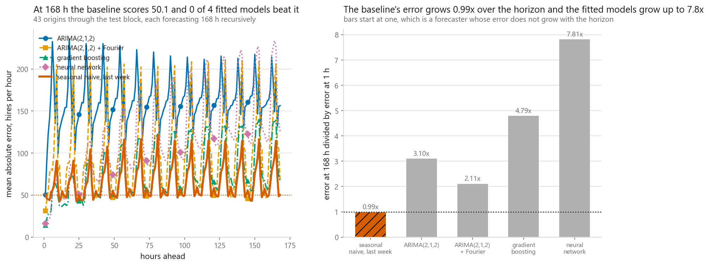
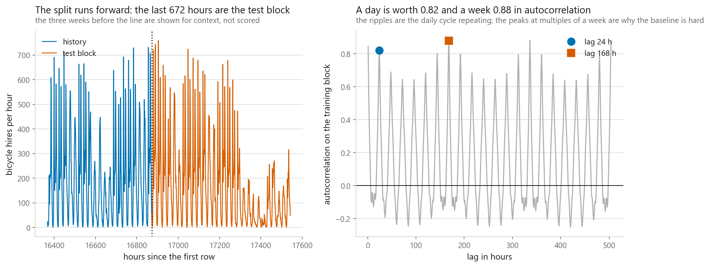
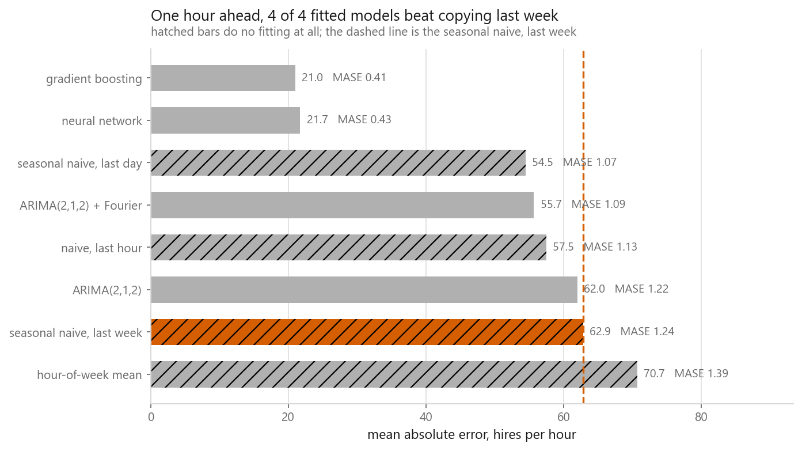
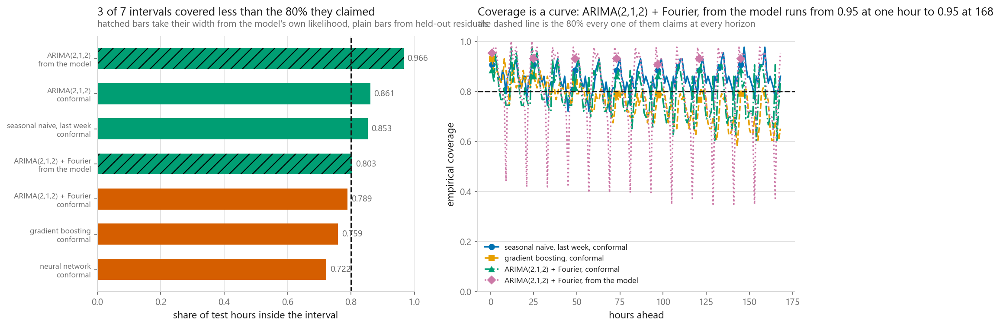
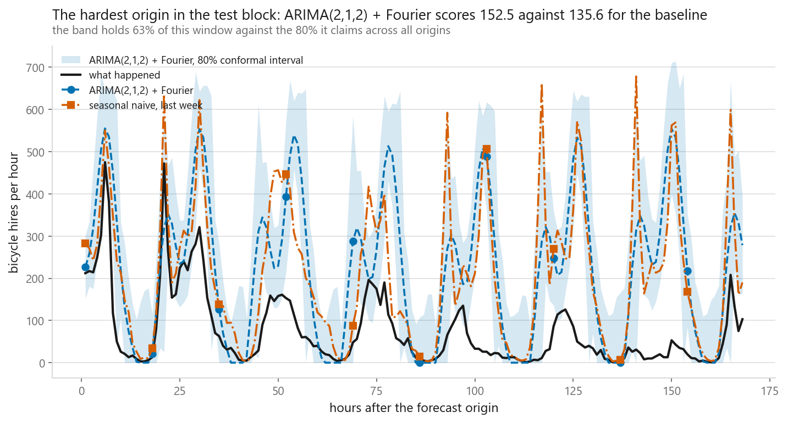

# Time series forecasting

### ARIMA against machine learning against deep learning, and the baseline that outlives all of them

**[Open the notebook](notebook.ipynb)** · Part 9, Sequences and language ·
Made by [Elyes Lounissi](https://www.linkedin.com/in/elyes-lounissi/)

| | |
|---|---|
| **What you will learn** | How to split a series without leaking, why a one-step leaderboard is close to meaningless, how error compounds under recursive forecasting, and how to check a prediction interval instead of trusting it |
| **You should already know** | Regression, gradient boosting, and enough PyTorch to read a small network |
| **Dataset** | UCI Bike Sharing, hourly demand. The busiest hour of the week averages 544.7 hires and the quietest 4.8, a ratio of 114.2x |
| **Runtime** | About two minutes. `statsmodels` is required for the ARIMA section |

---

## The result I would lead with

One hour ahead, every fitted model beats the baseline and it is not close:

| Model | MAE | RMSE | MASE |
|---|---|---|---|
| **gradient boosting** | **21.0281** | 33.9273 | **0.4131** |
| neural network | 21.7334 | 32.3641 | 0.4270 |
| seasonal naive, last day | 54.4567 | 91.2879 | 1.0699 |
| ARIMA(2,1,2) + Fourier | 55.7015 | 82.4968 | 1.0943 |
| ARIMA(2,1,2) | 61.9838 | 87.2441 | 1.2177 |
| seasonal naive, last week | 62.8806 | 110.1836 | 1.2354 |

Gradient boosting more than halves the seasonal naive error. **4 of 4 fitted
models beat the baseline.** That is the table most forecasting write-ups stop at,
and stopping there is the mistake this chapter exists to prevent.

Forecast further than one step and it reverses completely:

| Model | MAE at 1 h | MAE at 24 h | MAE at 168 h | Beats the baseline until |
|---|---|---|---|---|
| gradient boosting | **14.0** | 42.6 | 67.1 | **6 h** |
| neural network | 16.1 | 51.9 | 125.6 | **6 h** |
| ARIMA(2,1,2) + Fourier | 31.3 | 56.7 | 65.9 | 3 h |
| ARIMA(2,1,2) | 50.4 | 138.1 | 156.3 | 2 h |
| hour-of-week mean | 41.7 | 39.6 | 55.9 | 4 h |

**At a 168-hour horizon, 0 of 7 models beat the seasonal naive baseline's 50.09,
and 0 of 4 fitted models do.** The best model in the book on this task holds its
advantage for six hours out of a week.

Nothing about the one-step table was wrong. It simply answered a different
question from the one most people think they are asking.

## Why the errors compound the way they do

The forecasts here are recursive: each step feeds the previous prediction back in
as an input, across 43 rolling origins forecasting 168 hours each, scoring 7,196
points. That is how these models are used, and it is why the error growth differs
so much between them:

| Model | 1 h | 168 h | Growth |
|---|---|---|---|
| ARIMA(2,1,2) | 50.40 | 156.32 | 3.10x |
| ARIMA(2,1,2) + Fourier | 31.28 | 65.90 | 2.11x |

Adding ten Fourier terms to ARIMA improves the one-step error and improves the
compounding more, because the seasonal structure keeps supplying information the
recursion cannot invent.

## The AR forecast collapses to the mean, on purpose

Written from scratch by normal equations and checked against statsmodels to a
maximum absolute difference of **6.395e-14**, then rolled forward by hand:

| Steps ahead | Forecast | Distance from the training mean |
|---|---|---|
| 1 h | 55.98 | 132.12 |
| 12 h | 183.02 | 5.08 |
| 24 h | 187.95 | 0.15 |
| 168 h | 188.13 | **0.03** |

The training mean is 188.10. **The forecast is halfway to it after 3 hours and
0.032 away by 168 hours**, while the actual series over the same window moved
between 2 and 724 hires.

This is not a bug and the chapter does not treat it as one. A stationary
autoregression has the unconditional mean as its long-run forecast, so anything
that looks like a weekly cycle at a long horizon has to come from somewhere other
than the AR part. That is exactly what the Fourier terms supply.

The autocorrelations say the same thing in advance: the strongest relationship
beyond two hours is at **lag 168 h at +0.8806**, above even lag 1 h at +0.8468,
and lag 12 h is **negative** at -0.1279. Demand twelve hours ago is worse than
useless, because twelve hours is the distance from rush hour to the middle of
the night.

## Splitting a series without lying to yourself

A random split leaks the future into the past, so the split is time-ordered:
15,864 training rows, 672 validation, 672 test of which 670 are scored. The
notebook checks the property directly rather than asserting it, printing whether
any feature at a given hour reads from that hour or later: **False**.

Two details that matter more than they sound:

- The loader drops the calendar, so the hour index is reconstructed from weekday
  and hour and checked against the real dates. **165 hours are absent from the
  dataset entirely** and are excluded from scoring rather than being allowed to
  count as zero demand.
- `HistGradientBoostingRegressor` defaults to an internal validation split for
  early stopping, which on a time series is chosen at random from the training
  block. The chapter turns it off and says why.

## Intervals, checked rather than drawn

Every interval below claims 80% coverage:

| Model | Interval | Coverage | At 1 h | At 168 h | Mean width |
|---|---|---|---|---|---|
| neural network | conformal | 0.722 | 0.907 | 0.698 | 317.554 |
| gradient boosting | conformal | 0.759 | 0.930 | 0.651 | 220.492 |
| ARIMA + Fourier | conformal | 0.789 | 0.884 | 0.837 | 304.770 |
| **ARIMA + Fourier** | **from the model** | **0.803** | 0.953 | **0.953** | 300.771 |
| seasonal naive | conformal | 0.853 | 0.907 | 0.860 | 287.661 |

The only interval that lands on its promise is ARIMA's own parametric one, at
0.803 against a claimed 0.80. It is also the only one whose coverage does not
decay with horizon, holding 0.953 at both ends.

The machine learning intervals fail in the way that matters most: gradient
boosting covers 0.930 at one hour and **0.651 at 168 hours**. Averaged over all
horizons it reports 0.759, which hides the problem. A single coverage number for a
multi-horizon forecast is not a check, it is an average of a good answer and a bad
one.

## Cheat sheet

| | |
|---|---|
| **Always report** | MASE, or some ratio to a seasonal naive baseline. A raw MAE tells you nothing about whether the model earned its keep |
| **Always report** | The horizon. A model that wins at one step lost by six hours here |
| **Split** | Strictly in time. Then verify no feature reads forward, do not assume it |
| **ARIMA** | Cheap, honest intervals, and a long-run forecast that is the mean unless you give it seasonal terms |
| **Boosting** | Best one-step model here by a wide margin, and its intervals decay fastest with horizon |
| **Watch out** | `HistGradientBoostingRegressor` early stopping picks its validation rows at random, which leaks on a series |
| **Watch out** | Coverage averaged over horizons hides a band that is correct at 1 h and badly wrong at 168 h |
| **Sanity check** | If your model cannot beat the seasonal naive at your actual horizon, ship the seasonal naive |

---

Made by **Elyes Lounissi** ·
[LinkedIn](https://www.linkedin.com/in/elyes-lounissi/) ·
[pilot.tun@gmail.com](mailto:pilot.tun@gmail.com)

Back to [Part 9](../) · [the curriculum](../../CURRICULUM.md) · [the book](../../README.md)

`#TimeSeries` `#Forecasting` `#ARIMA` `#GradientBoosting` `#MASE`
`#ConformalPrediction` `#MachineLearning` `#MLTutorial`
`#LearnMachineLearning` `#DataScience` `#AI`
