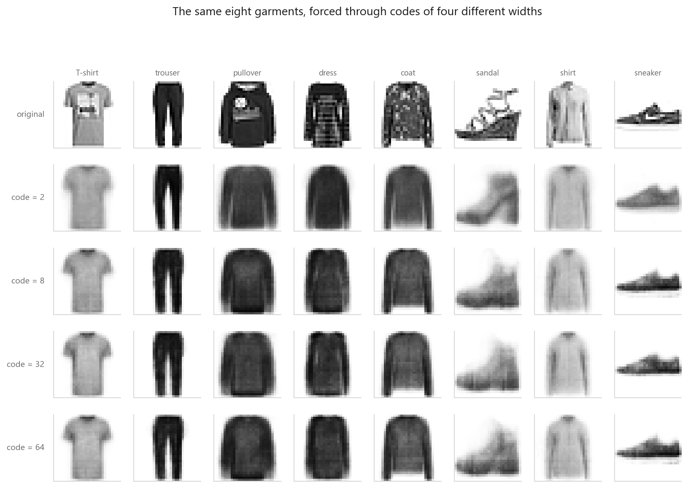
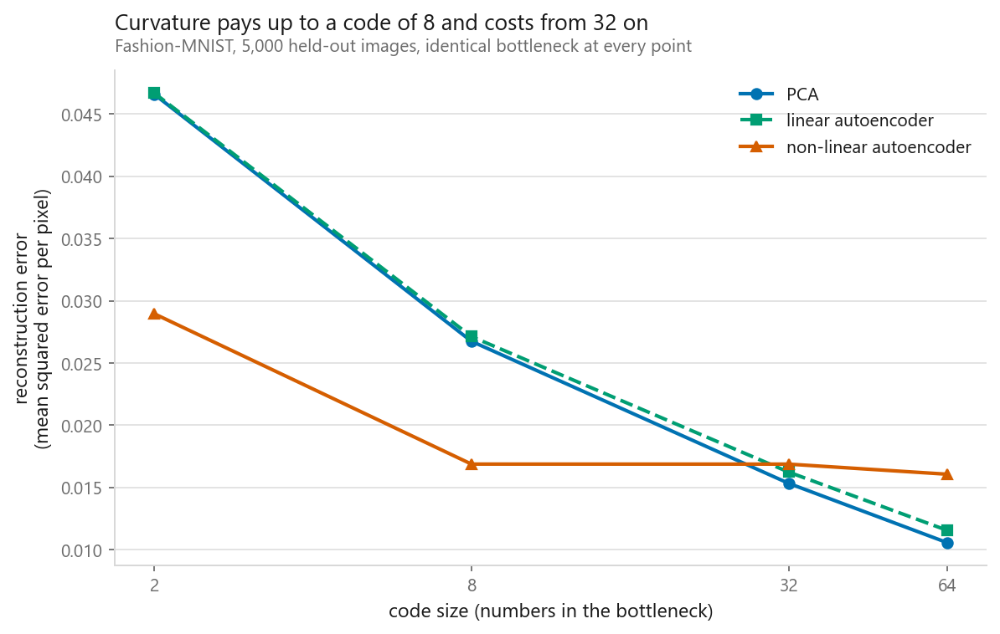
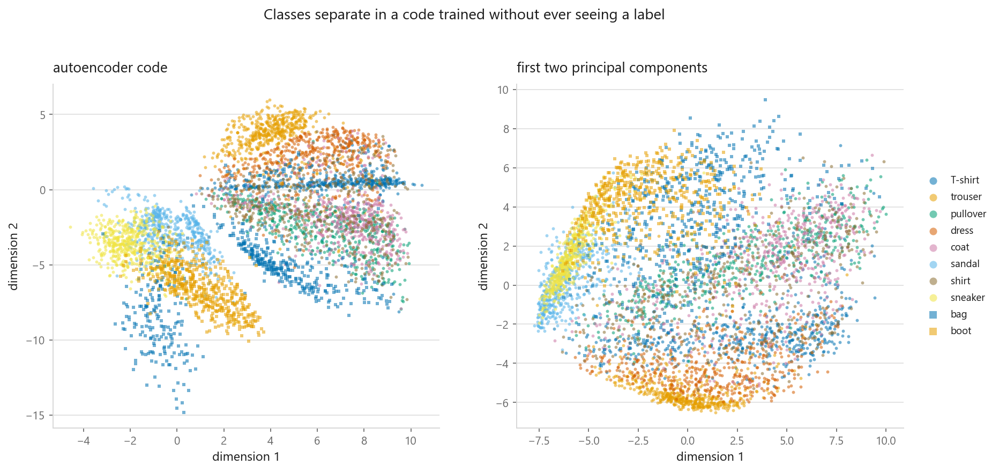
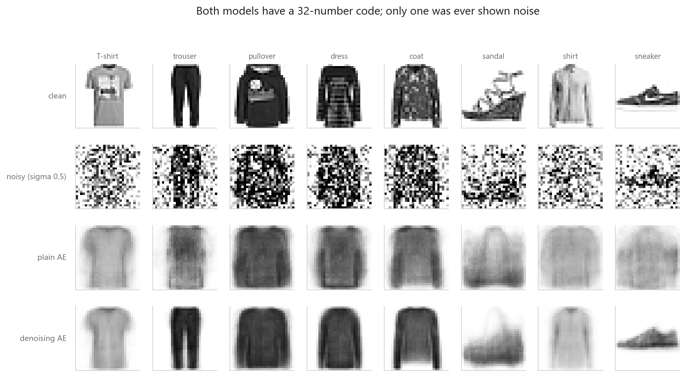
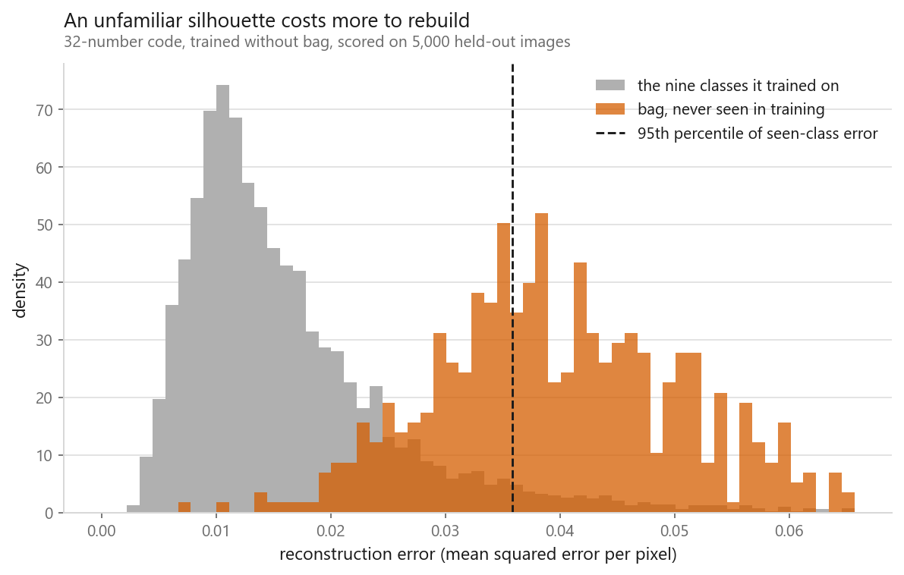

# Autoencoders

### Learning to compress by learning to reconstruct

**[Open the notebook](notebook.ipynb)** · Part 10, Generative models ·
Made by [Elyes Lounissi](https://www.linkedin.com/in/elyes-lounissi/)

| | |
|---|---|
| **What you will learn** | Why a narrow layer forces itself to carry information, how a linear autoencoder relates to PCA at the same bottleneck, where the non-linear version wins and where it loses, what a two-number code space looks like, why corrupting the input changes the task, and how to turn reconstruction error into an anomaly score |
| **You should already know** | [PCA](../../06-dimensionality-reduction/01-principal-component-analysis/), [the PyTorch training loop](../../07-neural-networks/03-the-same-net-in-pytorch/) |
| **Dataset** | Fashion-MNIST, 12,000 training and 5,000 test images sampled from it |
| **Runtime** | Four to six minutes on a laptop CPU, under two on a GPU |

---

## The idea

An autoencoder copies its input to its output through a layer narrower than the input. That layer is
the **bottleneck**, its contents are the **code**, the loss is squared error against the input
itself, and no labels appear anywhere. The headline measurement first: **the non-linear autoencoder
cut held-out error 37.8% below PCA at a 2-number code and 36.9% below it at 8, then lost by 10.1% at
32 and by 52.0% at 64.** Curvature is worth a great deal on a tiny budget and nothing on a generous
one.

## What the bottleneck drops, and in what order

Four autoencoders, identical apart from code width, trained in **37 seconds** on a GPU.

| Code size | Compression | Train MSE | Test MSE |
|---|---|---|---|
| 2 | 392× | 0.02927 | 0.02896 |
| 8 | 98× | 0.01658 | **0.01688** |
| 32 | 24× | 0.01659 | **0.01688** |
| 64 | 12× | 0.01593 | 0.01607 |

Train and test agree to within 0.0003 everywhere, so nothing overfits. The surprise is the middle
rows: **going from 8 numbers to 32 bought nothing**, test error identical to five decimals: from 8
onward the model is the limit, not the bottleneck. Squared error buys silhouette and brightness
first and texture last, which is why narrow codes come out blurred rather than wrong.

## Against PCA at the same bottleneck

Strip the activations out and the autoencoder solves PCA's problem by gradient descent, 50,992
parameters against 476,720 for the non-linear version at code 32.

| Code size | PCA | Linear AE | Non-linear AE | Non-linear advantage |
|---|---|---|---|---|
| 2 | 0.04659 | 0.04669 | **0.02896** | **+37.8%** |
| 8 | 0.02675 | 0.02713 | **0.01688** | **+36.9%** |
| 32 | **0.01534** | 0.01624 | 0.01688 | −10.1% |
| 64 | **0.01057** | 0.01156 | 0.01607 | −52.0% |

PCA keeps improving as $k$ grows while the autoencoder flatlines, so the crossover between 8 and 32
is the autoencoder running out of training rather than PCA finding curvature. The linear autoencoder
sat *above* PCA at every size (by 0.00010 at code 2, widening to 0.00099 at code 64) and never
below, the only direction theory allows. That gap is optimisation, not modelling. I checked the
subspace claim directly too: orthonormalise the linear encoder's rows, then measure how much of
PCA's top-$k$ basis falls inside that span, where 1 means the same subspace in other coordinates.

| Code size | 2 | 8 | 32 | 64 |
|---|---|---|---|---|
| Overlap with PCA's span | 0.0888 | 0.3042 | 0.5618 | 0.6308 |

**None of them got there.** Twelve epochs reached 0.63 of the span at best and 0.09 at code 2. A
loss 0.001 short of the closed form looked like convergence; the subspace says it was not.

## What two numbers look like

| 15-nearest-neighbour accuracy, two coordinates only | |
|---|---|
| Autoencoder code | **0.6758** |
| PCA components | 0.5358 |
| Guessing | 0.1000 |

Two numbers per image and a nearest-neighbour vote gets 68% of Fashion-MNIST right, against 54% for
the first two principal components, from a model never shown a label. Garments that reconstruct
through nearby codes are garments that look alike, and looking alike is most of what a label means
here.

## Denoising

Corrupt the input, keep the target clean, redraw the noise every batch. Copying the input now
scores badly, because it copies the noise.

| Recovering the clean image | MSE per pixel |
|---|---|
| The noisy input itself, no model | 0.11759 |
| Plain autoencoder | 0.05681 |
| Denoising autoencoder | **0.02239** |

That is 2.5× better than the plain autoencoder at removing noise. Whether the *code* improved or
only the output is a separate question, and a linear probe on the frozen encoder answers it.

| Logistic regression on frozen 32-number codes | Held-out accuracy |
|---|---|
| PCA, 32 components | **0.8096** |
| Plain autoencoder, 32 | 0.8014 |
| Denoising autoencoder, 32 | 0.7836 |

**The denoising code probed worst and PCA probed best.** The usual claim is that denoising buys
better features; here it bought a better denoiser and a code 0.0178 worse for classification.

## Reconstruction error as an anomaly score

Drop one class from training, train on the other nine, score all ten. With bag withheld and 10,786
training images, mean error ran **0.01637** on the nine seen classes against **0.04047** on bag,
**ROC AUC 0.9420**, catching 62.1% of bags at the 95th-percentile threshold. One class is one data
point, so here is the full sweep, ten models in 19 seconds.

| Withheld | ROC AUC | | Withheld | ROC AUC |
|---|---|---|---|---|
| bag | **0.951** | | sneaker | 0.624 |
| trouser | 0.798 | | T-shirt | 0.605 |
| sandal | 0.778 | | pullover | 0.568 |
| boot | 0.754 | | coat | 0.563 |
| dress | 0.695 | | shirt | **0.538** |

**0.951 down to 0.538, where 0.5 is a coin flip.** The method fires only when unfamiliar and
hard-to-rebuild mean the same thing: a model that has seen T-shirts, pullovers and coats rebuilds a
shirt fine without ever having been shown one.

## Cheat sheet

| | |
|---|---|
| **Use it when** | You need compression, denoising or an outlier score, and have plenty of unlabelled examples of normal |
| **Avoid it when** | You want to sample new images: the code space has holes. That is what [10-02](../02-variational-autoencoders/) fixes |
| **The bottleneck** | Narrower than the input, always. Equal width lets the network learn the identity |
| **Versus PCA** | Curvature pays at tiny codes and stops paying as the code widens. Here the crossover fell between 8 and 32 |
| **Convergence** | Check the subspace, not the loss. 0.001 from PCA's error was still only 0.63 of PCA's span |
| **Denoising** | One line, and it improves the output. Whether it improves the code needs a frozen-encoder probe |
| **Anomalies** | Threshold on a percentile of training error, and sweep every class before trusting a single AUC |

---

Made by **Elyes Lounissi** ·
[LinkedIn](https://www.linkedin.com/in/elyes-lounissi/) ·
[pilot.tun@gmail.com](mailto:pilot.tun@gmail.com)

Back to [Part 10](../) · [the curriculum](../../CURRICULUM.md) · [the book](../../README.md)

`#DeepLearning` `#Autoencoder` `#RepresentationLearning` `#AnomalyDetection`
`#PCA` `#PyTorch` `#FashionMNIST` `#UnsupervisedLearning` `#MLTutorial` `#Python`
