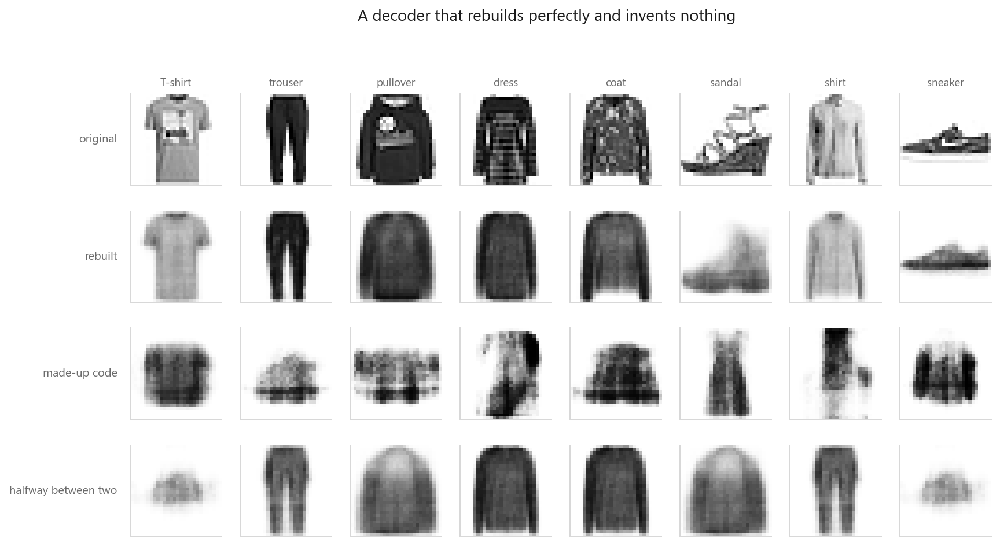
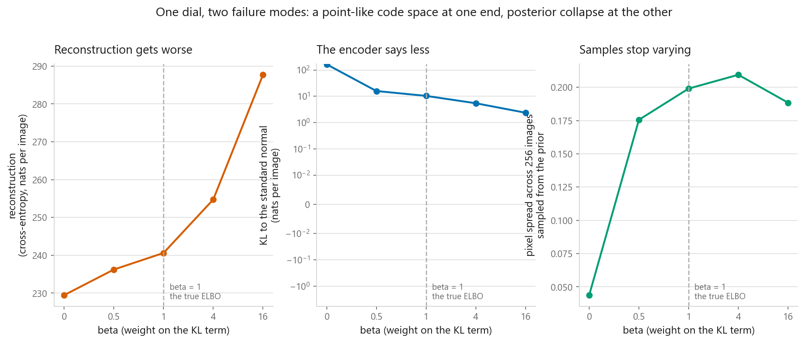
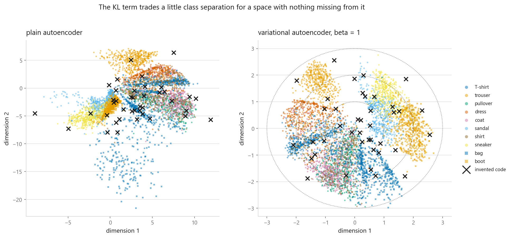
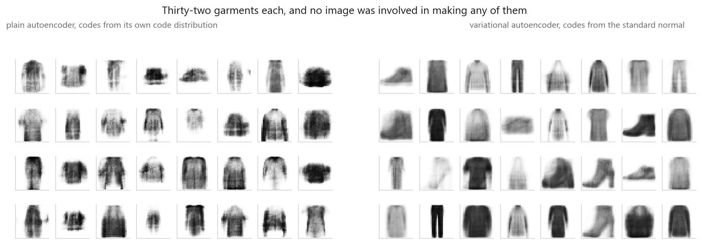
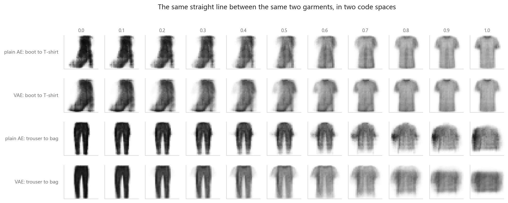

# Variational autoencoders

### Learning a distribution instead of a point, so you can sample from it

**[Open the notebook](notebook.ipynb)** · Part 10, Generative models ·
Made by [Elyes Lounissi](https://www.linkedin.com/in/elyes-lounissi/)

| | |
|---|---|
| **What you will learn** | Why a trained autoencoder cannot invent an image even though it reconstructs beautifully, what changes when the encoder returns a mean and a log-variance, why sampling has to be rewritten as `mu + sigma * epsilon` before a gradient can pass through it, what the weight on the KL term buys and costs at both extremes, and how to sample and interpolate once the space has no holes in it |
| **You should already know** | [Autoencoders](../01-autoencoders/), [the PyTorch training loop](../../07-neural-networks/03-the-same-net-in-pytorch/), [maximum likelihood](../../04-probability/02-maximum-likelihood/) |
| **Datasets** | Fashion-MNIST, the same 12,000 training and 5,000 test images used in [10-01](../01-autoencoders/) |
| **Runtime** | Five to seven minutes on a laptop CPU, about two on a GPU |

---

## The best-scoring sampler in the notebook is the broken one

Prior samples, scored by mean Euclidean distance to the nearest of the 12,000
training images, with the spread of pixel values across the batch beside it:

| | Distance to nearest real | Pixel spread |
|---|---|---|
| Real held-out garments | 3.980 | 0.2739 |
| Plain autoencoder, invented codes | 4.572 | 0.1871 |
| Variational autoencoder, `N(0, I)` draws | **3.282** | 0.2032 |
| The beta = 0 model from the sweep below | **2.506** | **0.044** |

The variational model's inventions sit **closer to the training set than a real
unseen garment does**, and the beta = 0 model sits closer still. That is not
quality. A pixel spread of 0.044 against real data's 0.2739 means the beta = 0
model draws nearly the same picture every time, and one average garment is
close to everything. Distance to real data is a blur score as much as a
fidelity score, so I read it next to the spread or not at all.

## Why a plain autoencoder cannot generate



Nothing in the reconstruction loss says where codes should land, so the encoder
scatters them and leaves gaps the decoder has never been trained on. Trained on
binary cross-entropy summed over 784 pixels, it goes from **335.4 nats** in the
first epoch to **227.2** in the last, and reconstructs fine.

Then I invent codes the most generous way available: a Gaussian fitted to the
model's own codes, so the invented points sit in the middle of the occupied
region at the right scale. Distance to the nearest real image goes from **3.980**
for real held-out clothes to **4.605** for those inventions, and the pixel
spread from **0.2739** down to **0.1929**. Row four of the figure is worse than
row three, because a midpoint between two real codes is not even an invented
region — it is the straight line between two places the encoder used.

## The reparameterisation trick, as a gradient-path check

Encoding to a mean and log-variance costs almost nothing: **472,608** parameters
for the plain autoencoder against **474,672** for the variational one. Sampling
is where the problem is, and PyTorch names the distinction directly.

```
sample()  produces a tensor connected to mu : False
rsample() produces a tensor connected to mu : True

d/dmu of sum(z^2) over 5 draws, from autograd : 17.6480
the same thing worked out by hand, sum(2z)    : 17.6480
```

`.sample()` detaches and the encoder never receives a gradient. There is another
route — the score-function estimator that reinforcement learning uses — and it
is unbiased, so the argument against it has to be measured rather than asserted.
Estimating $d/d\mu\,\mathbb{E}[z^2]$, where the truth is exactly 2:

| Estimator | Mean over 20,000 draws | Std of one draw |
|---|---|---|
| Reparameterised | 1.9761 | 2.009 |
| Score function | 1.9895 | **5.612** |

Both land on the answer. The score-function estimator needs **7.8x as many
draws** to match the other's standard error, which is what decides whether
training works at the batch sizes anyone uses.

## The beta sweep, and where collapse actually sets in



Five models, 53 seconds on a GPU. Real held-out images score 3.980 and 0.2739
on the last two columns.

| beta | Recon | KL | Mean sigma | Active dims | Recon spread | Sample to real | Sample spread |
|---|---|---|---|---|---|---|---|
| 0.0 | 229.453 | 165.294 | 0.008 | 16 | 0.249 | 2.506 | 0.044 |
| 0.5 | 236.219 | 15.944 | 0.561 | 12 | 0.241 | 3.500 | 0.176 |
| 1.0 | 240.608 | 10.403 | 0.709 | 12 | 0.240 | 3.192 | 0.199 |
| 4.0 | 254.730 | 5.457 | 0.831 | **4** | 0.227 | 3.123 | 0.209 |
| 16.0 | 287.705 | 2.380 | 0.909 | **2** | 0.200 | 3.113 | 0.188 |

At beta = 0 the blobs shrink to points — mean sigma **0.008** — which is the
plain autoencoder with extra steps. Collapse starts between beta = 1 and
beta = 4: active dimensions fall from 12 to 4, and by beta = 16 only **2 of 16**
carry anything. But it is not total. Reconstruction spread at beta = 16 is
**0.200** against 0.249 at beta = 0, so the model is still varying its output
with its input. Reconstruction loss climbs monotonically, 229.453 to 287.705,
and never tells you any of this on its own.

## What the constraint does to the picture



Two dimensions, the only size you can look at directly.

| | Code cloud mean | Code cloud std | 15-NN accuracy |
|---|---|---|---|
| Plain autoencoder | +0.823 | 4.523 | 0.6804 |
| Variational autoencoder | -0.181 | 1.221 | 0.6768 |
| Target / guessing | 0.000 | 1.000 | 0.1000 |

The plain model's codes sit at four and a half times the width of the standard
normal you would sample from, which is the failure in one number. The class
signal it gives up for that is **0.0036 of accuracy** — the KL term is close to
free here, not the tradeoff it is usually described as.

## Sampling and interpolating





Walking a straight line between two encodings, I take the pixel distance between
consecutive frames. A path crossing a hole spends its change in one jump, so the
ratio of largest step to mean step goes up.

| Path | Model | Mean step | Largest step | Largest / mean |
|---|---|---|---|---|
| Boot to T-shirt | Plain AE | 1.246 | 1.627 | 1.305 |
| Boot to T-shirt | VAE | 1.056 | 1.367 | 1.294 |
| Trouser to bag | Plain AE | 1.609 | 2.292 | 1.424 |
| Trouser to bag | VAE | 1.655 | 2.101 | **1.270** |

The VAE is smoother on both paths, and on the first one the margin is **0.011**.
Smooth interpolation is the headline claim for this model, and on one of two
paths at sixteen dimensions it is a rounding error. The real difference is
upstream, in the sampling table at the top.

## Cheat sheet

| | |
|---|---|
| **Use it when** | You want to sample, interpolate, or have neighbourhoods in code space mean something |
| **Avoid it when** | Sharpness is the deliverable. A per-pixel likelihood averages away the detail people judge an image by |
| **The encoder** | Two heads on a shared trunk, `mu` and `logvar`. Predict the log-variance so the layer output can be any real number |
| **The sampler** | `z = mu + exp(0.5 * logvar) * randn_like(mu)`. Never `Normal(mu, sigma).sample()`, which detaches |
| **beta** | 1 is the ELBO. At 0 you get the plain autoencoder back; at 4 half the dimensions are already dead |
| **Diagnose collapse** | Active dimensions and reconstruction spread. The loss looks respectable at every beta in the sweep |
| **Diagnose samples** | Distance to real data and spread together. The lowest distance here belongs to a model drawing one garment |

---

Made by **Elyes Lounissi** ·
[LinkedIn](https://www.linkedin.com/in/elyes-lounissi/) ·
[pilot.tun@gmail.com](mailto:pilot.tun@gmail.com)

Back to [Part 10](../) · [the curriculum](../../CURRICULUM.md) · [the book](../../README.md)

`#DeepLearning` `#VAE` `#GenerativeModels` `#RepresentationLearning`
`#PyTorch` `#FashionMNIST` `#UnsupervisedLearning` `#MachineLearning`
`#Python` `#MLTutorial`
