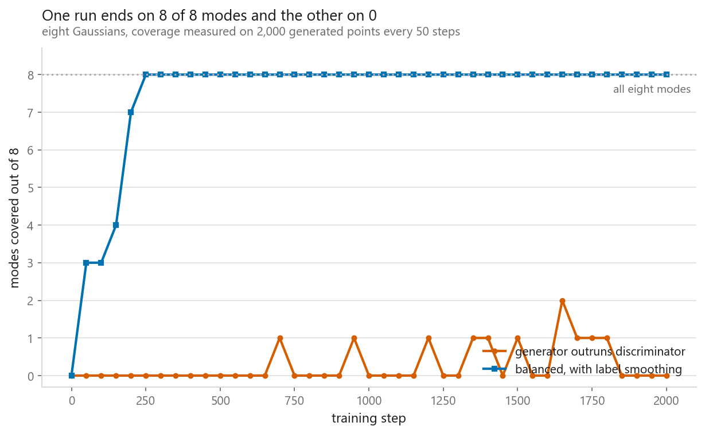
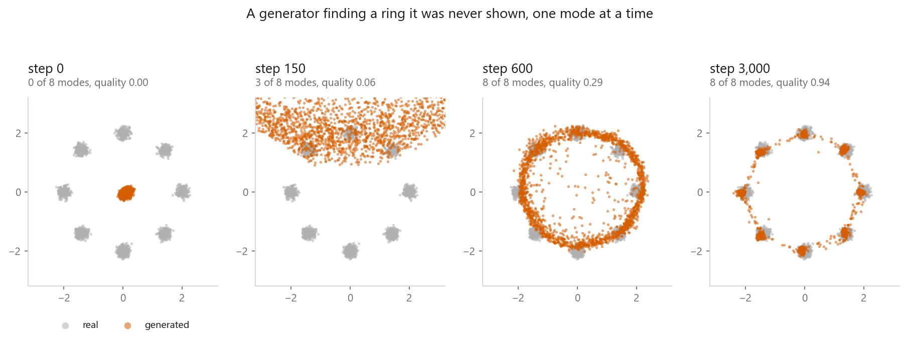
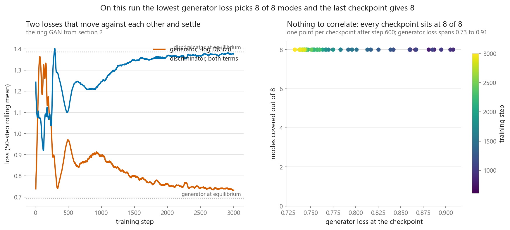
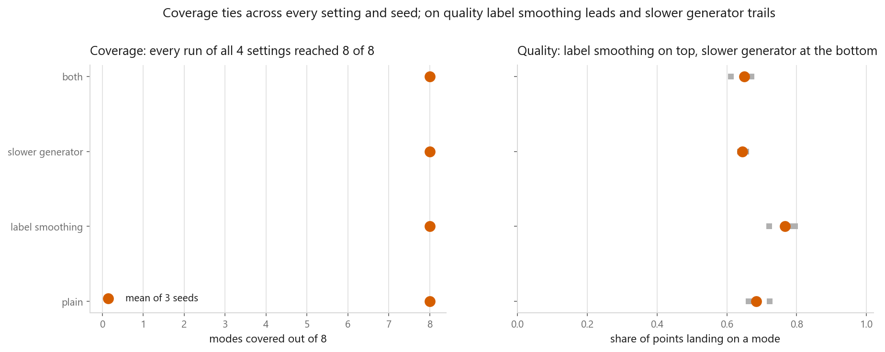
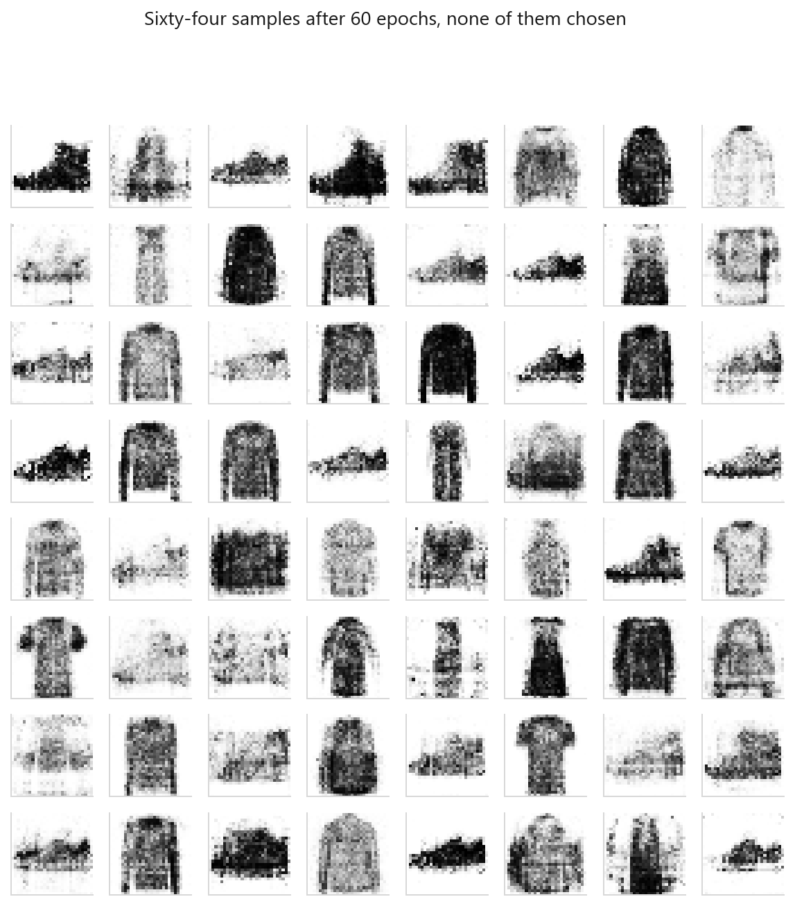

# Generative adversarial networks

### Two networks with opposing objectives, and no loss you can trust

**[Open the notebook](notebook.ipynb)** · Part 10, Generative models ·
Made by [Elyes Lounissi](https://www.linkedin.com/in/elyes-lounissi/)

| | |
|---|---|
| **What you will learn** | Why the generator's original loss goes flat when it is losing, why GAN losses do not tell you whether training is working, how to count mode collapse instead of describing it, and what two cheap stabilisers actually bought when measured across seeds |
| **You should already know** | [Variational autoencoders](../02-variational-autoencoders/), [the PyTorch training loop](../../07-neural-networks/03-the-same-net-in-pytorch/) |
| **Dataset** | A 2-D mixture of eight Gaussians on a ring for everything measured; Fashion-MNIST (12,000 images) for the closing demonstration |
| **Runtime** | About five and a half minutes of training on a GPU across all five experiments |

---

## The result I would lead with

Two runs of the same architecture. One covers the ring, one has collapsed. Here
is what their losses say about it:

| Run | Modes covered (last third) | Quality | Generator loss | Discriminator loss |
|---|---|---|---|---|
| Generator outruns discriminator | **0.571** of 8 | 0.169 | **0.682** | 1.410 |
| Balanced, with smoothing | **8.000** of 8 | 0.797 | 1.044 | 1.278 |

The collapsed run has the **lower** generator loss. Worse than that: the
theoretical equilibrium values are 0.693 for the generator and 1.386 for the
discriminator, and the collapsed run sits at 0.682 and 1.410 — closer to textbook
equilibrium on both counts than the run that works. Monitored the way you monitor
everything else in this book, the broken run would look like the healthy one, and
by the equilibrium reference it would look better.

## What the collapse actually looked like

Counting where 2,000 generated points land, at the end of each run:

| | Real data | Collapsing run | Stabilised run |
|---|---|---|---|
| Share per mode, range | 0.110 to 0.131 | 0.0 on all eight | 0.050 to 0.144 |
| Largest share on any mode | 0.131 | **0.000** | 0.144 |

Worth being precise here, because it is not the textbook picture. The collapsing
run did not settle on one mode and produce it well — it ended up
producing points that land on no mode at all, quality 0.169, meaning 83% of its
output falls in the gaps between the Gaussians. The sawtooth over training is
real, but the final state is drift, not one sharp mode.

That is why coverage and quality are always reported together. The calibration
run makes the point: a generator stuck on one mode scores quality 0.988 with
coverage 1, and one emitting uniform noise scores coverage 0 with quality 0.030.

## The saturating loss

The generator's original loss has gradient proportional to $D(G(z))$, so it is
flattest where the generator most needs to move. The non-saturating form
$-\log D(G(z))$ has the same optimum and the opposite profile:

| $D(G(z))$ | $\log(1-D)$ gradient | $-\log D$ gradient | Ratio |
|---|---|---|---|
| 0.0009 | -0.0009 | -0.9991 | **1096.6x** |
| 0.0474 | -0.0474 | -0.9526 | 20.1x |
| 0.5000 | -0.5000 | -0.5000 | 1.0x |

That table is arithmetic and settles the point. The training comparison is
weaker, and the notebook says so: with a 200-step discriminator head start to
force the saturating regime, **both forms covered 8 of 8 modes**. Only quality
separated them, 0.537 against 0.675.

## The main run, and why its loss curve is a trap

3,000 steps, 24 seconds, nothing switched on. Final checkpoint: **8 of 8 modes
covered, quality 0.941**. The generator never sees a real point; the ring comes
out of the discriminator's gradient alone.

Across all checkpoints, generator loss against coverage correlates at Pearson
**-0.771**, Spearman **-0.447**. I want to be exact about what that proves.
Coverage hit 8 by step 500 and **never moved again**, so within this run the loss
cannot be shown to mislead — there is no variation left to mislead about. The
-0.771 comes almost entirely from the opening transient, and the notebook itself
notes the correlation is undefined after the first fifth.

The evidence that the loss is untrustworthy is the collapsed-run comparison at
the top of this page, not this panel — two runs with similar losses and opposite
coverage. One run whose coverage never varied is not evidence either way.

## Stabilisers, measured across seeds

Four configurations, three seeds each, 1,200 steps, 149 seconds:

| Stabiliser | Mean covered | Worst seed | Best seed | Mean quality |
|---|---|---|---|---|
| Plain | 8.0 | 8.0 | 8.0 | 0.684 |
| Label smoothing | 8.0 | 8.0 | 8.0 | **0.766** |
| Slower generator | 8.0 | 8.0 | 8.0 | **0.645** |
| Both | 8.0 | 8.0 | 8.0 | 0.650 |

This cuts against the advice it was meant to support. **No stabiliser changed
coverage.** Every configuration, the plain one included, covered all eight modes
on every seed with zero spread. On quality, only label smoothing helped, +0.082
over plain; halving the generator's learning rate made things **worse**, 0.645
against 0.684, and combining the two gave back most of smoothing's gain. One of
the two recommended stabilisers is a net negative here. The caveat that keeps
this useful: the plain configuration was never in trouble, so this measures what
stabilisers cost when unnecessary, not what they buy when they are needed.

## The image GAN

552k generator parameters, 534k discriminator, 60 epochs in 77 seconds. Final
losses: generator 1.294, discriminator 1.151 — numbers that say nothing about
what came out.

| | Edge energy | Per-pixel spread |
|---|---|---|
| Real images | 0.0866 | 0.2762 |
| Real, 3x3 box blur | 0.0528 | — |
| GAN samples | **0.1087** | 0.2341 |

The blurred row is the comparison against the
[variational autoencoder](../02-variational-autoencoders/), which averages when
unsure. The GAN was never asked to minimise a per-pixel distance, so it has no
reason to blur — but note that it overshoots. At 0.1087 the samples are 26%
sharper than the real data, which is high-frequency noise rather than fidelity.
The per-pixel spread of 0.2341 against the real 0.2762 is the collapse check, and
it passes: a GAN settled on one garment would read near zero here.

## Cheat sheet

| | |
|---|---|
| **Use it when** | Sharpness is the deliverable and you can afford a sample-based measurement to babysit training |
| **Avoid it when** | You need coverage guarantees, a likelihood, or a run that behaves the same way twice |
| **Generator loss** | `bce_with_logits(D(G(z)), ones)`. Never the literal `log(1 - D(G(z)))` from the paper |
| **Discriminator loss** | `bce(D(real), 0.9) + bce(D(fake), 0)`. Detach the fake batch |
| **Adam** | `betas=(0.5, 0.999)` on both |
| **Label smoothing** | Real target 0.9, one-sided. The only stabiliser that improved quality here, +0.082 |
| **Learning rates** | Slowing the generator cost 0.039 of quality here and changed no coverage. Measure before adopting it |
| **Diagnosis** | Sample-based, always. A collapsed run scored a lower generator loss than a healthy one |

---

Made by **Elyes Lounissi** ·
[LinkedIn](https://www.linkedin.com/in/elyes-lounissi/) ·
[pilot.tun@gmail.com](mailto:pilot.tun@gmail.com)

Back to [Part 10](../) · [the curriculum](../../CURRICULUM.md) · [the book](../../README.md)

`#DeepLearning` `#GAN` `#GenerativeAdversarialNetworks` `#GenerativeModels`
`#ModeCollapse` `#PyTorch` `#FashionMNIST` `#TrainingDynamics`
`#MachineLearning` `#MLTutorial`
