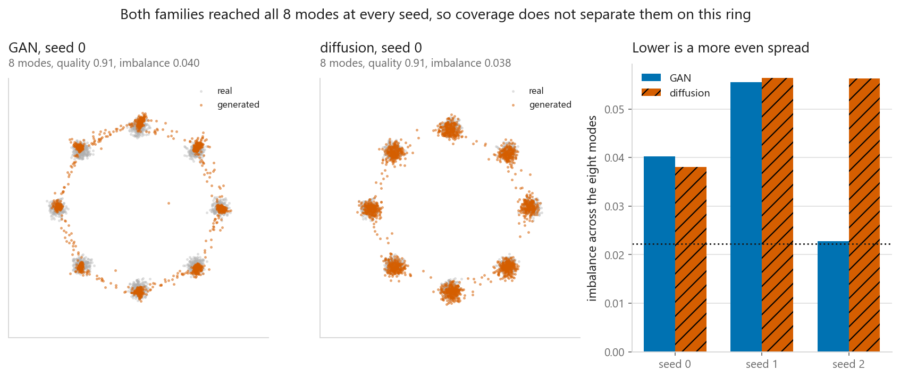
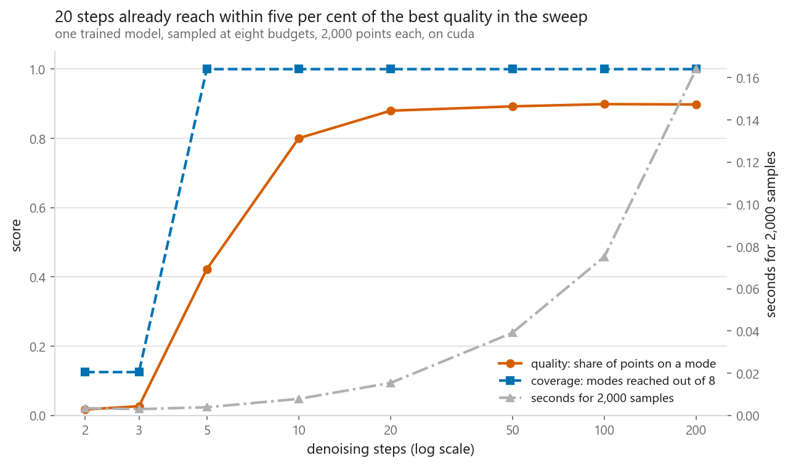
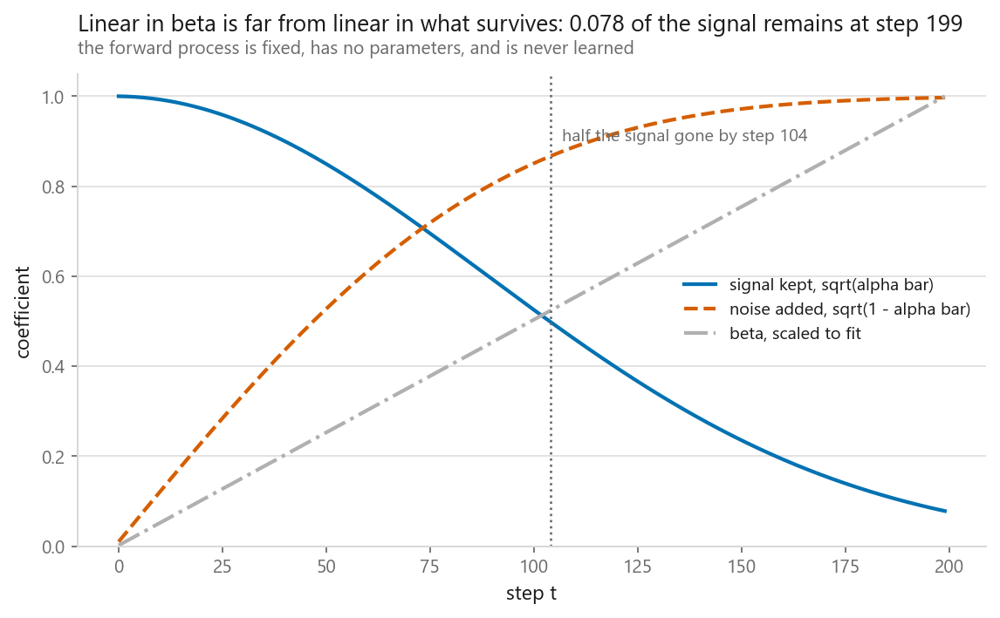
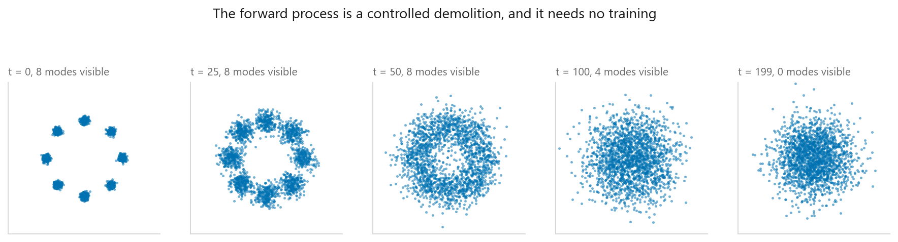
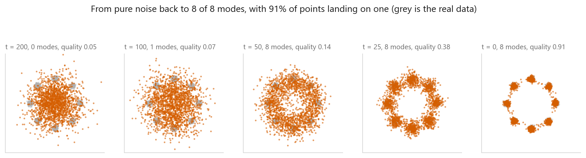
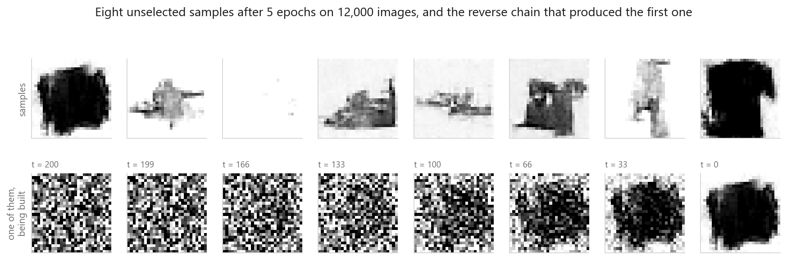

# Diffusion models

### The mode-collapse claim did not reproduce. On the finer measure the GAN won

**[Open the notebook](notebook.ipynb)** · Part 10, Generative models ·
Made by [Elyes Lounissi](https://www.linkedin.com/in/elyes-lounissi/)

| | |
|---|---|
| **What you will learn** | The forward noising schedule and the reverse step written from scratch, what a diffusion model actually predicts, how sample quality trades against the number of denoising steps, and whether diffusion covers modes better than a GAN on the same data with the same metric |
| **You should already know** | [Generative adversarial networks](../03-generative-adversarial-networks/), whose ring of eight Gaussians, training loop and coverage metric are reused here unchanged |
| **Datasets** | The same 2-D mixture of eight Gaussians as 10-03 for everything measured, plus 12,000 Fashion-MNIST images for the closing demonstration |
| **Runtime** | 3.1 minutes on the CUDA device this run used, torch 2.11.0+cu128 |

---

## The result I would lead with

The claim everybody repeats is that a GAN collapses onto a subset of the data and
diffusion does not. Both families, three seeds each, on the same ring, scored
with the same function:

| Family | Modes covered | Quality | Imbalance |
|---|---|---|---|
| GAN | 8.0000 | 0.9007 | 0.0395 |
| diffusion | 8.0000 | 0.9335 | 0.0502 |
| real data | 8.0000 | 0.9935 | **0.0222** |

**Both families reached all eight modes at every seed**, so coverage, the metric
the claim is usually stated in, does not separate them at all here. A saturated
measurement is a fact about the test, not about the methods.

Imbalance is the finer measure, the total variation distance between the per-mode
shares and a uniform eighth. Real data scores 0.0222, the floor set by sampling
noise. Look at what three seeds do to each family before reading the means:

| Seed | GAN quality | GAN imbalance | Diffusion quality | Diffusion imbalance |
|---|---|---|---|---|
| 0 | 0.9070 | 0.0402 | 0.9140 | 0.0380 |
| 1 | 0.9055 | 0.0555 | 0.9445 | 0.0564 |
| 2 | 0.8895 | **0.0228** | 0.9420 | 0.0563 |

The GAN's imbalance runs from 0.0228 to 0.0555 across its own three seeds. The gap
between the two families' means is smaller than that. **So this experiment does not
distinguish them, on either measure**, and the notebook prints each gap against the
within-family spread rather than leaving the bold text to imply an answer. I had
expected diffusion to win on imbalance, it did not, and a gap that size is not a
surprising finding. It is a null result.

Saying "inconclusive" teaches nothing on its own, so here is what would settle it.
Mode coverage separates generative methods when there are enough modes that
dropping some is likely, when the modes sit close enough that the discriminator
cannot separate them cheaply, or when the budget is short enough that a collapsed
run has no time to recover. The ring has eight well-separated modes and a generous
budget, which is three strikes.
[10-03](../03-generative-adversarial-networks/) had to tilt the game on purpose, by
starving the discriminator, before it could make a GAN collapse at all. That is the
condition the textbook claim needs, and this ring does not supply it.

Two more caveats before anybody quotes the table. The ring is two-dimensional and
both models train on it in under half a minute, so it is a place to watch
mechanisms rather than a place to rank methods. And the sampling budgets are
nowhere near equal: the GAN produces a point in one forward pass and the diffusion
model walked the entire chain.

The comparison this notebook does settle is not on that figure at all, and it is in
the next section.

## The loss is a real progress signal, which is the actual difference

The GAN chapter found that its generator loss told you nothing: the run that
never reached the ring had the lower loss. Diffusion has a fixed regression
target, so the loss ought to behave. Measured at checkpoints during training:

| Step | Loss | Modes covered | Quality |
|---|---|---|---|
| 500 | 0.4593 | 8 | 0.3330 |
| 1,000 | 0.3588 | 8 | 0.7530 |
| 2,000 | 0.3257 | 8 | 0.8260 |
| 3,000 | 0.3238 | 8 | 0.8450 |
| 4,000 | **0.3224** | 8 | **0.8600** |

**Correlation between training loss and sample quality: -0.994.** A falling loss
came with better samples, every time.

**This is the difference between the two families that survives measurement**, and
it is not the one the textbooks lead with.
[10-03](../03-generative-adversarial-networks/) runs the same correlation on a GAN
generator's loss and gets a much weaker number, because a GAN loss is a score in a
moving game: the generator's loss can fall because the discriminator got worse.
Diffusion regresses onto a fixed target, so nothing underneath the loss is moving,
and the number on the screen means what you want it to mean.

That difference holds for a reason rather than for a seed, which is exactly what
the mode-coverage comparison above could not offer. On a real project it also
matters more: it is the difference between being able to stop training when the
curve flattens and having to sample and eyeball every checkpoint.

It is bought with sampling cost, and the next section prices it.

## What the denoising steps buy

The DDIM sampler walks a subsequence of the chain, so one trained model can be
run at any budget without retraining:

| Denoising steps | Modes | Quality | Imbalance | Seconds for 2,000 samples |
|---|---|---|---|---|
| 2 | **1** | 0.0170 | **0.8162** | 0.0051 |
| 3 | **1** | 0.0265 | 0.6061 | 0.0054 |
| 5 | 8 | 0.4220 | 0.1013 | 0.0088 |
| 10 | 8 | 0.8005 | 0.0497 | 0.0163 |
| **20** | 8 | **0.8800** | 0.0432 | **0.0364** |
| 100 | 8 | **0.8990** | 0.0334 | 0.1604 |
| 200 | 8 | 0.8980 | 0.0334 | 0.3155 |

Two things in that table.

The bottom end is where real mode collapse appears in this notebook, and it is
not the model's fault. At 2 and 3 steps the sampler reaches **one mode out of
eight** with an imbalance of 0.8162. The same trained network, run with a shorter
walk, produces exactly the pathology the GAN gets blamed for.

The top end is flat. **20 steps reach within five per cent of the best quality in
the sweep, at 0.036 s against 0.315 s for the full chain**. Going
from 100 steps to 200 made quality slightly worse, 0.8990 to 0.8980, and doubled
the time. The model is not the bottleneck at generation time. The length of the
walk is, and that is why fast samplers are a research area of their own.

## The schedule, and the number worth checking

| t | beta | alpha bar | Signal kept | Noise added |
|---|---|---|---|---|
| 0 | 0.0001 | 0.9999 | 0.9999 | 0.0100 |
| 50 | 0.0126 | 0.7217 | 0.8495 | 0.5276 |
| 100 | 0.0252 | 0.2760 | 0.5254 | 0.8509 |
| 199 | 0.0500 | 0.0061 | **0.0782** | 0.9969 |

Beta is linear and what survives is not. At the end of the chain the data still
contributes **0.0782 of the signal**, not zero, and the standard deviation of the
fully noised batch is **1.008 against the 1.000** of the pure Gaussian the
sampler starts from.

That mismatch is the thing to check on any schedule you write. The sampler begins
from `N(0, I)` and the training data ends somewhere near it, and if those two
distributions do not meet, generation starts from a place the model never saw.

The forward process is a controlled demolition: fixed arithmetic, no parameters,
and any step reachable in one line from `x_t = √ᾱ_t x_0 + √(1-ᾱ_t) ε`. That
closed form is what makes training cheap, because a training example at step 137
never requires simulating 137 steps.

## The whole model is 37,762 parameters

Two coordinates and a step index in, two coordinates of predicted noise out. The
step index goes through a sinusoidal embedding, the same encoding the Transformer
uses for position, because a raw integer gives a linear layer almost nothing to
work with.

Training is four lines: pick a random step per point, noise the point with the
closed form, ask the network for the noise, compare with mean squared error.
Three seeds trained in 27, 26 and 24 seconds.

## The same code on images

Nothing about the method changes between the ring and the pictures except the
shape of the network and the shape of the noise. The image denoiser is **74,593
parameters** trained for 5 epochs on 12,000 images:

| Epoch | Loss |
|---|---|
| 1 | 0.1991 |
| 3 | 0.0932 |
| 5 | 0.0837 |

Trained in 0.2 minutes. Eight samples took 1 s, at **200 network passes each**,
which is the sampling cost stated plainly.

The samples come out with a **pixel range of -2.14 to 1.64 against the training
data's -1.00 to 1.00**. The model is generating values outside the range of
anything it was trained on, which the reverse step does not forbid, and it is the
kind of detail that gets clipped away before the pictures are shown. The grid is
unselected: eight noise vectors fixed before training, all eight shown.

Expectations set before the pictures rather than after: this is a small U-Net
given a couple of minutes. It produces garment silhouettes with soft edges and
visible noise, and published image diffusion models use compute orders of
magnitude larger.

## Cheat sheet

| | |
|---|---|
| **Forward** | `x_t = √ᾱ_t · x_0 + √(1-ᾱ_t) · ε`. Fixed, parameter-free, jumps to any t in one line |
| **What the net predicts** | The noise, from the noisy sample and the step index. Mean squared error, nothing adversarial |
| **Reverse step** | Subtract the predicted noise, rescale by `1/√α_t`, add `σ_t z` except on the last step |
| **Time conditioning** | Sinusoidal embedding of the step index. A raw integer is not enough |
| **Check the schedule** | `√ᾱ_T` was 0.0782 here, not 0, and the terminal std was 1.008 against 1.000. If those drift, sampling starts from the wrong distribution |
| **The loss means something** | Correlation with sample quality was -0.994. This is the real advantage over a GAN, not mode coverage |
| **Sampling cost** | One forward pass per step. 20 steps got within 5% of the best quality at a ninth of the time |
| **Too few steps** | 2 steps collapsed to 1 mode of 8 with imbalance 0.8162. The pathology is in the sampler, not only in GANs |
| **Do not claim** | That diffusion covers modes better, without measuring it. Both families hit 8 of 8 here and the GAN was more even |
| **Watch out** | Samples left the data range, -2.14 to 1.64 against -1 to 1. Scale data to match the terminal Gaussian and check the output |

---

If this chapter was useful, a star on the repository helps other people find it.
The code is yours to use, copy and adapt in your own work, no permission needed.

Made by **Elyes Lounissi** ·
[LinkedIn](https://www.linkedin.com/in/elyes-lounissi/) ·
[pilot.tun@gmail.com](mailto:pilot.tun@gmail.com)

Back to [Part 10](../) · [the curriculum](../../CURRICULUM.md) · [the book](../../README.md)

`#DiffusionModels` `#DDPM` `#DDIM` `#GenerativeModels` `#GAN` `#ModeCollapse`
`#PyTorch` `#FashionMNIST` `#DeepLearning` `#MachineLearning` `#MLTutorial`
`#LearnMachineLearning` `#AI`
