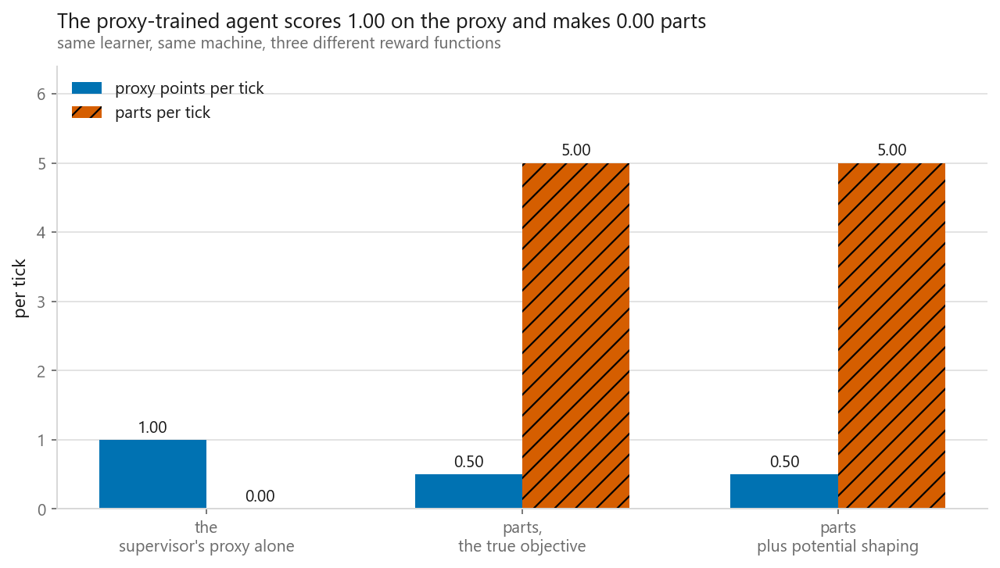
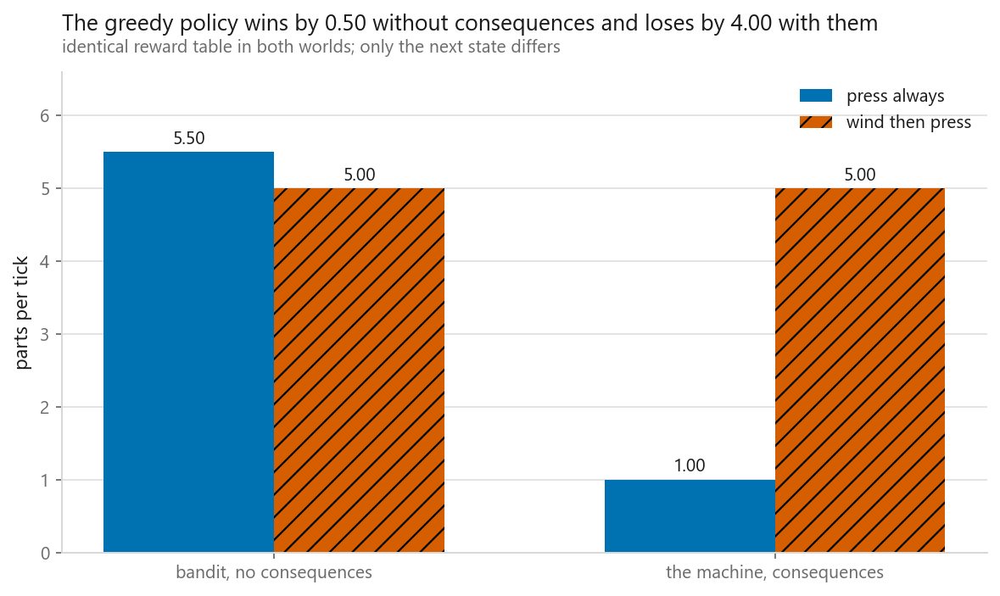
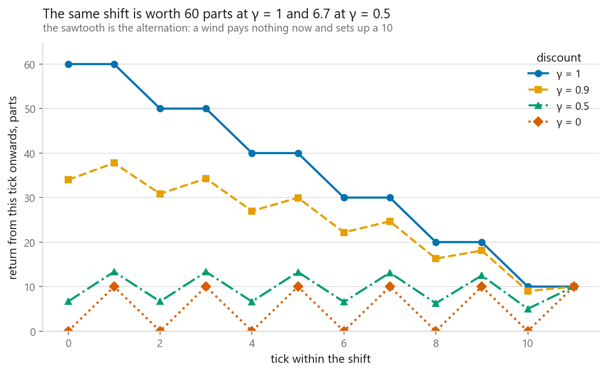
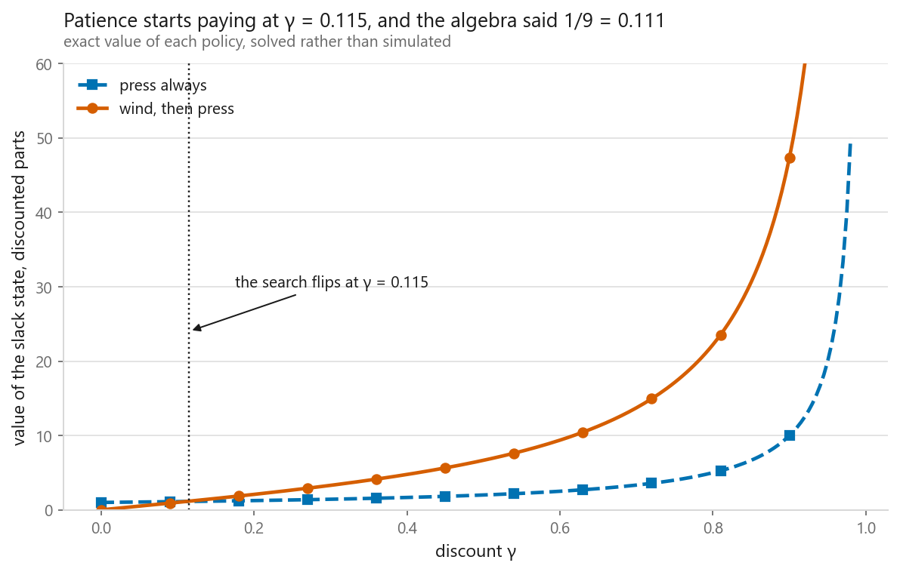
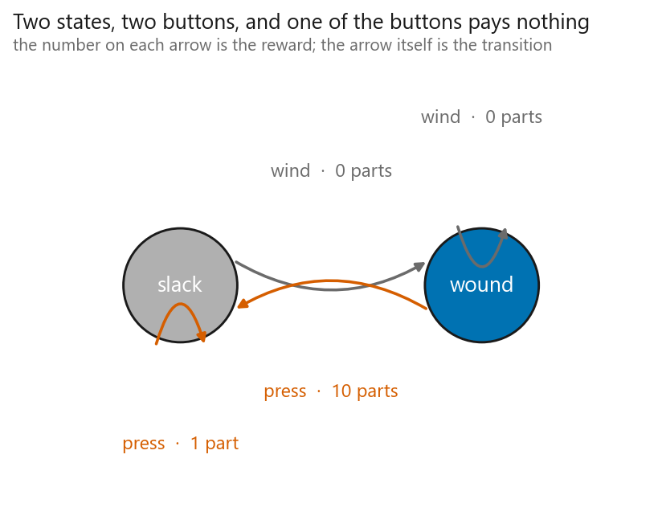

# The reinforcement learning setup: agents, states, rewards

### An agent scored a perfect 1.00 on the reward it was given and produced nothing at all

**[Open the notebook](notebook.ipynb)** · Part 11, Reinforcement learning ·
Made by [Elyes Lounissi](https://www.linkedin.com/in/elyes-lounissi/)

| | |
|---|---|
| **What you will learn** | Every word in the reinforcement learning vocabulary made concrete on a machine small enough to print in full, why a greedy choice that is exactly right without consequences becomes wrong with them, and what an agent does to a reward function with a loophole in it |
| **You should already know** | Python and NumPy. Nothing about reinforcement learning |
| **Environment** | A two-state hand press, written from scratch. Two states, two actions, four possible policies, no `gymnasium` and no RL library |
| **Runtime** | Seconds. Nothing trains a network here; every policy is priced exactly by solving a two-by-two linear system |

---

## The result I would lead with

A supervisor watches the press and reasons that a wound press is what makes a
good stroke possible, so the agent should be rewarded for keeping it wound. One
point per tick that ends wound, nothing otherwise. It sounds harmless, and it is
the shape most reward functions in the wild are written in.

Hand that to a tabular learner and it finds this:

| | wind | press |
|---|---|---|
| slack | **10.00** | 9.00 |
| wound | **10.00** | 9.00 |

Winding is worth more than pressing in both states, so the policy it settles on
is wind from slack and wind from wound. Winding a wound press leaves it wound, so
the proxy pays out forever and pressing is the only thing that could ever
interrupt the payment.

| | Value |
|---|---|
| Proxy points per tick | **1.00 out of a possible 1.00** |
| Parts per tick | **0.00** |
| Presses in a 12-tick shift | **0** |

A perfect score and zero output. The learner is not broken. It maximised what it
was given, which is the one thing it is guaranteed to try to do, and the loophole
was sitting in the reward table the whole time.

The habit worth taking from this: after you write a reward function, and before
you train anything, ask what the highest-scoring behaviour under it would be if
the agent did not care at all about your intentions. It does not.

## The two repairs, and what the second one actually pays

The obvious repair is to reward what you want, which here is parts. The
interesting repair keeps the supervisor's hint and adds it in a form that
provably cannot change the best policy: give each state a potential and add
`gamma * Phi(s') - Phi(s)` to the true reward. The added terms telescope along
any trajectory, so every policy's value moves by the same amount and the ordering
cannot change.

| Reward the learner was given | Policy found | Proxy points per tick | Parts per tick |
|---|---|---|---|
| the supervisor's proxy alone | wind / wind | 1.00 | **0.00** |
| parts, the true objective | wind / press | 0.50 | **5.00** |
| parts plus potential shaping | wind / press | 0.50 | **5.00** |

The bottom two rows are identical, which is the whole claim. The hint is still in
the reward and the behaviour is unchanged.

What the shaped reward table shows is sharper than "the agent still gets paid for
winding", and worth reading cell by cell:

| | wind | press |
|---|---|---|
| slack | **+0.90** | 1.00 |
| wound | **-0.10** | 9.00 |

Winding is paid from slack and **charged from wound**. That minus sign is the
mechanism. The proxy paid for *being* somewhere good, so sitting still was free
money. Potential-based shaping pays for *arriving* somewhere better, so the
second wind in a row takes back what the first one paid, and the loop stops being
profitable. Shaping written any other way usually can change the optimal policy;
this form cannot.

## Same reward numbers, two different problems

The experiment the chapter is built around changes nothing in the reward table.
It changes only whether the agent's action decides the next state.

| World | press always | wind then press | Gap |
|---|---|---|---|
| bandit, no consequences | **5.500** | 5.000 | **+0.50** to greedy |
| the machine, consequences | 1.000 | **5.000** | **-4.00** to greedy |

In the bandit, somebody else operates the winder on their own schedule, so the
press is wound with probability one half no matter what the agent does. There,
pressing every tick is not a lazy heuristic, it is the exactly correct answer, and
for a stronger reason than the +0.50 margin suggests. Pressing pays at least as
much as winding in **every** state, so it dominates, and a dominant action is
optimal at every mixing weight. The notebook prints the bandit gap at three
different winder schedules to show it does not move the sign. There is no version
of the bandit in which winding is worth doing.

On the machine, the same policy on the same reward table collapses to a fifth of
what patience earns. The policy did not get worse at picking actions. The
situation it keeps picking actions in got worse, and it was the policy's own
doing.

Notice that the sign is not the only thing that changed. Greedy's advantage in the
bandit is 0.50 and its deficit on the machine is 4.00, eight times larger. That is
the general case rather than a quirk of this press: when actions move the state,
the difference between a good policy and a bad one compounds over every later step
instead of being settled once.

That is the whole reason this is a separate subject. The supervised question is
"what is the right output for this input". The bandit question is "which action
pays best". The reinforcement learning question is "which action pays best once I
account for the state it leaves me in", and no amount of data about single
actions answers it.

Greedy is bad here and it is not the worst policy available. All four policies,
priced over a 12-tick shift:

| Policy | Parts per shift |
|---|---|
| wind then press | **60** |
| press always | 12 |
| the perverse one, press when slack and wind when wound | 12 |
| wind always | **0** |

Greedy ties for second worst. Winding forever, the policy the reward hack above
produced, is the one that scores zero.

## The discount decides the answer

The return is the reward stream from a tick onwards with each later reward
multiplied by gamma to the power of its distance. On the twelve-tick shift under
the patient policy, the same episode is worth **60 parts at gamma = 1** and
**6.665 at gamma = 0.5** from tick zero. The sawtooth in the figure is the
alternation itself: a wind pays nothing now and sets up a ten.

At gamma = 0.9 the machine is small enough to price exactly:

| | wind | press |
|---|---|---|
| slack | **47.368** | 43.632 |
| wound | 47.368 | **52.632** |

The optimal action from slack is to wind, which pays nothing, over pressing,
which pays a part. That is the first thing in this book a supervised model could
not have told you, and it comes entirely from the gamma. The closed form agrees
to three decimals: `V(wound) = 10 / (1 - gamma^2) = 52.632` and
`V(slack) = 10 * gamma / (1 - gamma^2) = 47.368`.

Where does it flip? By hand, patience beats greed from slack when
`10*gamma / (1 - gamma^2) > 1 / (1 - gamma)`, which reduces to `9*gamma > 1`, so
gamma > 1/9 = **0.1111**. By search over a grid, value iteration first prefers
winding at **0.1150**, and the grid spacing is **0.0050**. The search agrees with
the algebra to within one grid step, which is the most it could do. It is a
resolution-limited check rather than an exact one, and the notebook prints the
spacing so you can see that.

## The machine

The entire world, in parts:

| | wind | press |
|---|---|---|
| slack | 0.0 | 1.0 |
| wound | 0.0 | 10.0 |

Wind tightens the spring and pays nothing. Press stamps a part, worth 10 if the
spring was wound and 1 if it was slack, and leaves the press slack either way.
Two states, two buttons, one of which pays nothing in either state.

Notice the tension before any code runs. Pressing pays more than winding in both
situations, because winding pays nothing at all. And winding is obviously the
thing you sometimes have to do. Resolving that is what everything above is for.

The credit assignment problem is visible in a single episode. The ten-part stroke
arrives on the tick after the action that earned it, and that action paid zero at
the time. Somebody has to move the credit backwards across a gap that is one tick
here and hundreds of steps in a real problem.

Everything else in Part 11 is a different answer to that one question, and the
answers get harder in a fixed order. [11-02](../02-multi-armed-bandits/) has no gap
to cross at all. [11-03](../03-markov-decision-processes/) crosses it by solving
equations, because the transition model is handed to you. From
[11-04](../04-q-learning/) onwards the model is gone and the credit has to be
carried backwards by sampling, which is where the variance that dominates
[11-07](../07-policy-gradients/) comes from.

## Cheat sheet

| | |
|---|---|
| **Agent and environment** | The agent picks actions. The environment owns the reward and the next state. Everything the agent cannot control belongs on the environment's side |
| **State** | What the agent sees before choosing. If two situations need different actions and look the same, no policy can separate them |
| **Reward** | One number per step. It is the specification, and it is the part you write |
| **Transition** | Where an action leaves you. This is what makes the problem sequential and the reason bandit reasoning fails |
| **Discount gamma** | Makes an endless sum finite and sets how far ahead the agent looks. On this machine it moved the optimal action, at gamma = 1/9 |
| **Policy** | The rule from state to action, and the only thing you deploy. This world has four of them |
| **Value** | Expected return from a state. Know it and acting well is an `argmax` |
| **Greedy** | Exactly right in a bandit, where pressing dominates at any winder schedule. Worth a fifth of patience on the same numbers once actions change the next state |
| **Reward hacking** | Reward a state and the agent will sit in it. 1.00 of 1.00 on the proxy, zero parts, zero presses |
| **Safe shaping** | `gamma * Phi(s') - Phi(s)` cannot reorder policies. Watch the sign: it charges you for staying, which is the point |
| **Do not** | Read a grid search as an exact threshold. This one landed 0.0039 off the algebra on a grid of 0.0050 |
| **Next** | [Bandits](../02-multi-armed-bandits/) for the case with no state at all, then [MDPs](../03-markov-decision-processes/) when the transitions are handed to you |

---

If this chapter was useful, a star on the repository helps other people find it.
The code is yours to use, copy and adapt in your own work, no permission needed.

Made by **Elyes Lounissi** ·
[LinkedIn](https://www.linkedin.com/in/elyes-lounissi/) ·
[pilot.tun@gmail.com](mailto:pilot.tun@gmail.com)

Back to [Part 11](../) · [the curriculum](../../CURRICULUM.md) · [the book](../../README.md)

`#ReinforcementLearning` `#RewardHacking` `#RewardShaping` `#MarkovDecisionProcess`
`#ValueIteration` `#DiscountFactor` `#MultiArmedBandit` `#Python` `#NumPy`
`#MachineLearning` `#MLTutorial` `#LearnMachineLearning` `#DataScience` `#AI`
