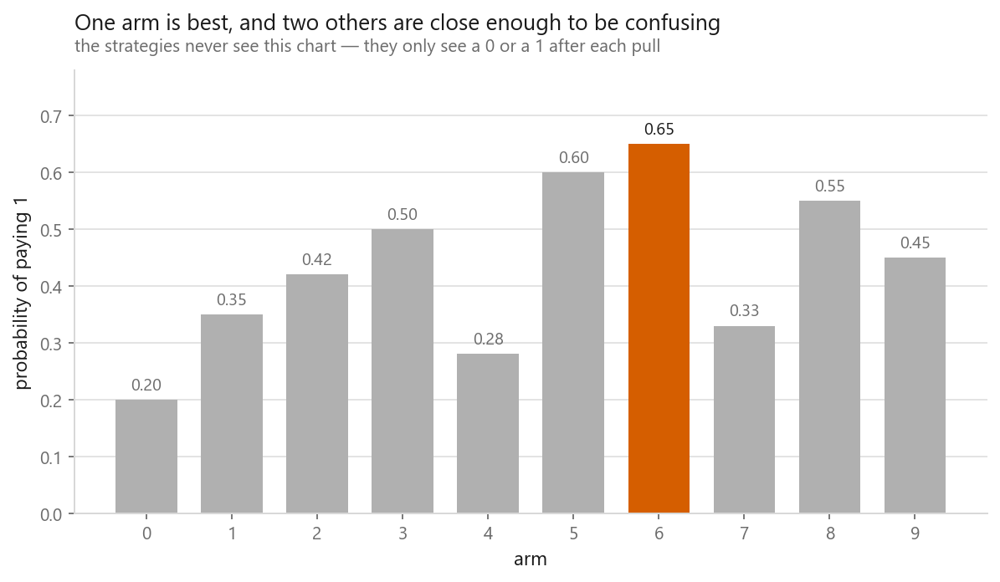
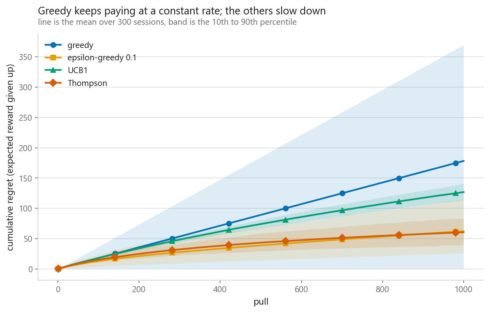
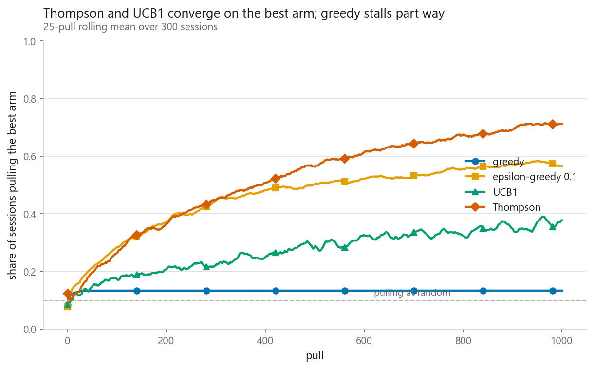
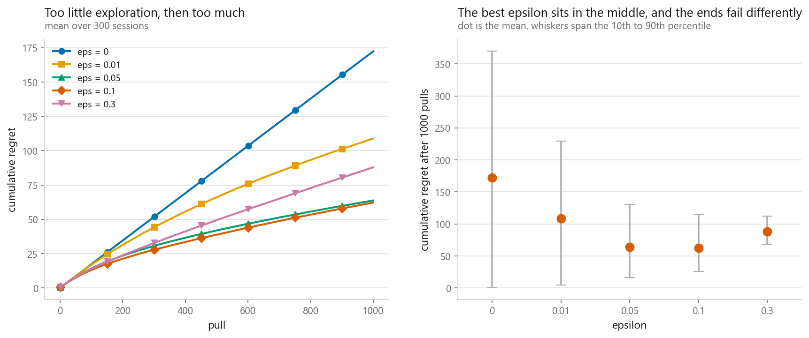
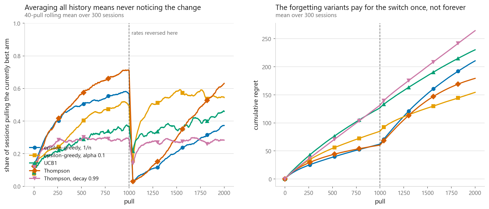

# Multi-armed bandits

### Ten slot machines, a thousand pulls, and no way to learn without paying for it

**[Open the notebook](notebook.ipynb)** · Part 11, Reinforcement learning ·
Made by [Elyes Lounissi](https://www.linkedin.com/in/elyes-lounissi/)

| | |
|---|---|
| **What you will learn** | Why exploring costs you money, what regret measures that reward does not, and four ways to trade the two off — greedy, epsilon-greedy, UCB1 and Thompson sampling — each written from scratch in NumPy |
| **You should already know** | Python and NumPy. A rough idea of what a probability distribution is. No prior reinforcement learning needed |
| **Datasets** | None. A Bernoulli bandit simulated from scratch — no gym, no RL library |
| **Runtime** | Under two minutes on a laptop CPU |

---

## The number that should scare you

Thompson sampling wins the standard benchmark: 60.42 mean regret against greedy's
178.16. Then I reversed the arms' payout rates halfway through the session, without
warning, and measured the share of sessions sitting on the best arm.

| Strategy | Just before the switch | 200 pulls after |
|---|---|---|
| Epsilon-greedy, 1/n averaging | 0.57 | **0.10** |
| Thompson, standard | **0.71** | **0.11** |
| Epsilon-greedy, α = 0.1 | 0.50 | **0.48** |

0.10 with ten arms is exactly what pulling at random gives you. The two best
strategies on the stationary benchmark were, 200 pulls after the world changed,
**worse than a coin**, because both were confidently defending an arm that had
stopped being good. The fix is one line — a constant step size instead of 1/n —
and the stationary benchmark had no way to tell you that you needed it.

## The setup

Ten arms, each paying 1 or 0. Arm 6 is best at 0.65, and arm 5 sits at 0.60, close
enough that separating them takes many pulls. 1,000 pulls per session, 300
independent sessions, all four strategies against the same seeded bandit so the
comparison is paired.

I score **regret**, the expected reward given up: Σ (p\* − p at the arm pulled).
Total reward mostly measures how generous the machines happen to be. Regret
measures the strategy. It starts at zero, never decreases, and stops growing once
the strategy has worked out the answer. Linear regret is the failure signature.

## The four strategies

**Greedy** pulls the highest estimate. **Epsilon-greedy** pulls at random with
probability ε. **UCB1** ranks arms by Q(a) + c·√(log t / N(a)) — the arm's best
plausible case, so a pull is either profitable or informative. **Thompson** draws
one sample from each arm's Beta posterior and pulls the highest draw, which means
each arm is pulled with exactly the probability that it is the best arm.

The last two shrink their own exploration automatically, and here is why. UCB1's
bonus at step 1000, by how often the arm has been pulled:

| Pulls of this arm | Bonus added to Q |
|---|---|
| 1 | 3.717 |
| 16 | 0.929 |
| 256 | 0.232 |
| 1024 | 0.116 |

Thompson's posterior does the same job through its width:

| Wins | Losses | Posterior mean | Posterior sd |
|---|---|---|---|
| 0 | 0 | 0.500 | **0.289** |
| 11 | 7 | 0.600 | 0.107 |
| 60 | 40 | 0.598 | 0.048 |
| 390 | 210 | 0.650 | **0.019** |

Broad posteriors cross each other, so the draws come out in a different order every
step and the strategy wanders. Narrow ones stop crossing, and the wandering stops
on its own. Nobody tunes that.

## Regret after 1,000 pulls

| Strategy | Mean regret | 10th pct | 90th pct | On best arm, last 100 pulls |
|---|---|---|---|---|
| greedy | 178.16 | **0.55** | **369.52** | 0.13 |
| epsilon-greedy 0.1 | 62.26 | 26.14 | 114.92 | 0.57 |
| UCB1 | 126.75 | 113.94 | 140.56 | 0.37 |
| Thompson | **60.42** | 39.35 | 83.29 | **0.71** |

Read greedy's percentiles, not its mean. Its 10th percentile is 0.55 and its 90th
is 369.52 — a **672× spread**. Those sessions are bimodal: some lock onto the best
arm immediately and pay almost nothing, the rest lock onto something poor and bleed
at a fixed rate all session. The mean sits in a gap between two outcomes that
mostly do not happen.

The lock-in, measured directly:

| | Distinct arms pulled per session, out of 10 |
|---|---|
| greedy | **2.2** |
| epsilon-greedy 0.1 | 10.0 |
| UCB1 | 10.0 |
| Thompson | 10.0 |

Greedy settled on the best arm in **13%** of sessions and on a below-median arm in
**39%**. Every estimate starts at 0 and Bernoulli rewards are never negative, so
the first arm to pay once beats nine untouched arms forever. The trap is not that
greedy chooses badly — it is that its choice destroys the evidence that would have
corrected it.

## Who is on the best arm

Share of sessions pulling the best arm at the final pull: greedy **13%**,
epsilon-greedy 0.1 **57%**, UCB1 **37%**, Thompson **70%**.

Epsilon-greedy has a ceiling it cannot pass, 1 − ε(k−1)/k, which is 0.91 here. Even
a strategy that has completely solved the problem still throws ε of its pulls away.
UCB1 starts badly on purpose: its first 10 pulls are a forced round robin, and the
√(log t / n) bonus keeps dragging it back to arms it has dismissed. It is buying
information early, and on a longer horizon that trade pays.

## Sweeping epsilon

| ε | Mean regret | Spread (90th − 10th) |
|---|---|---|
| 0 (plain greedy) | 172.4 | **369.0** |
| 0.01 | 108.9 | 224.4 |
| 0.05 | 63.7 | 114.2 |
| 0.1 | **62.3** | 88.8 |
| 0.3 | 87.9 | **44.4** |

Both ends fail, and they fail differently. At ε = 0 the mean is bad because the
variance is enormous — 369.0 of spread. At ε = 0.3 the mean is bad and the spread
is the smallest on the table at 44.4, because every session reliably wastes the
same fixed share of its pulls. One end gambles; the other end pays a subscription.

Where the curve bottoms out depends on the horizon, which is why decaying epsilon
is the usual practical answer and why UCB1 and Thompson need no dial here at all.

## When the world changes underneath you

2,000 pulls, rates reversed at pull 1,000. The best arm moves from arm 6 to arm 3,
both paying 0.65; the old best now pays 0.50. Nothing announces the change.

| Strategy | Before | 200 after | At the end | Regret in the second half |
|---|---|---|---|---|
| epsilon-greedy, 1/n | 0.57 | 0.10 | 0.36 | 148.35 |
| epsilon-greedy, α 0.1 | 0.50 | **0.48** | **0.54** | **69.31** |
| UCB1 | 0.37 | 0.33 | 0.45 | 103.52 |
| Thompson | **0.71** | 0.11 | 0.62 | 118.91 |
| Thompson, decay 0.99 | 0.29 | 0.27 | 0.28 | 132.81 |

The α = 0.1 version was the *worst* of the three epsilon-greedy-family entries
before the switch, at 0.50, and the best after it. It cut second-half regret by
79.04 against the 1/n version, more than halving it.

That is the whole lesson. 1/n weights every reward an arm ever produced equally, so
after 800 pulls a fresh reward moves the estimate by one part in 800 — and the arm
the strategy trusts most is the arm whose estimate is hardest to move, exactly
backwards from what the situation needs. A constant α makes the estimate an
exponentially weighted average with a memory of about 1/α pulls. It never fully
converges, and on a fixed problem that costs you precision. You are buying the
ability to change your mind.

Note also that Thompson with decay 0.99 forgot too fast, sitting at 0.28 even
before the switch. The dial has a wrong answer in both directions too.

## Cheat sheet

| | |
|---|---|
| **Use it when** | Each choice pays off immediately and does not change what comes next: A/B tests, ad slots, treatment arms, routing a request to a model |
| **Avoid it when** | Actions have consequences that arrive later. That needs [MDPs](../03-markov-decision-processes/) and [Q-learning](../04-q-learning/) |
| **Greedy** | Never. It stops collecting the evidence that would correct it |
| **Epsilon-greedy** | One line, works, linear regret. Decay ε and it becomes respectable |
| **UCB1** | Deterministic, one dial, logarithmic regret. Wants bounded rewards and a fixed world |
| **Thompson** | Usually the best of the four, handles delayed and batched feedback, needs a conjugate prior or a sampler |
| **Non-stationary** | Replace 1/n with a constant step, or discount the posterior counts |
| **Watch out** | Report the spread across runs, not the mean. And regret against a fixed benchmark is meaningless once the benchmark moves |

---

Made by **Elyes Lounissi** ·
[LinkedIn](https://www.linkedin.com/in/elyes-lounissi/) ·
[pilot.tun@gmail.com](mailto:pilot.tun@gmail.com)

Back to [Part 11](../) · [the curriculum](../../CURRICULUM.md) · [the book](../../README.md)

`#ReinforcementLearning` `#MultiArmedBandit` `#ThompsonSampling` `#UCB`
`#ExploreExploit` `#MachineLearning` `#Python` `#NumPy` `#MLTutorial`
`#LearnMachineLearning`
