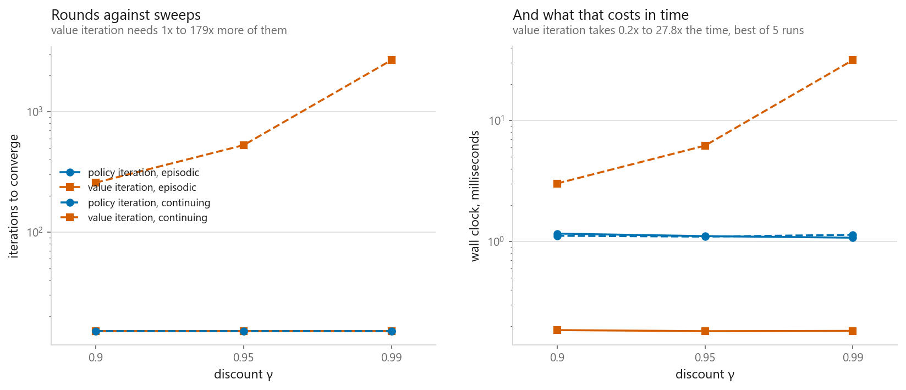
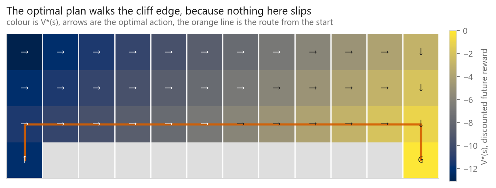
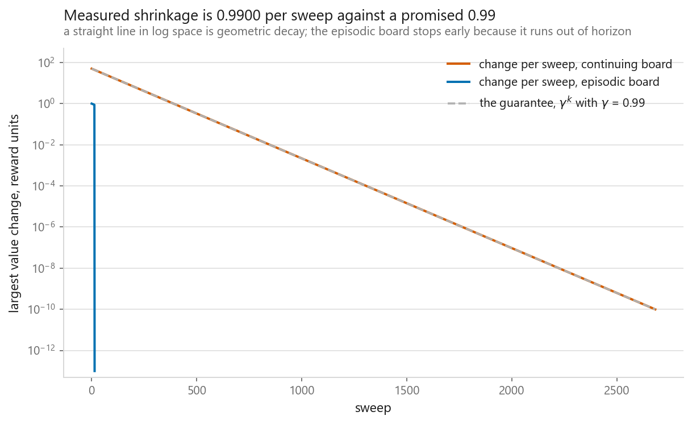
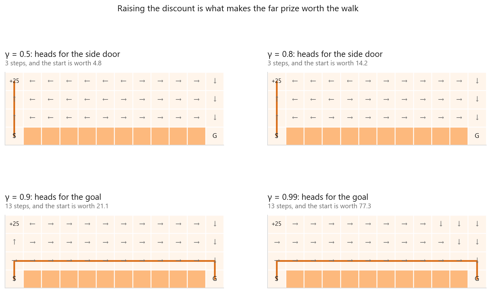
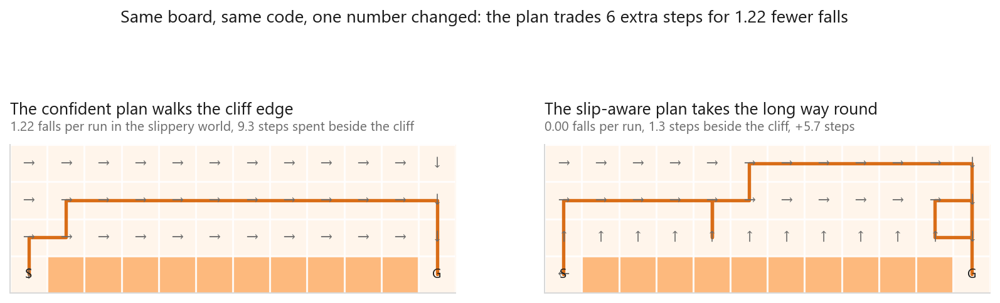

# Markov decision processes

### Planning when you already have the model, and an agent that presses into a wall on purpose

**[Open the notebook](notebook.ipynb)** · Part 11, Reinforcement learning ·
Made by [Elyes Lounissi](https://www.linkedin.com/in/elyes-lounissi/)

| | |
|---|---|
| **What you will learn** | The MDP formalism written out as arrays you can print, the difference between evaluating a policy and improving one, and why policy iteration and value iteration trade places depending on the board |
| **You should already know** | Linear algebra to the level of solving `Ax = b`. No RL background needed: this is the chapter the rest of Part 11 relies on |
| **Environment** | A 4x12 cliff grid, built as an explicit `P` of shape (48, 4, 48) and `R` of shape (48, 4). Nothing is sampled, everything is solved |
| **Runtime** | A few seconds |

---

Where this sits in Part 11: [11-01](../01-the-setup/) showed that actions change
the state you face next, and [11-02](../02-multi-armed-bandits/) took that away to
study exploration on its own. This chapter puts the state back and hands you the
transition model, so nothing has to be explored at all. Everything from
[11-04](../04-q-learning/) onwards takes the model away again, and every
difficulty those chapters have is a consequence of not having what this one is
given.

## The result I would lead with

Two exact planners on the same board, both finding the same optimal policy, timed
on the episodic grid and on a continuing version where the goal is a lap marker
rather than an ending:

| Board | Gamma | Policy iteration | Value iteration | Value gap |
|---|---|---|---|---|
| episodic | 0.90 | 15 rounds, 1.73 ms | 15 sweeps, **0.30 ms** | 1.8e-15 |
| episodic | 0.99 | 15 rounds, 1.74 ms | 15 sweeps, **0.30 ms** | 3.6e-15 |
| continuing | 0.90 | **15 rounds, 1.38 ms** | 257 sweeps, 3.11 ms | 1.0e-10 |
| continuing | 0.95 | **15 rounds, 1.62 ms** | 527 sweeps, 10.11 ms | 1.5e-10 |
| continuing | 0.99 | **15 rounds, 1.57 ms** | 2,682 sweeps, **49.34 ms** | 6.2e-10 |

Policy iteration takes 15 rounds on every row. It does not care about gamma at
all, because each round solves the linear system exactly and there is nothing
left over to converge. Value iteration goes from 15 sweeps to 2,682 across the
same rows, and ends up **31x slower** at gamma = 0.99.

Value iteration is the one everybody reaches for, and on the episodic board it
deserves that: it is 6x faster because it never solves a linear system. Move the
absorbing goal and the ordering flips completely.



## The board, printed

```
 . . . . . . . . . . . .
 . . . . . . . . . . . .
 . . . . . . . . . . . .
 S # # # # # # # # # # G
```

48 states, 4 actions. There are **7.92e+28 deterministic policies** on this grid
and exactly **one linear solve** scores any of them, which is the whole argument
for having a model. The notebook checks `P` sums to one along every row before
trusting a single result from it.

## Policy iteration looks broken until round 13

| Round | V(start) | Actions changed |
|---|---|---|
| 1 | -100.0000 | 1 |
| ... | -100.0000 | 3 |
| 12 | -100.0000 | 3 |
| 13 | **-12.2479** | 2 |
| 15 | -12.2479 | **0** |

For twelve rounds the value at the start does not move. Three actions change
every round and the number on screen is identical. Then it resolves in one step.

The greedy step is repairing the policy from the goal backwards, and the start
square cannot see any of that repair until the chain of improvements reaches it.
Watching V(start) alone would have told you the algorithm was stuck. Watching the
action-change count tells you it was working the whole time, and that count
hitting zero is the termination proof, since a finite policy space plus strict
improvement means it cannot cycle.



## The contraction bound is a worst case



The textbook rate says the error shrinks by gamma each sweep. On the episodic
board it does not: value iteration converges **exactly in 15 sweeps**, gap
3.55e-15, because each sweep carries reward back one square and the longest
route is 15 squares long. Termination beats contraction.

The continuing board is where the bound applies, and there it is nearly perfect:

| | |
|---|---|
| Predicted contraction factor | 0.99 |
| Measured, median across sweeps | 0.990000 |
| Sweeps the bound predicts | 2,681 |
| Sweeps actually taken | **2,682** |

One sweep off. The bound is not conservative here, it is exact, because there is
no absorbing state to short-circuit it.

## The discount did not do what I expected



I assumed a low discount would send the agent along the short dangerous route and
a high one would pay for safety. It does not, at any gamma:

```
gamma 0.5  : route is 13 steps, 10 of them on the row directly above the cliff
gamma 0.99 : route is 13 steps, 10 of them on the row directly above the cliff
```

The reason is worth saying plainly: **the cliff penalty is immediate**.
Discounting only shrinks costs that lie in the future, so an impatient agent
fears the cliff exactly as much as a patient one. To show gamma changing a route
at all, the notebook adds a second exit worth 25 near the start against a goal
worth 100. The agent takes the near exit up to gamma = 0.88 and switches to the
far goal at **gamma = 0.90**.

Gamma trades near rewards against far ones. It is not a risk dial.

## The best thing on this board

Adding a 20% slip and re-solving, the slip-aware plan's first move from the start
square is **left, into the wall**.

| Action pressed | P(over the cliff) | P(move up) |
|---|---|---|
| up | 0.10 | **0.80** |
| right | **0.80** | 0.10 |
| down | 0.10 | 0.00 |
| **left** | **0.00** | 0.10 |

Walking into a wall does nothing, which is why my first attempt at drawing this
policy's route produced eighty steps that never left the starting square. Under
slip it does something no other action can. The intended move is absorbed by the
wall, and the two ways to slip off it are up and down: down is another wall, up
is free progress. Pressing into the wall is the only action with **no chance at
all** of reaching the cliff.

Pressing up climbs eight times more often per attempt, and risks the cliff every
attempt. A fall costs a hundred against a step's one. At those prices the agent
would rather stand at the wall and wait to be pushed.

Nothing in the code knows what a wall is. It fell out of a lookahead over `P`.



| Plan run in the slippery world | Mean steps | Mean falls | Steps beside the cliff |
|---|---|---|---|
| cliff-edge plan | **24.43** | 1.22 | 9.30 |
| slip-aware plan | 30.16 | **0.00** | 1.33 |

These are the only sampled numbers on this page, over 2,000 rollouts each, so the
notebook prints the standard error of every gap beside it. All three clear their
own error bar by a wide margin, which is what makes the table worth reading as a
difference rather than as two lists.

**The confident plan is faster.** It reaches the goal in about six fewer steps,
because the cliff edge is the short way and most of the time it works. It also
falls 1.22 times per run, and every fall costs a hundred and returns the agent to
the start. Judged on step count you would pick the wrong plan; the value at the
start square is where the difference shows up, at -25.48 against -129.10.

If those two policies look familiar, they are the same split
[11-04](../04-q-learning/) produces between Q-learning and SARSA, reached from
the opposite direction: there from the agent's own exploration, here from noise
written into `P`.

## Cheat sheet

| | |
|---|---|
| **Use it when** | You have `P` and `R`, or can build them. Then you never have to sample |
| **Policy iteration** | Few, expensive rounds. Insensitive to gamma. Wins when gamma is near 1 |
| **Value iteration** | Many, cheap sweeps. Wins when the board terminates or gamma is small |
| **They agree** | Same policy, value gap 6.2e-10 at worst. Pick on cost, not on answer |
| **Gamma** | Trades near rewards against far ones. It will not make an agent cautious |
| **Watch out** | `P` folds a cliff step into a jump back to the start, so cliff risk read off `P` reports zero. Measure risk on the transition, not the destination |
| **Sanity check** | Every row of `P` sums to one, before you trust anything downstream |
| **Next** | [Q-learning](../04-q-learning/), which is this chapter with `P` taken away |

---

If this chapter was useful, a star on the repository helps other people find it.
The code is yours to use, copy and adapt in your own work, no permission needed.

Made by **Elyes Lounissi** ·
[LinkedIn](https://www.linkedin.com/in/elyes-lounissi/) ·
[pilot.tun@gmail.com](mailto:pilot.tun@gmail.com)

Back to [Part 11](../) · [the curriculum](../../CURRICULUM.md) · [the book](../../README.md)

`#ReinforcementLearning` `#MarkovDecisionProcess` `#DynamicProgramming`
`#ValueIteration` `#PolicyIteration` `#BellmanEquation` `#MachineLearning`
`#MLTutorial` `#LearnMachineLearning` `#AI`
