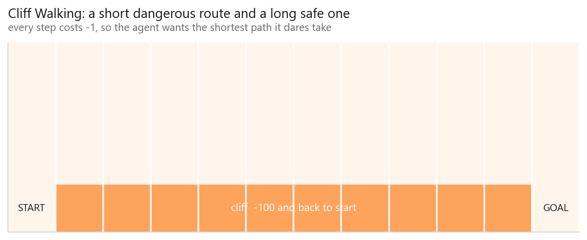
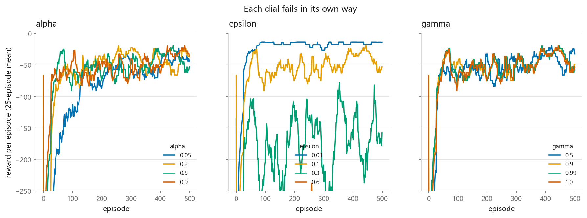
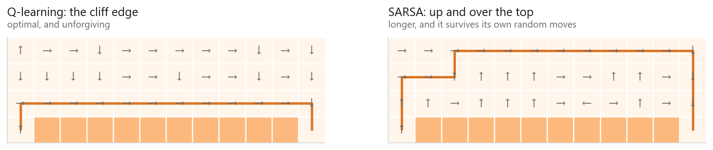
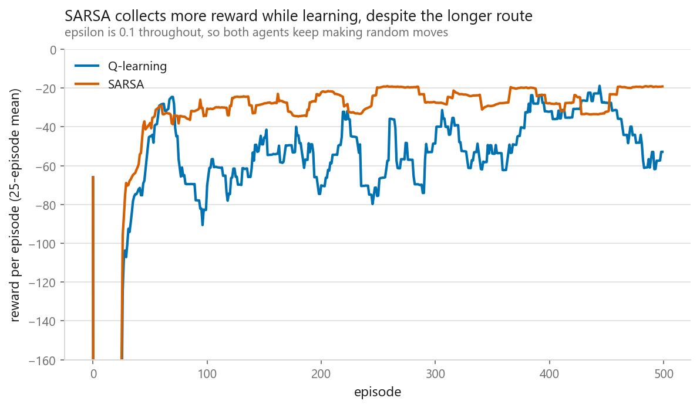

# Q-learning

### Learning to walk along a cliff without being told how

**[Open the notebook](notebook.ipynb)** · Part 11, Reinforcement learning ·
Made by [Elyes Lounissi](https://www.linkedin.com/in/elyes-lounissi/)

| | |
|---|---|
| **What you will learn** | How an agent learns from reward alone, what the Bellman equation does, how to write Q-learning in thirty lines, and the one-word difference from SARSA that changes the route |
| **You should already know** | Python and NumPy. No prior reinforcement learning needed |
| **Environment** | Cliff Walking, built from scratch in the notebook, no `gym` dependency |
| **Runtime** | Under a minute on a laptop CPU |

---

## The idea

Everything else in this book learns from answers. Reinforcement learning has
none. An agent acts, the world returns a number, and that is all it gets. Nobody
says which action was correct.

The problem in one sentence: **you find out a decision was bad long after you
made it.** Walking off a cliff on step 14 was caused by turning the wrong way on
step 3, and the reward has to travel back that far.

A 4 × 12 grid. Every step costs −1. The cliff costs −100 and throws you back to
the start. There is a short dangerous route along the edge and a long safe one
over the top, and that tension is the whole notebook.

## The maths

$Q(s,a)$ is the total future reward expected from taking action $a$ in state $s$.
Know it, and acting well is just `argmax`. The Bellman equation says $Q$ must be
self-consistent:

$$Q(s, a) = r + \gamma \max_{a'} Q(s', a')$$

The agent cannot solve this directly, so it plays and nudges its estimate toward
each observed surprise:

$$Q(s,a) \leftarrow Q(s,a) + \alpha\Big[r + \gamma \max_{a'} Q(s',a') - Q(s,a)\Big]$$

## The dials, and how each fails

**Alpha** too small barely moves off zero in 500 episodes; too large and each
update overwrites the last. **Epsilon** at 0.01 means the agent keeps the first
route it finds; at 0.6 it acts randomly regardless of how good its table gets.
**Gamma** at 0.5 makes a reward 13 steps away worth $0.5^{13}$, effectively
nothing, so it cannot plan a route at all.

## The result worth slowing down for

SARSA differs by one term: it bootstraps from the action it is **actually going
to take** rather than the best available. That sounds like a technicality.

| | Route | Reward, last 100 episodes |
|---|---|---|
| Q-learning | **13 steps** (optimal) | −38.8 |
| SARSA | 17 steps | **−23.9** |

**Q-learning found the better policy and collected the worse reward.**

Both agents explore at $\varepsilon = 0.1$, so one move in ten is random.
Q-learning's route hugs the cliff, where one random step down costs −100. SARSA's
update includes that exploration in its estimates, so it learns those squares are
dangerous *for an agent that sometimes moves at random*, which is what it is. It
climbs to the top row and pays four extra steps for the clearance.

The names are **off-policy** (Q-learning evaluates the greedy policy while
following an exploratory one) and **on-policy** (SARSA evaluates what it actually
runs).

Which is right depends on whether the exploration is real. Training in simulation
and deploying greedily? Q-learning's answer. Agent that will keep behaving
randomly in the world: noisy actuators, a live experiment? Then falling off the
cliff is a real cost and SARSA is being correct, not timid.

## Cheat sheet

| | |
|---|---|
| **Use it when** | The state space is small enough to enumerate and you can simulate episodes cheaply |
| **Avoid it when** | States are continuous or enormous: that is what [DQN](../06-deep-q-networks/) is for |
| **Off-policy** | Yes, so it can learn from replayed or borrowed experience. DQN depends on this |
| **Main dials** | `alpha` 0.1 to 0.5, `gamma` 0.9 to 1.0, `epsilon` 0.1 often decayed toward 0 |
| **Guarantee** | Converges to optimal $Q$ given enough visits to every state-action pair and a decaying alpha |
| **Watch out** | The `max` makes it optimistic, so it overestimates under noise. Double Q-learning fixes this |

---

Made by **Elyes Lounissi** ·
[LinkedIn](https://www.linkedin.com/in/elyes-lounissi/) ·
[pilot.tun@gmail.com](mailto:pilot.tun@gmail.com)

Back to [Part 11](../) · [the curriculum](../../CURRICULUM.md) · [the book](../../README.md)

`#ReinforcementLearning` `#QLearning` `#SARSA` `#MachineLearning` `#Python`
`#RL` `#BellmanEquation` `#MLTutorial` `#LearnMachineLearning` `#AI`
