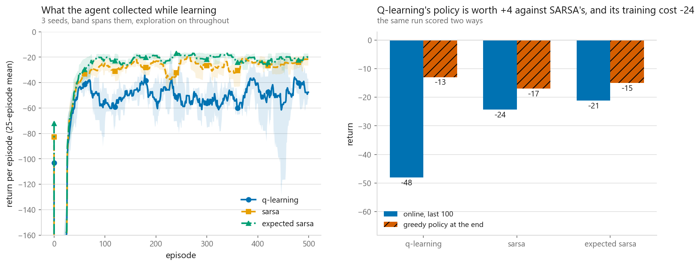
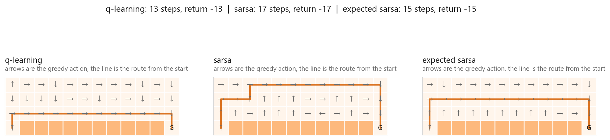
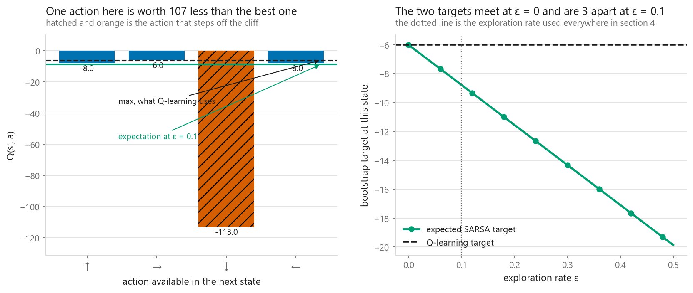
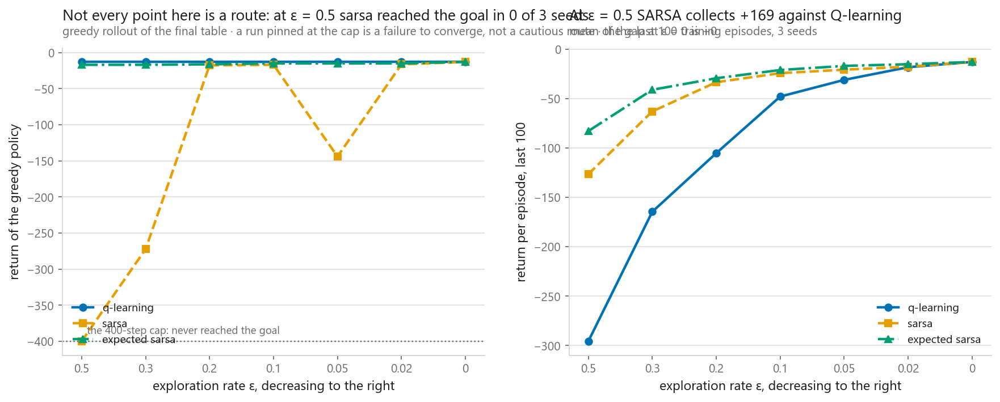
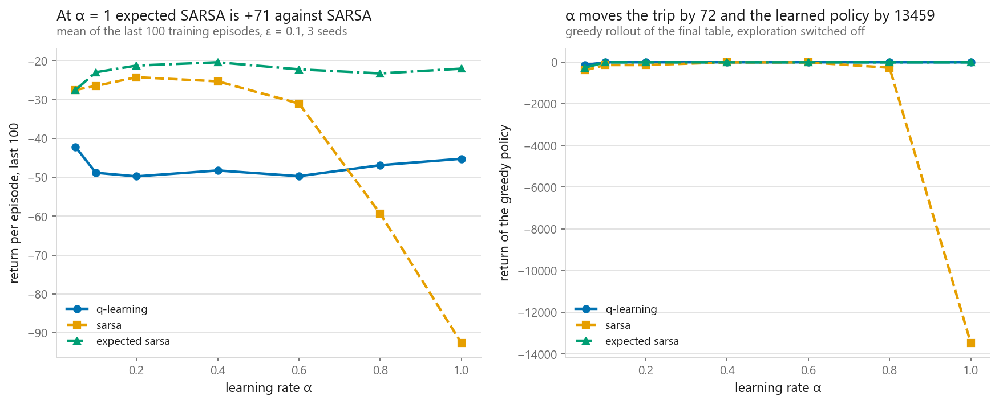

# SARSA

### One term in the update, and the agent with the best policy was the worst agent to be

**[Open the notebook](notebook.ipynb)** · Part 11, Reinforcement learning ·
Made by [Elyes Lounissi](https://www.linkedin.com/in/elyes-lounissi/)

| | |
|---|---|
| **What you will learn** | What on-policy means as one term in one line of code, how to score the policy an agent learned separately from the reward it collected while learning it, why those two numbers disagree, what happens to the disagreement as exploration goes to zero, and why expected SARSA is usually the one to reach for |
| **You should already know** | [Q-learning](../04-q-learning/): the temporal-difference update, epsilon-greedy, and the cliff grid |
| **Environment** | The 4 by 12 cliff grid from [11-03](../03-markov-decision-processes/), rebuilt from its transition model. No `gymnasium`, no RL library |
| **Runtime** | Around two minutes on a laptop CPU. The notebook prints the seconds each sweep took |

---

Where this sits in Part 11: [11-02](../02-multi-armed-bandits/) had actions and no
state, [11-03](../03-markov-decision-processes/) had state and handed you the
model, [11-04](../04-q-learning/) took the model away and learned by walking. This
chapter is about the thing 11-04 could not tell you, which is whether the number it
reported describes the policy you will deploy or the policy it was running while it
learned.

## The result I would lead with

Three methods, three seeds, 500 episodes, everything shared except the bootstrap
term. Scored two different ways on the same runs:

| Method | Collected while learning | Last 100 episodes | Greedy policy at the end | Steps |
|---|---|---|---|---|
| Q-learning | **-55.1** | -48.0 | **-13.0** | 13 |
| SARSA | -34.1 | -24.4 | **-17.0** | 17 |
| expected SARSA | **-28.6** | **-21.2** | -15.0 | 15 |

**Best policy learned: Q-learning. Worst agent to be while learning: Q-learning.
Same runs, opposite answers.**

Read that table with the seed spread the notebook prints beside it. Q-learning
against either on-policy method is a gap of tens of points against a spread of a
few, so those two comparisons are solid. SARSA against expected SARSA in the online
column is a gap of about three points on three seeds, and the notebook prints the
verdict on that pair rather than letting the bold text decide it. The place those
two genuinely separate is the learning-rate sweep at the bottom of this page.

The greedy column carries no sampling error at all. The environment is
deterministic and the policy is frozen, so one rollout is the exact answer.

Q-learning's -13.0 is not merely good, it is the best this grid allows. Priced
before anything trained, the cliff-edge route is 13 steps and -13, the route one
row up is 15 steps and -15, so the edge is worth exactly +2 to an agent that
never makes a random move. Q-learning found the edge.

Then it walked that edge with one move in ten chosen at random, beside squares
where a single wrong step costs 100 and sends it back to the start, and paid
**-55.1** for the privilege. It learned the better policy and was the worst
agent to be for the entire training run.

If you only plot the learning curve you conclude Q-learning is the worst method
here. If you only evaluate the final policy you conclude it is the best. Both
halves are right, and the disagreement is far larger than anything three seeds
could invent.

One detail that does not fit the usual telling. SARSA is described as learning
"the safe route", meaning the row above the cliff, which is priced at -15. SARSA
learned **-17**, two steps worse than that route. Expected SARSA is the one that
landed exactly on -15.

## The whole difference, on one square

Take a trained table and look at state 30, row 2 column 6, directly above the
middle of the cliff. One of its four actions steps off:

| Action | Lands on the cliff | Q(s', a) | Probability at ε = 0.1 |
|---|---|---|---|
| up | no | -7.979 | 0.025 |
| right | no | **-6.000** | 0.925 |
| down | **yes** | **-112.999** | 0.025 |
| left | no | -7.999 | 0.025 |

| Method | Bootstraps from | Value |
|---|---|---|
| Q-learning | `max Q(s', a')` | **-6.000** |
| expected SARSA | `E_π[Q(s', a')]` | **-8.774** |
| SARSA | one draw | -6.000 with probability 0.925, otherwise one of the rest, worst -112.999 |

**The gap between the optimistic target and the on-policy one is 2.774.** That is
the entire difference between the algorithms, expressed as a number, on the
square where it matters most.

SARSA is not being cautious. Its target contains the action the agent is
genuinely about to take, so what it converges to is the value of an agent that
keeps stepping sideways at random. For that agent a square beside a cliff really
is worth less. It is answering a different question correctly, not the same
question timidly.

## At ε = 0 they are not similar, they are identical

The methods are one family with ε as the dial. As ε goes to zero, expected
SARSA's weighted sum collapses to `max Q(s', a')`, which is Q-learning's target
exactly.

The notebook checks this the strict way, since all three consume the random
stream identically:

| | |
|---|---|
| Q-learning vs SARSA, tables bit-identical at ε = 0 | **True** |
| Q-learning vs expected SARSA, bit-identical | **True** |
| largest difference anywhere in the tables | **0.0e+00** |

All three then produce a 13-step, -13 route, and mean -13.0 over the last 100
training episodes.

Worth noting what does the exploring in that run, since nothing is exploring on
purpose. The table starts at zero and every reward is negative, so an unvisited
action always looks better than a visited one. **Optimistic initialisation is the
entire exploration strategy at ε = 0**, and on a 48-state grid it is enough.

## The epsilon sweep, which is messier than the prediction

The prediction was clean: if SARSA's behaviour comes from the exploration it
expects to keep doing, taking the exploration away should take the behaviour away.
Greedy policy return, meaned over three seeds:

| ε | Expected SARSA | Q-learning | SARSA |
|---|---|---|---|
| 0.00 | -13.0 | -13.0 | -13.0 |
| 0.02 | -15.0 | -13.0 | -16.3 |
| 0.05 | -15.0 | -13.0 | **-144.0** |
| 0.10 | -15.0 | -13.0 | -17.0 |
| 0.20 | -16.3 | -13.0 | -17.7 |
| 0.30 | -17.0 | -13.0 | **-272.3** |
| 0.50 | -17.0 | -13.0 | **-400.0** |

The prediction held for expected SARSA, which walks smoothly from -13.0 to -17.0
as exploration is turned up, and for Q-learning, which is **flat at -13.0 across
the whole sweep**, exactly as an off-policy method whose target never mentions π
should be.

SARSA did something else. At ε = 0.30 and 0.50 its greedy route runs 272 and 400
steps, and 400 is the step cap, meaning the learned policy does not reach the
goal at all. And it is not monotone: **-144.0 at ε = 0.05 sits between -16.3 at
0.02 and -17.0 at 0.10.**

I would not read the large values as caution taken too far. A policy that wanders
for 400 steps is not a safe route, it is a table that has not converged, and the
reason is in the target: at high ε, SARSA is bootstrapping from a single sampled
action that is random 50% of the time, so its updates carry the full variance of
the exploration policy. Expected SARSA averages that away and shows none of it,
in the column right beside it.

Three seeds is too few to say where the instability starts. What the row does
establish is that the difference between SARSA and expected SARSA is not a
rounding detail once ε is large.

## The learning rate, where expected SARSA earns its line of code

Return collected while learning, meaned over three seeds:

| α | Expected SARSA | Q-learning | SARSA |
|---|---|---|---|
| 0.05 | -27.6 | -42.2 | **-27.5** |
| 0.10 | -23.0 | -48.8 | -26.5 |
| 0.20 | -21.3 | -49.8 | -24.3 |
| **0.40** | **-20.4** | -48.3 | -25.4 |
| 0.60 | -22.3 | -49.7 | -31.0 |
| 0.80 | -23.3 | -46.9 | -59.4 |
| 1.00 | -22.1 | -45.2 | **-92.6** |

This environment is deterministic, so given Q the only thing that varies between
two identical transitions is which action SARSA happens to draw. Expected SARSA
removes exactly that, which here is the **only** source of noise in the update.

The curves say so at the top of the range. SARSA degrades from -24.3 at α = 0.20 to
**-92.6 at α = 1.00**, a factor of four, while expected SARSA moves between -20.4
and -23.3 across the same range and never thrashes. It costs a max and a mean over
four numbers.

At the bottom of the range the two are the same method as far as three seeds can
tell. SARSA reads -27.5 against expected SARSA's -27.6 at α = 0.05, which is a
tenth of a point and nothing at all, and the notebook prints the gap against the
seed spread at every learning rate so the row cannot be read as a win. That is what
the theory predicts: with a small step size the update barely moves, so an average
and a draw both get smoothed to the same place by sheer number of updates. The
sampling noise only matters once a single draw can move `Q(s,a)` most of the way to
its target.

So the claim to carry away is conditional. **Expected SARSA does not beat SARSA.
It lets you run a step size at which SARSA falls apart.** If you were going to use
a small step size anyway, the extra line of code bought nothing measurable here.

Q-learning is the worst row at every learning rate, and by margins nothing here
could invent. That is the leading table again from another angle: it is not failing
to learn, it is walking the cliff edge while it does.

## Cheat sheet

| | |
|---|---|
| **SARSA** | On-policy. Target `r + γQ(s', a')` with a' the action it will take. Converges to Q for the exploring policy |
| **Q-learning** | Off-policy. Target `r + γ max Q(s', a')`. Converges to Q* regardless of how it behaved |
| **Expected SARSA** | On-policy, target `r + γ E_π[Q(s', a')]`. Same expectation, sampling noise of a' removed |
| **They are one family** | Set the target policy in expected SARSA to greedy and you have written Q-learning. At ε = 0 all three tables came out bit-identical |
| **Use SARSA when** | The exploration or the action noise is still there at deployment and the mistake has a real cost |
| **Use Q-learning when** | You train in a simulator and deploy the argmax, or you learn from logged data. [DQN](../06-deep-q-networks/) depends on this |
| **Default to** | Expected SARSA, for the reason that survives three seeds: it was the only method still stable at α = 1.00. At small α it and SARSA are indistinguishable |
| **Before ranking** | Print the spread across seeds. Two of the three pairwise gaps here clear it easily and one does not |
| **Main dials** | `alpha`, `epsilon`, `gamma`. SARSA's greedy policy failed to reach the goal at ε ≥ 0.30 here |
| **Watch out** | Comparing an online learning curve against a final greedy evaluation and calling it one result. They are two, and they disagreed here |
| **Sanity check** | Evaluate the greedy policy with exploration off, separately, every time. Three lines, and it changes the conclusion |
| **Next** | [Deep Q-Networks](../06-deep-q-networks/), which keeps the `max` and replaces the table with a network |

---

If this chapter was useful, a star on the repository helps other people find it.
The code is yours to use, copy and adapt in your own work, no permission needed.

Made by **Elyes Lounissi** ·
[LinkedIn](https://www.linkedin.com/in/elyes-lounissi/) ·
[pilot.tun@gmail.com](mailto:pilot.tun@gmail.com)

Back to [Part 11](../) · [the curriculum](../../CURRICULUM.md) · [the book](../../README.md)

`#ReinforcementLearning` `#SARSA` `#QLearning` `#ExpectedSARSA`
`#TemporalDifference` `#OnPolicy` `#OffPolicy` `#CliffWalking` `#NumPy`
`#MachineLearning` `#MLTutorial` `#LearnMachineLearning` `#AI`
