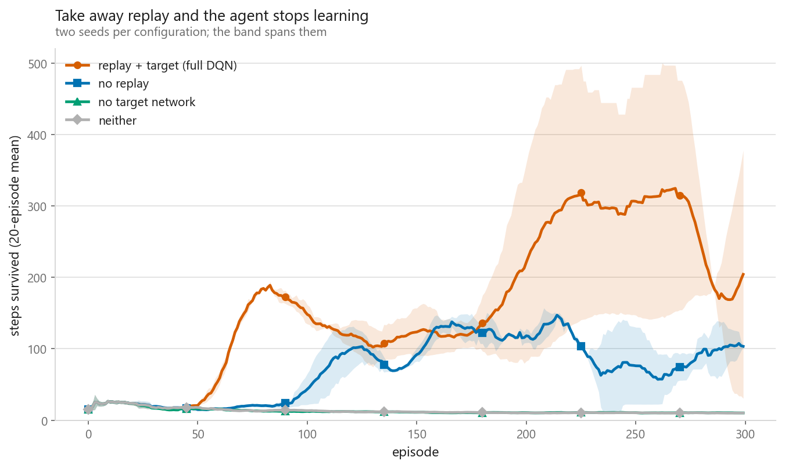
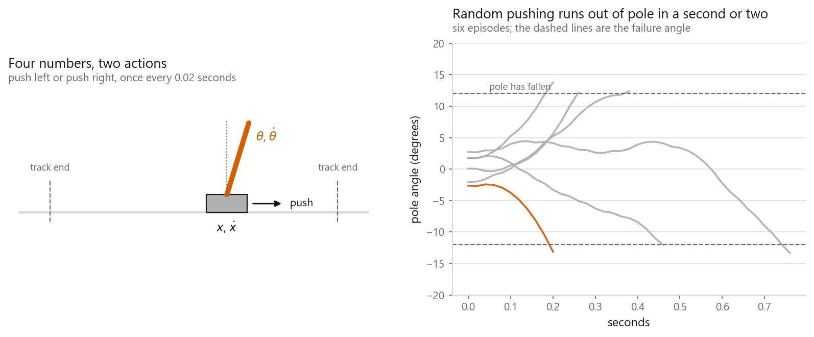
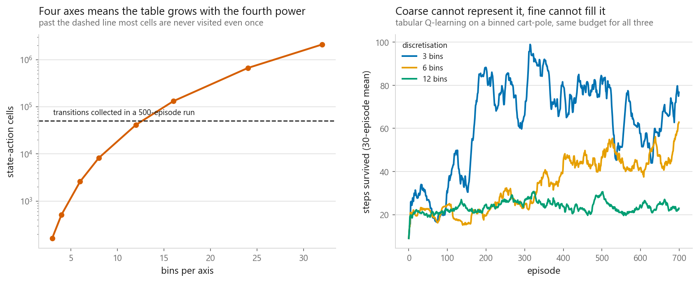
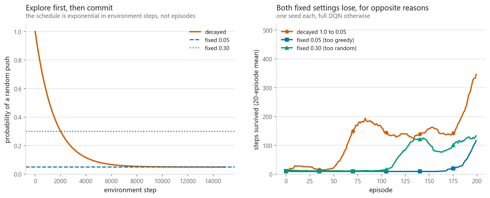
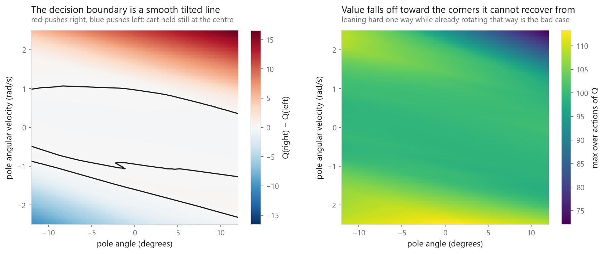

# Deep Q-Networks

### Throwing away the table, and an ablation that named a different culprit than I expected

**[Open the notebook](notebook.ipynb)** · Part 11, Reinforcement learning ·
Made by [Elyes Lounissi](https://www.linkedin.com/in/elyes-lounissi/)

| | |
|---|---|
| **What you will learn** | Why a Q table cannot survive a continuous state, how a network takes its place, and what experience replay and the target network are each worth — measured by removing them one at a time |
| **You should already know** | [Q-learning](../04-q-learning/), and enough PyTorch to read a three-layer network |
| **Environment** | Cart-pole, physics and all, written from scratch in the notebook. No `gymnasium` needed |
| **Runtime** | A few minutes on a laptop CPU (493 s for the full ablation) |

---

## The result I would lead with

Four configurations, two seeds each, 300 episodes, everything else identical. The
only difference is which repair is switched on.

| Config | First 50 episodes | Last 50 episodes | Best 20-episode window | Seed spread (last 50) |
|---|---|---|---|---|
| replay + target (full DQN) | 20.7 | **247.5** | 438.9 | 3.4 |
| no replay | 19.2 | **89.2** | 153.8 | 34.8 |
| no target network | 18.5 | **10.4** | 23.8 | 0.0 |
| neither | 19.8 | **10.2** | 24.0 | 0.3 |

**Removing the target network is what ends the run, not removing replay.** The
no-target agent finishes at 10.4 steps, below the 18.5 it started at, and
statistically indistinguishable from removing both repairs (10.2). It did not
learn and then destabilise. It never got off the ground.

The no-replay agent, by contrast, still climbed: 19.2 to 89.2, with a best window
of 153.8. That is a third of the full agent's score and nearly five times its own
starting point. It is damaged, not dead.

The seed spread column says the same thing from the other side. The unstable
configuration is **no replay, at 34.8 spread between seeds**. The no-target runs
agree with each other perfectly — spread 0.0 — because both seeds sat flat.

If you take one operational rule from this notebook: when a DQN never leaves its
starting return, check that the target network is actually frozen before you
touch anything else.

## Why the table runs out

Four real numbers in, two actions out. The episode ends at 12 degrees of lean or
2.4 of track. A random policy survives `[10, 19, 23, 10, 38, 13]` steps.

The obvious repair is to bin each axis. Four axes means the count is the bin
count raised to the fourth power:

| Bins per axis | Boxes | Table cells |
|---|---|---|
| 3 | 81 | 162 |
| 6 | 1,296 | 2,592 |
| 12 | 20,736 | 41,472 |
| 32 | 1,048,576 | 2,097,152 |

A 500-episode run collects about 50,000 transitions in total, so most of the
larger tables can never be filled.

| Bins per axis | Cells | Ever visited | Last-100 mean length |
|---|---|---|---|
| 3 | 162 | 70 (43.2%) | **63.6** |
| 6 | 2,592 | 150 (5.8%) | 52.4 |
| 12 | 41,472 | 397 (1.0%) | 23.3 |

The coarsest table won on this budget. Three bins per axis is too crude to
represent a good policy in principle, and it still beat 12 bins by 2.7x, because
the fine table had 1.0% of its cells visited even once and the rest were still at
their initial value when the budget ran out. Within this budget, coverage
dominated resolution outright.

## A network instead

The network has **4,610 parameters**. The 12-bin table above had 41,472 numbers
in it. The gain is not memory, it is that nearby states share weights.

The update becomes a regression:

$$y = r + \gamma (1 - \text{done}) \max_{a'} Q_{\phi^-}(s')[a'], \qquad
\mathcal{L}(\phi) = \big(Q_\phi(s)[a] - y\big)^2$$

The $\phi^-$ is a frozen copy of the weights. That copy is the thing the ablation
above says you cannot do without — fitting a target computed from the weights you
are updating is regression against a label that runs away, and here the values
spiral instead of converging.

## Epsilon has to decay

| Schedule | Last-50 mean |
|---|---|
| Decayed 1.0 to 0.05 | **234.0** |
| Fixed 0.05 (too greedy) | 58.1 |
| Fixed 0.30 (too random) | 113.8 |

The greedy setting commits to whatever the untrained network happened to prefer.
The random setting keeps learning and then throws the pole away doing it. The
greedy failure is the worse of the two here, by roughly 2x.

## The max inflates values

Take actions genuinely worth the same, add independent noise, take the max:

| Actions | True value | Max of one estimate | Double estimate |
|---|---|---|---|
| 2 | 0.0 | 0.565 | -0.003 |
| 4 | 0.0 | 1.033 | 0.003 |
| 10 | 0.0 | **1.538** | -0.001 |

Every true value is zero, so column three is pure bias and it grows with the
action count. Double DQN removes essentially all of it by letting the live
network choose the action and the frozen one price it — a one-line change, since
both networks are already there.

## What the network learned

Holding the cart still at the centre and sweeping the two pole variables, the
decision boundary is a tilted line: a pole leaning right is only a problem if it
is also rotating right, and the slope is the exchange rate between lean and
rotation. A table would have needed a separate number for every box along that
line and no way to know they belonged together.

One caveat the notebook prints and does not discuss. Running that same network
greedily with exploration off gives `[11, 9, 9, 11, 11, 12, 11, 11, 12, 10]` —
**mean 10.7 of a possible 500**, worse than the random policy above. The surface
is a snapshot of a network taken at the end of training, and its shape is more
readable than its performance. Treat the picture as an illustration of what
function approximation can represent, not as evidence that this particular
checkpoint balances the pole.

## Cheat sheet

| | |
|---|---|
| **Use it when** | Discrete actions, continuous states, a simulator you can run millions of steps in |
| **Avoid it when** | Actions are continuous. Use [policy gradients](../07-policy-gradients/) |
| **Must have** | The target network above all — removing it cost 96% of the score here. Replay cost 64% |
| **Main dials** | Learning rate, replay capacity, target sync interval, batch size, epsilon schedule |
| **Loss** | Huber rather than squared error, so one bad bootstrap cannot dominate a batch |
| **Watch out** | The `max` inflates values by 1.538 over ten actions. Double DQN costs one line |
| **Sanity check** | Return stuck at its starting level means the target network or a missing `(1 - done)`, not the learning rate |

---

Made by **Elyes Lounissi** ·
[LinkedIn](https://www.linkedin.com/in/elyes-lounissi/) ·
[pilot.tun@gmail.com](mailto:pilot.tun@gmail.com)

Back to [Part 11](../) · [the curriculum](../../CURRICULUM.md) · [the book](../../README.md)

`#ReinforcementLearning` `#DQN` `#DeepLearning` `#PyTorch` `#MachineLearning`
`#ExperienceReplay` `#CartPole` `#MLTutorial` `#LearnMachineLearning` `#AI`
