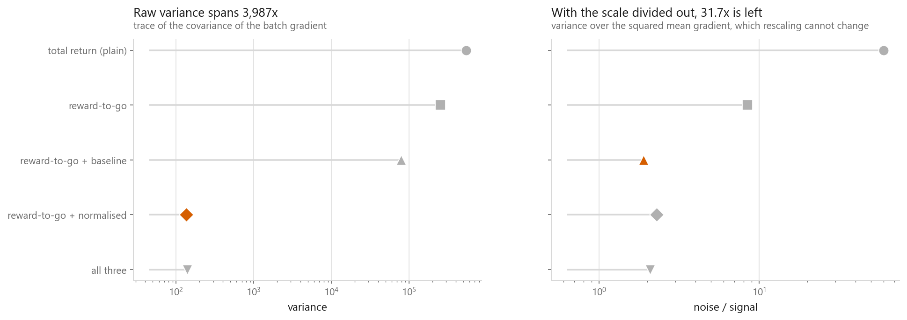
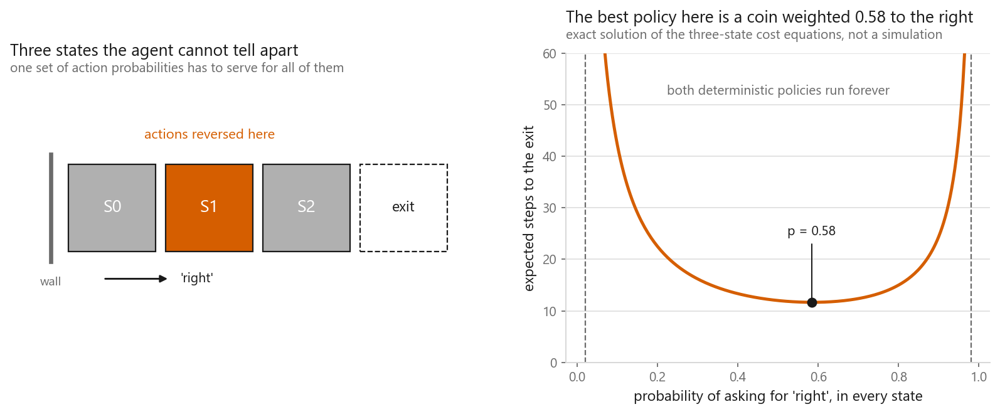
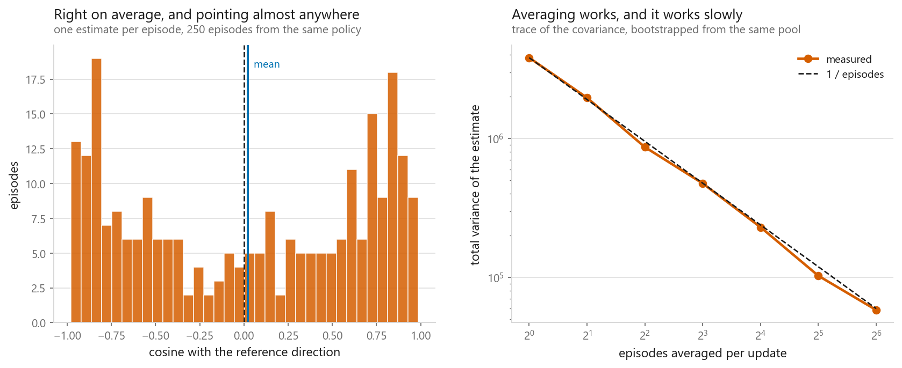
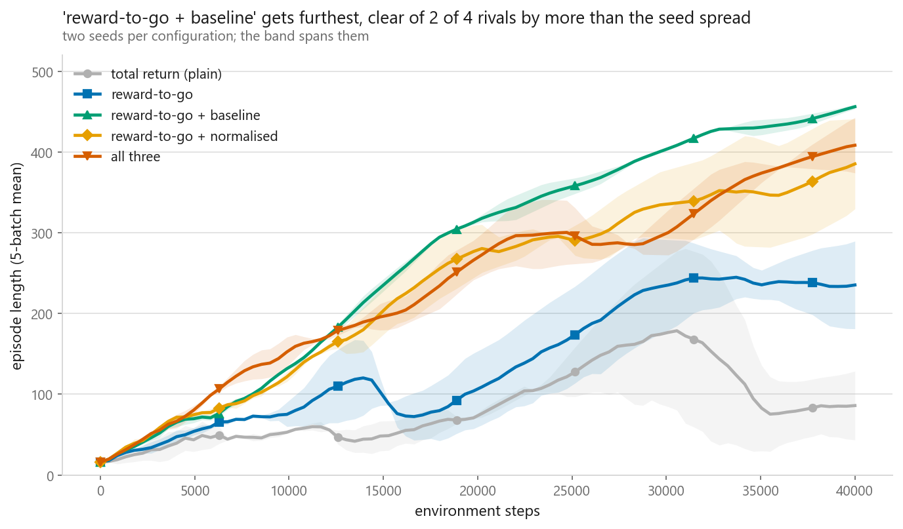
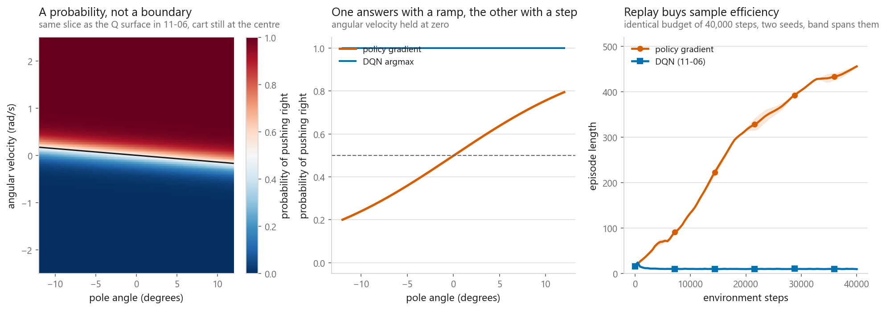

# Policy gradients

### Optimising the policy directly, and the one number that decides whether it works

**[Open the notebook](notebook.ipynb)** · Part 11, Reinforcement learning ·
Made by [Elyes Lounissi](https://www.linkedin.com/in/elyes-lounissi/)

| | |
|---|---|
| **What you will learn** | Why some problems have no best deterministic policy, how the score-function estimator turns a sampling problem into a gradient, and why REINFORCE is unusable until you fix its variance |
| **You should already know** | [MDPs](../03-markov-decision-processes/), and enough PyTorch to read a two-layer network |
| **Environment** | A three-state grid and cart-pole, both written from scratch in the notebook. No `gymnasium` needed |
| **Runtime** | About 6 minutes on a laptop CPU. Policy-gradient training is 56 s of that; the DQN it is compared against takes the rest |

---

## The result I would lead with

Five gradient estimators, identical in every other respect, each given the same
40,000 environment steps and two seeds.

| Weight on the log-probability | Noise / signal | Last quarter | Best batch | Seed spread |
|---|---|---|---|---|
| total return (plain REINFORCE) | 60.12 | 101.2 | 222.3 | 84.5 |
| reward-to-go | 8.468 | 240.2 | 296.1 | 112.5 |
| **reward-to-go + baseline** | **1.899** | **458.5** | **500.0** | **4.8** |
| reward-to-go + normalised | 2.287 | 384.1 | 500.0 | 86.9 |
| all three | 2.089 | 419.2 | 474.8 | 64.5 |

The estimator is unbiased in every row. All five are computing the same gradient
in expectation. The only thing that changes down the column is how much noise
sits on top of it, and that alone is the difference between an agent that finishes
at 101 steps and one that finishes at 458.

**Variance is not a tuning detail in policy gradients. It is the algorithm.**

Read the last column before you read the ranking. The bottom three rows sit inside
each other's seed spread, so **this experiment separates the estimators that have a
variance problem from the ones that do not, and does not order the three fixes
among themselves.** The notebook prints that verdict per row rather than leaving
the bold text to imply one. Two seeds cannot do finer than that, and the finding
does not need them to: the gap from 101.2 to the group above 380 is many times
anything the seeds vary by.

The noise-to-signal column is a different matter and it is nearly noiseless,
because it is measured on one fixed pool of episodes rather than on a training run.
That column can be ranked, and it is the one to tune on.

The seed-spread column is the part I did not expect to be so clean. The best
estimator is also the most reproducible, at 4.8 steps between seeds against 84.5
for plain REINFORCE. Lower variance in the gradient showed up directly as lower
variance in the outcome, which is the mechanism confirming itself: a noisy gradient
does not merely learn less, it learns a different amount every time you run it.

## Why not just take the best action

A three-state corridor with a wall on the left. Both deterministic policies fail
outright: always-right loops between the first two states forever, always-left is
held against the wall. Neither ever exits.

Every policy that does escape is a mixture, and the best one is **p = 0.58, at
11.7 steps to exit**. Push the same policy to p = 0.95 and it takes 44.2 steps;
to p = 0.05 and it takes 82.1.

A method built around `argmax` cannot represent the answer to this problem.
Policy gradients can, because the thing being optimised is the distribution
itself.

## The estimator

The trick is that a gradient of an expectation can be written as an expectation
of a gradient:

$$\nabla_\theta \mathbb{E}_{\tau \sim \pi_\theta}[R(\tau)]
= \mathbb{E}_{\tau \sim \pi_\theta}\big[R(\tau)\, \nabla_\theta \log \pi_\theta(\tau)\big]$$

Nothing on the right needs the environment to be differentiable, which is what
makes this usable at all. The notebook checks it against a closed form:

| Estimate | Samples | Value |
|---|---|---|
| exact | | -0.2350 |
| finite difference | | -0.2350 |
| score function | 10 | -0.4337 |
| score function | 1,000 | -0.2666 |
| score function | 100,000 | -0.2338 |

Unbiased, and visibly wrong at ten samples. That gap is the whole story of the
rest of the notebook.

## How bad is one episode

Measured against a reference direction averaged over many episodes, the gradient
from a single episode has **mean cosine +0.020**, and **47.2% of episodes point
the wrong way outright**. It is barely better than a coin flip.

Averaging fixes it, at the rate you would hope: the variance of the averaged
gradient falls **66x going from 1 episode to 64**.

## The discount is not a free variance knob

This is the section I would send someone to if they only read one.

| Gamma | Effective horizon | Variance | Noise / signal |
|---|---|---|---|
| 1 | infinite | 9.628e+05 | **6.952** |
| 0.999 | 1,000 | 8.136e+05 | 7.052 |
| 0.99 | 100 | 2.537e+05 | 8.468 |
| 0.95 | 20 | 2.544e+04 | 19.78 |
| 0.9 | 10 | 7,248 | **71.07** |

Raw variance falls by more than 100x as gamma drops, which is the usual argument
for discounting. The last column says it bought nothing: the noise-to-signal
ratio gets **ten times worse** over the same range. Lowering gamma shrinks the
weights, so it shrinks the noise and the signal together, and it shrinks the
signal faster.

Reporting a variance reduction without the signal alongside it would have made
gamma = 0.9 look like the best row in the table. It is the worst.

## Step size, measured in policy space

One step along the estimated gradient from a trained policy, sweeping the step
length:

| Step | Mean KL from the old policy | Episode length after |
|---|---|---|
| 0 (untouched) | 0 | 368.8 |
| 0.03 | 0.0003 | 397.5 |
| 0.1 | 0.0034 | 368.6 |
| 0.3 | 0.031 | 387.5 |
| 1 | 0.327 | 138.4 |
| 3 | 1.658 | **9.375** |
| 10 | 2.151 | 9.375 |

Between a KL of 0.031 and a KL of 1.658 the policy goes from working to
destroyed, and it does not come back: the data it collects afterwards is
generated by the broken policy. This is exactly the failure that TRPO and PPO
exist to prevent, and the table is the reason they measure their step in KL
rather than in parameter distance.

## Against the DQN from the previous chapter

Both agents given 40,000 environment steps, then ten fresh episodes each:

| Agent | Mean episode length |
|---|---|
| policy gradient, reward-to-go + baseline (sampled) | 476.6 |
| policy gradient, same weights, argmax | 492.8 |
| DQN from [11-06](../06-deep-q-networks/) (greedy) | 9.5 |

I would not read that last row as a verdict on DQN. It is the same checkpoint
whose own chapter prints it scoring 10.7 greedily, and 11-06's ablation shows
that agent reaching 247.5 during training. Something about that run does not
survive being evaluated greedily, and both chapters say so rather than quietly
picking the flattering number.

What the comparison does show cleanly is **sample reuse**. From the same 40,000
environment steps, DQN performed **39,501 gradient updates** and the policy
gradient performed about **50**. DQN replays each stored transition many times;
REINFORCE sees each one once and throws it away, because the moment the policy
changes the old data was generated by a different policy. That is the structural
cost of being on-policy, and it is why the best estimator in the table above
needed only 49.5 updates to reach 458 steps.

The policy-gradient agent is scored by sampling, which is how it actually
behaves. Its argmax is a different policy and is reported on its own line.

## Cheat sheet

| | |
|---|---|
| **Use it when** | Actions are continuous, or the best policy is genuinely stochastic |
| **Avoid it when** | Samples are expensive. On-policy means every update throws its data away |
| **Must have** | A baseline. It was worth 4.5x on the noise-to-signal ratio and 4x on the final score |
| **Main dials** | Step size (watch it in KL, not in parameters), batch size in episodes, network width |
| **Do not** | Reach for a lower gamma to control variance. It made the ratio 10x worse here |
| **Watch out** | A single episode's gradient points the wrong way 47.2% of the time. Never update from one |
| **Sanity check** | Plot the noise-to-signal ratio, not the variance. Variance alone will mislead you |
| **Before ranking** | Two seeds separate a broken estimator from a working one and nothing finer. The three variance-reduced rows here are a tie |
| **Next** | [Actor-critic and PPO](../08-actor-critic-and-ppo/), which replaces the baseline with a learned value function and then reuses each batch |

---

If this chapter was useful, a star on the repository helps other people find it.
The code is yours to use, copy and adapt in your own work, no permission needed.

Made by **Elyes Lounissi** ·
[LinkedIn](https://www.linkedin.com/in/elyes-lounissi/) ·
[pilot.tun@gmail.com](mailto:pilot.tun@gmail.com)

Back to [Part 11](../) · [the curriculum](../../CURRICULUM.md) · [the book](../../README.md)

`#ReinforcementLearning` `#PolicyGradient` `#REINFORCE` `#PyTorch` `#DeepRL`
`#MachineLearning` `#CartPole` `#MLTutorial` `#LearnMachineLearning` `#AI`
