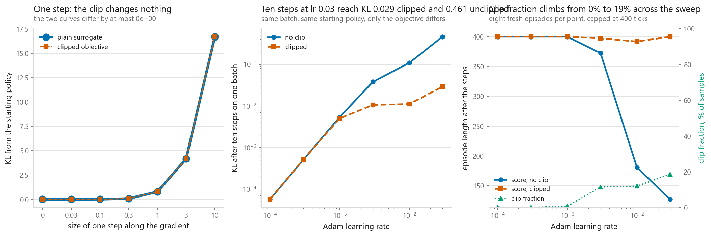
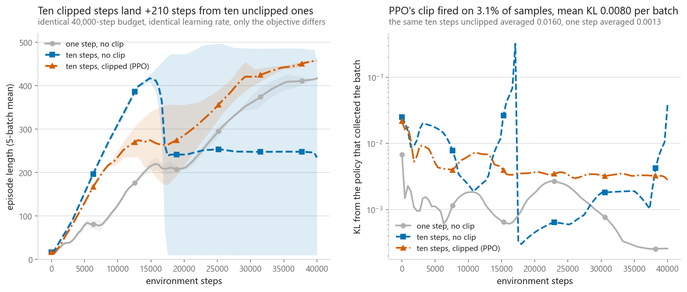
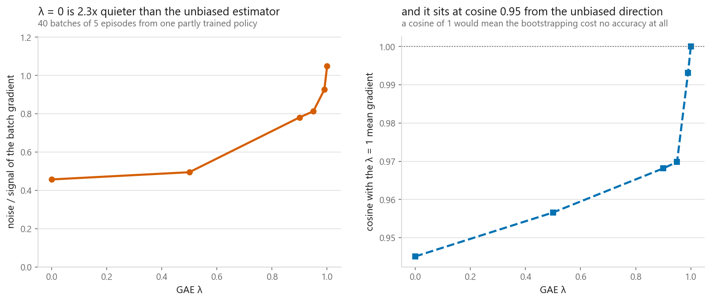
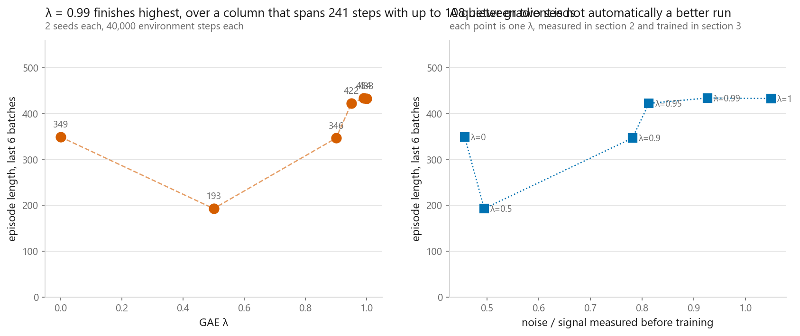
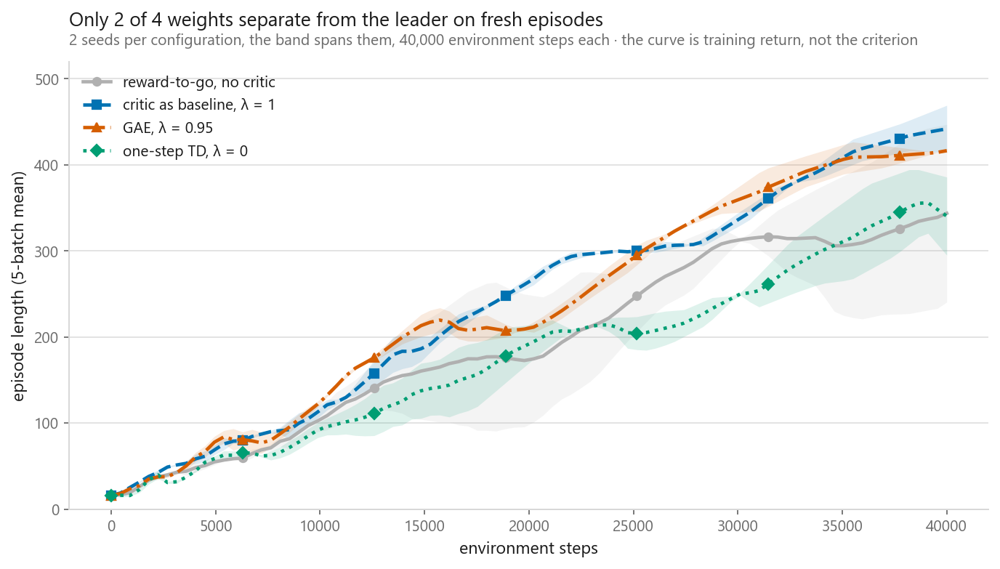

# Actor-critic and PPO

### The clip does not limit a single update. Here is the proof, to ten decimal places

**[Open the notebook](notebook.ipynb)** · Part 11, Reinforcement learning ·
Made by [Elyes Lounissi](https://www.linkedin.com/in/elyes-lounissi/)

| | |
|---|---|
| **What you will learn** | What a critic buys once it supplies the target and not only the baseline, how GAE turns bias against variance with one number, how PPO's clipped objective is written, and a measurement showing the clip cannot stop the failure it is usually credited with stopping |
| **You should already know** | [Policy gradients](../07-policy-gradients/): the score-function estimator, reward-to-go, and why variance is the whole problem |
| **Environment** | Cart-pole, written from scratch, the same class as [11-06](../06-deep-q-networks/) and [11-07](../07-policy-gradients/). No `gymnasium` |
| **Runtime** | Around five minutes on a laptop CPU. The notebook prints the seconds each of the three sweeps took |

---

## The result I would lead with

11-07 ended by pushing a trained policy along its own gradient at increasing
distances and watching it go from working to destroyed. The lesson usually drawn
from that figure is: this is why PPO clips.

This chapter reruns that exact sweep twice, once stepping along the gradient of
the plain surrogate and once along the gradient of the clipped objective, from
the same starting point:

| Step in parameter space | KL, plain | Score, plain | KL, clipped | Score, clipped |
|---|---|---|---|---|
| 0 | 0 | 400 | 0 | 400 |
| 0.03 | 0.0008053 | 400 | 0.0008053 | 400 |
| 0.1 | 0.008935 | 393.5 | 0.008935 | 393.5 |
| 0.3 | 0.07933 | 266.2 | 0.07933 | 266.2 |
| 1 | 0.7747 | 29.12 | 0.7747 | 29.12 |
| 3 | 4.158 | 12.88 | 4.158 | 12.88 |
| 10 | 16.7 | 9.75 | 16.7 | 9.75 |

**Largest KL difference between the two columns: 0.000e+00.**

The clipped objective destroys the policy at exactly the same step size, by
exactly the same amount, as the unclipped one. This is not a bug in the sweep and
not a coincidence of this seed. On the probe batch of 10 episodes and 2,930
samples:

| | |
|---|---|
| ratio at the starting point | min **1.000000**, max **1.000000** |
| fraction of samples outside the clip window | **0.0000** |
| largest disagreement between the two gradients | **0.000e+00** |
| cosine between the two gradients | **1.0000000000** |

Every update starts at `θ = θ_old`, where every probability ratio is exactly 1 by
construction. No sample is outside the window, so `clip` is the identity function
with derivative one, so the clipped objective and the plain surrogate are locally
the same function with the same gradient.

**If your learning rate is too large, PPO will wreck the policy exactly as fast
as REINFORCE will.** Every explanation that presents the clip as a bound on how
far one update may move the policy is describing TRPO, which really does solve a
constrained problem. PPO does not.

## What the clip does stop

The clip needs the ratio to have moved before it can do anything, and the ratio
only moves after a step has been taken. So it bites in the regime PPO was
actually written for: several gradient steps on one batch, where every step after
the first is evaluated at parameters that no longer generated the data.

Ten Adam steps on one fixed batch, the policy restored between rows, nothing
training:

| Learning rate | KL, no clip | KL, clipped | Score, no clip | Score, clipped | Clip fraction |
|---|---|---|---|---|---|
| 0.0001 | 5.686e-05 | 5.696e-05 | 400 | 400 | 0 |
| 0.001 | 0.005395 | 0.00501 | 400 | 400 | 0.007235 |
| 0.003 | 0.03791 | **0.01054** | 372.5 | **397.2** | 0.1144 |
| 0.01 | 0.1083 | **0.01111** | **180.8** | **392** | 0.1194 |
| 0.03 | **0.4606** | **0.02896** | **127.1** | **400** | 0.1862 |

The untouched policy scores 400.0.

At a learning rate of 0.03 the unclipped reuse moves the policy 0.4606 in KL and
takes the score from 400 to **127.1**. The clipped version moves 0.02896, a
**16x smaller** distance, and finishes at **400**, untouched.

Read the clip-fraction column alongside it. It is zero or near zero in the rows
where the two objectives agree, and it climbs to 0.1862 in the row where they
diverge most. The clip does nothing until the ratio leaves the window, and
everything after.

That column is also the diagnostic worth logging in your own runs. Near zero and
the clipped objective is the plain surrogate, so whatever you are attributing to
PPO is coming from somewhere else. Very high and most of your samples contribute
no gradient at all, so the extra epochs are burning compute. The middle of the
range is where the method is doing its job.

## The three-way training comparison

Same budget of 40,000 environment steps for each:

| Method | Last quarter | Fresh episodes | Mean KL per batch | Largest KL | Clip fraction | Gradient steps |
|---|---|---|---|---|---|---|
| one step, no clip | 415.43 | **476.5** | 0.0013 | 0.0069 | 0.000 | 55.5 |
| ten steps, no clip | **245.58** | **234.0** | 0.0160 | **0.7498** | 0.000 | 2,705.0 |
| ten steps, clipped (PPO) | **461.34** | 444.3 | 0.0080 | 0.0346 | 0.031 | 395.0 |

The middle row is the point of the ratio. Ten unclipped steps on one batch is not
a worse algorithm, it is not an algorithm: it optimises a surrogate at parameters
that did not generate the data, with no correction for that fact. It reached a
largest KL of **0.7498**, which is the same neighbourhood as the step that
destroyed the policy in the leading table, and it finished at less than half of
what a single step per batch achieves.

Adding the clip moves that from 245.58 to 461.34 on the last quarter, and cuts
the peak KL by more than 20x.

Now the part I would not leave out. **On fresh sampled episodes, PPO lost to the
single-step run, 444.3 against 476.5.** It wins the training metric by 45.9 and
loses the deployment metric by 32.2, on two seeds. So the honest reading of this
table is that PPO fixed batch reuse, which is what it was written to do, and did
not beat one careful gradient step per batch on this problem at this budget.
Cart-pole at 40,000 steps is not where PPO's sample efficiency was supposed to
show up.

## GAE, and the dial between the two chapters

The critic supplies the target now, not only the baseline. With
`δ_t = r_t + γV(s_{t+1}) - V(s_t)`, GAE takes an exponentially weighted average
over the whole ladder of n-step estimates, computed in one backward pass as
`Â_t = δ_t + γλ Â_{t+1}`. λ = 1 recovers 11-07's estimator exactly. λ = 0 is the
one-step TD estimate.

Measured on one shared pool of 200 episodes, so the comparison is paired:

| λ | Gradient variance | Signal | Noise / signal | Agreement with λ = 1 |
|---|---|---|---|---|
| 0 | 0.1055 | 0.7105 | **0.4571** | 0.9451 |
| 0.5 | **0.07322** | 0.5469 | 0.4948 | 0.9566 |
| 0.9 | 0.1856 | 0.5514 | 0.7813 | 0.9681 |
| 0.95 | 0.3681 | 0.7461 | 0.8131 | 0.9698 |
| 0.99 | 1.265 | 1.214 | 0.9265 | 0.9932 |
| 1 | **2.409** | 1.48 | **1.049** | 1 |

Bootstrapping does what it promises: λ = 0 has a noise-to-signal ratio of 0.4571
against 1.049 for the unbiased estimator, and it pays for that with a cosine of
0.9451 from the unbiased direction.

Then the outcome, which does not follow the noise:

| λ | Noise / signal | Agreement | Final episode length |
|---|---|---|---|
| 0.000 | **0.457** | 0.945 | 348.883 |
| 0.500 | 0.495 | 0.957 | **192.667** |
| 0.900 | 0.781 | 0.968 | 346.350 |
| 0.950 | 0.813 | 0.970 | 422.033 |
| **0.990** | 0.926 | 0.993 | **433.850** |
| 1.000 | **1.049** | 1.000 | 432.533 |

**The quietest gradients produced the worst runs.** λ = 0 has the lowest
noise-to-signal ratio in the table and finishes at 348.883; λ = 0.99 has twice the
noise and finishes at 433.850. Over the bottom half of the dial the ranking by
noise and the ranking by outcome point in opposite directions.

I would rest that claim on the two ends of the sweep and not on the λ = 0.5 row.
That row is 192.667 with quiet neighbours on both sides, which is not the shape of
a response curve, and the notebook prints the spread between the two seeds at every
lambda so you can see it is comparable to the whole range of the column. Two runs
of cart-pole per point cannot resolve a dip that size. **Do not tune λ by reading
that scatter.**

What the sweep does establish is the direction, and the mechanism behind it is not
subtle. Lowering λ removes variance and adds bias, in fixed proportion, and a
variance measurement cannot see the bias. This is the table I would show anybody
who has just measured a variance reduction and is about to report it as an
improvement. It is the same trap [11-07](../07-policy-gradients/) found with gamma,
where the missing quantity was the signal instead of the bias.

The best value here is 0.99, one step above the conventional 0.95, and it beats
λ = 1 by 1.3 steps, which is inside anything I would call a difference on two
seeds.

## Four estimators on the same budget

| Weight | Last quarter | Best batch | Seed spread | Updates | Fresh episodes |
|---|---|---|---|---|---|
| reward-to-go, no critic | 342.66 | 423.1 | **193.80** | 69.5 | 427.35 |
| critic as baseline, λ = 1 | **445.72** | 481.7 | 33.33 | 53.0 | 454.95 |
| GAE, λ = 0.95 | 415.43 | 477.9 | **12.07** | 55.5 | **476.50** |
| one-step TD, λ = 0 | 343.92 | 435.4 | 92.30 | 74.0 | 323.50 |

Bootstrapping moved the fresh-episode score by +21.6 steps against 11-07's
estimator, and I am not going to call that a win. The two criteria disagree on
which of the two critic rows is better, λ = 1 leading the last-quarter column by
about 30 and trailing the fresh column by 21.6, and both gaps sit in the same range
as the seed spreads in the table beside them. **Two seeds can separate a
configuration that fails from one that works. They cannot order four that all
work**, and the notebook prints the tie list rather than leaving the reader to
divide the columns.

The seed-spread column is the cleaner result and the one I would report. GAE at
λ = 0.95 finishes at **12.07** steps between seeds against **193.80** for the
no-critic estimator, a 16x reduction in how much the outcome depends on the random
seed. That is a gap nothing here could have invented, and it is the same pattern
[11-07](../07-policy-gradients/) found: a lower-variance gradient shows up as a
more reproducible run, whether or not it shows up as a higher score. Reproducibility
is the thing the critic reliably buys.

## The detail that quietly corrupts a critic

An episode that ends because the pole fell has `V(s_T) = 0`, since nothing
follows a terminal state. An episode that ends because the caller cut it off at a
step limit **has not ended**, and using zero there teaches the critic that
surviving perfectly for 500 steps is followed by nothing at all.

In the measurement pool, **13 of 200 episodes were cut off by the cap rather than
falling**. Every one of those would have taught the critic the opposite of the
truth about its best states. The `terminated` flag is what keeps the two cases
apart, and it is the single change between this chapter's λ = 1 configuration and
11-07's.

## Cheat sheet

| | |
|---|---|
| **Actor-critic** | The critic supplies the target as well as the baseline. Bootstrapping trades variance for bias, and the bias is the critic's error |
| **GAE λ** | 1 is Monte Carlo minus a baseline, 0 is one-step TD. A bias-variance dial and nothing else. 0.99 was best here, 0.5 was worst |
| **Do not** | Choose λ by measuring the gradient variance. The two quietest settings gave the two worst runs |
| **Terminal versus cut off** | `V = 0` only when the episode really ended. 13 of 200 episodes here were cut off, not terminated |
| **PPO ratio** | `π_θ / π_old`, exactly 1 before the update. It is what makes several passes over one batch mean anything |
| **PPO clip** | Bounds the damage from repeated passes. It does not bound a single step: at the starting point it is the identity, verified at 0.000e+00 |
| **Do not claim** | That the clip is a trust region. That is TRPO, which solves a constrained problem |
| **Main dials** | Learning rate, epochs per batch, clip width, λ, episodes per batch |
| **Watch out** | A clip fraction near zero means the clip never fired and you are running plain surrogate reuse. PPO's was 0.031 here |
| **Sanity check** | Log KL from the collecting policy every batch. Unclipped reuse hit 0.7498, which is the range that destroys a policy |
| **Before ranking** | Two seeds separate a failure from a success and nothing finer. Print the spread beside every mean |
| **Next** | [Part 12](../../12-putting-it-together/), where every method in the book goes on one scoreboard |

## Where Part 11 ends up

Eight chapters, each one there because of something the one before it could not do.

| Chapter | What it could not do, that the next one addresses |
|---|---|
| [11-01 The setup](../01-the-setup/) | Nothing is learned. Every policy is priced by hand |
| [11-02 Bandits](../02-multi-armed-bandits/) | No state, so no credit to assign across time |
| [11-03 MDPs](../03-markov-decision-processes/) | Needs the transition model handed to it |
| [11-04 Q-learning](../04-q-learning/) | Reports one number and does not say whether it describes the policy or the training run |
| [11-05 SARSA](../05-sarsa/) | Needs a table, so the state space has to be small enough to enumerate |
| [11-06 DQN](../06-deep-q-networks/) | Cannot represent a policy whose best answer is stochastic, and its `argmax` is brittle |
| [11-07 Policy gradients](../07-policy-gradients/) | On-policy, so every batch is used once and thrown away |
| **11-08 Actor-critic and PPO** | Reuses the batch, and the clip is what makes reuse survivable |

One thread runs through all of it and it is not a method. Every chapter reports a
number produced by a procedure, and the recurring mistake is reading it as if it
came from a different one: a training curve read as a policy evaluation, a variance
read as gradient quality, a mean over two seeds read as a ranking.
[12-05](../../12-putting-it-together/05-common-mistakes/) collects that habit and
what it costs across the whole book.

---

If this chapter was useful, a star on the repository helps other people find it.
The code is yours to use, copy and adapt in your own work, no permission needed.

Made by **Elyes Lounissi** ·
[LinkedIn](https://www.linkedin.com/in/elyes-lounissi/) ·
[pilot.tun@gmail.com](mailto:pilot.tun@gmail.com)

Back to [Part 11](../) · [the curriculum](../../CURRICULUM.md) · [the book](../../README.md)

`#ReinforcementLearning` `#PPO` `#ActorCritic` `#GAE` `#PolicyGradient`
`#TRPO` `#CartPole` `#PyTorch` `#DeepRL` `#MachineLearning` `#MLTutorial`
`#LearnMachineLearning` `#AI`
