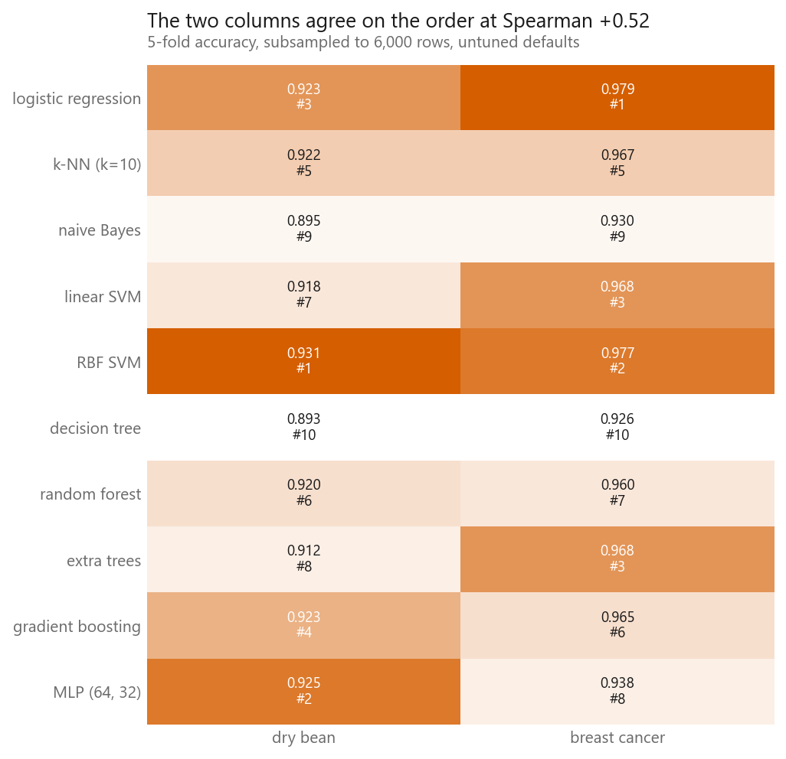
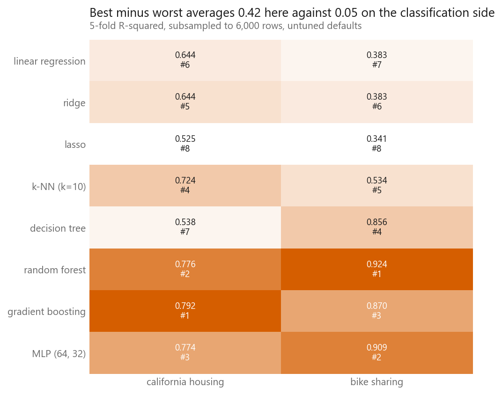
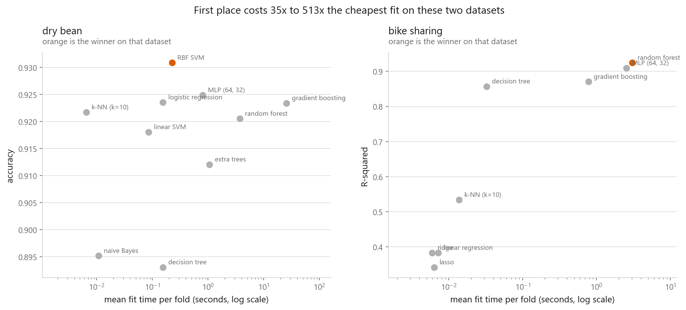
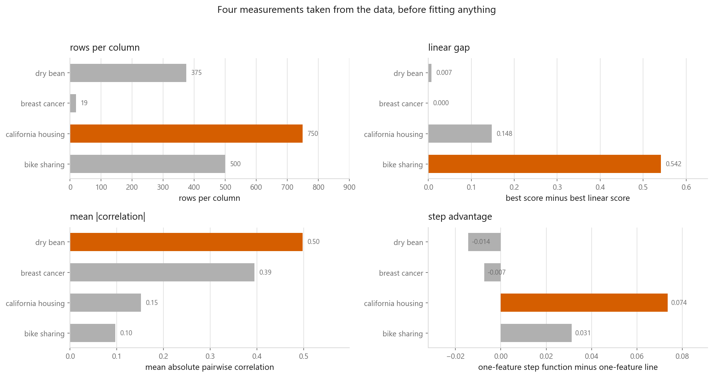
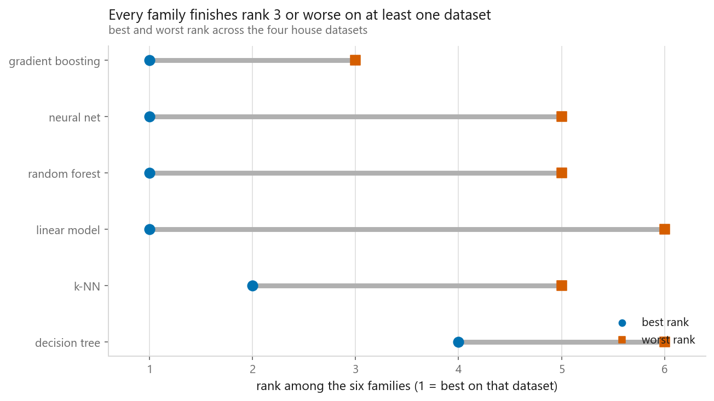

# The scoreboard

### Every method in this book, on every dataset in this book, scored the same way

**[Open the notebook](notebook.ipynb)** · Part 12, Putting it together ·
Made by [Elyes Lounissi](https://www.linkedin.com/in/elyes-lounissi/)

| | |
|---|---|
| **What you will learn** | Which method wins on which kind of data, why the answer changes, and how to tell the rows of a comparison table that are separated by the data from the rows that are a coin flip |
| **You should already know** | Anything from Parts 2 to 7. This chapter assumes the methods and compares them |
| **Datasets** | All four house datasets: Dry Bean, Breast Cancer, California Housing, Bike Sharing |
| **Runtime** | Under two minutes. 5-fold cross-validation throughout, one seed, identical preprocessing for every method |

---

## The result I would lead with

Half of this scoreboard cannot be read as a ranking, and the notebook prints the
evidence next to every table.

Each cell is a mean over five folds, and each mean comes with the standard
deviation across those folds. On Breast Cancer that spread is around a
percentage point, because the dataset has 569 rows and a fold holds about 114 of
them, so one extra mistake moves a fold's accuracy by almost a point. Most of the
gaps between methods are the same size as the spread. Six of the ten methods sit
within one pooled fold standard deviation of the leader:

| Method | Accuracy | Fold sd |
|---|---|---|
| **logistic regression** | **0.9789** | 0.0142 |
| RBF SVM | 0.9771 | 0.0070 |
| linear SVM | 0.9684 | 0.0119 |
| extra trees | 0.9684 | 0.0090 |
| k-NN | 0.9666 | 0.0170 |
| gradient boosting | 0.9649 | 0.0184 |
| random forest | 0.9596 | 0.0162 |
| MLP (64, 32) | 0.9385 | 0.0147 |
| naive Bayes | 0.9297 | 0.0124 |
| decision tree | 0.9262 | 0.0218 |

That block from logistic regression down to gradient boosting is one group, and
the order inside it is which patients landed in which fold. What the column does
separate is the bottom of it, and **that separation is the only thing this column
tells you**.

The same test on Dry Bean says the RBF SVM's lead is real, and that the block
underneath it is not ordered at all. The two regression datasets separate
properly, and that is not because R-squared is a better metric. It is because
those two targets are hard enough that the distance between a model which can
represent them and one which cannot dwarfs the distance between folds.

One warning about the arithmetic. The tempting move is to divide the fold
standard deviation by the square root of five and call it a standard error. Every
pair of training folds shares three fifths of its rows, so the fold scores are
correlated and that standard error comes out too small. Bengio and Grandvalet
showed in 2004 that no unbiased estimator of k-fold variance exists and that the
naive one is optimistic, so the notebook uses the fold standard deviation itself,
which is the conservative end.

## What I predicted, and what happened

Before running it I wrote down seven predictions. The notebook checks each one
against its own output.

| Prediction | Verdict |
|---|---|
| A tree ensemble wins on every dataset | **did not hold** |
| Breast Cancer has the smallest linear gap | held |
| Bike Sharing has the largest linear gap | held |
| Bike Sharing has the largest step advantage | **did not hold** |
| Breast Cancer has the fewest rows per column | held |
| The MLP gains nothing over logistic regression on Breast Cancer | held |
| The winner is never also the fastest method | held, but see below |

| Dataset | Winner | Score | Per fit |
|---|---|---|---|
| Dry Bean | **RBF SVM** | 0.9308 accuracy | 0.15 s |
| Breast Cancer | **logistic regression** | 0.9789 accuracy | 0.00 s |
| California Housing | gradient boosting | 0.7916 R² | 2.22 s |
| Bike Sharing | random forest | 0.9243 R² | 4.57 s |

Tree ensembles are the default advice for tabular data and they took first place
on two of four. Read with the tie check, the story is milder than that headline:
on Breast Cancer nothing beat logistic regression by enough to matter, so the
right sentence is that ensembles were not needed there, rather than that they
lost.

The MLP result on Breast Cancer is the one classification finding I would defend.
It lost to logistic regression by **0.0404**, several times either method's fold
standard deviation. At 19 rows per column there is not enough data to fit two
hidden layers, and the model spends its capacity on noise in the training folds.
That is [overfitting](../../01-foundations/03-overfitting-and-underfitting/)
showing up in a comparison table instead of a learning curve.

**"The winner is never the fastest" held, and deserves less credit than that.**
It is a claim about identity, not size, and on Breast Cancer the winner and the
fastest method both fit in a time the timer reports as 0.00 s. On the two large
datasets the win costs orders of magnitude: on Dry Bean, k-NN gives up **0.0092
accuracy**, which is inside the tie band, and runs **51x cheaper** than the RBF
SVM. That is the version of the claim worth carrying away.

## What makes the datasets different

Four properties of each dataset, measured from the data itself before any model
is fitted, lined up against which method won:

| | Rows per column | Mean abs correlation | Columns for 95% variance | Step advantage | Linear gap |
|---|---|---|---|---|---|
| Dry Bean | 375.0 | 0.498 | 5 of 16 | -0.014 | 0.007 |
| Breast Cancer | 19.0 | 0.395 | 10 of 30 | -0.007 | 0.000 |
| California Housing | 750.0 | 0.152 | 6 of 8 | 0.074 | 0.148 |
| Bike Sharing | 500.0 | 0.097 | 10 of 12 | 0.031 | 0.542 |

**Linear gap** is how far the best linear model sits behind the winner, and it is
the column that explains the most. On Breast Cancer it is 0.000: nothing beats a
line, so the extra machinery has nothing to buy. On Bike Sharing it is **0.542**,
because hourly demand depends on time of day in a way no straight line can
express. A linear model asked to fit demand against an hour index puts a nearly
flat line through the middle of two sharp peaks. A tree cuts the column either
side of each peak and has it.

**Step advantage** is where my second prediction failed. I expected Bike Sharing
to reward step functions most; California Housing rewarded them more, 0.074
against 0.031. The measurement is taken one column at a time, and that is the
whole explanation. Bike Sharing has one spectacular column and eleven ordinary
ones, and the average dilutes it. California Housing's threshold structure is
spread across latitude, longitude and median income, so more of its columns
contribute. My prediction had confused "has the sharpest threshold anywhere" with
"has the highest average threshold effect". The linear gap, which lets features
combine, ordered them the way I expected.

Two of the four step advantages are slightly negative, and that is the
measurement being honest rather than a defect: a depth-limited tree on one
monotone feature approximates a smooth relationship with a handful of constant
pieces, and a logistic curve does not have to.

## The k-NN result I got wrong

The standard claim is that k-NN falls apart as columns are added. Measuring
k-NN's gap to the winner against the column count gives a correlation of
**-0.41**, which points the wrong way: the dataset with the most columns (Breast
Cancer, 30) has one of k-NN's smallest gaps, and the dataset where it loses badly
(Bike Sharing, 0.3906) has 12.

**A correlation over four datasets is not evidence of anything.** It has two
degrees of freedom and the sign could flip on a fifth dataset, so I am not
claiming the textbook is wrong.

What the four points do say is that dimension count is not the variable doing the
work at this scale. What decides it is whether Euclidean distance means anything.
Breast Cancer's 30 columns are 30 measurements of the size and texture of one
nucleus, on comparable scales once standardised, so two similar cells really are
close together. Bike Sharing's columns are an hour index, a weekday flag, a
temperature and a humidity, and one unit of hour is not comparable to one unit of
humidity no matter how you scale it. Worse, hour 23 and hour 0 are an hour apart
in the world and maximally far apart in the column.

The curse of dimensionality is real and it needs many more than 30 columns to
bite. What bit here was a meaningless metric, which is fixed by feature
engineering, not by a smaller k. [Chapter
03-02](../../03-classification/02-k-nearest-neighbours/) builds both failures on
purpose.

## No free lunch, ranked

Every family's rank within each dataset, out of the six families that appear on
both sides of the book:

| Family | Dry Bean | Breast Cancer | California | Bike Sharing | Best | Worst | Mean |
|---|---|---|---|---|---|---|---|
| gradient boosting | 3 | 3 | **1** | 3 | #1 | **#3** | **2.50** |
| neural net | **1** | 5 | 3 | 2 | #1 | #5 | 2.75 |
| random forest | 5 | 4 | 2 | **1** | #1 | #5 | 3.00 |
| linear model | 2 | **1** | 5 | 6 | #1 | #6 | 3.50 |
| k-NN | 4 | 2 | 4 | 5 | #2 | #5 | 3.75 |
| decision tree | 6 | 6 | 6 | 4 | #4 | #6 | 5.50 |

Ranking is a function that turns a gap of two thousandths into a whole place, so
the notebook runs the tie check on this table too. **Two of these four columns are
an ordering and two are a shuffle.** On Dry Bean five of the six families sit
inside one pooled fold standard deviation of each other, so the neural net's first
place there is a draw from a hat. On Breast Cancer three do. California Housing
and Bike Sharing separate properly.

Which means the mean-rank column inherits the noise from half its inputs, and a
quarter of a place between the top three families is not a difference. What
survives is coarser:

- **No family is top-ranked on all four.** Four of the six take first place
  somewhere, and four of the six also land fifth or sixth somewhere.
- **Gradient boosting is never far from the leader.** It is inside the tie group
  where there is one, first on California Housing, and its single clear loss is to
  a random forest and a neural network on Bike Sharing. That is a good argument
  for it as a default, and note that it is an argument about the worst case, not
  the best.
- **The linear model swings furthest**, 5 places, from a genuine member of the top
  group on Breast Cancer to last by an enormous margin on Bike Sharing. That swing
  is far larger than any noise in this notebook, and its cause is one column.

## Cheat sheet

| | |
|---|---|
| **Before you accept a win** | Compare the gap to the fold standard deviation. Half the orderings on this page do not survive it |
| **Do not** | Divide the fold sd by the square root of the fold count. Folds share training rows and that standard error is too small |
| **Start with** | [Gradient boosting](../../04-ensembles/05-gradient-boosting/) on tabular data. It was never far from the leader on any of the four |
| **Always run** | A [linear model](../../02-regression/01-linear-regression/). It won a dataset, and its gap to the winner measures how much non-linearity the problem actually has |
| **Few rows per column** | Prefer the linear model. At 19 rows per column the MLP lost to logistic regression by 0.0404 |
| **Sharp thresholds** | [Tree ensembles](../../04-ensembles/02-random-forest/). Bike Sharing's linear gap of 0.542 is what that looks like |
| **Cost** | The winner was never the fastest on any of the four. On Dry Bean first place cost 51x the cheapest fit for 0.0092 accuracy |
| **Do not** | Read a four-dataset correlation as a law. This page contains one that points the wrong way |

## Where each finding comes from

This chapter is a summary of eleven parts, so every claim on it has a chapter
underneath it that does the work:

| Finding here | Chapter that builds it |
|---|---|
| Fold spread is the yardstick for a gap | [01-04 Cross-validation](../../01-foundations/04-cross-validation/) |
| Flexible models fail on few rows per column | [01-03 Overfitting and underfitting](../../01-foundations/03-overfitting-and-underfitting/) |
| Untuned defaults are not a property of a method | [01-09 Hyperparameter tuning](../../01-foundations/09-hyperparameter-tuning/) |
| Ridge equals plain least squares when the penalty is small | [02-04 Ridge](../../02-regression/04-ridge-regression/) |
| A lasso penalty that is too heavy cuts signal | [02-05 Lasso](../../02-regression/05-lasso-regression/) |
| k-NN needs a meaningful metric | [03-02 k-nearest neighbours](../../03-classification/02-k-nearest-neighbours/) |
| Splits handle thresholds a slope cannot | [03-06 Decision trees](../../03-classification/06-decision-trees/) |
| Averaging trees buys variance reduction | [04-02 Random forest](../../04-ensembles/02-random-forest/) |
| Correlated columns break distance methods | [06-01 PCA](../../06-dimensionality-reduction/01-principal-component-analysis/) |
| Explaining an ensemble needs tooling | [12-02 Interpreting models](../02-interpreting-models/) |
| The leaks that would have made these numbers wrong | [12-05 Common mistakes](../05-common-mistakes/) |

---

If this chapter was useful, a star on the repository helps other people find it.
The code is yours to use, copy and adapt in your own work, no permission needed.

Made by **Elyes Lounissi** ·
[LinkedIn](https://www.linkedin.com/in/elyes-lounissi/) ·
[pilot.tun@gmail.com](mailto:pilot.tun@gmail.com)

Back to [Part 12](../) · [the curriculum](../../CURRICULUM.md) · [the book](../../README.md)

`#MachineLearning` `#ModelSelection` `#NoFreeLunch` `#ScikitLearn`
`#TabularData` `#GradientBoosting` `#Benchmark` `#MLTutorial`
`#LearnMachineLearning` `#DataScience` `#AI`
