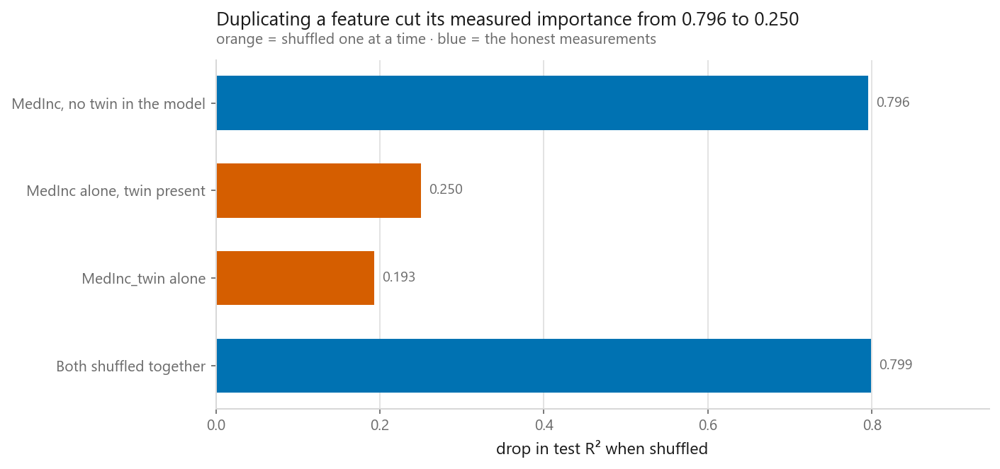
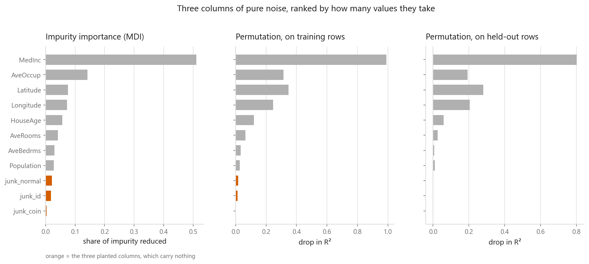
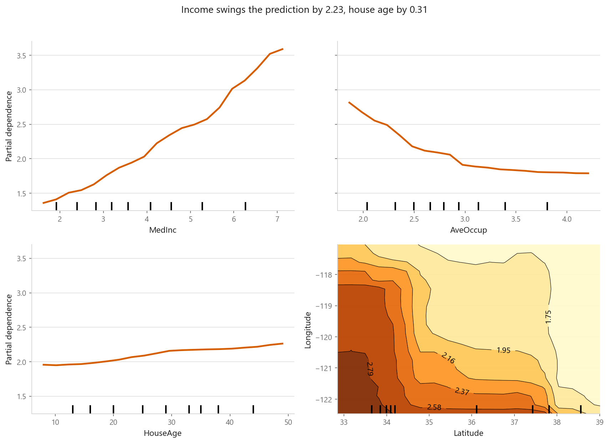
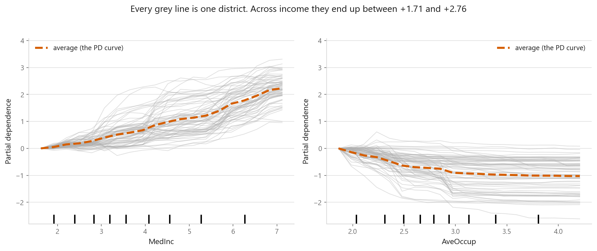
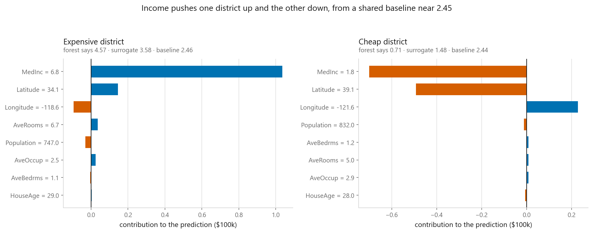

# Interpreting models

### Which features the model uses, and why it said that about this row

**[Open the notebook](notebook.ipynb)** · Part 12, Putting it together ·
Made by [Elyes Lounissi](https://www.linkedin.com/in/elyes-lounissi/)

| | |
|---|---|
| **What you will learn** | Why `feature_importances_` misleads, how permutation importance fixes it and where it silently breaks, what partial dependence and ICE assume, and how to build LIME and exact Shapley values from scratch |
| **You should already know** | [Random forests](../../04-ensembles/02-random-forest/), [linear regression](../../02-regression/01-linear-regression/), [ridge](../../02-regression/04-ridge-regression/) |
| **Datasets** | California Housing, subsampled to 6,000 rows |
| **Runtime** | Two to four minutes on a laptop CPU |

---

## Copying a column made it look unimportant, twice

I added one column to the feature table: `MedInc` plus a whisper of noise,
correlation **0.99995** with the original. The model's score did not move — test
R² went from 0.7794 to 0.7789, which is nothing. Its measured importance collapsed.

| Measurement | Drop in test R² when shuffled |
|---|---|
| `MedInc`, no twin in the model | **0.7956** |
| `MedInc` alone, twin present | **0.2502** |
| `MedInc_twin` alone | 0.1930 |
| Both shuffled together as a block | **0.7990** (sd 0.0153) |

The two individual scores sum to **0.4432 against a grouped 0.7990**. Nothing about
the model changed and nothing about the data changed, and the most useful feature
in the dataset now reports as minor — twice over. Permuting one column leaves the
model the other to read the answer off, so each partner is individually disposable
and the procedure never asks about them together.

Top and bottom bars are the same quantity measured two ways, and they match. The
orange bars in the middle are the lie. You do not need a near-perfect twin: real
feature tables are full of weaker correlations that deflate both partners — a
total and an average of the same thing, a raw value and its log, this month and
last month.

The data is 6,000 California districts, split 4,500 train / 1,500 test, 8 features
that all mean something in plain English. The target runs 0.15 to 5.00 and **4.8%
of rows sit exactly on the 5.0 cap**, which is why every curve below flattens at
the top for a reason that has nothing to do with the model.

## Impurity importance rewards cardinality

I planted three columns containing nothing, differing only in how many distinct
values they take.

| Planted column | Distinct values | Correlation with target | MDI | Permutation, test |
|---|---|---|---|---|
| `junk_normal` | 6,000 | −0.0102 | **0.0214** | −0.0013 |
| `junk_id` | 1,904 | −0.0032 | **0.0179** | −0.0012 |
| `junk_coin` | 2 | −0.0129 | **0.0031** | −0.0013 |

Three columns that contain nothing at all received MDI scores spanning **6.9×**,
ordered exactly by cardinality. The normal draw scored **0.0214 against
`Population`'s 0.0276** — a pure noise column collecting 77% of the credit of a
real feature. Permutation importance on held-out rows put all three at roughly
zero, and slightly negative, which is noise around zero rather than a signal.

Honest note, since it cuts against the usual demo: the junk columns landed at MDI
ranks 9, 10 and 11 of 11, so they did **not** outrank the real features. The bias
shows in their internal ordering and in how close `junk_normal` got to
`Population`, not in a headline inversion.

The forest scored train R² **0.9672** against test R² **0.7674**, and that gap is
why MDI misleads: it was computed on the set the model memorised. The figure's
middle panel is the next trap — permutation importance measured on training rows
inflates exactly the columns the model memorised, because shuffling them really
does hurt the training score. My hand-written grouped permutation matched
scikit-learn on a group of one: `HouseAge` at **0.0588** against **0.0603**.

## Partial dependence, and what the average hides

| Feature | PD runs from | to | Swing |
|---|---|---|---|
| `MedInc` | 1.36 | 3.59 | **2.23** |
| `AveOccup` | 1.79 | 2.81 | 1.03 |
| `HouseAge` | 1.95 | 2.26 | **0.31** |

A feature whose partial dependence is flat cannot be moving predictions much,
whatever any importance chart says. `HouseAge` swings 0.31 across its entire range.
The latitude-longitude panel is a map: the model rediscovered the California
coastline from two unlabelled numeric columns.

I used `method="brute"` rather than sklearn's `"recursion"` default for tree
ensembles, because recursion averages over the training distribution baked into
the tree weights rather than over the data you pass.

ICE is the same computation without the averaging: one line per district, centred
at its left edge.

| Feature | Total change per district, 10th pct | Median | 90th pct |
|---|---|---|---|
| `MedInc` | +1.71 | +2.23 | +2.76 |
| `AveOccup` | **−1.89** | −0.96 | **−0.35** |

If every district responded the same way those percentiles would sit on top of each
other. `AveOccup` spans a factor of more than five between the 10th and 90th, so the
averaged curve is describing nobody in particular, and that width is itself a
measure of interaction. Draw ICE first, the average second.

## One prediction, explained two ways

A LIME-style local surrogate is about fifteen lines: sample around the instance,
ask the black box, weight by distance, fit weighted ridge.

| | Expensive district | Cheap district |
|---|---|---|
| Forest predicts | 4.566 | 0.710 |
| Surrogate predicts | **3.577** | **1.482** |
| Local baseline | 2.458 | 2.442 |
| Weighted R² of the surrogate | 0.671 | 0.625 |
| Effective samples of 5,000 | 2,535 | 2,276 |
| Top contribution | `MedInc` +1.036 | `MedInc` −0.701 |

Both surrogates miss the forest's own number by roughly one unit — 3.577 against
4.566, 1.482 against 0.710 — and the weighted R² near 0.65 says why: a straight
line is a mediocre description of the model in those neighbourhoods. LIME reports
this number; most screenshots of LIME crop it out.

Then the choices you make turn out to matter more than the model does:

| | Largest change in any contribution |
|---|---|
| Two different random seeds | **0.010** |
| Kernel width 0.6 against 12.0 | **0.743** |

`MedInc`'s contribution moved from **0.155 at width 0.6 to 0.897 at width 12.0**,
a swing larger than every other attribution combined. The narrow kernel fit at
R² 0.139 on **3 effective samples**; the wide one at 0.642 on 4,992, by which point
"local" means "everywhere" and the explanation is an ordinary global linear fit.
Nothing in the method sets the width.

## Exact Shapley values, since eight features is only 256 subsets

$$\phi_i = \sum_{S \subseteq N \setminus \{i\}} \frac{|S|!\,(d - |S| - 1)!}{d!}
\left[v(S \cup \{i\}) - v(S)\right]$$

| | |
|---|---|
| Baseline, average prediction over the background | 1.8762 |
| Baseline + sum of the eight Shapley values | **4.5656** |
| The forest's actual prediction | **4.5656** |
| Gap | **0.00e+00** |

Local accuracy verified rather than asserted. LIME has no such guarantee — its
bars add up to whatever the little linear model happened to say, which above was
3.577 for a prediction of 4.566.

| Feature | Shapley, exact | Local surrogate |
|---|---|---|
| `MedInc` | **1.662** | 1.036 |
| `AveOccup` | 0.368 | 0.025 |
| `Latitude` | 0.314 | 0.146 |
| `HouseAge` | 0.123 | 0.004 |
| `Longitude` | 0.106 | **−0.094** |
| `AveRooms` | 0.096 | 0.037 |
| `AveBedrms` | 0.044 | −0.004 |
| `Population` | −0.025 | −0.030 |

They agree on which feature dominates and disagree on amounts, and they disagree on
the sign of `Longitude`. That is roughly the right expectation from two methods
answering related but different questions. The cost is the $2^d$ sum: 256 here,
about a billion at thirty features, which is why `shap` ships TreeSHAP.

The unsolved problem sits under every method above. Permutation, partial dependence,
LIME and Shapley all move one feature while holding the others still, and all four
evaluate the model on rows that could not exist as the features get more correlated.

## Cheat sheet

| | |
|---|---|
| **`feature_importances_` (MDI)** | Free, and biased toward columns with many distinct values. A rough glance at a tree, never evidence |
| **Permutation importance** | Model-agnostic, meaningful units, any metric. Held-out data only |
| **Correlated features** | Deflate every individual score in the group. Cluster by correlation and permute the block |
| **Partial dependence** | Shape of the average response. Extrapolates wherever features are dependent. ALE is the alternative |
| **ICE** | Partial dependence without the averaging. Draw it first |
| **Local surrogate (LIME)** | Check the weighted fit and the kernel width before believing the bars |
| **Shapley values (SHAP)** | Attributions that provably sum to the prediction. Exponential in feature count |
| **All of them** | Describe the model, not the world. None of this is causal |
| **Next** | [Pipelines, and never leaking again](../03-pipelines/) |

---

Made by **Elyes Lounissi** ·
[LinkedIn](https://www.linkedin.com/in/elyes-lounissi/) ·
[pilot.tun@gmail.com](mailto:pilot.tun@gmail.com)

Back to [Part 12](../) · [the curriculum](../../CURRICULUM.md) · [the book](../../README.md)

`#MachineLearning` `#Interpretability` `#ExplainableAI` `#PermutationImportance`
`#PartialDependence` `#SHAP` `#LIME` `#Python` `#ScikitLearn` `#MLTutorial`
