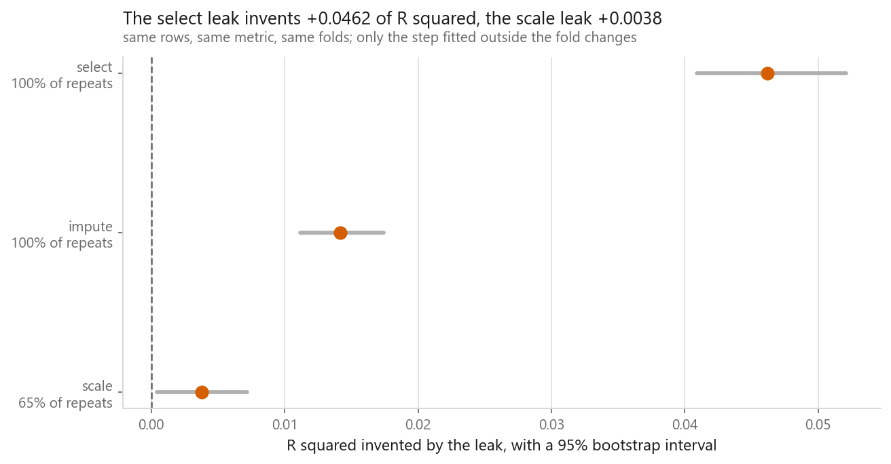
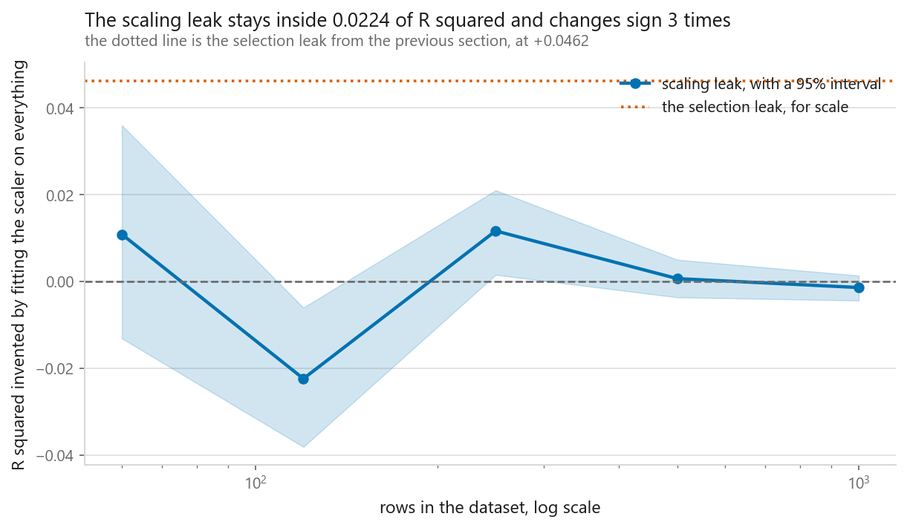
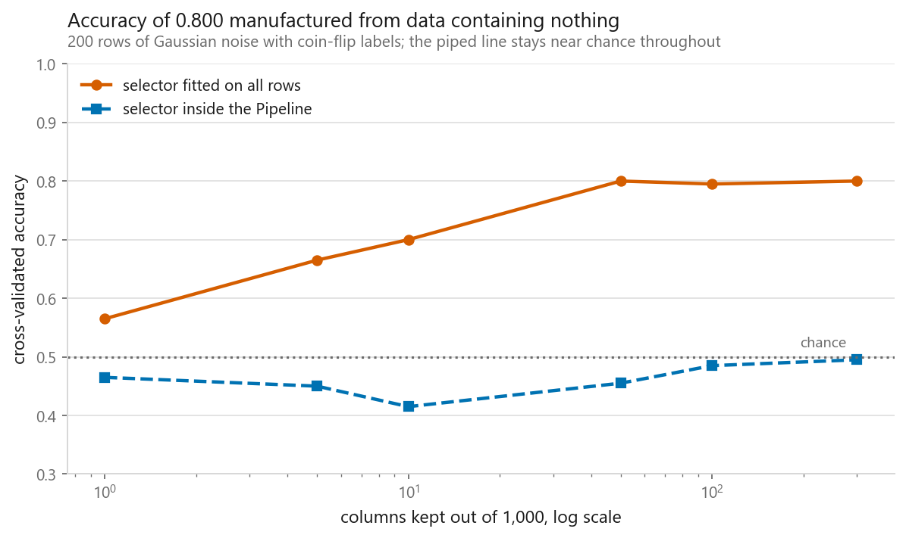
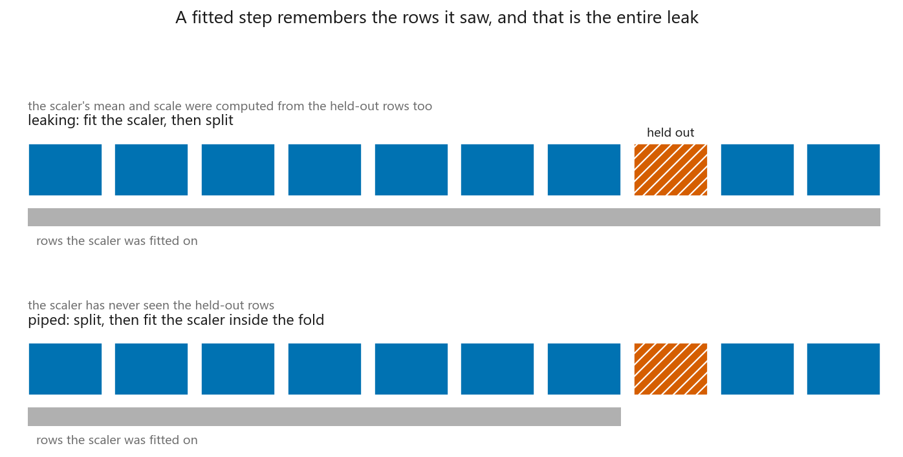
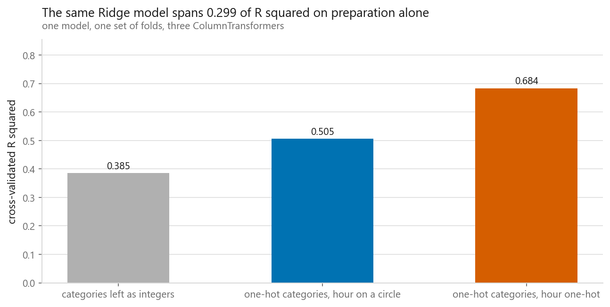

# Pipelines

### The leak every tutorial warns about was the smallest of three, by a factor of twelve

**[Open the notebook](notebook.ipynb)** · Part 12, Putting it together ·
Made by [Elyes Lounissi](https://www.linkedin.com/in/elyes-lounissi/)

| | |
|---|---|
| **What you will learn** | What a fitted preprocessing step actually remembers, why the three classic leaks differ by an order of magnitude from each other, how to write `Pipeline` yourself in twenty lines, and a `ColumnTransformer` for mixed columns you can copy |
| **You should already know** | [Cross-validation](../../01-foundations/04-cross-validation/), [feature scaling and encoding](../../01-foundations/07-feature-scaling-and-encoding/), [missing data](../../01-foundations/08-missing-data/) |
| **Datasets** | 600 California Housing districts with 400 noise columns bolted on, Bike Sharing at 17,379 rows, and one matrix of pure noise |
| **Runtime** | Two minutes on a laptop CPU. Every leak is measured as a paired difference over 20 repeated cross-validations |

---

## The result I would lead with

Three leaks, same 600 districts, same model, same metric, each measured as a
paired difference over 20 repeated cross-validations:

| Leak | Leaky R² | Honest R² | Inflation | Interval | Leaky higher in |
|---|---|---|---|---|---|
| **select** | +0.5219 | +0.4757 | **+0.0462** | [+0.0409, +0.0521] | **100%** |
| impute | +0.3921 | +0.3779 | +0.0142 | [+0.0112, +0.0174] | 100% |
| **scale** | +0.6146 | +0.6108 | **+0.0038** | [+0.0004, +0.0072] | **65%** |

`StandardScaler().fit_transform(X)` before the split is the mistake every
tutorial opens with. It is the **smallest of the three by a factor of twelve**,
its interval only cleared zero after twenty repeated cross-validations, and the
leaky version was ahead in **65% of runs**, which for a real effect is barely
better than a coin.

Push it further and it gets worse for the standard advice. The same leak against
sample size:

| Rows | Honest R² | Leaky R² | Inflation | Interval |
|---|---|---|---|---|
| 60 | +0.0165 | +0.0273 | +0.0108 | [-0.0132, +0.0360] |
| 120 | +0.3950 | +0.3726 | **-0.0224** | **[-0.0382, -0.0061]** |
| 250 | +0.4426 | +0.4542 | +0.0116 | [+0.0015, +0.0210] |
| 500 | +0.5656 | +0.5662 | +0.0006 | [-0.0037, +0.0050] |
| 1000 | +0.6613 | +0.6599 | -0.0014 | [-0.0044, +0.0013] |

**Three of the five intervals still contain zero, and at 120 rows the interval
excludes zero on the negative side**, which would say the leak improved the score.
It cannot say that. A leak has no mechanism for making a model better on average,
so the flip is a fact about the interval rather than about leakage.

Here is what went wrong, and it is a trap worth more than the result it spoiled.
Each row of that table uses one fixed subsample of that many rows, and the twelve
repeats only reshuffle the folds inside it. So the interval measures fold-shuffle
noise and stays silent about which rows I happened to draw, which at 120 rows is
much the larger source of variation. An interval answers the question you built it
to answer. It says nothing about anything you held constant. Widening it to cover
the row draw would have made every one of those five intervals several times wider,
and none of them would exclude zero.

The honest reading, which is not the one I set out to write: **fitting a scaler
before the split is a real leak, and at these sizes it is small enough that
ordinary sampling variation pushes it around and sometimes past zero.** Fix it
because fixing it is free, not because it is what went wrong with your result.

## What the expensive leak can manufacture

Now the leak that is worth being frightened of. Two hundred rows of Gaussian
noise, a thousand columns, coin-flip labels. **True accuracy by construction:
0.5.** There is nothing in the file to learn.

| Columns kept | Selector outside the loop | Selector in a `Pipeline` | Inflation |
|---|---|---|---|
| 1 | 0.5650 | 0.4650 | +0.1000 |
| 10 | 0.7000 | 0.4150 | +0.2850 |
| **50** | **0.8000** | 0.4550 | **+0.3450** |
| 100 | 0.7950 | 0.4850 | +0.3100 |
| 300 | 0.8000 | 0.4950 | +0.3050 |

**An accuracy of 0.800 on data containing nothing.** That is not a distortion of a
real result. It is a whole result, invented, and it would pass review in most
venues. The pipelined column stays where it belongs, between 0.4150 and 0.4950.

The mechanism has a closed form. With p columns of pure noise and n rows, the
largest sample correlation any of them achieves is about `√(2 ln p / n)`, because
a sample correlation behaves like a standard normal over `√n` and the maximum of
p standard normals grows like `√(2 ln p)`. On 600 rows and 400 noise columns:

| | |
|---|---|
| largest absolute correlation among the noise columns | **0.1130** |
| what `√(2 ln p / n)` predicts | 0.1413 |
| median absolute correlation among the noise columns | 0.0270 |
| the winner beats the median by | **4.2x** |

Close enough to be useful as a rule of thumb. With a few hundred columns and a
few hundred rows, the luckiest meaningless column reaches a correlation people
would call worth investigating.

And it shows up in what the leaky selector actually kept. Out of 408 columns it
chose 12:

`MedInc, HouseAge, AveRooms, AveOccup, Latitude, noise_016, noise_095, noise_096, noise_291, noise_340, noise_347, noise_375`

**Seven of the twelve are pure noise**, kept because their accidental correlation
was computed on rows the model would later be scored on.

So the ranking of the three leaks is not about which step is complicated. It is
about how much of the target crossed the boundary. Zero for the scaler, indirect
for the imputer, direct for the selector.

## The leak as a printable number

A `StandardScaler` looks like a formula and behaves like a memory: `fit` stores a
mean and a standard deviation per column, and every later `transform` uses those
stored numbers. The abstract version is that the scaler "sees" the test rows. The
concrete version is that one stored number is different.

Running five California folds by hand and printing what each scaler remembered:

| Fold | MedInc max, honest scaler | MedInc max, leaky scaler | Largest MedInc actually held out |
|---|---|---|---|
| 1 | 15.0001 | 15.0001 | 15.0001 |
| 4 | 15.0001 | 15.0001 | **9.0683** |
| 5 | 15.0001 | 15.0001 | **13.2935** |

**In 3 of 5 folds the leaky scaler's maximum came from a held-out row.** In those
folds it is dividing training rows by a number that arrived from a row the model
is about to be scored on.

Writing `Pipeline` yourself is twenty lines and worth doing once, because then the
reason it fixes this is visible in the code rather than promised in the
documentation: `fit` calls `fit_transform` on every step but the last, `predict`
calls `transform`, and the refitting happens because the cross-validator calls
`fit` on the whole chain once per fold. The hand-written version matches
scikit-learn's predictions to **0.00e+00**.

## The other reason to use `ColumnTransformer`

Bike Sharing has all three kinds of column: numeric, cyclical, categorical, plus
1,414 missing humidity values and 1,415 missing windspeed values punched in. The
transformer takes **12 columns in and produces 29 out**, cross-validating at
R² 0.5054.

Everything that could leak is inside that one object: the imputer's medians, the
scaler's means, the encoder's category list, all refitted per fold.

Then the part that has nothing to do with leakage. Same Ridge model, same folds,
differing only in how the columns are prepared:

| Preparation | R² |
|---|---|
| categories left as integers | **0.3849** |
| one-hot categories, hour on a circle | 0.5054 |
| one-hot categories, hour one-hot | **0.6835** |

**The model never changed and the score moved 0.2986.** That is larger than most
of the model-choice differences in [the scoreboard](../01-the-scoreboard/), and
all of it came from the `ColumnTransformer`.

It is also worth noting the middle row against the last. Putting the hour on a
circle, which is the elegant answer and the one usually recommended, scored
**0.1781 below** simply one-hotting all 24 hours. The circle imposes that
consecutive hours are similar, and hourly bike demand does not respect that at
7am and 8am.

One line inside that object is worth pausing on: `handle_unknown="ignore"`. A
category present in the test fold and absent from the training fold otherwise
raises, and the tempting fix at that moment is to fit the encoder on everything
to make the error go away. That fix is the leak.

## Cheat sheet

| | |
|---|---|
| **The rule** | If it has `fit`, it goes in the `Pipeline`. No exceptions, including the ones that seem harmless |
| **Why** | A cross-validator calls `fit` on the chain, so every step is refitted on the training fold alone |
| **Cheap leaks** | Scalers. +0.0038 R² here, and 3 of 5 sample sizes could not tell it from zero |
| **Expensive leaks** | Anything that reads the target. A selector fitted outside the loop reached 0.800 accuracy on random labels |
| **The rule of thumb** | The best of p null columns correlates at about `√(2 ln p / n)`. It hit 0.1130 with 400 columns and 600 rows |
| **Measuring a leak** | Paired differences over repeated cross-validation with an interval. One run cannot separate a small leak from fold noise, and one here pointed the wrong way |
| **Reading an interval** | It covers only what you resampled. Mine reshuffled folds inside a fixed subsample, which is why a tiny effect changed sign down the size sweep |
| **Mixed columns** | `ColumnTransformer`, with a `Pipeline` per block |
| **Unknown categories** | `handle_unknown="ignore"`. Never fix the error by fitting the encoder on everything |
| **Not an object** | Any decision made after looking at a plot of the whole dataset. Those cannot be piped and they leak the same way |
| **Also worth it** | Preparation moved R² by 0.2986 on one model here. The transformer makes that comparable and searchable |
| **Naming steps** | Names become the grid-search prefix, so `model__alpha` reaches `Ridge(alpha=...)` |
| **Next** | [Saving and serving](../04-saving-and-serving/), where the thing you save is this whole object rather than the estimator |

---

If this chapter was useful, a star on the repository helps other people find it.
The code is yours to use, copy and adapt in your own work, no permission needed.

Made by **Elyes Lounissi** ·
[LinkedIn](https://www.linkedin.com/in/elyes-lounissi/) ·
[pilot.tun@gmail.com](mailto:pilot.tun@gmail.com)

Back to [Part 12](../) · [the curriculum](../../CURRICULUM.md) · [the book](../../README.md)

`#DataLeakage` `#Pipeline` `#ColumnTransformer` `#ScikitLearn`
`#FeatureEngineering` `#CrossValidation` `#FeatureSelection` `#MachineLearning`
`#MLTutorial` `#LearnMachineLearning` `#DataScience` `#AI`
