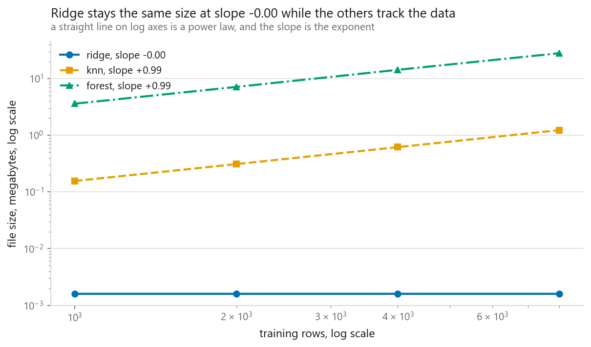
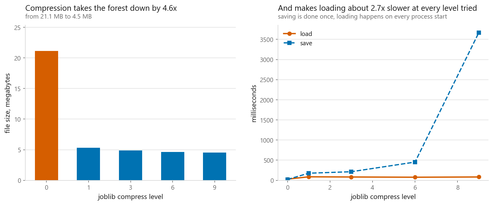
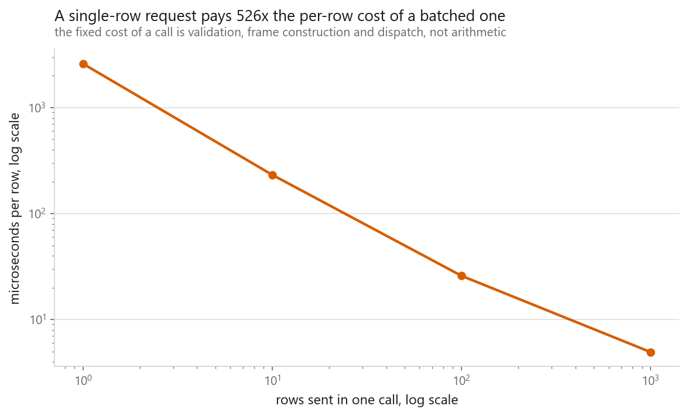

# Saving and serving

### A model loaded under a version four majors out of date, predicted identically, and warned into a void

**[Open the notebook](notebook.ipynb)** · Part 12, Putting it together ·
Made by [Elyes Lounissi](https://www.linkedin.com/in/elyes-lounissi/)

| | |
|---|---|
| **What you will learn** | What a pickle actually contains, how to predict a model's file size before saving it, what happens when a model is loaded under a different library version or without the class it needs, what compression costs at load time, and how to write a prediction service that checks itself on startup |
| **You should already know** | [Pipelines](../03-pipelines/), and enough Python to read a class definition |
| **Dataset** | California Housing, 6,000 training rows and 8 features. Every file written goes to a temporary directory, not into the repository |
| **Runtime** | One to two minutes on a laptop CPU. scikit-learn 1.8.0, joblib 1.5.3 |

---

## The result I would lead with

scikit-learn stamps its own version into every estimator and warns on load when
the stamp does not match. The notebook takes a real pickle and edits that
recorded version in place, byte for byte, from **1.8.0 to 0.8.0**, leaving
everything else untouched.

| | |
|---|---|
| warnings raised on load | **3**, one each for `StandardScaler`, `Ridge` and `Pipeline` |
| did the model load | **yes** |
| largest prediction difference | **0.000e+00** |

**The load succeeded, the predictions are identical to the last bit, and the only
evidence that anything is wrong is a warning that most production code has
configured away.**

Nothing changed here because only the stamp was edited. That is the point. Across
a real version gap the risk is that an attribute was renamed, a default changed,
or an internal array grew a dimension, and the object **still constructs**,
because pickle only fills in a dictionary. Then the estimator behaves like
something nobody tested, and the warning is the only thing between that and a
silent wrong answer.

This is why the service in section 5 asserts a known input against a known output
rather than trusting metadata. That check costs one stored row and it is the only
one in the chapter that verifies behaviour instead of a label.

## What each model is carrying

The training table itself is **0.528 MB** in memory. Against that:

| Model | MB on disk | Times the training data | Held-out RMSE |
|---|---|---|---|
| ridge | 0.002 | 0.00 | 0.7509 |
| knn | 0.907 | **1.72** | 0.6179 |
| hist boosting | 0.379 | 0.72 | **0.4429** |
| forest | **21.107** | **39.98** | 0.4698 |

The k-NN pipeline is the honest one: it has no parameters, so the training data
**is** the model, and its file is 1.72x the table it was fitted on.

The forest is the one to think about before deploying. It is **40x the training
data**, and it is beaten on accuracy by a boosted model **56x smaller**, 0.379 MB
against 21.107. That file has to be fetched, held in memory by every worker
process, and paid for again on every restart and every autoscale event.


For a tree ensemble the size is arithmetic rather than mystery. Each node costs 64
bytes of record plus 8 bytes of leaf value, so 72 bytes per node:

| Trees | Total nodes | Predicted MB | Measured MB | Ratio |
|---|---|---|---|---|
| 5 | 36,579 | 2.634 | 2.637 | 1.0012 |
| 10 | 73,146 | 5.267 | 5.271 | 1.0009 |
| 20 | 146,422 | 10.542 | 10.550 | 1.0007 |
| 40 | 292,954 | 21.093 | 21.107 | 1.0007 |


**Node count predicts the file to within 0.09%.** There is no compression and no
cleverness in the default format: whatever the model is carrying, you pay for it
byte for byte.

## Which files grow with your data

The table above is one training-set size. The axis a project actually moves along
is the number of rows, and the three models behave completely differently on it:

| Training rows | forest MB | knn MB | ridge MB |
|---|---|---|---|
| 1,000 | 3.6204 | 0.1564 | 0.0016 |
| 2,000 | 7.1579 | 0.3107 | 0.0016 |
| 4,000 | 14.3472 | 0.6191 | 0.0016 |
| 8,000 | 28.1642 | 1.2361 | 0.0016 |



Fitting a straight line to log size against log rows gives the exponent directly:
**ridge -0.000, knn +0.994, forest +0.988**. A slope of one means the file is a
copy of your dataset by another name; a slope of zero means the file does not know
how much data it was fitted on.

That is the deployment consequence of the model choice made back in [the
scoreboard](../01-the-scoreboard/). A linear model's serving cost is fixed
forever. A forest's serving cost is a function of your training set, so it grows
every time the data does, and nobody notices until an autoscale event.

## Format: measure it rather than inherit the advice

Four fitted pipelines, each written both ways:

| Model | Format | MB | Save ms | Load ms |
|---|---|---|---|---|
| ridge | joblib | 0.002 | 1.3 | 0.5 |
| ridge | **pickle** | **0.001** | 0.7 | **0.1** |
| knn | joblib | 0.907 | 3.6 | 1.0 |
| knn | **pickle** | **0.523** | 1.5 | **0.3** |
| forest | joblib | 21.107 | 22.4 | 37.4 |
| forest | **pickle** | 21.104 | 30.4 | **24.0** |
| hist boosting | joblib | 0.379 | 16.0 | 10.4 |
| hist boosting | **pickle** | **0.371** | 2.1 | **1.1** |

The standing advice is that joblib is the default because it specialises in NumPy
arrays. On these four models it produced the larger file every time and the slower
load every time.

Two of those eight rows are worth taking seriously and two are not. The ridge and
k-NN load times are tenths of a millisecond apart, which is one timing on one
machine and not a difference. The k-NN **file size** is a difference: 0.907 MB
against 0.523 is structural, reproducible and has nothing to do with the clock.
And the boosted model loading in 10.4 ms against 1.1 is nearly a factor of ten,
far outside anything a timer would invent.

So the conclusion is narrower than "use pickle". It is that format advice is worth
measuring on your own model rather than inherited, and that the measurement is
four lines.

## Compression: the decision is whether, not how much



The 21 MB forest at every compression level:

| compress | MB | Save ms | Load ms |
|---|---|---|---|
| 0 | 21.107 | **21.8** | **36.3** |
| 1 | 5.316 | 206.2 | 97.2 |
| 3 | 4.887 | 241.7 | 91.4 |
| 6 | 4.623 | 519.3 | 97.8 |
| 9 | 4.544 | **4205.3** | 89.4 |

The usual advice is right about direction. Turning compression on at all cut the
file by roughly four times and roughly tripled the load. Compress when the file
has to travel, over a network or into a container image. Do not compress when a
worker reloads on every restart and the restart budget is what you are protecting.

**The part nobody mentions is that the level barely matters.** Between
`compress=1` and `compress=9` the file shrinks by well under a megabyte, and the
four load times sit inside a spread of about 8 ms on measurements of around 90,
which is timer noise rather than a trend. I nearly wrote a paragraph claiming load
time improves as compression rises, because the numbers happen to fall from 97.2
to 89.4 if you read only the first and last rows. The middle rows go back up. That
is not a trend, it is four draws from the same distribution.

What the level does change is the save side, and there the numbers are not
ambiguous: level 9 cost **4,205.3 ms against 206.2** at level 1, twenty times the
work, for less than a megabyte. If you compress, take level 1 or 3 and stop
thinking about it.

## Two other ways it breaks

**The class is no longer importable.** A pipeline containing a custom `Winsoriser`
transformer, defined in the notebook, saves cleanly at 1,457 bytes and scores RMSE
0.6514. The file records the class as `__main__.Winsoriser`. Delete that name and
the load fails:

`AttributeError: Can't get attribute 'Winsoriser' on <module '__main__'>`

Restore the name and it loads again. The file contains a **pointer**, not code, so
the thing it points at has to keep existing at the same address. The fix is not a
serialisation trick: put custom classes in an importable, versioned module that
ships alongside the model, and never define a transformer in the notebook you
intend to save from.

**Loading a pickle runs code.** The disassembly of the ridge pipeline is 312 lines
for 1,256 bytes, and the first instructions are the whole mechanism:

```
11: SHORT_BINUNICODE 'sklearn.pipeline'
30: SHORT_BINUNICODE 'Pipeline'
41: STACK_GLOBAL
44: NEWOBJ
```

`STACK_GLOBAL` after two strings is import-and-look-up. That pair of strings is the
entire dependency the file has on your environment, and it is also why the
`Winsoriser` load could be broken by removing one name. Constructing objects means
calling things, so a model file from an untrusted source is an executable from an
untrusted source. No flag makes it safe.

## Saving without pickle at all

A fitted linear pipeline is four arrays and a list of names. Write those out and
there is nothing left to be incompatible:

| | Bytes |
|---|---|
| npz | 1,194 |
| json | 270 |
| **joblib, same pipeline** | **1,601** |

Predictions from the hand-rolled loader against the real pipeline over 2,000 rows:
**largest disagreement 0.000e+00**.

Two files, no classes, no version stamp, smaller than the pickle, and it will still
load in ten years and from another language. The cost is that it only covers models
whose arithmetic you can write out, which rules out any ensemble. That is precisely
the trade ONNX and PMML make at a larger scale.

## A prediction service is a validation problem

The unit that gets saved is not the estimator. It is a **bundle**: the fitted
pipeline plus everything a loader needs to check it is holding what it thinks it is
holding. The bundle here is 0.380 MB and carries a golden input whose recorded
output is **0.553482**.

On startup: `golden test passed, drift 0.00e+00`.

Then the request handler, which imports no framework:

| Input | Response |
|---|---|
| valid payload | `prediction 0.5534818281985154`, units, empty flag list |
| a field is missing | `missing fields: ['Longitude']` |
| an extra field | `unexpected fields: ['Bedrooms']` |
| text where a number belongs | `field 'MedInc' is not a number: 'eight thousand'` |
| a NaN | `field 'HouseAge' is not finite: nan` |
| **absurd but well-formed** | `prediction 3.3408, outside training range: ['MedInc', 'AveRooms']` |

The last row is the one worth arguing about. The model answered a question about a
district with ninety times the state's median income and four hundred rooms per
house, and it answered **without hesitating**, because nothing in a fitted
estimator knows what it has not seen. Returning the flag next to the number is the
cheapest honesty available at serving time.

## Latency is not about the model



| Rows per call | Total ms | Microseconds per row |
|---|---|---|
| 1 | 2.53 | **2527.0** |
| 10 | 1.78 | 178.2 |
| 100 | 2.00 | 20.0 |
| 1,000 | 4.24 | **4.2** |

Read the total column before the per-row one. Sending 1 row, 10 rows and 100 rows
all took about two milliseconds, and the ten-row call came out **faster** than the
one-row call, which is only possible if neither of them is doing any measurable
arithmetic. The fixed cost of a call is building a DataFrame, walking the
pipeline's steps and dispatching into NumPy, and it costs the same either way.

The headline ratio, **597x per row between one row and a thousand**, follows from
that and should be read as an order of magnitude rather than a measurement. It is
two timings of a few milliseconds divided, and another machine would produce a
different number with the same shape.

The shape is what matters: if a service is slow, **batching is the first thing to
try and a smaller model is the last**. Swapping this boosted model for a ridge
would remove almost none of a single-row request, because almost none of it is the
model.

## Cheat sheet

| | |
|---|---|
| **Save the pipeline** | Not the estimator. The preprocessing is part of the model, see [12-03](../03-pipelines/) |
| **Save a bundle** | Model plus feature names, dtypes, ranges, library versions, and one golden input with its recorded output |
| **The check that matters** | The golden input. A version mismatch loaded, predicted identically and only warned |
| **Custom classes** | In an importable, versioned module. Never defined in the notebook you save from |
| **Never load** | A model file you did not produce. Unpickling runs code, and no flag changes that |
| **Format** | Measure it. joblib was larger and slower to load than plain pickle on all four models here, and two of the four gaps are big enough to believe |
| **File size** | For trees, node count times 72 bytes. Predicted the file to within 0.09% |
| **File growth** | Slope of log size against log rows: ridge -0.00, knn +0.99, forest +0.99. Only one of those is a fixed serving cost |
| **Check what it carries** | The forest was 40x the training table and lost on accuracy to a model 56x smaller |
| **Compression** | Roughly 3x on load against uncompressed. Above that the level is noise on load and 20x on save, so take 1 or 3 |
| **Validation** | Missing and unexpected fields both raise. Out-of-range values return a flag, because the model will answer regardless |
| **Latency** | One row and a hundred rows took the same wall clock. Batch before you shrink the model |
| **Next** | [The mistakes everybody makes](../05-common-mistakes/), which closes the book |

---

If this chapter was useful, a star on the repository helps other people find it.
The code is yours to use, copy and adapt in your own work, no permission needed.

Made by **Elyes Lounissi** ·
[LinkedIn](https://www.linkedin.com/in/elyes-lounissi/) ·
[pilot.tun@gmail.com](mailto:pilot.tun@gmail.com)

Back to [Part 12](../) · [the curriculum](../../CURRICULUM.md) · [the book](../../README.md)

`#MLOps` `#ModelServing` `#joblib` `#Pickle` `#ScikitLearn` `#ModelDeployment`
`#Serialization` `#CaliforniaHousing` `#MachineLearning` `#MLTutorial`
`#LearnMachineLearning` `#DataScience` `#AI`
