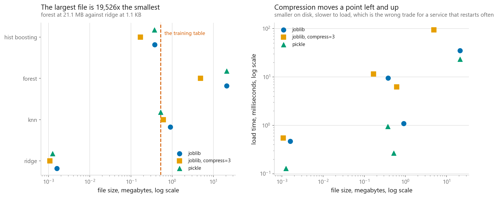
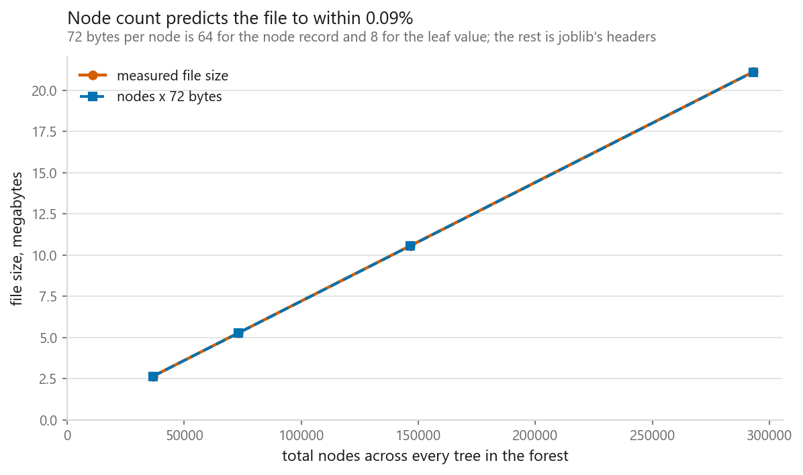
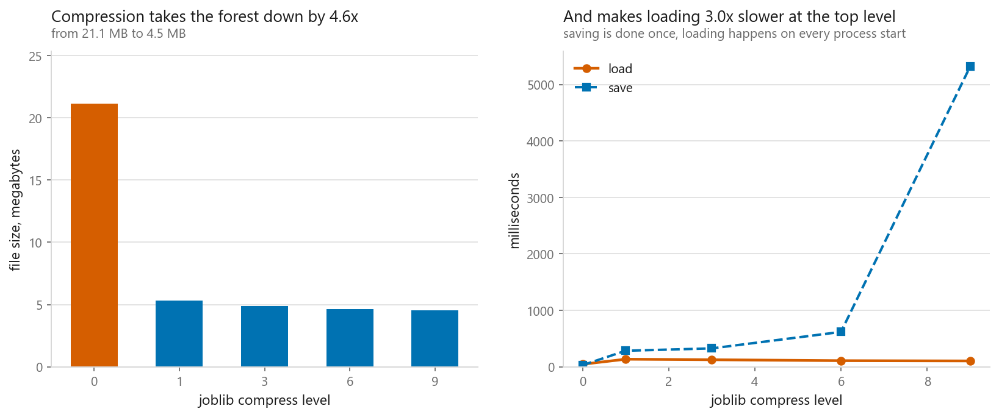
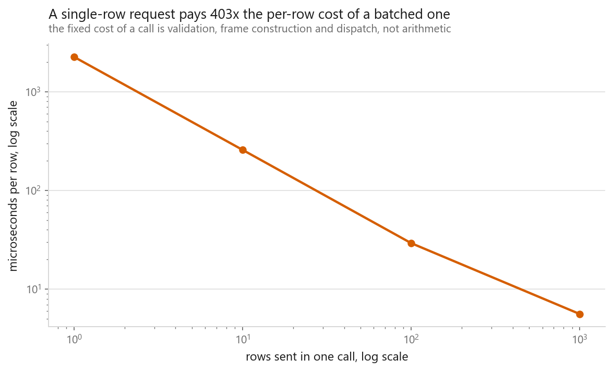

# Saving and serving

### A model loaded under a version four majors out of date, predicted identically, and warned into a void

**[Open the notebook](notebook.ipynb)** · Part 12, Putting it together ·
Made by [Elyes Lounissi](https://www.linkedin.com/in/elyes-lounissi/)

| | |
|---|---|
| **What you will learn** | What a pickle actually contains, how to predict a model's file size before saving it, what happens when a model is loaded under a different library version or without the class it needs, what compression costs at load time, and how to write a prediction service that checks itself on startup |
| **You should already know** | [Pipelines](../03-pipelines/), and enough Python to read a class definition |
| **Dataset** | California Housing, 6,000 training rows and 8 features. Every file written goes to a temporary directory, not into the repository |
| **Runtime** | One to two minutes on a laptop CPU. scikit-learn 1.8.0, joblib 1.5.3 |

---

## The result I would lead with

scikit-learn stamps its own version into every estimator and warns on load when
the stamp does not match. The notebook takes a real pickle and edits that
recorded version in place, byte for byte, from **1.8.0 to 0.8.0**, leaving
everything else untouched.

| | |
|---|---|
| warnings raised on load | **3**, one each for `StandardScaler`, `Ridge` and `Pipeline` |
| did the model load | **yes** |
| largest prediction difference | **0.000e+00** |

**The load succeeded, the predictions are identical to the last bit, and the
only evidence that anything is wrong is a warning that most production code has
configured away.**

Nothing changed here because only the stamp was edited. That is the point. Across
a real version gap the risk is that an attribute was renamed, a default changed,
or an internal array grew a dimension, and the object **still constructs**,
because pickle only fills in a dictionary. Then the estimator behaves like
something nobody tested and the warning is the only thing between that and a
silent wrong answer.

This is why the service in section 5 asserts a known input against a known
output rather than trusting metadata. That check costs one stored row and it is
the only one in the chapter that verifies behaviour instead of a label.

## The recommended format lost to the one it replaced

Four fitted pipelines, each written both ways:

| Model | Format | MB | Save ms | Load ms |
|---|---|---|---|---|
| ridge | joblib | 0.002 | 1.5 | 0.5 |
| ridge | **pickle** | **0.001** | 2.7 | **0.1** |
| knn | joblib | 0.907 | 2.9 | 1.2 |
| knn | **pickle** | **0.523** | 1.9 | **0.3** |
| forest | joblib | 21.107 | 24.6 | 38.3 |
| forest | **pickle** | 21.104 | 34.0 | **27.6** |
| hist boosting | joblib | 0.379 | 20.7 | 11.8 |
| hist boosting | **pickle** | **0.371** | 2.5 | **1.1** |

The standing advice, which this notebook's own summary table repeats, is that
joblib is the default because it specialises in NumPy arrays. On these four
models it produced **the larger file every time and the slower load every time**.
On the k-NN pipeline the joblib file is 73% bigger, 0.907 MB against 0.523. On
the boosted model it loaded in 11.8 ms against pickle's 1.1.

These are single measurements on one machine and the two smallest rows are
sub-millisecond, so I would not read the ridge row as evidence of anything. The
forest and boosting rows are large enough to take seriously, and they point the
same way as the other two.

What I would take from it is narrower than "use pickle". It is that the format
advice is worth measuring on your own model rather than inherited, and that the
measurement is four lines.



## What each model is carrying

The training table itself is **0.528 MB** in memory. Against that:

| Model | MB on disk | Times the training data | Held-out RMSE |
|---|---|---|---|
| ridge | 0.002 | 0.00 | 0.7509 |
| knn | 0.907 | **1.72** | 0.6179 |
| hist boosting | 0.379 | 0.72 | **0.4429** |
| forest | **21.107** | **39.98** | 0.4698 |

The k-NN pipeline is the honest one: it has no parameters, so the training data
**is** the model, and its file is 1.72x the table it was fitted on.

The forest is the one to think about before deploying. It is **40x the training
data**, and it is beaten on accuracy by a boosted model that is **56x smaller**,
0.379 MB against 21.107. That file has to be fetched, held in memory by every
worker process, and paid for again on every restart and every autoscale event.

For a tree ensemble the size is arithmetic rather than mystery. Each node costs
64 bytes of record plus 8 bytes of leaf value, so 72 bytes per node:

| Trees | Total nodes | Predicted MB | Measured MB | Ratio |
|---|---|---|---|---|
| 5 | 36,579 | 2.634 | 2.637 | 1.0012 |
| 10 | 73,146 | 5.267 | 5.271 | 1.0009 |
| 20 | 146,422 | 10.542 | 10.550 | 1.0007 |
| 40 | 292,954 | 21.093 | 21.107 | 1.0007 |



**Node count predicts the file to within 0.12%.** There is no compression and no
cleverness in the default format: whatever the model is carrying, you pay for it
byte for byte.

## Compression, where the trade goes the other way inside itself



The 21 MB forest at every compression level:

| compress | MB | Save ms | Load ms |
|---|---|---|---|
| 0 | 21.107 | **28.8** | **45.2** |
| 1 | 5.316 | 284.2 | **134.7** |
| 3 | 4.887 | 326.1 | 125.4 |
| 6 | 4.623 | 618.0 | 108.4 |
| 9 | 4.544 | **5322.7** | **104.0** |

Two things, and the second is the one nobody mentions.

Turning compression on at all costs 3x the load time, 45.2 ms to 134.7. That is
the trade everybody describes: compress when the file has to travel over a
network or into a container image, do not compress when a worker reloads on every
restart.

**Then load time falls as compression rises.** From `compress=1` to `compress=9`
the file goes from 5.316 MB to 4.544 and the load from 134.7 ms to 104.0. The
decompressor has less to read, and at these levels that outweighs the extra work
per byte. If you have already decided to compress, `compress=3` is the worst
common choice on load time and the middle choice on everything else.

The save side is where level 9 bills you: **5,322.7 ms against 326.1**, sixteen
times, for 0.343 MB.

## Two other ways it breaks

**The class is no longer importable.** A pipeline containing a custom
`Winsoriser` transformer, defined in the notebook, saves cleanly at 1,457 bytes
and scores RMSE 0.6514. The file records the class as `__main__.Winsoriser`.
Delete that name and the load fails:

`AttributeError: Can't get attribute 'Winsoriser' on <module '__main__'>`

Restore the name and it loads again. The file contains a **pointer**, not code,
so the thing it points at has to keep existing at the same address. The fix is
not a serialisation trick: put custom classes in an importable, versioned module
that ships alongside the model, and never define a transformer in the notebook
you intend to save from.

**Loading a pickle runs code.** The disassembly of the ridge pipeline is 312
lines for 1,256 bytes, and the first instructions are the whole mechanism:

```
11: SHORT_BINUNICODE 'sklearn.pipeline'
30: SHORT_BINUNICODE 'Pipeline'
41: STACK_GLOBAL
44: NEWOBJ
```

`STACK_GLOBAL` after two strings is import-and-look-up. That pair of strings is
the entire dependency the file has on your environment, and it is also why the
`Winsoriser` load could be broken by removing one name. Constructing objects
means calling things, so a model file from an untrusted source is an executable
from an untrusted source. No flag makes it safe.

## Saving without pickle at all

A fitted linear pipeline is four arrays and a list of names. Write those out and
there is nothing left to be incompatible:

| | Bytes |
|---|---|
| npz | 1,194 |
| json | 270 |
| **joblib, same pipeline** | **1,601** |

Predictions from the hand-rolled loader against the real pipeline over 2,000
rows: **largest disagreement 0.000e+00**.

Two files, no classes, no version stamp, smaller than the pickle, and it will
still load in ten years and from another language. The cost is that it only
covers models whose arithmetic you can write out, which rules out any ensemble.
That is precisely the trade ONNX and PMML make at a larger scale.

## A prediction service is a validation problem

The unit that gets saved is not the estimator. It is a **bundle**: the fitted
pipeline plus everything a loader needs to check it is holding what it thinks it
is holding. The bundle here is 0.380 MB and carries a golden input whose recorded
output is **0.553482**.

On startup: `golden test passed, drift 0.00e+00`.

Then the request handler, which imports no framework:

| Input | Response |
|---|---|
| valid payload | `prediction 0.5534818281985154`, units, empty flag list |
| a field is missing | `missing fields: ['Longitude']` |
| an extra field | `unexpected fields: ['Bedrooms']` |
| text where a number belongs | `field 'MedInc' is not a number: 'eight thousand'` |
| a NaN | `field 'HouseAge' is not finite: nan` |
| **absurd but well-formed** | `prediction 3.3408, outside training range: ['MedInc', 'AveRooms']` |

The last row is the one worth arguing about. The model answered a question about
a district with ninety times the state's median income and four hundred rooms per
house, and it answered **without hesitating**, because nothing in a fitted
estimator knows what it has not seen. Returning the flag next to the number is
the cheapest honesty available at serving time.

## Latency is not about the model



| Rows per call | Total ms | Microseconds per row |
|---|---|---|
| 1 | 2.26 | **2260.5** |
| 10 | 2.58 | 258.1 |
| 100 | 2.93 | 29.3 |
| 1,000 | 5.61 | **5.6** |

**One row at a time costs 403x as much per row as a batch of 1,000.** Going from
1 row to 1,000 multiplied the work by a thousand and the clock by 2.5.

Almost none of the single-row time is spent computing. It is spent building a
one-row DataFrame and walking the pipeline, and the arithmetic is a rounding
error against that. If a service is slow, **batching is the first thing to try
and a smaller model is the last**.

## Cheat sheet

| | |
|---|---|
| **Save the pipeline** | Not the estimator. The preprocessing is part of the model, see [12-03](../03-pipelines/) |
| **Save a bundle** | Model plus feature names, dtypes, ranges, library versions, and one golden input with its recorded output |
| **The check that matters** | The golden input. A version mismatch loaded, predicted identically and only warned |
| **Custom classes** | In an importable, versioned module. Never defined in the notebook you save from |
| **Never load** | A model file you did not produce. Unpickling runs code, and no flag changes that |
| **Format** | Measure it. joblib was larger and slower to load than plain pickle on all four models here |
| **File size** | For trees, node count times 72 bytes. Predicted the file to within 0.12% |
| **Check what it carries** | The forest was 40x the training table and lost on accuracy to a model 56x smaller |
| **Compression** | Costs 3x on load against uncompressed. Above that, higher levels load faster, and level 9 costs 16x on save |
| **Validation** | Missing and unexpected fields both raise. Out-of-range values return a flag, because the model will answer regardless |
| **Latency** | Per-row cost collapses with batch size, 403x here. Fixed per-call overhead dominates a single-row request |
| **Next** | [The mistakes everybody makes](../05-common-mistakes/), which closes the book |

---

Made by **Elyes Lounissi** ·
[LinkedIn](https://www.linkedin.com/in/elyes-lounissi/) ·
[pilot.tun@gmail.com](mailto:pilot.tun@gmail.com)

Back to [Part 12](../) · [the curriculum](../../CURRICULUM.md) · [the book](../../README.md)

`#MLOps` `#ModelServing` `#joblib` `#Pickle` `#ScikitLearn` `#ModelDeployment`
`#Serialization` `#CaliforniaHousing` `#MachineLearning` `#MLTutorial`
`#LearnMachineLearning` `#DataScience` `#AI`
