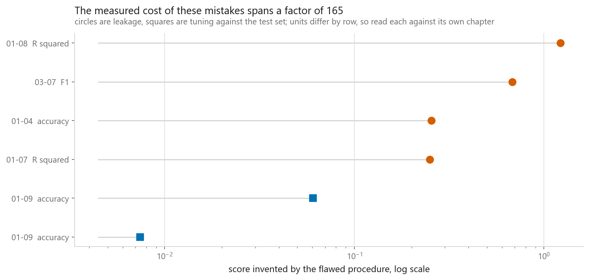
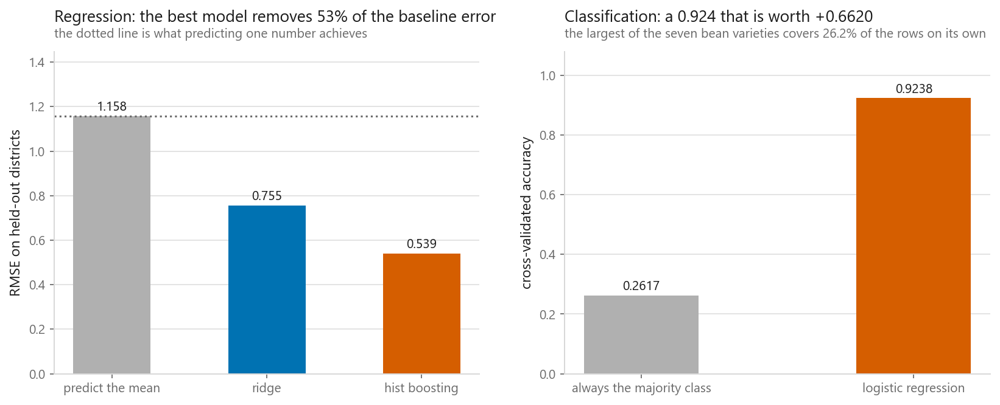
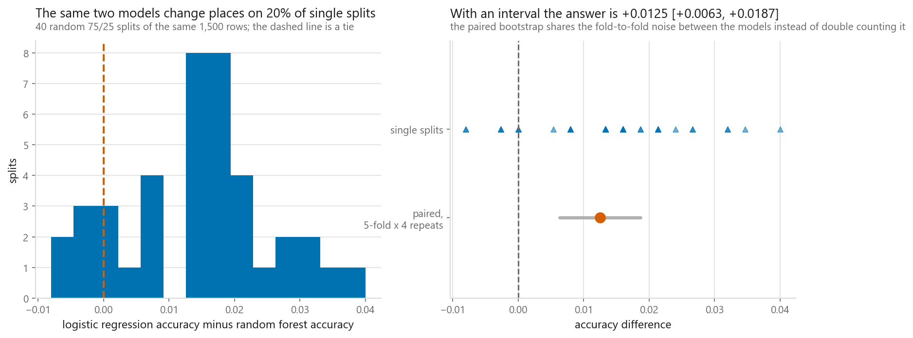
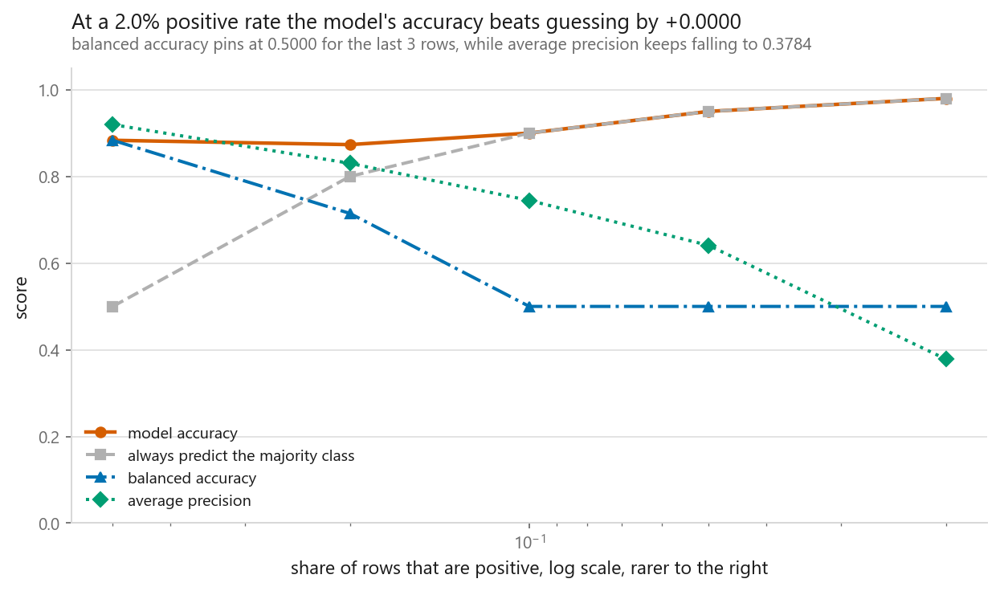
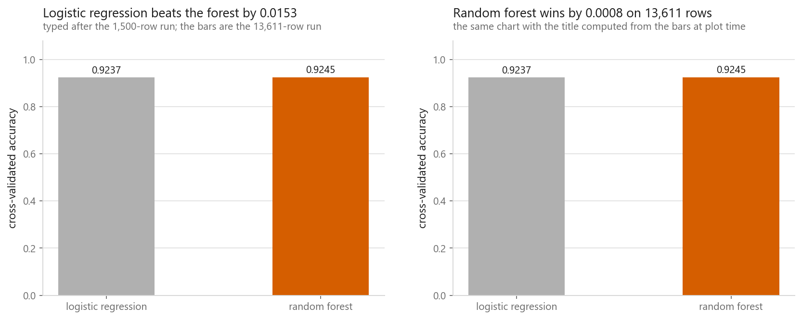

# The mistakes everybody makes

### The loudest-warned mistake invented 0.0074 accuracy. A quiet one invented 1.2226 R squared

**[Open the notebook](notebook.ipynb)** · Part 12, Putting it together ·
Made by [Elyes Lounissi](https://www.linkedin.com/in/elyes-lounissi/)

| | |
|---|---|
| **What you will learn** | The failures that produce most wrong results in applied machine learning, what each one cost when this book measured it, which chapter to reread for the mechanism, and a printed checklist to copy |
| **You should already know** | Nothing new. This chapter is the index to everything already measured |
| **Datasets** | UCI Dry Bean and California Housing, for the four demonstrations run here |
| **Runtime** | Under two minutes on a laptop CPU |

---

## The result I would lead with

Every entry on the ledger is something this book measured, with a chapter that
shows the measurement, and the `invented` column marks the rows where the
quantity is a score that did not exist: the difference between what a flawed
procedure reported and what an honest one reported on the same data.

| Mistake | Chapter | What was measured | Invented |
|---|---|---|---|
| **leaking a fitted step** | **01-08** | **R squared manufactured by a KNN imputer fitted before the split** | **1.2226** |
| leaking a fitted step | 03-07 | F1 manufactured by oversampling before the split | 0.6810 |
| leaking a fitted step | 01-04 | accuracy manufactured on pure noise by selecting columns outside the loop | 0.2550 |
| leaking a fitted step | 01-07 | R squared manufactured by target encoding computed in-fold, on a noise column | 0.2502 |
| tuning against the test set | 01-09 | simulated: 500 candidates all truly worth 0.900, best one reported | 0.0606 |
| **tuning against the test set** | **01-09** | **a grid search's own best score against nested cross-validation** | **0.0074** |



**The mistakes people warn about loudest are not the ones that cost the most.**
Tuning against the test set is the one everybody has heard of, and in a real grid
search it inflated the reported accuracy by 0.0074. A `KNNImputer` fitted before
the split, which nobody writes a blog post about, manufactured 1.2226 of R
squared out of nothing. An invented R squared above one is not a small
exaggeration of a real result. There was no result.

The rest of the ledger records real costs rather than invented scores:

| Mistake | Chapter | What was measured | Value |
|---|---|---|---|
| accuracy on unbalanced classes | 01-05 | margin of a real model over always predicting negative, at 1% positives | 0.0030 |
| accuracy on unbalanced classes | 03-07 | the same margin at a 1.66% positive rate | 0.0092 |
| importance read as causation | 12-02 | impurity importance handed to a column of pure noise, against 0.0276 for a real feature | 0.0214 |
| importance read as causation | 12-02 | permutation importance of one feature alone, against 0.7990 for it and its twin together | 0.2502 |
| no baseline | 02-01 | RMSE of predicting the mean, against 0.726 for linear regression | 1.1540 |
| one split, no interval | 01-04 | spread of a single 80/20 split over 200 seeds, against 0.0074 for 5-fold | 0.0226 |
| variance without the signal | 11-07 | noise-to-signal ratio after lowering gamma cut raw variance by more than 100x | 71.0700 |
| a training curve is not a policy | 07-06 | test accuracy at the validation-loss minimum, epoch 9, against 0.8170 at epoch 18 | 0.7963 |
| a training curve is not a policy | 07-06 | accuracy reported when `model.eval()` is forgotten at batch size 8, true value 0.7533 | 0.6426 |

`distinct mistakes on the ledger : 8`
`chapters cited                  : 10`

Treating all of them as equally fatal is how people end up fixing the cheap ones
and shipping the expensive ones.

## No baseline



A score without the score of doing nothing beside it cannot be interpreted,
whether it looks good or bad. On California Housing:

| Model | RMSE | % of the baseline error removed |
|---|---|---|
| predict the mean | 1.1578 | +0.0 |
| ridge | 0.7552 | +34.8 |
| hist boosting | **0.5391** | **+53.4** |

On seven bean varieties over 4,000 rows, the largest class is DERMASON at
**26.17%** of rows, so always predicting the majority scores **0.2617** and
logistic regression scores **0.9238**, a margin of **+0.6620**.

Both margins are wide, which is what a healthy result looks like: the model is
doing the work rather than inheriting it from the shape of the data. The reason
to print the baseline anyway is that you cannot tell a wide margin from a narrow
one without it, and the narrow case does not announce itself.

## One split, no interval



Two models, one train and test split, one number each, whichever is larger wins.
This is how almost every model comparison in the world is made. Over 1,500 bean
rows and 40 single splits:

| | |
|---|---|
| logistic regression ahead in | **80.0% of splits** |
| mean difference | +0.0139 |
| standard deviation | 0.0114 |
| most flattering split | **+0.0400** |
| least flattering split | **-0.0080** |
| range across seeds | 0.0480 |

The same comparison with repeated folds and a paired interval:

| | |
|---|---|
| logistic regression, 5-fold x 4 repeats | 0.9180 |
| random forest, the same folds | 0.9055 |
| paired difference | **+0.0125 [+0.0063, +0.0187]** |
| interval excludes zero | True |

The interval settles it and the honest sentence is longer than people want it to
be: on fifteen hundred bean rows logistic regression beats this forest by
+0.0125, and a single split named it the winner in only 80.0% of tries, with the
most flattering one reporting +0.0400 and the least flattering one reporting a
loss of -0.0080. `toolkit.evaluate.paired_ci` is four lines and removes the
excuse.

## Accuracy on unbalanced classes



The same model, the same features and the same number of positive rows, varying
only how many negatives are in the room:

| Positive rate | Rows | Majority class accuracy | Model accuracy | Margin | Balanced accuracy | Average precision |
|---|---|---|---|---|---|---|
| 50.00% | 240 | 0.5000 | 0.8833 | **+0.3833** | 0.8833 | 0.9195 |
| 20.00% | 600 | 0.8000 | 0.8733 | +0.0733 | 0.7146 | 0.8302 |
| 10.00% | 1200 | 0.9000 | 0.9000 | **+0.0000** | **0.5000** | 0.7445 |
| 5.00% | 2400 | 0.9500 | 0.9500 | **+0.0000** | **0.5000** | 0.6408 |
| 2.00% | 6000 | 0.9800 | 0.9800 | **+0.0000** | **0.5000** | 0.3784 |

**At a 2.00% positive rate the model reports 0.9800 accuracy and beats the
majority-class baseline by exactly nothing.** Balanced accuracy pins at 0.5000
from the 10.00% row down, which is what it says when a model has stopped
predicting the positive class at all at a threshold of one half. Average
precision is the only column still moving at the bottom of the sweep, falling to
0.3784, and it is the one that ignores the pile of true negatives entirely.

[03-07](../../03-classification/07-imbalanced-classes/) is the chapter about what
to do instead, and its answer is a threshold rather than a resampler.

## A chart title that stopped being true



This one is about the book's own working method. Compare two models on a sample,
find a winner, write the finding into the chart title the way anyone would. Then
the analysis grows, the run moves to the full dataset, and the chart is
regenerated while the title is not, because the title is a string:

| Rows | Logistic regression | Random forest | Winner | Margin |
|---|---|---|---|---|
| 1500 | **0.9153** | 0.9000 | logistic regression | 0.0153 |
| 13611 | 0.9237 | **0.9245** | random forest | 0.0008 |

```
the title I wrote after the first run : 'Logistic regression beats the forest by 0.0153'
is it still true on the full dataset  : False
```

Both panels of that figure are drawn from the same numbers. The left one carries
a sentence that was true when it was written and no longer matches its own bars,
and nothing in the pipeline that produced it would ever notice.

The flip is not an artefact either. It is the ordinary way model comparisons
behave: a linear model wins when rows are few and loses when there are enough
rows for a flexible model to pin its structure down, which is the thread running
through [the scoreboard](../01-the-scoreboard/) and
[01-03](../../01-foundations/03-overfitting-and-underfitting/). Note also that
the winning margin on the full file is 0.0008, which is small enough that the
sensible report is the flip rather than the winner.

**A title that states a finding must be computed from the data it sits on. Same
for a number in a paragraph.** If it cannot be regenerated, it will eventually be
wrong, and it will be wrong quietly. Every chart title in this book is an
f-string evaluated when the figure is drawn, and this chapter is why.

## The checklist, printed rather than written

| When | Do this | Measured in |
|---|---|---|
| before modelling | look at the target's distribution and count what is capped, missing or duplicated | 01-01 |
| before modelling | decide what a held-out row means: random, grouped, or later in time | 01-02 |
| first model | fit a `DummyRegressor` or `DummyClassifier` and write the number down | 01-01 |
| every experiment | everything with a `fit` method goes inside the `Pipeline` | 12-03 |
| every comparison | repeated folds and a paired interval, never one split | 01-04 |
| classification | print the majority-class rate next to accuracy, or use another metric | 01-05 |
| tuning | nested cross-validation or a test set touched once. Never `best_score_` | 01-09 |
| interpretation | permutation importance on held-out rows, and no causal language | 12-02 |
| any variance claim | report the signal beside it | 11-07 |
| any chart | the title is computed from the data at plot time | 12-05 |
| shipping | save the pipeline, with feature names and one golden input | 12-04 |

## The one habit underneath all of them

Every mistake here has the same shape. A number was produced by a procedure, and
the number was read as if it had been produced by a different, better procedure.
The accuracy was real, and it was the accuracy of a model that had seen its test
set. The importance was real, and it was the importance of a column inside a
model rather than a cause in the world. In none of these cases was the arithmetic
wrong.

So one question, asked of every number before it leaves the notebook: **what
exactly was measured, and what would it have said if there were nothing there?**
The first half catches the leaks and the causal readings. The second half is the
baseline, which is where this book started.

## Cheat sheet

| | |
|---|---|
| **Most expensive** | Leaking a fitted step. A `KNNImputer` fitted before the split invented 1.2226 R squared in 01-08 |
| **Most common** | No baseline. Costs nothing to fix and makes every other number readable |
| **Hardest to see** | Tuning against the test set. It invented only 0.0074 in a real search, and the model is fine while the number is not |
| **Most misread** | Feature importance. Impurity importance gave a pure-noise column 0.0214 against 0.0276 for a real feature |
| **Sneakiest** | A stale chart title or a hardcoded number in prose. Regenerate or delete |
| **The unbalanced trap** | At a 2.00% positive rate, 0.9800 accuracy bought +0.0000 over the majority class and balanced accuracy sat at 0.5000 |
| **The single-split trap** | One split named logistic regression the winner in 80.0% of 40 tries. The paired interval settled it at +0.0125 [+0.0063, +0.0187] |
| **The fix for most of them** | `Pipeline`, a `Dummy` estimator, repeated folds, and a paired interval |
| **The question** | What was measured, and what would this say if there were nothing there |
| **Where to go next** | [The scoreboard](../01-the-scoreboard/) for how the methods compare, then run this checklist against a dataset of your own |

---

Made by **Elyes Lounissi** ·
[LinkedIn](https://www.linkedin.com/in/elyes-lounissi/) ·
[pilot.tun@gmail.com](mailto:pilot.tun@gmail.com)

Back to [Part 12](../) · [the curriculum](../../CURRICULUM.md) · [the book](../../README.md)

`#DataLeakage` `#ModelEvaluation` `#Baseline` `#CrossValidation`
`#ImbalancedData` `#ScikitLearn` `#DryBean` `#CaliforniaHousing`
`#MachineLearning` `#MLTutorial` `#LearnMachineLearning` `#DataScience` `#AI`
