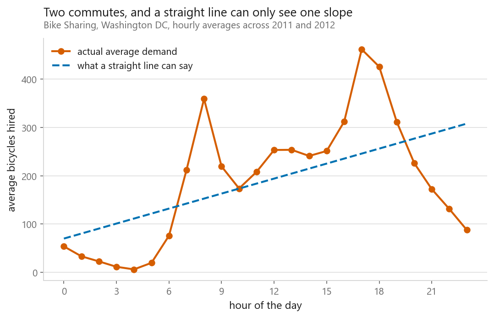

[English](../README.md) · [العربية](README.ar.md) · [Français](README.fr.md) · [Deutsch](README.de.md) · [Español](README.es.md) · [Português](README.pt.md) · [हिन्दी](README.hi.md) · [简体中文](README.zh-CN.md)

# open-ml-notebooks

### Aprende machine learning leyendo el código

Un libro gratuito y abierto de **86 notebooks de Jupyter** sobre aprendizaje
automático, deep learning y aprendizaje por refuerzo: un método por notebook,
explicado en lenguaje llano, implementado desde cero y después hecho bien, con la
biblioteca.

Todos los notebooks vienen **ya ejecutados**. Abre uno en GitHub y ahí están las
gráficas, los números y las salidas. No hace falta instalar nada para empezar a
leer.

**Hecho por [Elyes Lounissi](https://www.linkedin.com/in/elyes-lounissi/)**

Los notebooks están en inglés, y eso apenas es una barrera. El código, los
nombres de las variables, las tablas que se imprimen y las etiquetas de los ejes
están en el idioma que hablan de todas formas las bibliotecas de ML y los
mensajes de error, y las gráficas y los números se leen igual en cualquier
idioma. Puedes seguir cualquier resultado sin leer inglés con soltura.



*De [Regresión lineal](../02-regression/01-linear-regression/): por qué el modelo
más simple falla con datos cíclicos, y el arreglo de una línea que lo lleva de
0,39 a 0,68.*

---

## Por qué este libro

La mayoría de los tutoriales te enseñan qué función llamar. Pocos te enseñan qué
está haciendo el método en realidad, y casi ninguno te dice **cuándo es la
elección equivocada**.

Cada notebook responde a cuatro preguntas:

1. **¿Qué hace este método en realidad?** Primero con palabras, y con un dibujo.
2. **¿Cuáles son las matemáticas?** Escritas, solo lo que necesitas.
3. **¿Puedo construirlo yo?** Una versión mínima en NumPy, para que nada sea magia.
4. **¿Cuándo gana y cuándo pierde?** Medido, no afirmado.

La cuarta pregunta es la que importa y la que suele faltar.

## La idea que lo une todo

Todos los notebooks usan **los mismos cinco conjuntos de datos**. Es deliberado.
Cuando una máquina de vectores de soporte saca 0,93 en el capítulo tres y un
Random Forest saca 0,94 en el capítulo cuatro, los números se comparan
directamente, porque la pregunta era idéntica.

| Conjunto de datos | Tarea | Tamaño | Por qué este |
|---|---|---|---|
| California Housing | regresión | 20.640 × 8 | Viene con scikit-learn: el capítulo uno funciona sin descargar nada |
| Breast Cancer Wisconsin | clasificación binaria | 569 × 30 | Lo bastante pequeño para que cualquier método entrene al instante |
| **UCI Dry Bean** | clasificación en 7 clases | 13.611 × 16 | Publicado en 2020, apenas usado en tutoriales y agradablemente desequilibrado |
| UCI Bike Sharing | regresión y series temporales | 17.379 × 16 | Un solo conjunto que sirve para los capítulos tabulares y los de secuencias |
| Fashion-MNIST | clasificación de imágenes | 70.000 imágenes | La forma de MNIST, varias veces más difícil, para que las CNN sigan teniendo interés |

Al final, [**el marcador**](CURRICULUM.es.md) enfrenta cada método a cada
conjunto de datos en una sola tabla y explica el patrón: por qué gradient
boosting suele llevarse los datos tabulares, por qué los k vecinos más cercanos
se deshacen cuando se multiplican las columnas, por qué un modelo lineal le gana
a una red neuronal cuando hay pocas filas.

---

## Contenido

Índice completo con los 86 notebooks: **[CURRICULUM.es.md](CURRICULUM.es.md)**

| Parte | Contenido |
|---|---|
| **1: [Fundamentos](../01-foundations/)** | El flujo de trabajo, entrenamiento/validación/test, overfitting, validación cruzada, métricas, escalado, codificación, datos faltantes, ajuste |
| **2: [Regresión](../02-regression/)** | Lineal, descenso de gradiente, polinómica, Ridge, Lasso, Elastic Net, Huber, RANSAC, cuantiles, GLM |
| **3: [Clasificación](../03-classification/)** | Regresión logística, k-NN, Naive Bayes, LDA/QDA, SVM y kernels, árboles de decisión, desequilibrio, calibración |
| **4: [Ensembles](../04-ensembles/)** | Bagging, Random Forest, Extra Trees, AdaBoost, gradient boosting, XGBoost, LightGBM, CatBoost, stacking |
| **5: [Aprendizaje no supervisado](../05-unsupervised/)** | k-Means, elegir k, jerárquico, DBSCAN, HDBSCAN, mezclas gaussianas, detección de anomalías, Apriori |
| **6: [Reducción de dimensionalidad](../06-dimensionality-reduction/)** | PCA, Kernel PCA, ICA, NMF, t-SNE, UMAP, selección de variables |
| **7: [Redes neuronales](../07-neural-networks/)** | Perceptrón, MLP y retropropagación en NumPy, PyTorch, activaciones, optimizadores, regularización |
| **8: [Visión artificial](../08-computer-vision/)** | Convolución, CNN, LeNet/VGG/ResNet, aumento de datos, transfer learning, segmentación, detección |
| **9: [Secuencias y lenguaje](../09-sequences-and-language/)** | TF-IDF, embeddings, RNN, LSTM, GRU, seq2seq, atención, Transformers, series temporales |
| **10: [Modelos generativos](../10-generative-models/)** | Autoencoders, VAE, GAN, difusión |
| **11: [Aprendizaje por refuerzo](../11-reinforcement-learning/)** | Bandidos, MDP, Q-learning, SARSA, DQN, gradientes de política, actor-crítico, PPO |
| **12: [Todo junto](../12-putting-it-together/)** | El marcador, SHAP y LIME, pipelines, despliegue, errores frecuentes |

### Unos cuantos para empezar

- **[01-03: Overfitting y underfitting](../01-foundations/03-overfitting-and-underfitting/)**,
  el diagnóstico más útil del aprendizaje automático, dibujado en lugar de
  definido, con el ajuste de grado 20 que sale peor que el de grado 4 tanto en
  entrenamiento como en test, porque la matriz de diseño tiene un número de
  condición de `1.1e+21` y el solver se rinde en silencio antes de que el
  overfitting llegue a tener su oportunidad
- **[02-01: Regresión lineal](../02-regression/01-linear-regression/)**, la
  ecuación normal deducida, una versión de 30 líneas en NumPy que coincide con
  scikit-learn hasta el decimal 12, un diagnóstico de residuos que destapa un
  sesgo que el estadístico resumen escondía, y el método fallando con datos
  cíclicos y rescatado después por la codificación y no por un modelo más grande
- **[02-04: Regresión Ridge](../02-regression/04-ridge-regression/)**, la
  penalización L2 y el hallazgo honesto de que no ganó **nada de exactitud** con
  estos datos, aunque dejó los coeficientes **32× más estables**; además, un
  experimento de escalado que salió al revés y se explica solo
- **[02-05: Regresión Lasso](../02-regression/05-lasso-regression/)**, por qué un
  solo exponente convierte la contracción en selección, y el descubrimiento de
  que **`LassoCV` se quedó con 17 de 30 columnas de puro ruido**, porque la
  validación cruzada optimiza la predicción y no la parsimonia
- **[03-01: Regresión logística](../03-classification/01-logistic-regression/)**,
  la sigmoide, la log loss, el descenso de gradiente escrito paso a paso, softmax
  sobre siete variedades de frijol de frecuencias muy distintas, y por qué la
  clase *más rara* resultó ser la más fácil
- **[03-02: k vecinos más cercanos](../03-classification/02-k-nearest-neighbours/)**,
  el modelo que no entrena nada; solo escalar vale **+0,205 de exactitud**, `k=1`
  saca un 1,000 perfecto y sin sentido sobre los datos de entrenamiento, y la
  maldición de la dimensionalidad se mide en lugar de afirmarse
- **[03-03: Naive Bayes](../03-classification/03-naive-bayes/)**, por qué una
  suposición que todo el mundo sabe falsa sigue funcionando, y un rodeo de trece
  puntos por el valor por defecto de `var_smoothing` en scikit-learn, que destroza
  sin avisar las variables de escala pequeña
- **[03-05: Máquinas de vectores de soporte](../03-classification/05-support-vector-machines/)**,
  el margen, qué controla `C` de verdad, y el truco del kernel mostrado
  levantando dos anillos a una tercera dimensión antes de explicar por qué nunca
  hace falta construirla; además, el coste del que nadie habla: 27× más filas
  cuestan **139× más tiempo**
- **[03-06: Árboles de decisión](../03-classification/06-decision-trees/)**, la
  búsqueda de la división escrita desde cero, la mejor pregunta de todo el
  conjunto de datos encontrada con aritmética, un árbol legible de profundidad 3,
  y otro sin restricciones que alcanza exactitud perfecta en entrenamiento
  mientras *empeora* con datos reservados
- **[04-02: Random Forests](../04-ensembles/02-random-forest/)**, la ecuación de
  la varianza que explica todo el diseño, la puntuación out-of-bag, dos medidas de
  importancia de variables que no coinciden, y un cara a cara contra la regresión
  logística que el bosque **no gana**
- **[04-05: Gradient boosting](../04-ensembles/05-gradient-boosting/)**, por qué
  ajustar el residuo *es* descenso de gradiente, qué se gana y qué se paga con la
  tasa de aprendizaje, y la diferencia más marcada con un bosque: llega un punto
  en el que añadir árboles deja el boosting **peor**
- **[05-01: k-Means](../05-unsupervised/01-k-means/)**, el algoritmo de Lloyd
  desde cero, el codo y la silueta señalando los dos al número *equivocado* de
  clusters sobre datos cuya verdad se conoce, y cuatro maneras de fallar, entre
  ellas la de k-means partiendo puro ruido en grupos ordenados sin despeinarse
- **[05-04: DBSCAN y HDBSCAN](../05-unsupervised/04-dbscan-and-hdbscan/)**,
  clustering por densidad que encuentra medias lunas donde k-means no puede, `eps`
  elegido a partir del codo de la k-distancia en vez de a ojo, y el descubrimiento
  de que **ningún valor de `eps` informa de que "estos datos no tienen
  estructura"**
- **[06-01: PCA](../06-dimensionality-reduction/01-principal-component-analysis/)**,
  la descomposición en autovalores hecha a mano coincidiendo con scikit-learn
  hasta 2,2×10⁻¹⁶, componentes que resultan significar "tamaño" y "forma", y el
  hallazgo honesto de que PCA **nunca ganó** a quedarse simplemente con todas las
  columnas
- **[07-01: El perceptrón](../07-neural-networks/01-the-perceptron/)**, una
  neurona, la regla de aprendizaje que no necesita cálculo, y los cuatro puntos
  del XOR que dejaron paradas las redes neuronales durante una década
- **[07-02: MLP y retropropagación](../07-neural-networks/02-mlp-and-backpropagation/)**,
  cada gradiente deducido a mano y **comprobado numéricamente hasta 1,9×10⁻¹⁰**, y
  después una red que funciona solo con NumPy
- **[07-03: La misma red en PyTorch](../07-neural-networks/03-the-same-net-in-pytorch/)**,
  autograd demostrado sobre algo que puedes comprobar a mano, el bucle de
  entrenamiento de cinco líneas que reutilizarás siempre, y los tres errores que
  todo el mundo comete una vez
- **[08-02: Una CNN, capa por capa](../08-computer-vision/02-a-cnn-layer-by-layer/)**,
  la compartición de pesos explicada, y una red convolucional que le gana a una
  densa en exactitud, en número de parámetros **y** en velocidad; los filtros de
  su primera capa se convierten en detectores de bordes que nadie pidió
- **[11-04: Q-learning](../11-reinforcement-learning/04-q-learning/)**, Cliff
  Walking construido desde cero sin depender de `gym`, la actualización de Bellman
  en una línea, y el resultado clásico en el que Q-learning encuentra la mejor
  política mientras SARSA recoge más recompensa

Entre todos cubren regresión supervisada, clasificación supervisada, ensembles,
clustering no supervisado, reducción de dimensionalidad y aprendizaje por
refuerzo, y todos ellos están terminados y ejecutados.

### El marcador

Como todos los notebooks usan los mismos conjuntos de datos, las comparaciones se
van acumulando. Sobre **UCI Dry Bean**, exactitud con validación cruzada de 5
particiones:

| Método | Exactitud |
|---|---|
| SVM, kernel RBF | **0.9301** |
| Gradient boosting | 0.9271 |
| SVM, kernel lineal | 0.9262 |
| Random forest | 0.9244 |
| Regresión logística | 0.9234 |
| k vecinos más cercanos | 0.9231 |
| Red neuronal (NumPy, desde cero) | 0.9306 * |
| Naive Bayes | 0.8972 |
| Árbol de decisión | 0.8945 |

\* una única partición reservada en lugar de 5 particiones, así que no es
directamente comparable. En el [notebook](../07-neural-networks/02-mlp-and-backpropagation/)
explico por qué no lo reclamo como victoria.

Los números de esta tabla aparecen tal cual los imprimen los notebooks, con punto
decimal; en el texto de esta página uso la coma, que es lo normal en español.

Nueve métodos dentro de cuatro centésimas, y una recta le gana a casi todos. Las
medidas de los frijoles son geometría suave y correlacionada, así que a los
modelos flexibles les queda poca estructura no lineal que aprovechar.

Cambia el conjunto de datos y cambia el orden. Sobre **California Housing**,
gradient boosting baja el RMSE de la regresión lineal de 0,7263 a **0,4668**, una
mejora del 36 %, porque ese problema *sí* está lleno de interacciones.

**Qué método gana es una propiedad de tus datos, no un ranking de algoritmos.**
Ese es el hilo que recorre todo el libro, y varios notebooks cuentan un resultado
que yo esperaba al revés y lo dicen sin adornos.

---

## Cómo empezar

```bash
git clone https://github.com/ELounissi/open-ml-notebooks
cd open-ml-notebooks
python -m venv .venv && source .venv/bin/activate   # Windows: .venv\Scripts\activate
pip install -r requirements.txt
jupyter lab
```

Todo funciona en **minutos y en la CPU de un portátil**. Una GPU acelera los
capítulos de deep learning y nunca hace falta. Los conjuntos de datos pequeños
están en el repositorio, así que la mayoría de los notebooks funcionan sin
conexión desde el primer momento.

**¿Empiezas de cero?** Ve a la [Parte 1, Fundamentos](../01-foundations/).
**¿Ya sabes lo básico?** Salta al método que necesites: cada notebook se sostiene solo.
**¿Preparando entrevistas?** La sección "cuándo gana, cuándo pierde" de cada
notebook está escrita justo para esa conversación.

---

## Reutilizar esto

El código es **MIT**. El texto y las figuras, **CC BY 4.0**. Llévatelos a un
curso, a una charla o a un grupo de estudio, citando la fuente. Los conjuntos de
datos conservan sus propias licencias, anotadas uno a uno en
[`data/README.md`](../data/README.md).

Si esto te ha ahorrado tiempo, **una estrella ayuda a que otras personas lo
encuentren**. ¿Has visto un error? Abre un issue: las correcciones son bienvenidas
de verdad, sobre todo las que demuestran que algo de lo que digo aquí está mal.

---

### Temas

`machine-learning` `deep-learning` `reinforcement-learning` `machine-learning-tutorial`
`jupyter-notebook` `python` `scikit-learn` `pytorch` `data-science` `neural-network`
`cnn` `rnn` `lstm` `transformer` `linear-regression` `logistic-regression`
`random-forest` `xgboost` `clustering` `pca` `learn-machine-learning`
`machine-learning-algorithms` `ml-tutorial` `data-science-tutorial` `education`

`#MachineLearning` `#DeepLearning` `#ReinforcementLearning` `#DataScience`
`#Python` `#ScikitLearn` `#PyTorch` `#LearnMachineLearning` `#MLTutorial`
`#JupyterNotebook` `#OpenSource` `#AI`

---

**Hecho por Elyes Lounissi** ·
[LinkedIn](https://www.linkedin.com/in/elyes-lounissi/) ·
[pilot.tun@gmail.com](mailto:pilot.tun@gmail.com)
